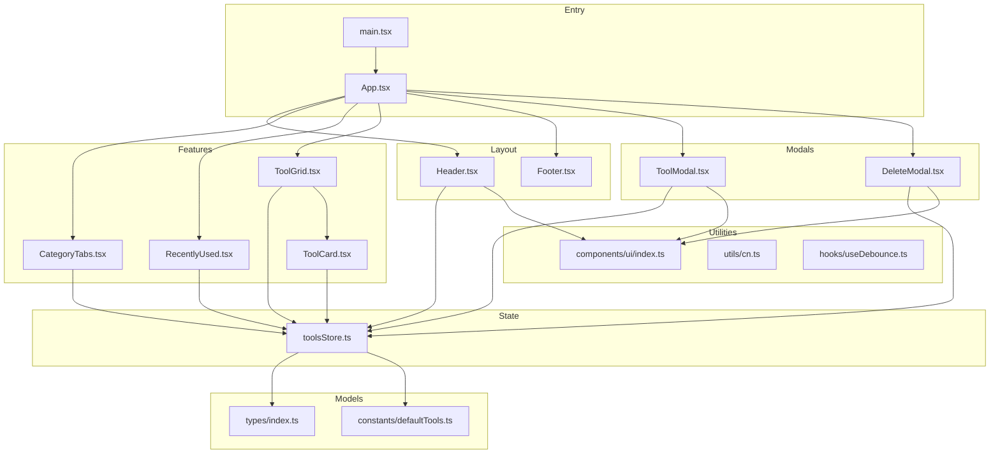
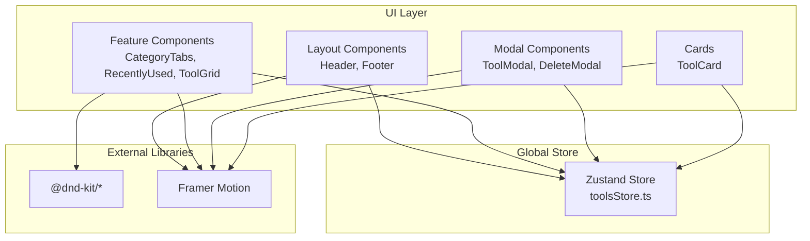
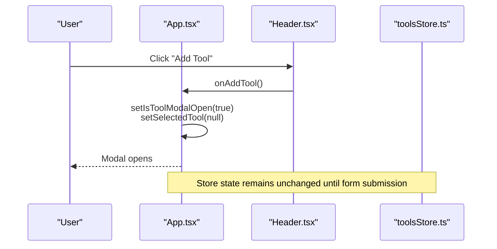
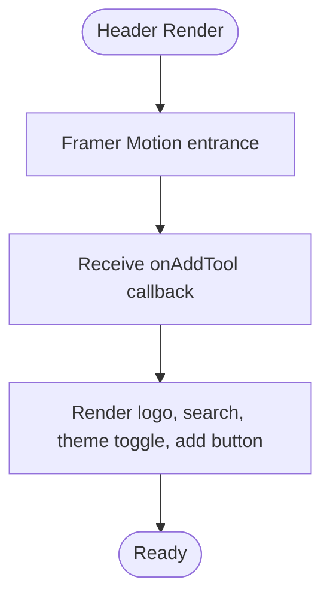
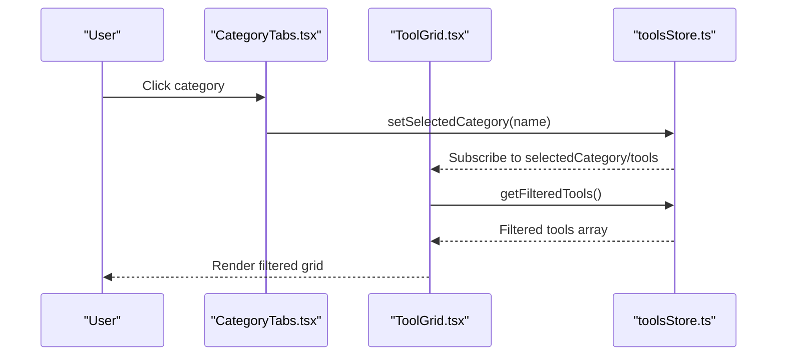
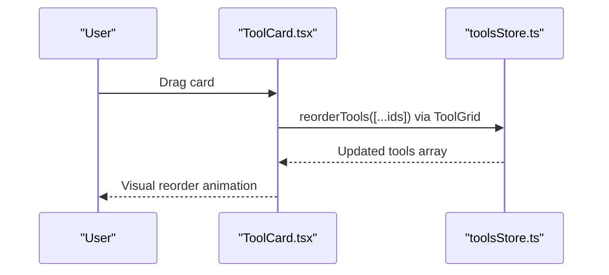
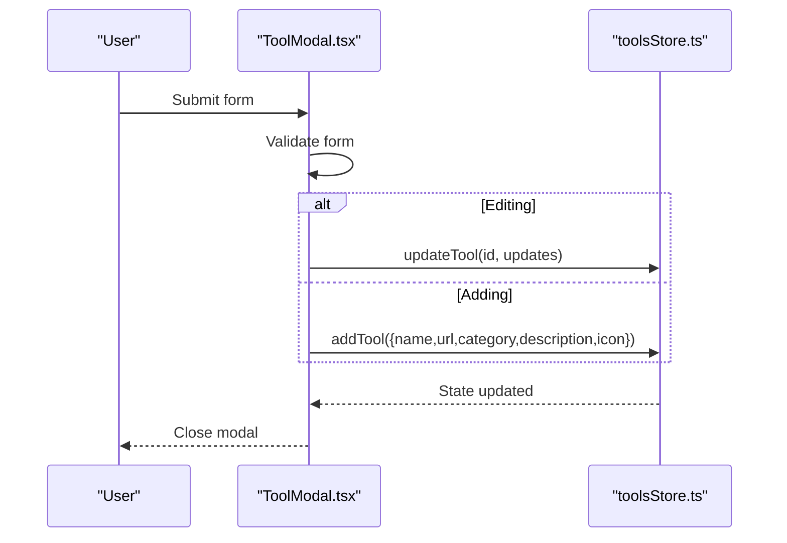
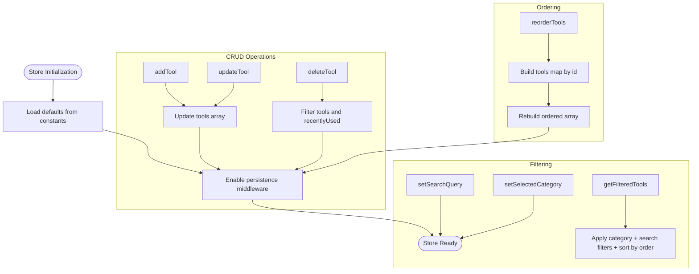
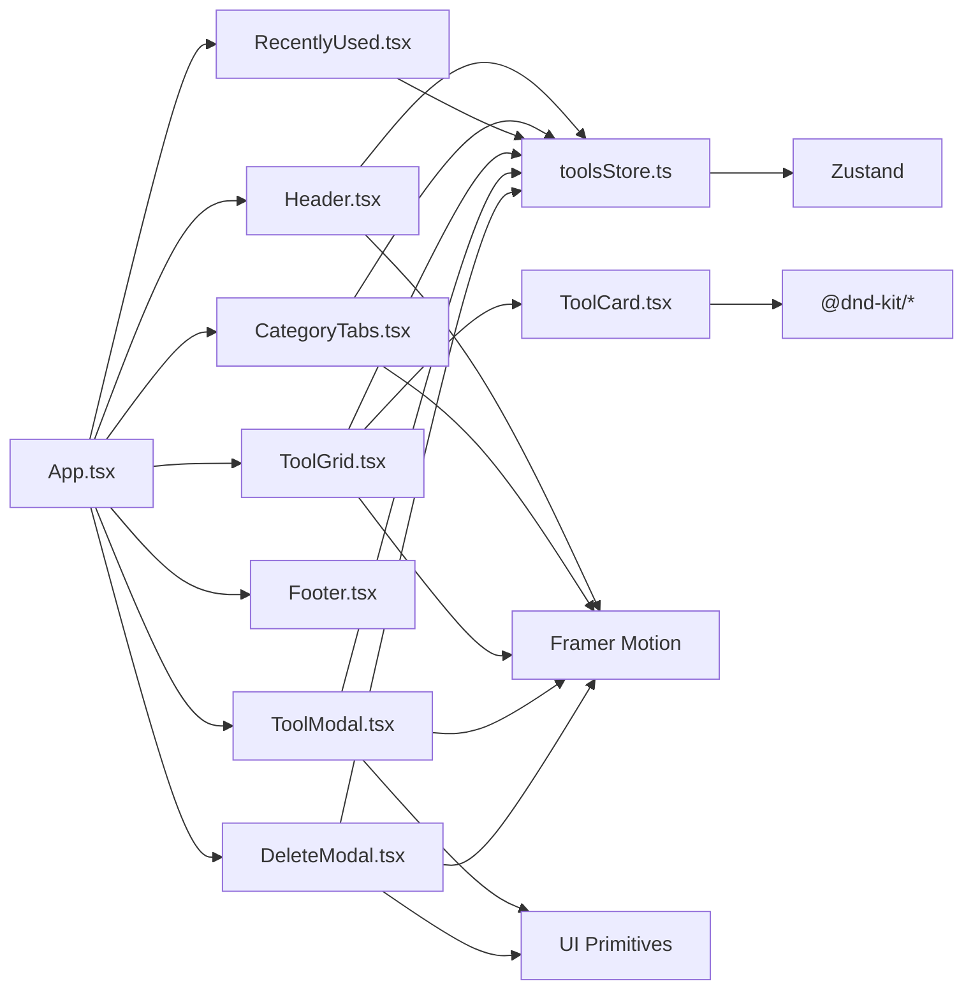

# Application Architecture

<cite>
**Referenced Files in This Document**
- [App.tsx](file://src/App.tsx)
- [main.tsx](file://src/main.tsx)
- [toolsStore.ts](file://src/stores/toolsStore.ts)
- [Header.tsx](file://src/components/layout/Header.tsx)
- [Footer.tsx](file://src/components/layout/Footer.tsx)
- [CategoryTabs.tsx](file://src/components/features/CategoryTabs.tsx)
- [RecentlyUsed.tsx](file://src/components/features/RecentlyUsed.tsx)
- [ToolGrid.tsx](file://src/components/features/ToolGrid.tsx)
- [ToolCard.tsx](file://src/components/features/ToolCard.tsx)
- [ToolModal.tsx](file://src/components/modals/ToolModal.tsx)
- [DeleteModal.tsx](file://src/components/modals/DeleteModal.tsx)
- [index.ts (UI exports)](file://src/components/ui/index.ts)
- [index.ts (Types)](file://src/types/index.ts)
- [defaultTools.ts](file://src/constants/defaultTools.ts)
- [useDebounce.ts](file://src/hooks/useDebounce.ts)
- [cn.ts](file://src/utils/cn.ts)
- [package.json](file://package.json)
</cite>

## Table of Contents
1. [Introduction](#introduction)
2. [Project Structure](#project-structure)
3. [Core Components](#core-components)
4. [Architecture Overview](#architecture-overview)
5. [Detailed Component Analysis](#detailed-component-analysis)
6. [Dependency Analysis](#dependency-analysis)
7. [Performance Considerations](#performance-considerations)
8. [Troubleshooting Guide](#troubleshooting-guide)
9. [Conclusion](#conclusion)

## Introduction
This document describes the architectural design of the AIPulse application. It focuses on a component-driven architecture with centralized state management powered by Zustand. The design emphasizes separation of concerns across UI components, state management, data models, and utilities. It documents the store pattern implementation in toolsStore.ts, covering CRUD operations, category management, and drag-and-drop reordering. It also outlines the component hierarchy from the root App.tsx through layout, feature, and modal components, and explains data flow from user interactions to state updates and persistence. Architectural patterns such as Provider pattern for state sharing, Factory pattern for component creation, and Observer pattern for reactive updates are discussed alongside integrations with DnD Kit and Framer Motion.

## Project Structure
The project follows a feature-based and layer-based organization:
- Root entry renders the application via main.tsx.
- App.tsx is the root component orchestrating layout, features, and modals.
- Components are grouped under layout, features, modals, and ui.
- State management is encapsulated in a single Zustand store.
- Types define the data contracts for tools, categories, and store state.
- Constants provide default categories and tools.
- Utilities and hooks support styling and debouncing.

**Diagram sources**
- [main.tsx](file://src/main.tsx#L1-L11)
- [App.tsx](file://src/App.tsx#L1-L122)
- [Header.tsx](file://src/components/layout/Header.tsx#L1-L83)
- [Footer.tsx](file://src/components/layout/Footer.tsx#L1-L21)
- [CategoryTabs.tsx](file://src/components/features/CategoryTabs.tsx#L1-L106)
- [RecentlyUsed.tsx](file://src/components/features/RecentlyUsed.tsx#L1-L101)
- [ToolGrid.tsx](file://src/components/features/ToolGrid.tsx#L1-L112)
- [ToolCard.tsx](file://src/components/features/ToolCard.tsx#L1-L141)
- [ToolModal.tsx](file://src/components/modals/ToolModal.tsx#L1-L253)
- [DeleteModal.tsx](file://src/components/modals/DeleteModal.tsx#L1-L67)
- [toolsStore.ts](file://src/stores/toolsStore.ts#L1-L177)
- [index.ts (Types)](file://src/types/index.ts#L1-L60)
- [defaultTools.ts](file://src/constants/defaultTools.ts#L1-L101)
- [index.ts (UI exports)](file://src/components/ui/index.ts#L1-L15)
- [cn.ts](file://src/utils/cn.ts#L1-L7)
- [useDebounce.ts](file://src/hooks/useDebounce.ts#L1-L18)

**Section sources**
- [main.tsx](file://src/main.tsx#L1-L11)
- [App.tsx](file://src/App.tsx#L1-L122)

## Core Components
- App.tsx: Root component managing theme application, modal visibility, and orchestrating layout and feature components.
- toolsStore.ts: Centralized state using Zustand with persistence middleware, exposing CRUD, filtering, ordering, theme, and recently used utilities.
- UI primitives: Re-exported via components/ui/index.ts for consistent component creation across the app.
- Types: Strongly typed contracts for tools, categories, and store state/actions.
- Constants: Default categories and tools to bootstrap the application.

Key responsibilities:
- App.tsx: Event handlers for modals and theme binding; passes callbacks to child components.
- toolsStore.ts: Pure state transitions, derived getters, and automatic persistence to storage.
- UI exports: Provide a factory-like interface for reusable components.
- Types and constants: Define models and defaults to enforce consistency.

**Section sources**
- [App.tsx](file://src/App.tsx#L13-L122)
- [toolsStore.ts](file://src/stores/toolsStore.ts#L14-L177)
- [index.ts (UI exports)](file://src/components/ui/index.ts#L1-L15)
- [index.ts (Types)](file://src/types/index.ts#L1-L60)
- [defaultTools.ts](file://src/constants/defaultTools.ts#L1-L101)

## Architecture Overview
AIPulse employs a component-driven architecture with centralized state:
- Provider pattern: Zustand store acts as a global provider for state and actions.
- Observer pattern: Components subscribe to store slices via hooks, enabling reactive updates.
- Factory pattern: UI components are exported via a single index barrel for consistent creation.
- External integrations: DnD Kit for drag-and-drop reordering; Framer Motion for animations.

**Diagram sources**
- [toolsStore.ts](file://src/stores/toolsStore.ts#L14-L177)
- [Header.tsx](file://src/components/layout/Header.tsx#L1-L83)
- [Footer.tsx](file://src/components/layout/Footer.tsx#L1-L21)
- [CategoryTabs.tsx](file://src/components/features/CategoryTabs.tsx#L1-L106)
- [RecentlyUsed.tsx](file://src/components/features/RecentlyUsed.tsx#L1-L101)
- [ToolGrid.tsx](file://src/components/features/ToolGrid.tsx#L1-L112)
- [ToolCard.tsx](file://src/components/features/ToolCard.tsx#L1-L141)
- [ToolModal.tsx](file://src/components/modals/ToolModal.tsx#L1-L253)
- [DeleteModal.tsx](file://src/components/modals/DeleteModal.tsx#L1-L67)

## Detailed Component Analysis

### Root Component: App.tsx
- Responsibilities:
  - Manages modal open/close states and selected tool context.
  - Applies theme class to the document element based on store state.
  - Passes callbacks to Header and ToolGrid for add/edit/delete actions.
- Data flow:
  - User actions trigger App-level handlers, which call store actions or update local state.
  - Store updates propagate automatically to subscribed components.

**Diagram sources**
- [App.tsx](file://src/App.tsx#L28-L51)
- [Header.tsx](file://src/components/layout/Header.tsx#L62-L76)
- [toolsStore.ts](file://src/stores/toolsStore.ts#L14-L177)

**Section sources**
- [App.tsx](file://src/App.tsx#L13-L122)

### Layout Components
- Header.tsx:
  - Provides search bar, theme toggle, and add tool button.
  - Uses Framer Motion for entrance animations.
  - Exposes onAddTool prop to App.tsx.
- Footer.tsx:
  - Presentational component with branding and year.

**Diagram sources**
- [Header.tsx](file://src/components/layout/Header.tsx#L1-L83)

**Section sources**
- [Header.tsx](file://src/components/layout/Header.tsx#L1-L83)
- [Footer.tsx](file://src/components/layout/Footer.tsx#L1-L21)

### Feature Components
- CategoryTabs.tsx:
  - Reads categories and selected category from store.
  - Computes counts per category and toggles selection.
  - Uses Framer Motion layoutId for smooth active tab transitions.
- RecentlyUsed.tsx:
  - Displays up to six most recently accessed tools.
  - Supports expand/collapse and launches tools.
- ToolGrid.tsx:
  - Filters tools via store getter and supports drag-and-drop reordering.
  - Integrates @dnd-kit for drag context and sorting strategy.
  - Emits empty state messaging and forwards add action to parent.

**Diagram sources**
- [CategoryTabs.tsx](file://src/components/features/CategoryTabs.tsx#L1-L106)
- [ToolGrid.tsx](file://src/components/features/ToolGrid.tsx#L1-L112)
- [toolsStore.ts](file://src/stores/toolsStore.ts#L131-L156)

**Section sources**
- [CategoryTabs.tsx](file://src/components/features/CategoryTabs.tsx#L1-L106)
- [RecentlyUsed.tsx](file://src/components/features/RecentlyUsed.tsx#L1-L101)
- [ToolGrid.tsx](file://src/components/features/ToolGrid.tsx#L1-L112)

### ToolCard Component
- Integrates DnD Kit via useSortable to enable drag handles and sorting.
- Launches tools and updates recently used list.
- Uses Framer Motion for hover and tap interactions.

**Diagram sources**
- [ToolCard.tsx](file://src/components/features/ToolCard.tsx#L1-L141)
- [ToolGrid.tsx](file://src/components/features/ToolGrid.tsx#L46-L56)
- [toolsStore.ts](file://src/stores/toolsStore.ts#L53-L75)

**Section sources**
- [ToolCard.tsx](file://src/components/features/ToolCard.tsx#L1-L141)

### Modal Components
- ToolModal.tsx:
  - Form-driven creation/editing of tools with validation.
  - Supports dynamic category creation and icon selection.
  - Calls store add/update actions upon submit.
- DeleteModal.tsx:
  - Confirmation dialog for deletion with loading state.

**Diagram sources**
- [ToolModal.tsx](file://src/components/modals/ToolModal.tsx#L80-L108)
- [toolsStore.ts](file://src/stores/toolsStore.ts#L25-L51)

**Section sources**
- [ToolModal.tsx](file://src/components/modals/ToolModal.tsx#L1-L253)
- [DeleteModal.tsx](file://src/components/modals/DeleteModal.tsx#L1-L67)

### Store Pattern Implementation: toolsStore.ts
- State shape:
  - tools, categories, searchQuery, selectedCategory, isDarkMode, recentlyUsed.
- Actions:
  - CRUD: addTool, updateTool, deleteTool.
  - Ordering: reorderTools with stable index updates.
  - Categories: addCategory, deleteCategory.
  - Filtering: setSearchQuery, setSelectedCategory, getFilteredTools.
  - Theme: toggleTheme, setDarkMode.
  - Recently used: addToRecentlyUsed.
  - Getters: getFilteredTools, getRecentlyUsedTools.
- Persistence:
  - Middleware persists tools, categories, theme, and recentlyUsed slices.

**Diagram sources**
- [toolsStore.ts](file://src/stores/toolsStore.ts#L14-L177)
- [defaultTools.ts](file://src/constants/defaultTools.ts#L1-L101)

**Section sources**
- [toolsStore.ts](file://src/stores/toolsStore.ts#L14-L177)
- [index.ts (Types)](file://src/types/index.ts#L19-L51)

## Dependency Analysis
- Internal dependencies:
  - App.tsx depends on Header, CategoryTabs, RecentlyUsed, ToolGrid, Footer, and modal components.
  - Feature components depend on toolsStore.ts for state and actions.
  - Modals depend on UI primitives and toolsStore.ts.
- External dependencies:
  - Zustand for state management.
  - DnD Kit for drag-and-drop.
  - Framer Motion for animations.
  - UUID for identifiers.
  - Tailwind utilities via clsx and tailwind-merge.

**Diagram sources**
- [App.tsx](file://src/App.tsx#L1-L122)
- [Header.tsx](file://src/components/layout/Header.tsx#L1-L83)
- [CategoryTabs.tsx](file://src/components/features/CategoryTabs.tsx#L1-L106)
- [RecentlyUsed.tsx](file://src/components/features/RecentlyUsed.tsx#L1-L101)
- [ToolGrid.tsx](file://src/components/features/ToolGrid.tsx#L1-L112)
- [ToolCard.tsx](file://src/components/features/ToolCard.tsx#L1-L141)
- [ToolModal.tsx](file://src/components/modals/ToolModal.tsx#L1-L253)
- [DeleteModal.tsx](file://src/components/modals/DeleteModal.tsx#L1-L67)
- [toolsStore.ts](file://src/stores/toolsStore.ts#L1-L177)
- [index.ts (UI exports)](file://src/components/ui/index.ts#L1-L15)
- [package.json](file://package.json#L22-L34)

**Section sources**
- [package.json](file://package.json#L22-L34)

## Performance Considerations
- Memoization:
  - ToolGrid uses useMemo to compute filtered tools, minimizing re-renders when dependencies are unchanged.
- Debouncing:
  - A debouncing hook is available for potential use with search inputs to reduce frequent filter recalculations.
- Rendering:
  - ToolGrid conditionally renders an empty state to avoid unnecessary DOM nodes.
  - ToolCard leverages transform/transition for smooth animations without heavy DOM thrashing.
- Persistence:
  - Zustand persistence writes only selected slices, reducing storage overhead.

Recommendations:
- Introduce debounced search updates to further optimize filtering performance.
- Consider virtualizing long lists if the number of tools grows significantly.

**Section sources**
- [ToolGrid.tsx](file://src/components/features/ToolGrid.tsx#L33-L33)
- [useDebounce.ts](file://src/hooks/useDebounce.ts#L1-L18)

## Troubleshooting Guide
Common issues and resolutions:
- Theme not applying:
  - Verify isDarkMode updates propagate to App.tsx and that the document element class is toggled accordingly.
- Drag-and-drop not working:
  - Ensure DndContext and SortableContext wrap the grid and items are correctly keyed.
- Modal not closing after save:
  - Confirm ToolModal calls onClose after store updates.
- Tool not launching:
  - Check addToRecentlyUsed is invoked and window.open is permitted by browser policies.
- Persistence not saving:
  - Confirm the persistence slice includes tools, categories, isDarkMode, and recentlyUsed.

**Section sources**
- [App.tsx](file://src/App.tsx#L19-L26)
- [ToolGrid.tsx](file://src/components/features/ToolGrid.tsx#L88-L109)
- [ToolModal.tsx](file://src/components/modals/ToolModal.tsx#L106-L108)
- [toolsStore.ts](file://src/stores/toolsStore.ts#L166-L175)

## Conclusion
AIPulse demonstrates a clean, component-driven architecture with centralized state managed by Zustand. The store encapsulates CRUD, filtering, ordering, theming, and recently used utilities, while UI components remain declarative and reusable. External libraries like DnD Kit and Framer Motion are integrated thoughtfully to enhance interactivity and user experience. The architecture balances simplicity and scalability, with clear separation of concerns and observable state updates.