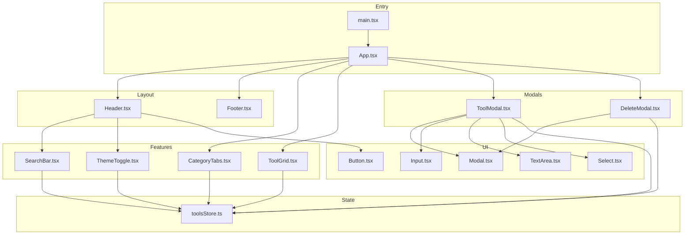
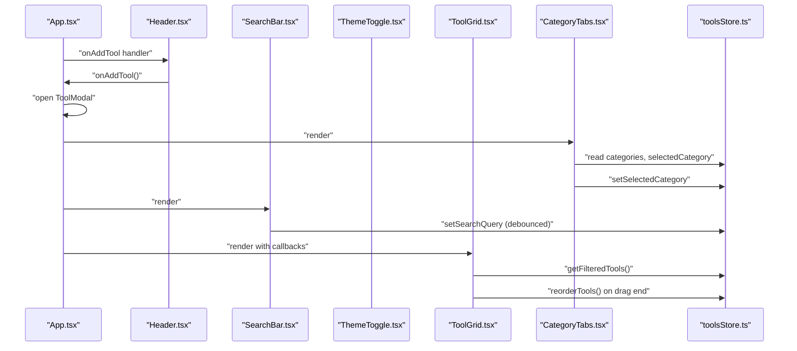
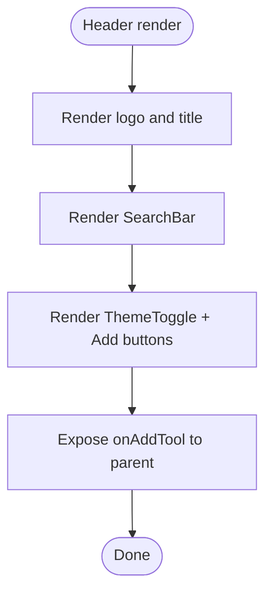
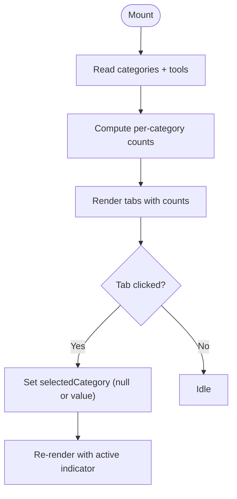
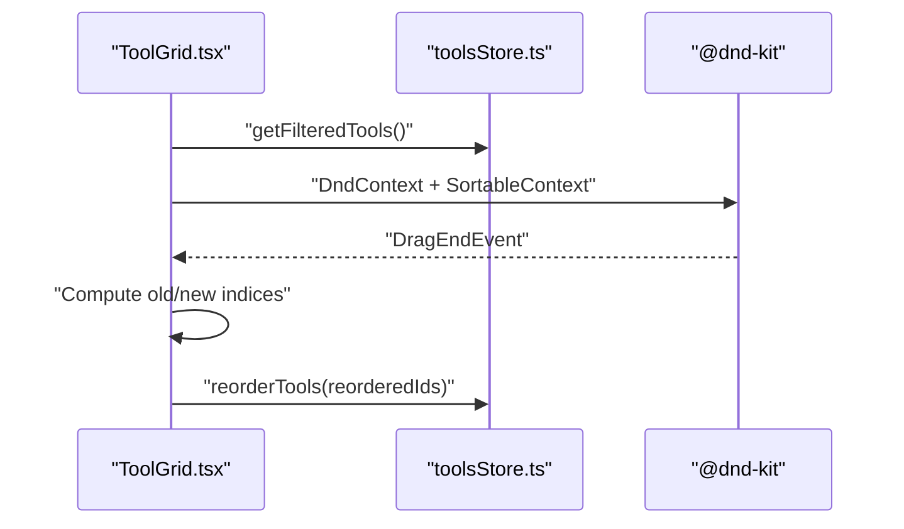
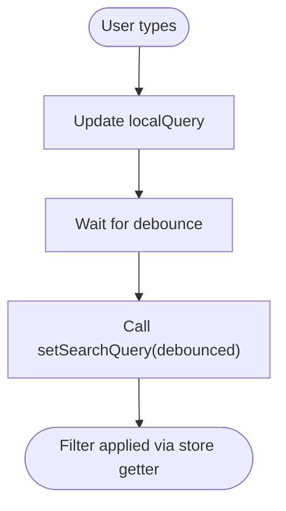
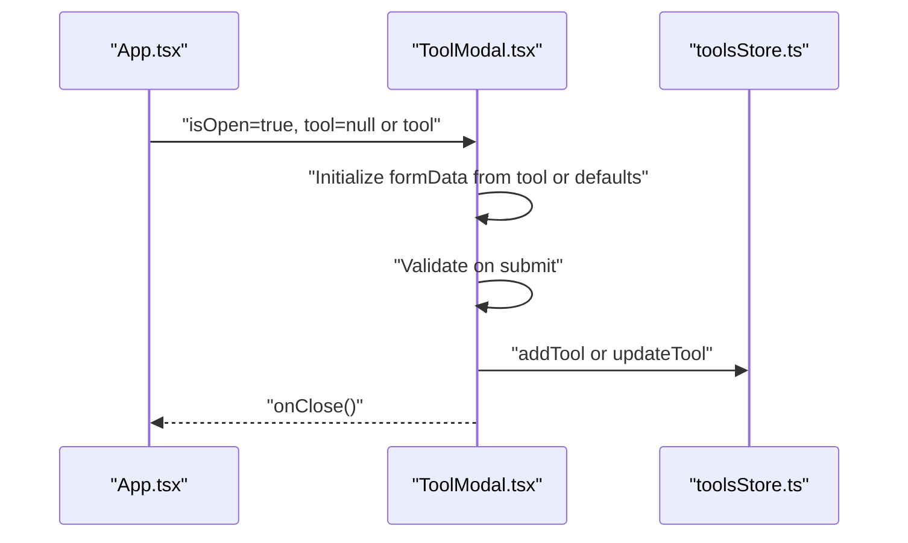
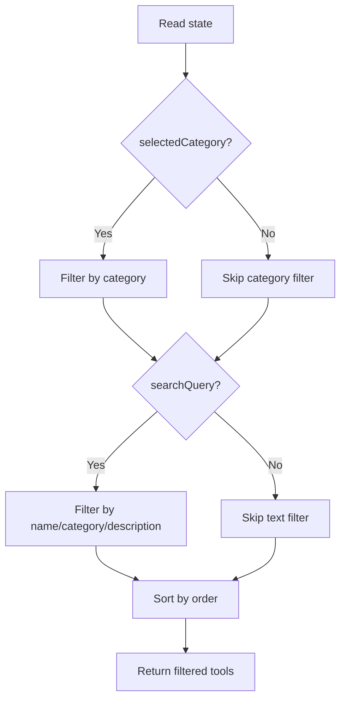
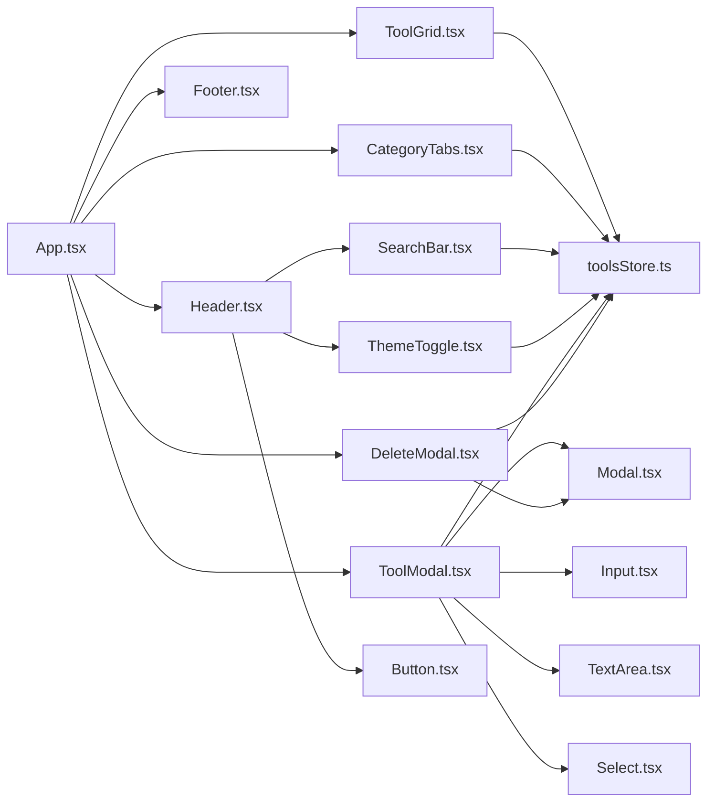

# Component System

<cite>
**Referenced Files in This Document**
- [App.tsx](file://src/App.tsx)
- [main.tsx](file://src/main.tsx)
- [Header.tsx](file://src/components/layout/Header.tsx)
- [Footer.tsx](file://src/components/layout/Footer.tsx)
- [CategoryTabs.tsx](file://src/components/features/CategoryTabs.tsx)
- [ToolGrid.tsx](file://src/components/features/ToolGrid.tsx)
- [SearchBar.tsx](file://src/components/features/SearchBar.tsx)
- [ThemeToggle.tsx](file://src/components/features/ThemeToggle.tsx)
- [Button.tsx](file://src/components/ui/Button.tsx)
- [Input.tsx](file://src/components/ui/Input.tsx)
- [Modal.tsx](file://src/components/ui/Modal.tsx)
- [ToolModal.tsx](file://src/components/modals/ToolModal.tsx)
- [DeleteModal.tsx](file://src/components/modals/DeleteModal.tsx)
- [toolsStore.ts](file://src/stores/toolsStore.ts)
- [index.ts](file://src/types/index.ts)
- [cn.ts](file://src/utils/cn.ts)
</cite>

## Table of Contents
1. [Introduction](#introduction)
2. [Project Structure](#project-structure)
3. [Core Components](#core-components)
4. [Architecture Overview](#architecture-overview)
5. [Detailed Component Analysis](#detailed-component-analysis)
6. [Dependency Analysis](#dependency-analysis)
7. [Performance Considerations](#performance-considerations)
8. [Troubleshooting Guide](#troubleshooting-guide)
9. [Conclusion](#conclusion)
10. [Appendices](#appendices)

## Introduction
This document describes the AIPulse UI component system and reusable patterns. It explains the three-tier organization:
- Layout components: Header, Footer
- Feature components: CategoryTabs, ToolGrid, SearchBar, ThemeToggle
- UI components: Button, Input, Modal, Select, TextArea

It documents component composition, prop interfaces, event handling, the component hierarchy from the root App down to specialized features, the modal system (ToolModal and DeleteModal), state integration via the Zustand store, lifecycle management, performance optimizations, styling consistency with Tailwind CSS, accessibility considerations, extension guidelines, testing approaches, and integration patterns with external libraries.

## Project Structure
The project follows a feature-based component organization under src/components, grouped by tier:
- layout: Header, Footer
- features: CategoryTabs, ToolGrid, SearchBar, ThemeToggle, ToolCard, RecentlyUsed
- ui: Button, Input, Modal, Select, TextArea, index.ts barrel export
- modals: ToolModal, DeleteModal
- stores: toolsStore.ts (Zustand)
- types: index.ts (shared types)
- utils: cn.ts (Tailwind merging utility)
- App.tsx (root component)
- main.tsx (entrypoint)

**Diagram sources**
- [main.tsx](file://src/main.tsx#L1-L11)
- [App.tsx](file://src/App.tsx#L1-L122)
- [Header.tsx](file://src/components/layout/Header.tsx#L1-L83)
- [Footer.tsx](file://src/components/layout/Footer.tsx#L1-L21)
- [CategoryTabs.tsx](file://src/components/features/CategoryTabs.tsx#L1-L106)
- [ToolGrid.tsx](file://src/components/features/ToolGrid.tsx#L1-L112)
- [SearchBar.tsx](file://src/components/features/SearchBar.tsx#L1-L42)
- [ThemeToggle.tsx](file://src/components/features/ThemeToggle.tsx#L1-L43)
- [Button.tsx](file://src/components/ui/Button.tsx#L1-L88)
- [Input.tsx](file://src/components/ui/Input.tsx#L1-L74)
- [Modal.tsx](file://src/components/ui/Modal.tsx#L1-L128)
- [ToolModal.tsx](file://src/components/modals/ToolModal.tsx#L1-L253)
- [DeleteModal.tsx](file://src/components/modals/DeleteModal.tsx#L1-L67)
- [toolsStore.ts](file://src/stores/toolsStore.ts#L1-L177)

**Section sources**
- [main.tsx](file://src/main.tsx#L1-L11)
- [App.tsx](file://src/App.tsx#L1-L122)

## Core Components
This section summarizes the core building blocks and their roles.

- UI primitives (Button, Input, Modal, Select, TextArea) provide consistent styling and behavior across the app. They accept props for variants, sizes, icons, and validation states, and integrate with Tailwind via a merging utility.
- Feature components encapsulate domain logic:
  - CategoryTabs: reads categories and selected category from the store, computes counts, toggles selection, and animates active tab highlighting.
  - ToolGrid: filters tools via the store’s getter, supports drag-and-drop reordering, and renders ToolCard instances.
  - SearchBar: local input with debounced synchronization to the store’s search query, plus clear functionality.
  - ThemeToggle: toggles dark/light mode and applies document classes.
- Layout components:
  - Header: orchestrates actions (add tool), search bar, and theme toggle; exposes an onAddTool callback.
  - Footer: static branding and attribution.
- Modals:
  - ToolModal: form-driven CRUD for tools with validation, category creation, and icon selection.
  - DeleteModal: confirmation dialog with destructive action.

**Section sources**
- [Button.tsx](file://src/components/ui/Button.tsx#L1-L88)
- [Input.tsx](file://src/components/ui/Input.tsx#L1-L74)
- [Modal.tsx](file://src/components/ui/Modal.tsx#L1-L128)
- [CategoryTabs.tsx](file://src/components/features/CategoryTabs.tsx#L1-L106)
- [ToolGrid.tsx](file://src/components/features/ToolGrid.tsx#L1-L112)
- [SearchBar.tsx](file://src/components/features/SearchBar.tsx#L1-L42)
- [ThemeToggle.tsx](file://src/components/features/ThemeToggle.tsx#L1-L43)
- [Header.tsx](file://src/components/layout/Header.tsx#L1-L83)
- [Footer.tsx](file://src/components/layout/Footer.tsx#L1-L21)
- [ToolModal.tsx](file://src/components/modals/ToolModal.tsx#L1-L253)
- [DeleteModal.tsx](file://src/components/modals/DeleteModal.tsx#L1-L67)

## Architecture Overview
The component hierarchy starts at the root App, which composes layout wrappers and feature sections. State is centralized in toolsStore.ts using Zustand with persistence. Modals are composed on top of the main content and communicate with the store for data mutations.

**Diagram sources**
- [App.tsx](file://src/App.tsx#L1-L122)
- [Header.tsx](file://src/components/layout/Header.tsx#L1-L83)
- [SearchBar.tsx](file://src/components/features/SearchBar.tsx#L1-L42)
- [ThemeToggle.tsx](file://src/components/features/ThemeToggle.tsx#L1-L43)
- [CategoryTabs.tsx](file://src/components/features/CategoryTabs.tsx#L1-L106)
- [ToolGrid.tsx](file://src/components/features/ToolGrid.tsx#L1-L112)
- [toolsStore.ts](file://src/stores/toolsStore.ts#L1-L177)

## Detailed Component Analysis

### Layout Components

#### Header
- Purpose: Top navigation bar with logo, centered search, theme toggle, and add tool action.
- Props: onAddTool (callback to open ToolModal).
- Composition: Uses Button, SearchBar, ThemeToggle; applies motion animations and responsive breakpoints.
- Accessibility: Buttons include aria-labels where icons are sole indicators.

**Diagram sources**
- [Header.tsx](file://src/components/layout/Header.tsx#L1-L83)

**Section sources**
- [Header.tsx](file://src/components/layout/Header.tsx#L1-L83)

#### Footer
- Purpose: Static footer with copyright and attribution.
- Styling: Uses background and border tokens consistent with layout.

**Section sources**
- [Footer.tsx](file://src/components/layout/Footer.tsx#L1-L21)

### Feature Components

#### CategoryTabs
- State integration: Reads categories, selectedCategory, and tools from the store; computes counts per category.
- Behavior: Click toggles selection; supports clearing selection; animates active indicator using layoutId.
- Rendering: Horizontal scroll container with dynamic counts.

**Diagram sources**
- [CategoryTabs.tsx](file://src/components/features/CategoryTabs.tsx#L1-L106)
- [toolsStore.ts](file://src/stores/toolsStore.ts#L1-L177)

**Section sources**
- [CategoryTabs.tsx](file://src/components/features/CategoryTabs.tsx#L1-L106)
- [toolsStore.ts](file://src/stores/toolsStore.ts#L1-L177)

#### ToolGrid
- State integration: Filters tools via getFilteredTools; integrates drag-and-drop reordering.
- Sensors: PointerSensor and KeyboardSensor configured with thresholds and keyboard coordinates.
- Events: On drag end, computes new indices and calls reorderTools with ordered IDs.
- Empty state: Renders friendly message with optional CTA to add tools.

**Diagram sources**
- [ToolGrid.tsx](file://src/components/features/ToolGrid.tsx#L1-L112)
- [toolsStore.ts](file://src/stores/toolsStore.ts#L1-L177)

**Section sources**
- [ToolGrid.tsx](file://src/components/features/ToolGrid.tsx#L1-L112)
- [toolsStore.ts](file://src/stores/toolsStore.ts#L1-L177)

#### SearchBar
- Local state: Maintains localQuery to provide immediate feedback.
- Debounce: Uses a debounce hook to synchronize to the store after a delay.
- Clear: Clears both local and store state.

**Diagram sources**
- [SearchBar.tsx](file://src/components/features/SearchBar.tsx#L1-L42)
- [toolsStore.ts](file://src/stores/toolsStore.ts#L1-L177)

**Section sources**
- [SearchBar.tsx](file://src/components/features/SearchBar.tsx#L1-L42)
- [toolsStore.ts](file://src/stores/toolsStore.ts#L1-L177)

#### ThemeToggle
- State integration: Toggles isDarkMode and applies document classes for theme switching.
- Animation: Smooth transitions between sun/moon icons based on mode.

**Section sources**
- [ThemeToggle.tsx](file://src/components/features/ThemeToggle.tsx#L1-L43)
- [toolsStore.ts](file://src/stores/toolsStore.ts#L1-L177)

### UI Components

#### Button
- Props: variant, size, isLoading, leftIcon, rightIcon, plus standard button attributes.
- Variants: primary, secondary, ghost, danger.
- Sizes: sm, md, lg.
- Accessibility: Inherits native button semantics; disabled state handled.

**Section sources**
- [Button.tsx](file://src/components/ui/Button.tsx#L1-L88)

#### Input
- Props: label, error, helperText, leftIcon, rightIcon, plus standard input attributes.
- Validation: Applies error styles when error is provided.
- Icons: Positions icons inside the input field with proper padding.

**Section sources**
- [Input.tsx](file://src/components/ui/Input.tsx#L1-L74)

#### Modal
- Props: isOpen, onClose, title, description, children, footer, size, showCloseButton, className.
- Behavior: Escape key handling, body scroll lock, backdrop click-to-close, internal click propagation blocking.
- Composition: Header with close button; content area; optional footer.

**Section sources**
- [Modal.tsx](file://src/components/ui/Modal.tsx#L1-L128)

### Modal System

#### ToolModal
- Purpose: Form for adding/editing tools with validation, category creation, and icon selection.
- State: Local formData, errors, loading state; syncs with store on submit.
- Validation: Name and URL required; URL validated via URL constructor; category required.
- Categories: Dropdown with option to create new category; adds to store and selects immediately.
- Icons: Grid of Lucide icons selectable by name.

**Diagram sources**
- [App.tsx](file://src/App.tsx#L107-L116)
- [ToolModal.tsx](file://src/components/modals/ToolModal.tsx#L1-L253)
- [toolsStore.ts](file://src/stores/toolsStore.ts#L1-L177)

**Section sources**
- [ToolModal.tsx](file://src/components/modals/ToolModal.tsx#L1-L253)
- [toolsStore.ts](file://src/stores/toolsStore.ts#L1-L177)

#### DeleteModal
- Purpose: Confirmation dialog for deleting tools.
- State: Local loading state; calls deleteTool from store on confirm.
- UX: Disabled cancel during delete; simulates delay for better feedback.

**Section sources**
- [DeleteModal.tsx](file://src/components/modals/DeleteModal.tsx#L1-L67)
- [toolsStore.ts](file://src/stores/toolsStore.ts#L1-L177)

### State Integration with Zustand Store
- Store shape: Tools, categories, searchQuery, selectedCategory, isDarkMode, recentlyUsed, plus actions and getters.
- Filtering: getFilteredTools applies category filter, search query filter, and ordering.
- Persistence: Middleware persists tools, categories, theme, and recentlyUsed.
- Reordering: reorderTools updates order indices and merges remaining tools.

**Diagram sources**
- [toolsStore.ts](file://src/stores/toolsStore.ts#L131-L156)

**Section sources**
- [toolsStore.ts](file://src/stores/toolsStore.ts#L1-L177)

## Dependency Analysis
- Component coupling:
  - App depends on Header, Footer, CategoryTabs, ToolGrid, and modals.
  - Features depend on toolsStore for state and UI primitives for rendering.
  - Modals depend on UI primitives and toolsStore for data mutations.
- External dependencies:
  - @dnd-kit for drag-and-drop in ToolGrid.
  - framer-motion for animations in Header, CategoryTabs, ToolGrid, and Modal.
  - lucide-react for icons across components.
  - uuid for generating IDs.
  - Zustand for state management with persistence.

**Diagram sources**
- [App.tsx](file://src/App.tsx#L1-L122)
- [Header.tsx](file://src/components/layout/Header.tsx#L1-L83)
- [Footer.tsx](file://src/components/layout/Footer.tsx#L1-L21)
- [CategoryTabs.tsx](file://src/components/features/CategoryTabs.tsx#L1-L106)
- [ToolGrid.tsx](file://src/components/features/ToolGrid.tsx#L1-L112)
- [SearchBar.tsx](file://src/components/features/SearchBar.tsx#L1-L42)
- [ThemeToggle.tsx](file://src/components/features/ThemeToggle.tsx#L1-L43)
- [Button.tsx](file://src/components/ui/Button.tsx#L1-L88)
- [Input.tsx](file://src/components/ui/Input.tsx#L1-L74)
- [Modal.tsx](file://src/components/ui/Modal.tsx#L1-L128)
- [ToolModal.tsx](file://src/components/modals/ToolModal.tsx#L1-L253)
- [DeleteModal.tsx](file://src/components/modals/DeleteModal.tsx#L1-L67)
- [toolsStore.ts](file://src/stores/toolsStore.ts#L1-L177)

**Section sources**
- [App.tsx](file://src/App.tsx#L1-L122)
- [toolsStore.ts](file://src/stores/toolsStore.ts#L1-L177)

## Performance Considerations
- Memoization:
  - ToolGrid uses useMemo to compute filtered tools based on dependencies, avoiding unnecessary re-renders.
- Debouncing:
  - SearchBar uses a debounce hook to reduce store writes and filtering computations.
- Animations:
  - Motion components are used selectively; consider disabling animations on reduced-motion preferences if needed.
- Drag-and-drop:
  - Sorting uses arrayMove and reorders only filtered items, minimizing work.
- Store granularity:
  - Actions are granular; avoid forcing re-renders by selecting only required slices when integrating elsewhere.

[No sources needed since this section provides general guidance]

## Troubleshooting Guide
- Modals not closing:
  - Ensure onClose is passed and invoked correctly from parent App handlers.
- Theme not applying:
  - Verify document classes are toggled on mount and on theme change.
- Search not filtering:
  - Confirm setSearchQuery is called with the debounced value and that getFilteredTools is used by ToolGrid.
- Drag-and-drop not working:
  - Check sensor activation constraints and that SortableContext items match filtered IDs.
- Validation errors not visible:
  - Ensure error messages are wired to Input and Select components and that form submission triggers validation.

**Section sources**
- [App.tsx](file://src/App.tsx#L107-L116)
- [ThemeToggle.tsx](file://src/components/features/ThemeToggle.tsx#L1-L43)
- [SearchBar.tsx](file://src/components/features/SearchBar.tsx#L1-L42)
- [ToolGrid.tsx](file://src/components/features/ToolGrid.tsx#L1-L112)
- [ToolModal.tsx](file://src/components/modals/ToolModal.tsx#L1-L253)

## Conclusion
AIPulse employs a clean, layered component architecture with strong separation of concerns. UI primitives provide consistent styling and behavior, while feature components encapsulate domain logic and integrate with a centralized Zustand store. The modal system offers robust CRUD and confirmation flows. Performance is addressed through memoization, debouncing, and efficient sorting. Styling remains consistent via Tailwind and a merging utility, and accessibility is considered through semantic markup and aria labels.

[No sources needed since this section summarizes without analyzing specific files]

## Appendices

### Component Composition Patterns
- Callback props: App passes onAddTool, onEditTool, onDeleteTool to ToolGrid; Header receives onAddTool.
- Store selectors: Components subscribe to minimal slices of state to optimize re-renders.
- Composition over inheritance: UI components expose variants and sizes; features orchestrate state and behavior.

**Section sources**
- [App.tsx](file://src/App.tsx#L28-L51)
- [Header.tsx](file://src/components/layout/Header.tsx#L7-L9)
- [ToolGrid.tsx](file://src/components/features/ToolGrid.tsx#L24-L28)

### Prop Interfaces Reference
- ButtonProps: variant, size, isLoading, leftIcon, rightIcon, plus button attributes.
- ModalProps: isOpen, onClose, title, description, children, footer, size, showCloseButton, className.
- ToolGridProps: onEditTool, onDeleteTool, onAddTool.
- ToolModalProps: isOpen, onClose, tool.
- DeleteModalProps: isOpen, onClose, tool.

**Section sources**
- [Button.tsx](file://src/components/ui/Button.tsx#L4-L10)
- [Modal.tsx](file://src/components/ui/Modal.tsx#L7-L17)
- [ToolGrid.tsx](file://src/components/features/ToolGrid.tsx#L24-L28)
- [ToolModal.tsx](file://src/components/modals/ToolModal.tsx#L9-L13)
- [DeleteModal.tsx](file://src/components/modals/DeleteModal.tsx#L7-L11)

### Accessibility Considerations
- Buttons include aria-labels when icons are sole indicators.
- Focus management: Inputs and buttons receive focus styles via Tailwind.
- Keyboard support: ToolGrid enables keyboard sensors for drag-and-drop.
- Reduced motion: Consider guarding animations behind prefers-reduced-motion checks.

**Section sources**
- [Header.tsx](file://src/components/layout/Header.tsx#L58-L76)
- [ThemeToggle.tsx](file://src/components/features/ThemeToggle.tsx#L26)
- [ToolGrid.tsx](file://src/components/features/ToolGrid.tsx#L35-L44)

### Styling Consistency with Tailwind CSS
- Utility-first classes: Components apply consistent spacing, colors, borders, and shadows.
- Merging utility: cn combines and deduplicates classes safely.
- Dark mode: Store toggles document classes; components adapt via dark: variants.

**Section sources**
- [cn.ts](file://src/utils/cn.ts#L1-L7)
- [ThemeToggle.tsx](file://src/components/features/ThemeToggle.tsx#L10-L18)
- [Modal.tsx](file://src/components/ui/Modal.tsx#L77-L82)

### Guidelines for Extending the Component System
- New UI component:
  - Define a clear prop interface; support variants and sizes; use cn for class merging.
  - Add to ui/index.ts barrel export for easy imports.
- New feature component:
  - Encapsulate domain logic; integrate with toolsStore via selectors and actions.
  - Keep rendering lightweight; compute derived data in the store or via useMemo.
- New modal:
  - Compose Modal with form components; manage local state and validation; delegate store mutations.
- New layout wrapper:
  - Keep fixed positioning and z-index consistent; ensure backdrop interactions are handled.

**Section sources**
- [Button.tsx](file://src/components/ui/Button.tsx#L1-L88)
- [Modal.tsx](file://src/components/ui/Modal.tsx#L1-L128)
- [toolsStore.ts](file://src/stores/toolsStore.ts#L1-L177)

### Testing Approaches and Integration Patterns
- Unit tests:
  - Mock Zustand store for isolated component tests; test prop-driven rendering and event handlers.
- Integration tests:
  - Test modal flows (open, validate, submit, close) and store updates.
- External library integration:
  - Modal relies on framer-motion and lucide-react; ensure versions align with project peer dependencies.
  - Drag-and-drop uses @dnd-kit; verify sensor configurations meet UX needs.

**Section sources**
- [Modal.tsx](file://src/components/ui/Modal.tsx#L37-L54)
- [ToolGrid.tsx](file://src/components/features/ToolGrid.tsx#L35-L44)