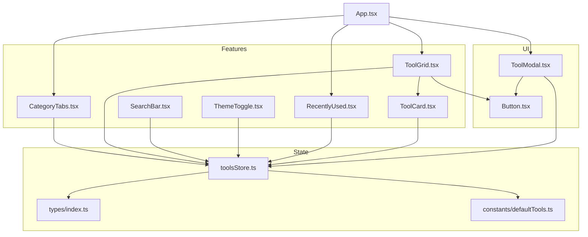
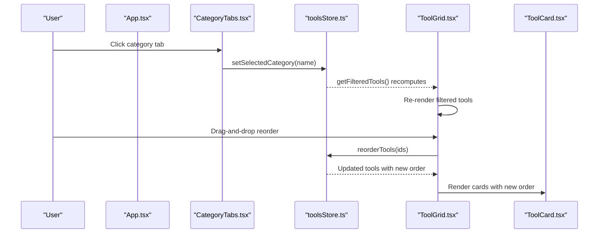
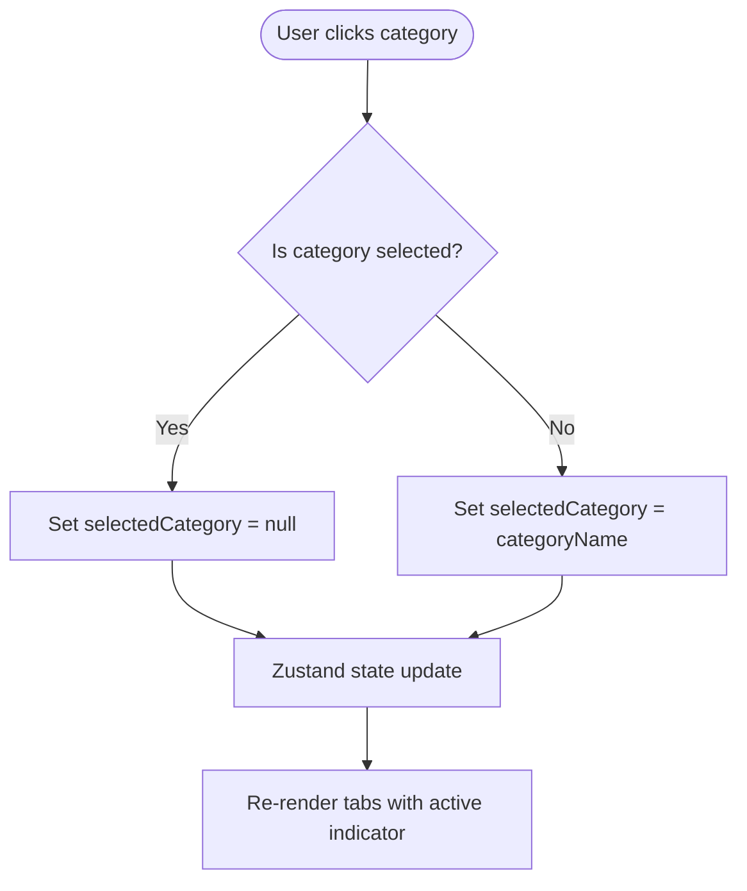
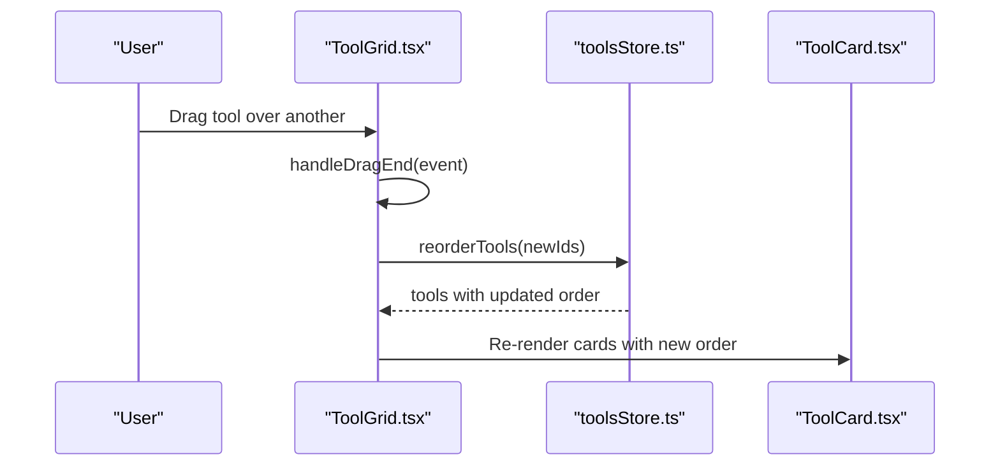
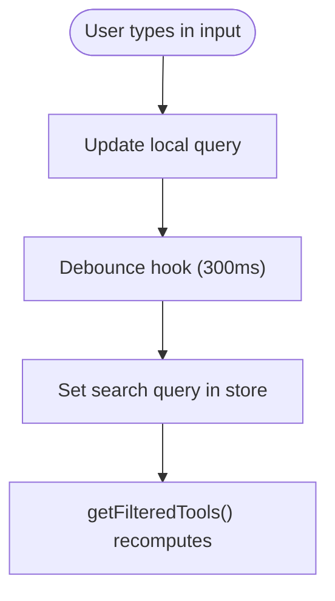
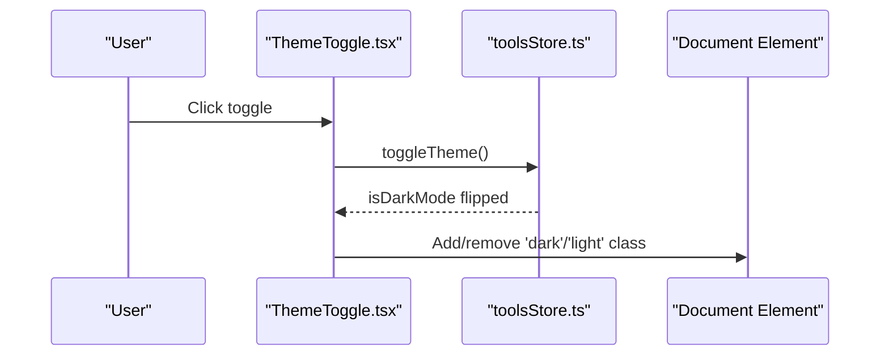
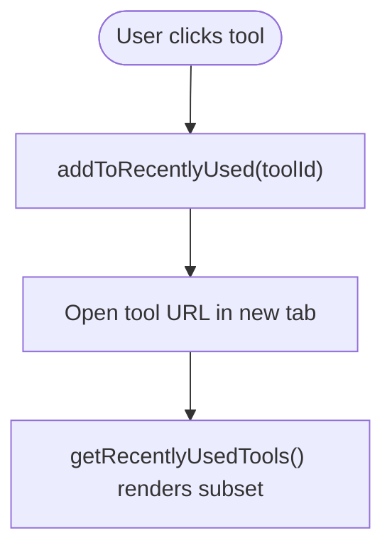
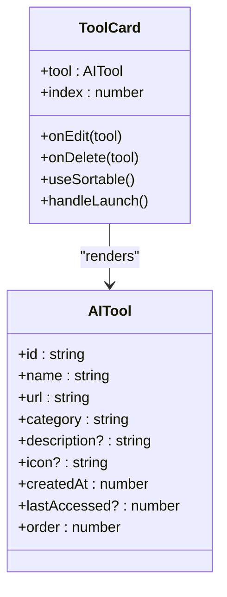
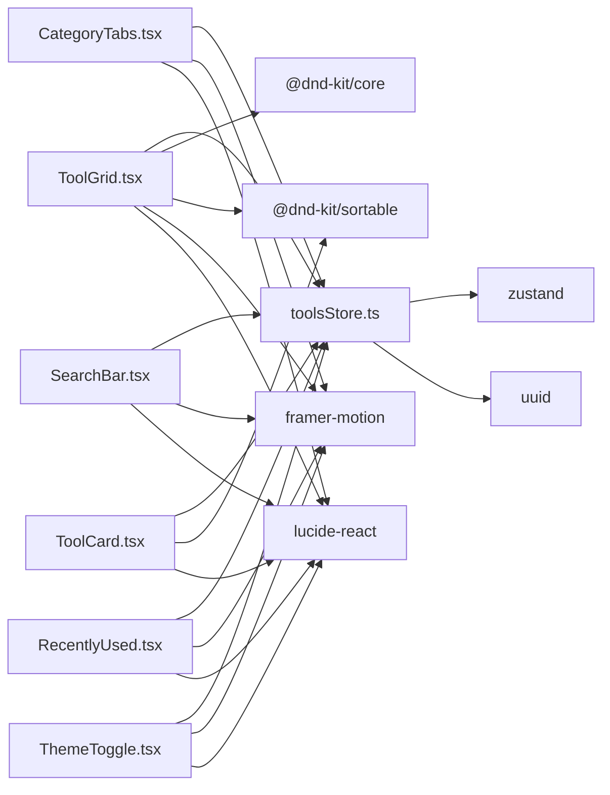

# Feature Components

<cite>
**Referenced Files in This Document**
- [CategoryTabs.tsx](file://src/components/features/CategoryTabs.tsx)
- [ToolGrid.tsx](file://src/components/features/ToolGrid.tsx)
- [SearchBar.tsx](file://src/components/features/SearchBar.tsx)
- [ThemeToggle.tsx](file://src/components/features/ThemeToggle.tsx)
- [RecentlyUsed.tsx](file://src/components/features/RecentlyUsed.tsx)
- [ToolCard.tsx](file://src/components/features/ToolCard.tsx)
- [toolsStore.ts](file://src/stores/toolsStore.ts)
- [index.ts](file://src/types/index.ts)
- [defaultTools.ts](file://src/constants/defaultTools.ts)
- [Button.tsx](file://src/components/ui/Button.tsx)
- [ToolModal.tsx](file://src/components/modals/ToolModal.tsx)
- [App.tsx](file://src/App.tsx)
- [package.json](file://package.json)
</cite>

## Table of Contents
1. [Introduction](#introduction)
2. [Project Structure](#project-structure)
3. [Core Components](#core-components)
4. [Architecture Overview](#architecture-overview)
5. [Detailed Component Analysis](#detailed-component-analysis)
6. [Dependency Analysis](#dependency-analysis)
7. [Performance Considerations](#performance-considerations)
8. [Troubleshooting Guide](#troubleshooting-guide)
9. [Conclusion](#conclusion)
10. [Appendices](#appendices)

## Introduction
This document provides comprehensive documentation for AIPulse feature components that implement core application functionality. It focuses on five key features: CategoryTabs for tool categorization and filtering, ToolGrid for displaying and organizing tools in a responsive grid, SearchBar for tool discovery, ThemeToggle for dark/light mode switching, RecentlyUsed for tracking tool usage, and ToolCard for individual tool representation. The guide explains component interfaces, state management integration with the Zustand store, user interaction patterns, drag-and-drop implementation using @dnd-kit/core, animation systems with Framer Motion, and responsive design considerations. It also covers customization examples, event handling patterns, integration with external APIs, and component composition to create cohesive user experiences.

## Project Structure
The feature components are organized under src/components/features and integrate with shared UI components, Zustand store, and type definitions. The store manages state for tools, categories, filters, theme, and recently used items. The UI components provide reusable primitives like Button and Modal. The App orchestrates modals and passes callbacks to ToolGrid for editing and deleting tools.

**Diagram sources**
- [CategoryTabs.tsx](file://src/components/features/CategoryTabs.tsx#L1-L106)
- [ToolGrid.tsx](file://src/components/features/ToolGrid.tsx#L1-L112)
- [SearchBar.tsx](file://src/components/features/SearchBar.tsx#L1-L42)
- [ThemeToggle.tsx](file://src/components/features/ThemeToggle.tsx#L1-L43)
- [RecentlyUsed.tsx](file://src/components/features/RecentlyUsed.tsx#L1-L101)
- [ToolCard.tsx](file://src/components/features/ToolCard.tsx#L1-L141)
- [toolsStore.ts](file://src/stores/toolsStore.ts#L1-L177)
- [index.ts](file://src/types/index.ts#L1-L60)
- [defaultTools.ts](file://src/constants/defaultTools.ts#L1-L101)
- [Button.tsx](file://src/components/ui/Button.tsx#L1-L88)
- [ToolModal.tsx](file://src/components/modals/ToolModal.tsx#L1-L253)
- [App.tsx](file://src/App.tsx#L1-L122)

**Section sources**
- [App.tsx](file://src/App.tsx#L1-L122)
- [package.json](file://package.json#L1-L36)

## Core Components
This section introduces the six feature components and their roles:
- CategoryTabs: Renders category tabs with counts and selection state, integrates with Framer Motion for smooth transitions.
- ToolGrid: Displays tools in a responsive grid, supports drag-and-drop reordering via @dnd-kit, and shows empty states with animations.
- SearchBar: Provides live search with debounced updates and clear functionality.
- ThemeToggle: Switches between dark and light themes and applies CSS classes to the document element.
- RecentlyUsed: Shows frequently accessed tools with expandable list and animated entries.
- ToolCard: Individual tool card with drag handles, edit/delete actions, and launch behavior.

Each component consumes the Zustand store for state and actions, and uses Tailwind CSS for styling and Framer Motion for animations.

**Section sources**
- [CategoryTabs.tsx](file://src/components/features/CategoryTabs.tsx#L1-L106)
- [ToolGrid.tsx](file://src/components/features/ToolGrid.tsx#L1-L112)
- [SearchBar.tsx](file://src/components/features/SearchBar.tsx#L1-L42)
- [ThemeToggle.tsx](file://src/components/features/ThemeToggle.tsx#L1-L43)
- [RecentlyUsed.tsx](file://src/components/features/RecentlyUsed.tsx#L1-L101)
- [ToolCard.tsx](file://src/components/features/ToolCard.tsx#L1-L141)

## Architecture Overview
The feature components form a cohesive UI layer that interacts with the Zustand store. The store encapsulates CRUD operations for tools and categories, filtering logic, theme management, and recently used tracking. Components subscribe to store slices and trigger actions through callbacks passed from App.

**Diagram sources**
- [App.tsx](file://src/App.tsx#L28-L51)
- [CategoryTabs.tsx](file://src/components/features/CategoryTabs.tsx#L13-L19)
- [toolsStore.ts](file://src/stores/toolsStore.ts#L99-L156)
- [ToolGrid.tsx](file://src/components/features/ToolGrid.tsx#L46-L56)
- [ToolCard.tsx](file://src/components/features/ToolCard.tsx#L18-L29)

## Detailed Component Analysis

### CategoryTabs
- Purpose: Allow users to filter tools by category and show counts per category.
- State Management: Uses Zustand selectors to read categories, selectedCategory, and tools; writes selectedCategory.
- Interactions:
  - Clicking “All” clears the category filter.
  - Clicking a category toggles selection or clears it if clicked again.
- Animations: Uses Framer Motion with layoutId for smooth active indicator transitions.
- Accessibility: Uses relative z-index for label stacking and keyboard-friendly buttons.

**Diagram sources**
- [CategoryTabs.tsx](file://src/components/features/CategoryTabs.tsx#L13-L19)
- [toolsStore.ts](file://src/stores/toolsStore.ts#L99-L101)

**Section sources**
- [CategoryTabs.tsx](file://src/components/features/CategoryTabs.tsx#L1-L106)
- [toolsStore.ts](file://src/stores/toolsStore.ts#L1-L177)

### ToolGrid
- Purpose: Display filtered tools in a responsive grid and support drag-and-drop reordering.
- State Management: Reads filtered tools via getFilteredTools and triggers reorderTools.
- Drag-and-Drop:
  - Sensors configured for pointer and keyboard.
  - Collision detection uses closestCenter.
  - On drag end, computes new indices and updates tool order.
- Empty States: Renders a friendly message with optional “Add Your First Tool” button.
- Responsive Grid: Uses Tailwind grid classes with breakpoints for 1–4 columns.

**Diagram sources**
- [ToolGrid.tsx](file://src/components/features/ToolGrid.tsx#L35-L56)
- [toolsStore.ts](file://src/stores/toolsStore.ts#L53-L75)
- [ToolCard.tsx](file://src/components/features/ToolCard.tsx#L22-L29)

**Section sources**
- [ToolGrid.tsx](file://src/components/features/ToolGrid.tsx#L1-L112)
- [toolsStore.ts](file://src/stores/toolsStore.ts#L132-L156)

### SearchBar
- Purpose: Enable live search with debounced updates to reduce store churn.
- State Management: Maintains local query state and debounces to Zustand setSearchQuery.
- Interactions:
  - Clears input and query on clear button click.
  - Updates searchQuery via store action.
- Accessibility: Proper placeholder and aria-labels.

**Diagram sources**
- [SearchBar.tsx](file://src/components/features/SearchBar.tsx#L6-L18)
- [toolsStore.ts](file://src/stores/toolsStore.ts#L95-L97)

**Section sources**
- [SearchBar.tsx](file://src/components/features/SearchBar.tsx#L1-L42)
- [toolsStore.ts](file://src/stores/toolsStore.ts#L95-L97)

### ThemeToggle
- Purpose: Toggle between dark and light themes and apply CSS classes to document element.
- State Management: Uses isDarkMode and toggleTheme from Zustand.
- Effects: Applies/removes “dark” class on mount and when theme changes.
- Animation: Smooth transitions between sun/moon icons.

**Diagram sources**
- [ThemeToggle.tsx](file://src/components/features/ThemeToggle.tsx#L6-L18)
- [toolsStore.ts](file://src/stores/toolsStore.ts#L104-L106)

**Section sources**
- [ThemeToggle.tsx](file://src/components/features/ThemeToggle.tsx#L1-L43)
- [toolsStore.ts](file://src/stores/toolsStore.ts#L104-L110)

### RecentlyUsed
- Purpose: Display frequently accessed tools with expandable list and animated entries.
- State Management: Uses getRecentlyUsedTools and addToRecentlyUsed.
- Interactions:
  - Expands/collapses list with chevron animation.
  - Opens tool URLs in a new tab and updates recently used list.
- Animation: Uses Framer Motion for header rotation, list expansion, and staggered item appearance.

**Diagram sources**
- [RecentlyUsed.tsx](file://src/components/features/RecentlyUsed.tsx#L20-L23)
- [toolsStore.ts](file://src/stores/toolsStore.ts#L113-L129)

**Section sources**
- [RecentlyUsed.tsx](file://src/components/features/RecentlyUsed.tsx#L1-L101)
- [toolsStore.ts](file://src/stores/toolsStore.ts#L113-L129)

### ToolCard
- Purpose: Individual tool representation with drag handle, edit/delete actions, and launch button.
- Drag-and-Drop: Implements useSortable to integrate with ToolGrid’s DndContext.
- Interactions:
  - Launch opens tool URL and updates recently used.
  - Edit/Delete callbacks invoked by parent ToolGrid.
- Animation: Hover effects, staggered entrance, and dragging visuals.

**Diagram sources**
- [ToolCard.tsx](file://src/components/features/ToolCard.tsx#L11-L16)
- [index.ts](file://src/types/index.ts#L1-L11)

**Section sources**
- [ToolCard.tsx](file://src/components/features/ToolCard.tsx#L1-L141)
- [index.ts](file://src/types/index.ts#L1-L11)

## Dependency Analysis
The feature components depend on:
- Zustand store for state and actions.
- Framer Motion for animations.
- @dnd-kit for drag-and-drop.
- Tailwind CSS for responsive styling.
- Lucide icons for UI elements.
- UUID for generating IDs.

**Diagram sources**
- [CategoryTabs.tsx](file://src/components/features/CategoryTabs.tsx#L1-L3)
- [ToolGrid.tsx](file://src/components/features/ToolGrid.tsx#L3-L17)
- [SearchBar.tsx](file://src/components/features/SearchBar.tsx#L1-L4)
- [ThemeToggle.tsx](file://src/components/features/ThemeToggle.tsx#L1-L4)
- [RecentlyUsed.tsx](file://src/components/features/RecentlyUsed.tsx#L1-L7)
- [ToolCard.tsx](file://src/components/features/ToolCard.tsx#L1-L9)
- [toolsStore.ts](file://src/stores/toolsStore.ts#L1-L5)
- [package.json](file://package.json#L22-L34)

**Section sources**
- [package.json](file://package.json#L22-L34)
- [toolsStore.ts](file://src/stores/toolsStore.ts#L1-L5)

## Performance Considerations
- Debounced Search: SearchBar uses a debounce hook to minimize store updates during typing.
- Memoized Filtering: ToolGrid uses useMemo to compute filtered tools only when dependencies change.
- Efficient Sorting: reorderTools updates order properties and rebuilds the tools array efficiently.
- Lazy Icon Loading: ToolCard dynamically resolves icon components from Lucide icons, avoiding unused imports.
- Minimal Re-renders: Zustand selectors isolate state slices to reduce unnecessary re-renders.

[No sources needed since this section provides general guidance]

## Troubleshooting Guide
- Drag-and-drop not working:
  - Ensure DndContext wraps ToolGrid and SortableContext wraps filtered tools with correct item IDs.
  - Verify useSortable is used in ToolCard and IDs match filtered tools.
- Theme not applying:
  - Confirm toggleTheme updates isDarkMode and useEffect applies classes to document element.
- Search not filtering:
  - Check setSearchQuery is called with debounced query and getFilteredTools recomputes filters.
- Recently used not updating:
  - Verify addToRecentlyUsed updates both recentlyUsed list and tool’s lastAccessed timestamp.

**Section sources**
- [ToolGrid.tsx](file://src/components/features/ToolGrid.tsx#L88-L109)
- [ToolCard.tsx](file://src/components/features/ToolCard.tsx#L22-L29)
- [ThemeToggle.tsx](file://src/components/features/ThemeToggle.tsx#L10-L18)
- [SearchBar.tsx](file://src/components/features/SearchBar.tsx#L11-L13)
- [toolsStore.ts](file://src/stores/toolsStore.ts#L113-L129)

## Conclusion
The AIPulse feature components deliver a cohesive, interactive experience centered around tool discovery, organization, and personalization. They leverage Zustand for efficient state management, Framer Motion for delightful animations, and @dnd-kit for intuitive drag-and-drop interactions. Together, these components provide a responsive, accessible, and extensible foundation for managing AI tools.

[No sources needed since this section summarizes without analyzing specific files]

## Appendices

### Component Interfaces and Props
- CategoryTabs: No props; reads from Zustand store.
- ToolGrid: onEditTool(tool), onDeleteTool(tool), onAddTool().
- SearchBar: No props; manages local state and debounces to store.
- ThemeToggle: No props; toggles theme via store.
- RecentlyUsed: onToolClick(tool) callback.
- ToolCard: tool, onEdit(tool), onDelete(tool), index.

**Section sources**
- [CategoryTabs.tsx](file://src/components/features/CategoryTabs.tsx#L5-L6)
- [ToolGrid.tsx](file://src/components/features/ToolGrid.tsx#L24-L28)
- [SearchBar.tsx](file://src/components/features/SearchBar.tsx#L6-L8)
- [ThemeToggle.tsx](file://src/components/features/ThemeToggle.tsx#L6-L7)
- [RecentlyUsed.tsx](file://src/components/features/RecentlyUsed.tsx#L9-L11)
- [ToolCard.tsx](file://src/components/features/ToolCard.tsx#L11-L16)

### State Management Integration with Zustand
- Store shape and actions are defined in toolsStore.ts with typed getters and setters.
- Types define AITool, Category, and ToolsState interfaces for compile-time safety.
- Default tools and categories are loaded from defaultTools.ts.

**Section sources**
- [toolsStore.ts](file://src/stores/toolsStore.ts#L14-L177)
- [index.ts](file://src/types/index.ts#L19-L51)
- [defaultTools.ts](file://src/constants/defaultTools.ts#L1-L101)

### Event Handling Patterns
- Callbacks passed from App to ToolGrid for edit/delete/add actions.
- ToolCard triggers addToRecentlyUsed on launch and opens URLs in new tabs.
- CategoryTabs toggles selectedCategory on click; ThemeToggle flips isDarkMode.

**Section sources**
- [App.tsx](file://src/App.tsx#L28-L51)
- [ToolCard.tsx](file://src/components/features/ToolCard.tsx#L41-L44)
- [CategoryTabs.tsx](file://src/components/features/CategoryTabs.tsx#L13-L19)
- [ThemeToggle.tsx](file://src/components/features/ThemeToggle.tsx#L20-L27)

### Customization Examples
- Theming: Adjust dark/light classes and CSS variables in App.tsx and ThemeToggle.tsx.
- Icons: Choose from iconOptions in defaultTools.ts and ToolModal.tsx.
- Categories: Add or remove categories via addCategory/deleteCategory actions.
- Grid responsiveness: Modify Tailwind grid classes in ToolGrid.tsx for different breakpoints.

**Section sources**
- [ThemeToggle.tsx](file://src/components/features/ThemeToggle.tsx#L10-L18)
- [defaultTools.ts](file://src/constants/defaultTools.ts#L75-L100)
- [ToolModal.tsx](file://src/components/modals/ToolModal.tsx#L119-L128)
- [ToolGrid.tsx](file://src/components/features/ToolGrid.tsx#L97-L107)

### Integration with External APIs
- Tool URLs are opened externally via window.open in ToolCard.tsx and RecentlyUsed.tsx.
- ToolModal validates URLs using URL constructor before submitting edits/creations.
- No backend integration is present; data persistence relies on Zustand with localStorage via persist middleware.

**Section sources**
- [ToolCard.tsx](file://src/components/features/ToolCard.tsx#L41-L44)
- [RecentlyUsed.tsx](file://src/components/features/RecentlyUsed.tsx#L20-L23)
- [ToolModal.tsx](file://src/components/modals/ToolModal.tsx#L71-L78)
- [toolsStore.ts](file://src/stores/toolsStore.ts#L166-L175)