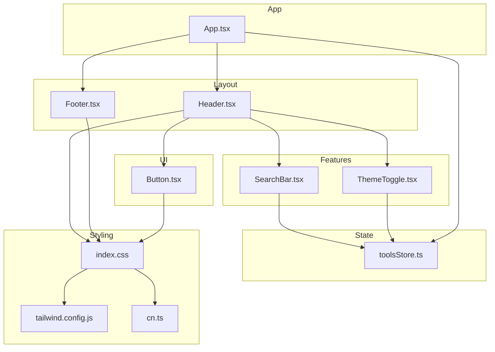
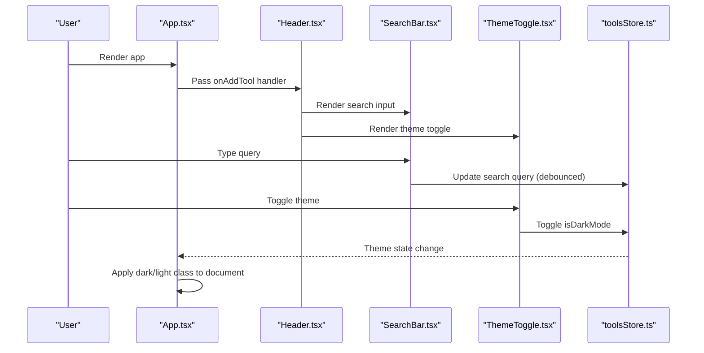
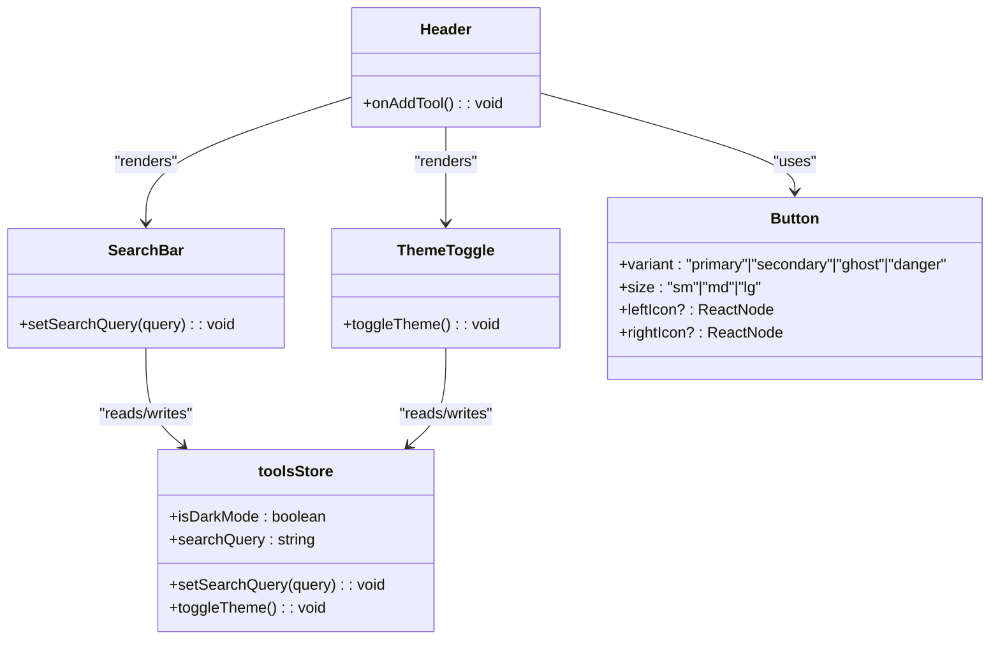
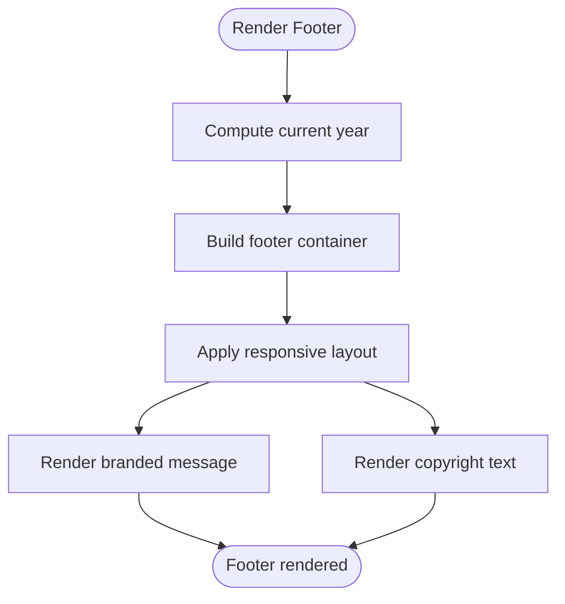
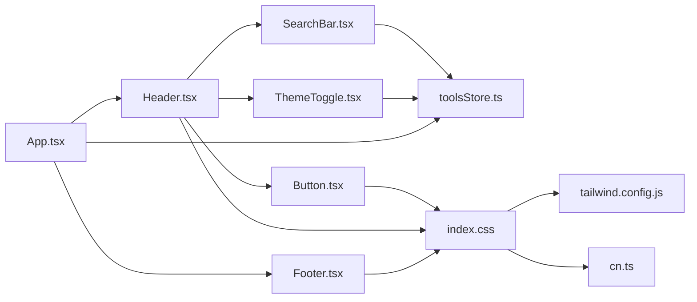

# Layout Components

<cite>
**Referenced Files in This Document**
- [Header.tsx](file://src/components/layout/Header.tsx)
- [Footer.tsx](file://src/components/layout/Footer.tsx)
- [App.tsx](file://src/App.tsx)
- [SearchBar.tsx](file://src/components/features/SearchBar.tsx)
- [ThemeToggle.tsx](file://src/components/features/ThemeToggle.tsx)
- [Button.tsx](file://src/components/ui/Button.tsx)
- [toolsStore.ts](file://src/stores/toolsStore.ts)
- [index.ts](file://src/types/index.ts)
- [cn.ts](file://src/utils/cn.ts)
- [index.css](file://src/index.css)
- [tailwind.config.js](file://tailwind.config.js)
- [useDebounce.ts](file://src/hooks/useDebounce.ts)
</cite>

## Table of Contents
1. [Introduction](#introduction)
2. [Project Structure](#project-structure)
3. [Core Components](#core-components)
4. [Architecture Overview](#architecture-overview)
5. [Detailed Component Analysis](#detailed-component-analysis)
6. [Dependency Analysis](#dependency-analysis)
7. [Performance Considerations](#performance-considerations)
8. [Troubleshooting Guide](#troubleshooting-guide)
9. [Conclusion](#conclusion)
10. [Appendices](#appendices)

## Introduction
This document provides comprehensive documentation for the AIPulse layout components, focusing on the Header and Footer implementations. It explains how the Header manages navigation, search, and theme switching, and how the Footer structures and positions itself within the application layout. It also details component props, event handlers, integration with global state management, styling approaches using Tailwind CSS, responsive design patterns, accessibility features, composition patterns, and performance considerations.

## Project Structure
The layout components are located under src/components/layout and integrate with the main application in App.tsx. They rely on shared UI primitives, global state management, and Tailwind CSS utilities for styling and responsiveness.

**Diagram sources**
- [Header.tsx](file://src/components/layout/Header.tsx#L1-L83)
- [Footer.tsx](file://src/components/layout/Footer.tsx#L1-L21)
- [App.tsx](file://src/App.tsx#L1-L122)
- [SearchBar.tsx](file://src/components/features/SearchBar.tsx#L1-L42)
- [ThemeToggle.tsx](file://src/components/features/ThemeToggle.tsx#L1-L43)
- [Button.tsx](file://src/components/ui/Button.tsx#L1-L88)
- [toolsStore.ts](file://src/stores/toolsStore.ts#L1-L177)
- [index.css](file://src/index.css#L1-L141)
- [tailwind.config.js](file://tailwind.config.js#L1-L69)
- [cn.ts](file://src/utils/cn.ts#L1-L7)

**Section sources**
- [Header.tsx](file://src/components/layout/Header.tsx#L1-L83)
- [Footer.tsx](file://src/components/layout/Footer.tsx#L1-L21)
- [App.tsx](file://src/App.tsx#L1-L122)

## Core Components
- Header: Fixed top bar containing logo, centered search, theme toggle, settings, and add tool actions. Uses motion animations and Tailwind classes for styling and responsiveness.
- Footer: Static bottom bar with copyright and branding text, responsive layout, and consistent theming.

Key responsibilities:
- Header: Provides navigation affordances, search input, and theme switching; forwards add tool events to parent.
- Footer: Presents static informational content and maintains consistent spacing and typography.

**Section sources**
- [Header.tsx](file://src/components/layout/Header.tsx#L7-L83)
- [Footer.tsx](file://src/components/layout/Footer.tsx#L3-L21)

## Architecture Overview
The layout components are composed within the main App container. The Header integrates SearchBar and ThemeToggle, which both consume the global Zustand store. The Footer is positioned at the bottom of the page and remains unaffected by the main content scrolling.

**Diagram sources**
- [App.tsx](file://src/App.tsx#L13-L51)
- [Header.tsx](file://src/components/layout/Header.tsx#L11-L83)
- [SearchBar.tsx](file://src/components/features/SearchBar.tsx#L6-L42)
- [ThemeToggle.tsx](file://src/components/features/ThemeToggle.tsx#L6-L43)
- [toolsStore.ts](file://src/stores/toolsStore.ts#L14-L177)

## Detailed Component Analysis

### Header Component
Role and behavior:
- Fixed position at the top with backdrop blur and themed borders.
- Contains a logo section, centered search bar, and action buttons (theme toggle, settings, add tool).
- Responsive design: desktop shows text labels and larger buttons; mobile hides labels and uses compact icons.

Props:
- onAddTool: Callback invoked when the add tool button is clicked.

Event handlers:
- Header does not define local click handlers; it forwards the onAddTool prop to the add tool button.

Integration with global state:
- Uses SearchBar and ThemeToggle, which both read/write state from toolsStore.
- SearchBar updates the search query in the store with a debounced value.
- ThemeToggle toggles isDarkMode and applies the appropriate class to document.documentElement.

Styling and responsiveness:
- Uses Tailwind utilities for layout, spacing, and theming.
- Responsive breakpoints: hidden on small screens, visible on medium+ screens.
- Motion animations for entrance and staggered child elements.

Accessibility:
- Buttons include aria-label attributes for screen readers.
- Focus-visible outlines and keyboard operable.

Composition patterns:
- Composes SearchBar and ThemeToggle as children.
- Uses Button component for consistent button styling and behavior.

**Diagram sources**
- [Header.tsx](file://src/components/layout/Header.tsx#L7-L83)
- [SearchBar.tsx](file://src/components/features/SearchBar.tsx#L6-L42)
- [ThemeToggle.tsx](file://src/components/features/ThemeToggle.tsx#L6-L43)
- [Button.tsx](file://src/components/ui/Button.tsx#L4-L88)
- [toolsStore.ts](file://src/stores/toolsStore.ts#L14-L177)

**Section sources**
- [Header.tsx](file://src/components/layout/Header.tsx#L7-L83)
- [SearchBar.tsx](file://src/components/features/SearchBar.tsx#L6-L42)
- [ThemeToggle.tsx](file://src/components/features/ThemeToggle.tsx#L6-L43)
- [Button.tsx](file://src/components/ui/Button.tsx#L4-L88)
- [toolsStore.ts](file://src/stores/toolsStore.ts#L14-L177)

### Footer Component
Structure and positioning:
- Positioned at the bottom of the page with a top border and themed background.
- Responsive layout: stacked on small screens, aligned horizontally on medium+ screens.
- Contains copyright notice and a branded message with an icon.

Content customization:
- The year is dynamically computed from the current date.
- Text content is static but can be adapted by replacing the paragraph elements.

Styling and responsiveness:
- Uses Tailwind utilities for padding, alignment, and responsive flex behavior.
- Theming follows the global dark/light classes applied by the store.

Accessibility:
- No interactive elements; text content is accessible by default.

**Diagram sources**
- [Footer.tsx](file://src/components/layout/Footer.tsx#L3-L21)

**Section sources**
- [Footer.tsx](file://src/components/layout/Footer.tsx#L3-L21)

### SearchBar Component
Behavior:
- Maintains a local query state and debounces updates to the global store.
- Provides a clear button when the input is not empty.

Integration with global state:
- Reads and writes searchQuery via toolsStore.
- Debounce delay is 300ms.

Styling and responsiveness:
- Uses Tailwind utilities for input appearance, focus states, and hover transitions.
- Responsive padding and icon placement.

Accessibility:
- Clear button includes aria-label for assistive technologies.

**Section sources**
- [SearchBar.tsx](file://src/components/features/SearchBar.tsx#L6-L42)
- [useDebounce.ts](file://src/hooks/useDebounce.ts#L3-L18)
- [toolsStore.ts](file://src/stores/toolsStore.ts#L95-L97)

### ThemeToggle Component
Behavior:
- Reads isDarkMode from toolsStore and toggles it on click.
- Applies dark or light class to document.documentElement based on state.

Integration with global state:
- Uses toolsStore for isDarkMode and toggleTheme.

Styling and responsiveness:
- Uses Button component for consistent styling and sizing.
- Animated sun/moon icons reflect current theme state.

Accessibility:
- Button includes aria-label indicating current mode.

**Section sources**
- [ThemeToggle.tsx](file://src/components/features/ThemeToggle.tsx#L6-L43)
- [toolsStore.ts](file://src/stores/toolsStore.ts#L104-L106)

### App Container Integration
Composition:
- Wraps Header and Footer around the main content sections.
- Manages modal visibility and passes callbacks to Header and ToolGrid.

Global state integration:
- Applies dark/light class to document based on isDarkMode.
- Passes onAddTool to Header for unified add tool flow.

**Section sources**
- [App.tsx](file://src/App.tsx#L13-L122)
- [toolsStore.ts](file://src/stores/toolsStore.ts#L17-L26)

## Dependency Analysis
The layout components depend on shared UI primitives, global state, and styling utilities. The following diagram shows key dependencies:

**Diagram sources**
- [Header.tsx](file://src/components/layout/Header.tsx#L1-L83)
- [Footer.tsx](file://src/components/layout/Footer.tsx#L1-L21)
- [App.tsx](file://src/App.tsx#L1-L122)
- [SearchBar.tsx](file://src/components/features/SearchBar.tsx#L1-L42)
- [ThemeToggle.tsx](file://src/components/features/ThemeToggle.tsx#L1-L43)
- [Button.tsx](file://src/components/ui/Button.tsx#L1-L88)
- [toolsStore.ts](file://src/stores/toolsStore.ts#L1-L177)
- [index.css](file://src/index.css#L1-L141)
- [tailwind.config.js](file://tailwind.config.js#L1-L69)
- [cn.ts](file://src/utils/cn.ts#L1-L7)

**Section sources**
- [Header.tsx](file://src/components/layout/Header.tsx#L1-L83)
- [Footer.tsx](file://src/components/layout/Footer.tsx#L1-L21)
- [App.tsx](file://src/App.tsx#L1-L122)
- [toolsStore.ts](file://src/stores/toolsStore.ts#L1-L177)
- [index.css](file://src/index.css#L1-L141)
- [tailwind.config.js](file://tailwind.config.js#L1-L69)
- [cn.ts](file://src/utils/cn.ts#L1-L7)

## Performance Considerations
- Debounced search: SearchBar uses a 300ms debounce to reduce store updates during typing, minimizing re-renders.
- Motion animations: Header uses Framer Motion for entrance animations; keep durations reasonable to avoid jank.
- Global state updates: ThemeToggle and SearchBar update the store efficiently; avoid unnecessary re-renders by keeping components pure.
- Tailwind utilities: Prefer utility classes over custom CSS to leverage build-time optimizations.
- Responsive breakpoints: Use Tailwind’s responsive variants to minimize media queries and improve maintainability.

[No sources needed since this section provides general guidance]

## Troubleshooting Guide
Common issues and resolutions:
- Theme not applying: Ensure the dark/light class is correctly toggled on document.documentElement by ThemeToggle and reflected in App.tsx.
- Search not filtering: Verify setSearchQuery is called with the debounced value and that getFilteredTools uses searchQuery appropriately.
- Header overlaps content: Confirm the main content has sufficient top padding to account for the fixed header height.
- Footer misalignment: Check responsive flex properties and ensure max-width containers are respected.

**Section sources**
- [ThemeToggle.tsx](file://src/components/features/ThemeToggle.tsx#L9-L18)
- [App.tsx](file://src/App.tsx#L19-L26)
- [SearchBar.tsx](file://src/components/features/SearchBar.tsx#L11-L13)
- [toolsStore.ts](file://src/stores/toolsStore.ts#L132-L156)

## Conclusion
The Header and Footer components provide a cohesive layout foundation for AIPulse. The Header integrates search and theme controls through global state, while the Footer offers a consistent, responsive bottom bar. Together with shared UI primitives and Tailwind-based styling, they form a scalable and accessible layout architecture.

[No sources needed since this section summarizes without analyzing specific files]

## Appendices

### Props and Event Handlers Reference
- Header.onAddTool: Invoked when the add tool button is clicked.
- SearchBar: Manages local query state and debounces store updates.
- ThemeToggle: Toggles isDarkMode and applies document class.

**Section sources**
- [Header.tsx](file://src/components/layout/Header.tsx#L7-L9)
- [SearchBar.tsx](file://src/components/features/SearchBar.tsx#L6-L18)
- [ThemeToggle.tsx](file://src/components/features/ThemeToggle.tsx#L6-L27)

### Styling and Accessibility Notes
- Tailwind classes: Use semantic color tokens and responsive modifiers.
- Accessibility: Provide aria-labels for icon-only buttons; ensure focus-visible outlines are visible.
- Animations: Keep motion durations short and avoid heavy transforms on frequently updated elements.

**Section sources**
- [index.css](file://src/index.css#L72-L75)
- [Button.tsx](file://src/components/ui/Button.tsx#L12-L88)
- [Header.tsx](file://src/components/layout/Header.tsx#L58-L76)