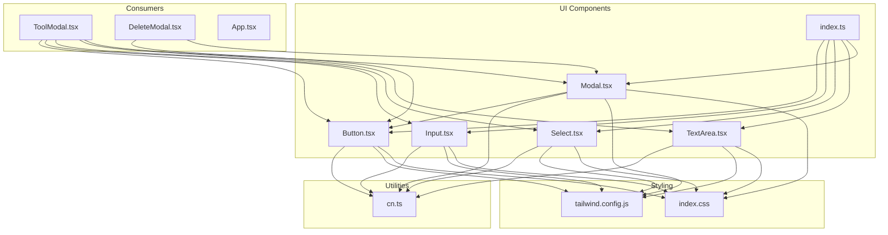
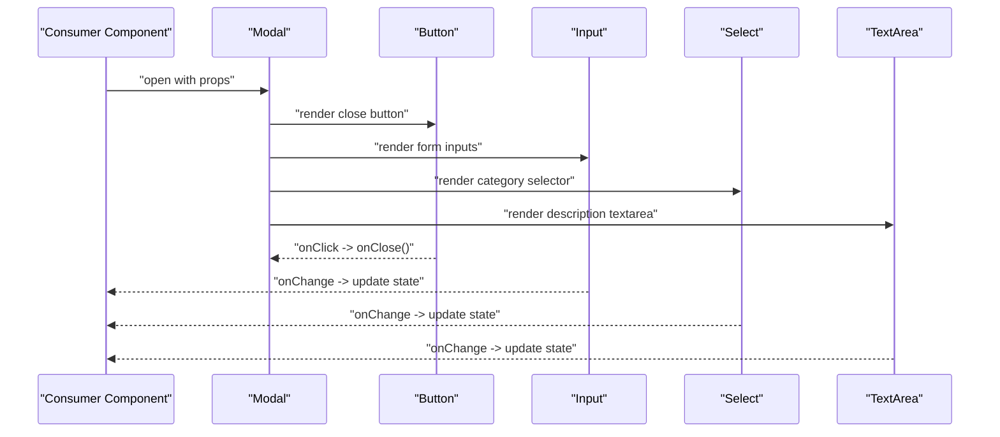
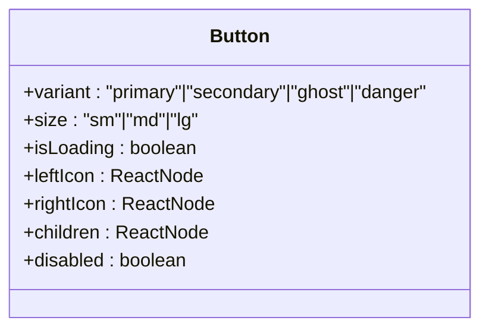
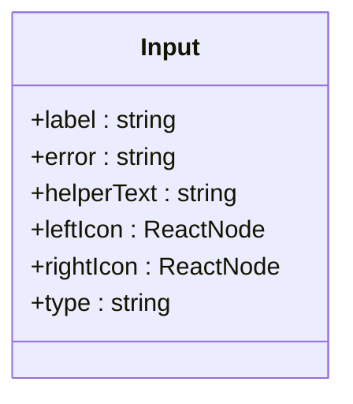
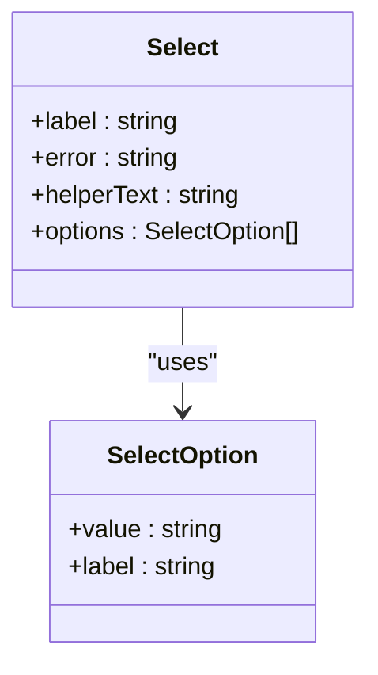
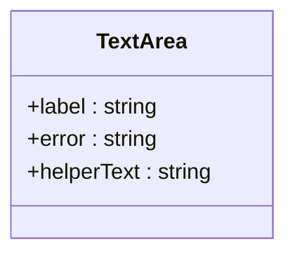
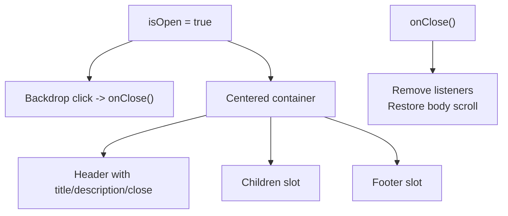
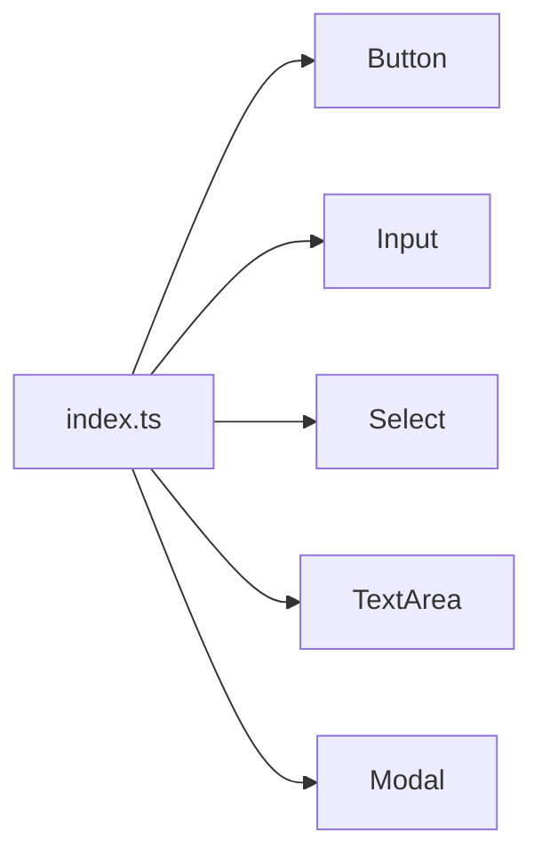
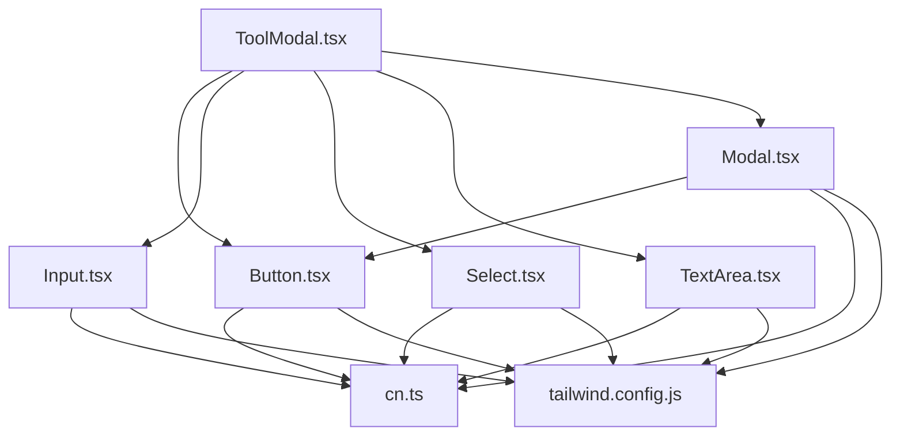

# UI Components

<cite>
**Referenced Files in This Document**
- [Button.tsx](file://src/components/ui/Button.tsx)
- [Input.tsx](file://src/components/ui/Input.tsx)
- [Modal.tsx](file://src/components/ui/Modal.tsx)
- [Select.tsx](file://src/components/ui/Select.tsx)
- [TextArea.tsx](file://src/components/ui/TextArea.tsx)
- [index.ts](file://src/components/ui/index.ts)
- [cn.ts](file://src/utils/cn.ts)
- [tailwind.config.js](file://tailwind.config.js)
- [index.css](file://src/index.css)
- [ToolModal.tsx](file://src/components/modals/ToolModal.tsx)
- [DeleteModal.tsx](file://src/components/modals/DeleteModal.tsx)
- [App.tsx](file://src/App.tsx)
- [types/index.ts](file://src/types/index.ts)
</cite>

## Table of Contents
1. [Introduction](#introduction)
2. [Project Structure](#project-structure)
3. [Core Components](#core-components)
4. [Architecture Overview](#architecture-overview)
5. [Detailed Component Analysis](#detailed-component-analysis)
6. [Dependency Analysis](#dependency-analysis)
7. [Performance Considerations](#performance-considerations)
8. [Troubleshooting Guide](#troubleshooting-guide)
9. [Conclusion](#conclusion)
10. [Appendices](#appendices)

## Introduction
This document describes the reusable UI components that form the foundation of AIPulse’s visual design system. It covers the Button, Input, Modal, Select, and TextArea components, including their variants, sizes, interactive states, composition patterns, prop interfaces, and styling consistency enforced through Tailwind CSS utilities. It also documents the centralized index export pattern, component customization and theme integration, accessibility features, state management and event handling patterns, and performance best practices.

## Project Structure
The UI components live under src/components/ui and are exported via a central index.ts barrel file. They are consumed by higher-level components such as modals and pages.

**Diagram sources**
- [Button.tsx](file://src/components/ui/Button.tsx#L1-L88)
- [Input.tsx](file://src/components/ui/Input.tsx#L1-L74)
- [Select.tsx](file://src/components/ui/Select.tsx#L1-L61)
- [TextArea.tsx](file://src/components/ui/TextArea.tsx#L1-L45)
- [Modal.tsx](file://src/components/ui/Modal.tsx#L1-L128)
- [index.ts](file://src/components/ui/index.ts#L1-L15)
- [cn.ts](file://src/utils/cn.ts#L1-L7)
- [tailwind.config.js](file://tailwind.config.js#L1-L69)
- [index.css](file://src/index.css#L1-L141)
- [ToolModal.tsx](file://src/components/modals/ToolModal.tsx#L1-L253)
- [DeleteModal.tsx](file://src/components/modals/DeleteModal.tsx#L1-L67)
- [App.tsx](file://src/App.tsx#L1-L122)

**Section sources**
- [index.ts](file://src/components/ui/index.ts#L1-L15)
- [cn.ts](file://src/utils/cn.ts#L1-L7)
- [tailwind.config.js](file://tailwind.config.js#L1-L69)
- [index.css](file://src/index.css#L1-L141)

## Core Components
This section summarizes the five core UI components and their primary responsibilities.

- Button: Renders interactive buttons with variants, sizes, icons, loading states, and focus/ring behavior.
- Input: Presents a labeled input field with optional icons, validation feedback, and helper text.
- Select: Provides a styled select dropdown with options and validation feedback.
- TextArea: Offers a labeled textarea with validation and helper text.
- Modal: Implements an overlay dialog with backdrop, header, content, footer, and close controls.

Each component composes Tailwind utility classes and integrates with the shared cn() utility for safe class merging.

**Section sources**
- [Button.tsx](file://src/components/ui/Button.tsx#L1-L88)
- [Input.tsx](file://src/components/ui/Input.tsx#L1-L74)
- [Select.tsx](file://src/components/ui/Select.tsx#L1-L61)
- [TextArea.tsx](file://src/components/ui/TextArea.tsx#L1-L45)
- [Modal.tsx](file://src/components/ui/Modal.tsx#L1-L128)

## Architecture Overview
The UI components are designed around a consistent design system:
- Centralized exports via index.ts enable ergonomic imports across the app.
- Tailwind CSS defines theme tokens (colors, typography, animations) and global utilities.
- The cn() utility merges and deduplicates Tailwind classes safely.
- Consumers (e.g., ToolModal, DeleteModal) compose multiple UI components to build forms and dialogs.

**Diagram sources**
- [ToolModal.tsx](file://src/components/modals/ToolModal.tsx#L132-L250)
- [Modal.tsx](file://src/components/ui/Modal.tsx#L26-L127)
- [Button.tsx](file://src/components/ui/Button.tsx#L12-L87)
- [Input.tsx](file://src/components/ui/Input.tsx#L12-L73)
- [Select.tsx](file://src/components/ui/Select.tsx#L17-L60)
- [TextArea.tsx](file://src/components/ui/TextArea.tsx#L10-L44)

## Detailed Component Analysis

### Button
- Purpose: Primary interactive element with consistent styling and states.
- Variants: primary, secondary, ghost, danger.
- Sizes: sm, md, lg.
- States: loading, disabled, focus-visible ring, hover/active effects.
- Composition: Uses forwardRef, cn() for class merging, and renders an internal spinner during loading.

**Diagram sources**
- [Button.tsx](file://src/components/ui/Button.tsx#L4-L10)

**Section sources**
- [Button.tsx](file://src/components/ui/Button.tsx#L1-L88)

### Input
- Purpose: Text input with label, optional icons, validation, and helper text.
- Props: label, error, helperText, leftIcon, rightIcon, plus standard input attributes.
- Behavior: Applies focused, hover, and error states; positions icons inside the input.

**Diagram sources**
- [Input.tsx](file://src/components/ui/Input.tsx#L4-L10)

**Section sources**
- [Input.tsx](file://src/components/ui/Input.tsx#L1-L74)

### Select
- Purpose: Dropdown selector with label, validation, and helper text.
- Props: label, error, helperText, options (array of { value, label }).
- Behavior: Renders a styled select with a decorative chevron indicator.

**Diagram sources**
- [Select.tsx](file://src/components/ui/Select.tsx#L5-L15)

**Section sources**
- [Select.tsx](file://src/components/ui/Select.tsx#L1-L61)

### TextArea
- Purpose: Multi-line text input with label, validation, and helper text.
- Props: label, error, helperText, plus standard textarea attributes.

**Diagram sources**
- [TextArea.tsx](file://src/components/ui/TextArea.tsx#L4-L8)

**Section sources**
- [TextArea.tsx](file://src/components/ui/TextArea.tsx#L1-L45)

### Modal
- Purpose: Overlay dialog with backdrop, header, content, and footer areas.
- Props: isOpen, onClose, title, description, children, footer, size, showCloseButton, className.
- Behavior: Handles Escape key, disables body scroll, animates entrance/exit, and delegates close to Button.

**Diagram sources**
- [Modal.tsx](file://src/components/ui/Modal.tsx#L37-L54)
- [Modal.tsx](file://src/components/ui/Modal.tsx#L56-L127)

**Section sources**
- [Modal.tsx](file://src/components/ui/Modal.tsx#L1-L128)

### Index Export Pattern
- Centralized exports in index.ts allow importing components and their types in a single place.
- Consumers import from '@/components/ui' for cleaner, consistent usage.

**Diagram sources**
- [index.ts](file://src/components/ui/index.ts#L1-L15)

**Section sources**
- [index.ts](file://src/components/ui/index.ts#L1-L15)

## Dependency Analysis
- Utility dependency: All components depend on cn() to merge Tailwind classes safely.
- Styling dependency: Tailwind theme tokens (colors, transitions, animations) drive component visuals.
- Consumer dependency: Modals and pages import UI components to assemble forms and dialogs.

**Diagram sources**
- [Button.tsx](file://src/components/ui/Button.tsx#L1-L2)
- [Input.tsx](file://src/components/ui/Input.tsx#L1-L2)
- [Select.tsx](file://src/components/ui/Select.tsx#L1-L3)
- [TextArea.tsx](file://src/components/ui/TextArea.tsx#L1-L2)
- [Modal.tsx](file://src/components/ui/Modal.tsx#L1-L5)
- [cn.ts](file://src/utils/cn.ts#L1-L7)
- [tailwind.config.js](file://tailwind.config.js#L1-L69)
- [ToolModal.tsx](file://src/components/modals/ToolModal.tsx#L1-L7)

**Section sources**
- [cn.ts](file://src/utils/cn.ts#L1-L7)
- [tailwind.config.js](file://tailwind.config.js#L1-L69)
- [ToolModal.tsx](file://src/components/modals/ToolModal.tsx#L1-L7)

## Performance Considerations
- Prefer forwardRef for components that render native elements to avoid unnecessary re-renders.
- Use cn() to minimize class string concatenation and reduce DOM churn.
- Keep Modal open/close logic efficient by removing event listeners and restoring body styles on unmount.
- Avoid heavy computations in render; memoize derived values when composing forms.
- Use controlled components (onChange handlers) to keep state local and predictable.

[No sources needed since this section provides general guidance]

## Troubleshooting Guide
- Button disabled state: Ensure disabled or isLoading props are passed to prevent interaction.
- Input/Select/TextArea validation: Provide error messages to surface validation failures; ensure helperText is used for guidance.
- Modal keyboard handling: Pressing Escape triggers onClose; confirm consumers handle cleanup.
- Focus-visible outlines: Global focus styles are defined; ensure components do not override focus visibility unintentionally.
- Theme switching: The app toggles dark/light classes on the root element; verify consumer components adapt to .dark/.light classes.

**Section sources**
- [Button.tsx](file://src/components/ui/Button.tsx#L27-L53)
- [Input.tsx](file://src/components/ui/Input.tsx#L28-L66)
- [Select.tsx](file://src/components/ui/Select.tsx#L21-L53)
- [TextArea.tsx](file://src/components/ui/TextArea.tsx#L14-L37)
- [Modal.tsx](file://src/components/ui/Modal.tsx#L38-L54)
- [index.css](file://src/index.css#L71-L75)
- [App.tsx](file://src/App.tsx#L19-L26)

## Conclusion
The AIPulse UI components establish a cohesive design system built on Tailwind CSS, consistent variants and sizes, and a centralized export pattern. They support robust state management and form validation through controlled components and integrate seamlessly with modals and pages. Following the outlined patterns ensures consistent UI implementation, accessibility, and performance across the application.

[No sources needed since this section summarizes without analyzing specific files]

## Appendices

### Component Prop Interfaces and Composition Patterns
- Button: variant, size, isLoading, leftIcon, rightIcon, plus standard button attributes.
- Input: label, error, helperText, leftIcon, rightIcon, plus standard input attributes.
- Select: label, error, helperText, options[], plus standard select attributes.
- TextArea: label, error, helperText, plus standard textarea attributes.
- Modal: isOpen, onClose, title, description, children, footer, size, showCloseButton, className.

These components are composed by higher-level components to build forms and dialogs, as seen in ToolModal and DeleteModal.

**Section sources**
- [Button.tsx](file://src/components/ui/Button.tsx#L4-L10)
- [Input.tsx](file://src/components/ui/Input.tsx#L4-L10)
- [Select.tsx](file://src/components/ui/Select.tsx#L10-L15)
- [TextArea.tsx](file://src/components/ui/TextArea.tsx#L4-L8)
- [Modal.tsx](file://src/components/ui/Modal.tsx#L7-L17)
- [ToolModal.tsx](file://src/components/modals/ToolModal.tsx#L9-L13)
- [DeleteModal.tsx](file://src/components/modals/DeleteModal.tsx#L7-L11)

### Styling Consistency and Theme Integration
- Tailwind theme tokens define primary, background, text, and border palettes, enabling consistent dark/light modes.
- Global focus-visible outlines and transition defaults ensure accessible and smooth interactions.
- cn() utility guarantees class deduplication and precedence when combining base, variant, and state classes.

**Section sources**
- [tailwind.config.js](file://tailwind.config.js#L10-L34)
- [index.css](file://src/index.css#L71-L88)
- [cn.ts](file://src/utils/cn.ts#L4-L6)

### Accessibility Features
- Focus-visible outlines are globally defined for keyboard navigation.
- Modal includes an aria-label on the close button.
- Required indicators are shown on labels when applicable.

**Section sources**
- [index.css](file://src/index.css#L71-L75)
- [Modal.tsx](file://src/components/ui/Modal.tsx#L104-L107)
- [Input.tsx](file://src/components/ui/Input.tsx#L28-L33)
- [Select.tsx](file://src/components/ui/Select.tsx#L21-L26)

### Example Integrations
- ToolModal composes Modal, Button, Input, TextArea, and Select to build a form with validation and dynamic category creation.
- DeleteModal composes Modal and Button to present a destructive action with loading states.

**Section sources**
- [ToolModal.tsx](file://src/components/modals/ToolModal.tsx#L132-L250)
- [DeleteModal.tsx](file://src/components/modals/DeleteModal.tsx#L32-L66)