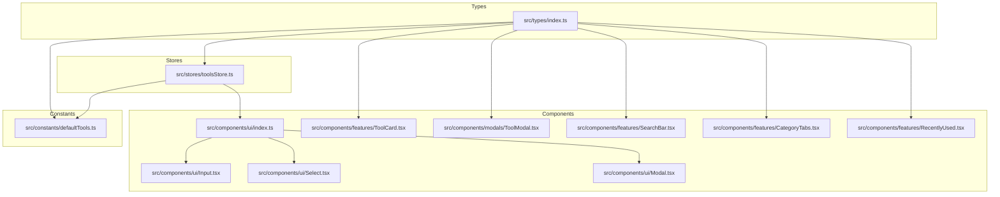
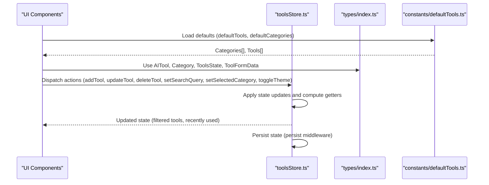
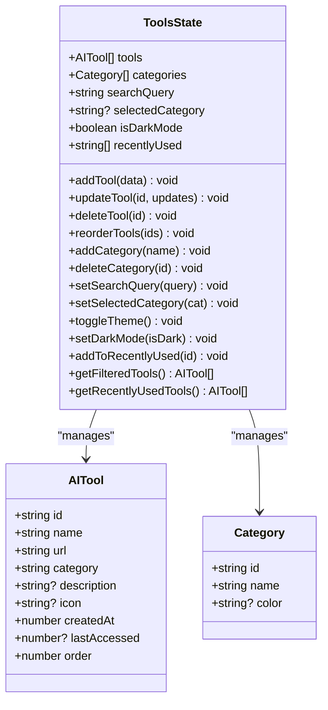
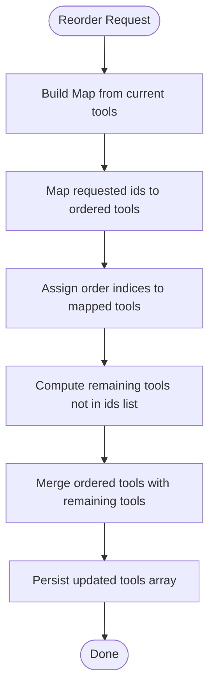
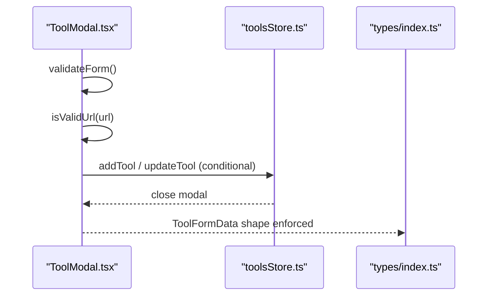
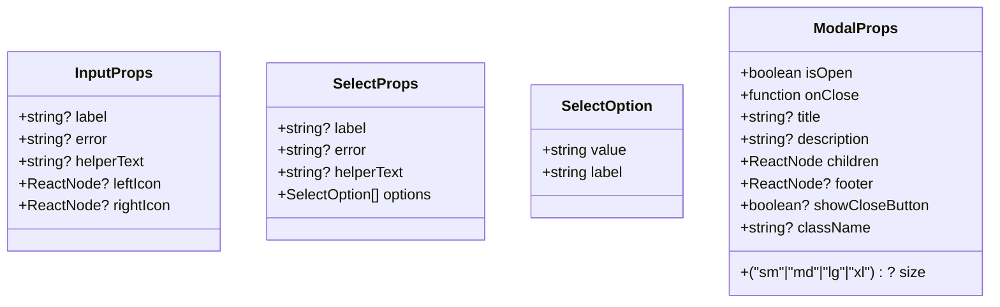
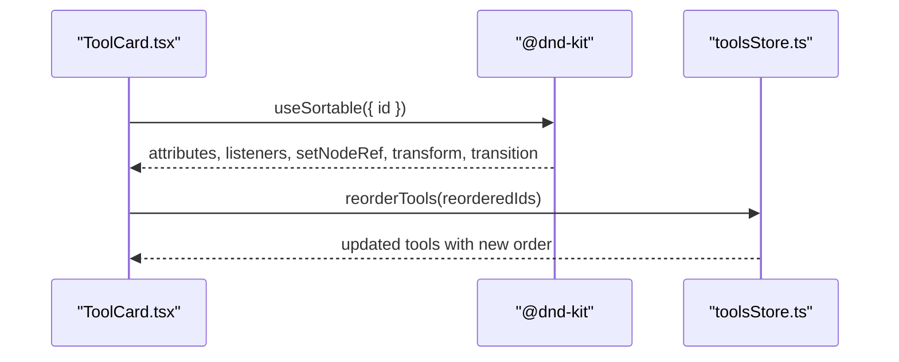
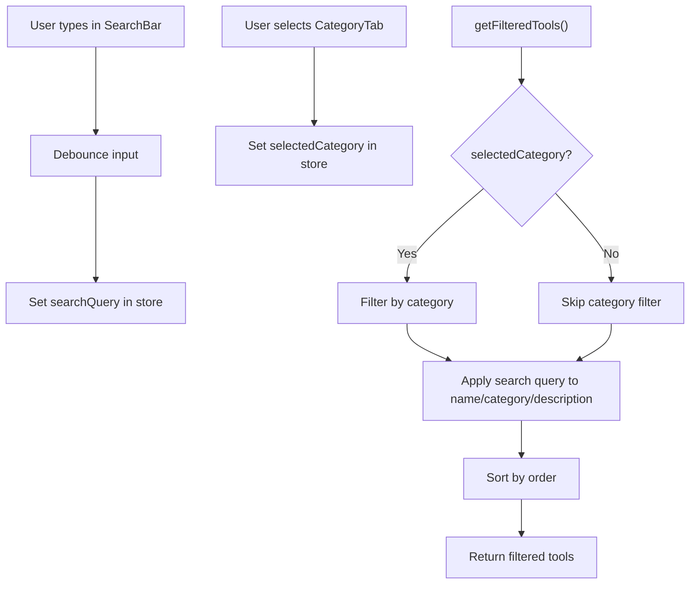
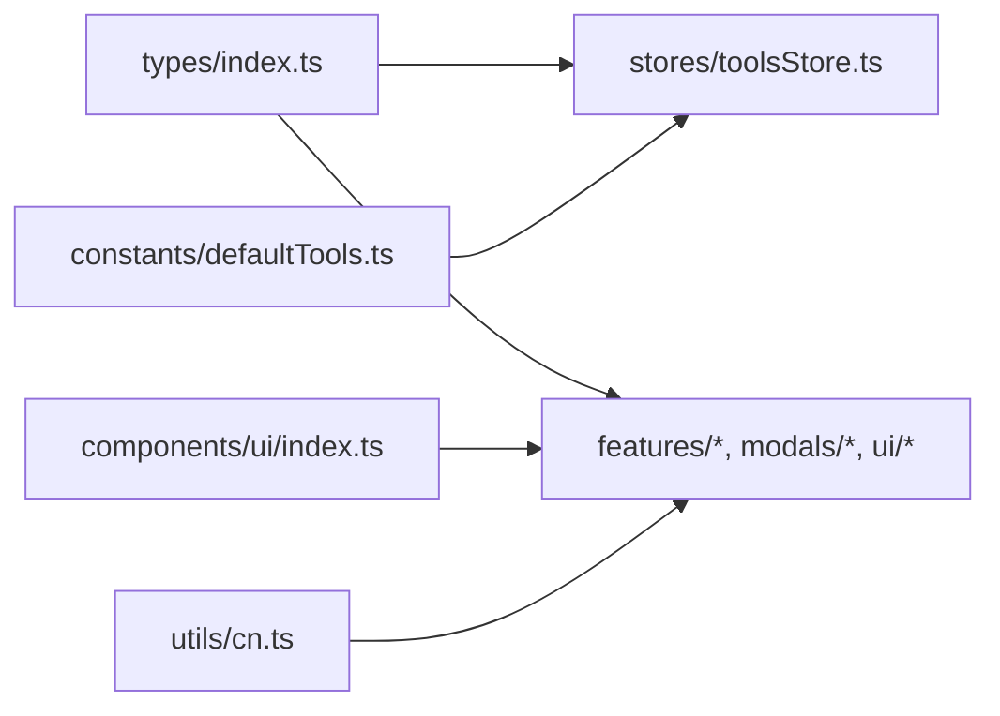

# Data Models & Types

<cite>
**Referenced Files in This Document**
- [src/types/index.ts](file://src/types/index.ts)
- [src/constants/defaultTools.ts](file://src/constants/defaultTools.ts)
- [src/stores/toolsStore.ts](file://src/stores/toolsStore.ts)
- [src/components/features/ToolCard.tsx](file://src/components/features/ToolCard.tsx)
- [src/components/modals/ToolModal.tsx](file://src/components/modals/ToolModal.tsx)
- [src/components/features/SearchBar.tsx](file://src/components/features/SearchBar.tsx)
- [src/components/features/CategoryTabs.tsx](file://src/components/features/CategoryTabs.tsx)
- [src/components/features/RecentlyUsed.tsx](file://src/components/features/RecentlyUsed.tsx)
- [src/components/ui/index.ts](file://src/components/ui/index.ts)
- [src/components/ui/Input.tsx](file://src/components/ui/Input.tsx)
- [src/components/ui/Select.tsx](file://src/components/ui/Select.tsx)
- [src/components/ui/Modal.tsx](file://src/components/ui/Modal.tsx)
- [src/utils/cn.ts](file://src/utils/cn.ts)
</cite>

## Table of Contents
1. [Introduction](#introduction)
2. [Project Structure](#project-structure)
3. [Core Components](#core-components)
4. [Architecture Overview](#architecture-overview)
5. [Detailed Component Analysis](#detailed-component-analysis)
6. [Dependency Analysis](#dependency-analysis)
7. [Performance Considerations](#performance-considerations)
8. [Troubleshooting Guide](#troubleshooting-guide)
9. [Conclusion](#conclusion)
10. [Appendices](#appendices)

## Introduction
This document provides comprehensive data model documentation for the AIPulse type system and entity definitions. It covers the AITool interface, Category interface, ToolsState interface, ToolFormData interface, and supporting UI component props. It also explains TypeScript patterns used across the application, including optional properties, union types, generics, and utility types. Validation examples, type guards, and runtime checks are included, along with serialization/deserialization considerations via the persistence layer. Finally, it offers guidelines for extending data models while maintaining type safety across component boundaries.

## Project Structure
The type system is centralized under a dedicated module and consumed by stores, components, and constants. Stores orchestrate state transitions and persistence, while components consume typed props and state to render UI and collect user input.

**Diagram sources**
- [src/types/index.ts](file://src/types/index.ts#L1-L60)
- [src/constants/defaultTools.ts](file://src/constants/defaultTools.ts#L1-L101)
- [src/stores/toolsStore.ts](file://src/stores/toolsStore.ts#L1-L177)
- [src/components/features/ToolCard.tsx](file://src/components/features/ToolCard.tsx#L1-L141)
- [src/components/modals/ToolModal.tsx](file://src/components/modals/ToolModal.tsx#L1-L253)
- [src/components/features/SearchBar.tsx](file://src/components/features/SearchBar.tsx#L1-L42)
- [src/components/features/CategoryTabs.tsx](file://src/components/features/CategoryTabs.tsx#L1-L106)
- [src/components/features/RecentlyUsed.tsx](file://src/components/features/RecentlyUsed.tsx#L1-L101)
- [src/components/ui/index.ts](file://src/components/ui/index.ts#L1-L15)
- [src/components/ui/Input.tsx](file://src/components/ui/Input.tsx#L1-L74)
- [src/components/ui/Select.tsx](file://src/components/ui/Select.tsx#L1-L61)
- [src/components/ui/Modal.tsx](file://src/components/ui/Modal.tsx#L1-L128)

**Section sources**
- [src/types/index.ts](file://src/types/index.ts#L1-L60)
- [src/constants/defaultTools.ts](file://src/constants/defaultTools.ts#L1-L101)
- [src/stores/toolsStore.ts](file://src/stores/toolsStore.ts#L1-L177)
- [src/components/ui/index.ts](file://src/components/ui/index.ts#L1-L15)

## Core Components
This section documents the primary data models and their roles in the application.

- AITool
  - Purpose: Represents an AI tool entity with identity, metadata, categorization, and ordering.
  - Key properties:
    - id: string
    - name: string
    - url: string
    - category: string
    - description?: string
    - icon?: string
    - createdAt: number
    - lastAccessed?: number
    - order: number
  - Notes:
    - Optional fields indicate missing data may be defaulted or omitted at runtime.
    - Timestamps are numeric epoch milliseconds.
    - Order controls display sequence.

- Category
  - Purpose: Defines a classification for tools.
  - Key properties:
    - id: string
    - name: string
    - color?: string
  - Notes:
    - Color is optional and can be used for visual indicators.

- ToolsState
  - Purpose: Encapsulates the entire application state and actions for managing tools and categories.
  - State fields:
    - tools: AITool[]
    - categories: Category[]
    - searchQuery: string
    - selectedCategory: string | null
    - isDarkMode: boolean
    - recentlyUsed: string[]
  - Actions:
    - CRUD for tools: addTool, updateTool, deleteTool, reorderTools
    - Categories: addCategory, deleteCategory
    - Filters: setSearchQuery, setSelectedCategory
    - Theme: toggleTheme, setDarkMode
    - Recently used: addToRecentlyUsed
  - Getters:
    - getFilteredTools(): AITool[]
    - getRecentlyUsedTools(): AITool[]
  - Notes:
    - Uses utility types Partial<T> and Omit<T, K> for safe updates and creation.
    - Reordering maintains order property consistency.

- ToolFormData
  - Purpose: Captures form input for adding or editing tools.
  - Key properties:
    - name: string
    - url: string
    - category: string
    - description: string
    - icon: string
  - Notes:
    - Used for validation and submission handling.

**Section sources**
- [src/types/index.ts](file://src/types/index.ts#L1-L60)
- [src/constants/defaultTools.ts](file://src/constants/defaultTools.ts#L1-L101)
- [src/stores/toolsStore.ts](file://src/stores/toolsStore.ts#L14-L177)

## Architecture Overview
The type system drives the store’s state machine and UI components. Defaults are loaded from constants, validated in forms, persisted via middleware, and rendered by components.

**Diagram sources**
- [src/stores/toolsStore.ts](file://src/stores/toolsStore.ts#L14-L177)
- [src/types/index.ts](file://src/types/index.ts#L1-L60)
- [src/constants/defaultTools.ts](file://src/constants/defaultTools.ts#L1-L101)

## Detailed Component Analysis

### AITool and Category Entities
These interfaces define the core domain models used throughout the app.

**Diagram sources**
- [src/types/index.ts](file://src/types/index.ts#L1-L60)

**Section sources**
- [src/types/index.ts](file://src/types/index.ts#L1-L60)

### ToolsState Implementation Details
Key implementation patterns:
- Utility types:
  - Omit<AITool, 'id' | 'createdAt' | 'order'> for creation without derived fields.
  - Partial<AITool> for safe field-wise updates.
- Type guards:
  - Explicit narrowing via predicate checks (e.g., filtering undefined after mapping).
- Ordering:
  - Maintains order property during reordering and appends remaining tools.

**Diagram sources**
- [src/stores/toolsStore.ts](file://src/stores/toolsStore.ts#L53-L75)

**Section sources**
- [src/stores/toolsStore.ts](file://src/stores/toolsStore.ts#L14-L177)

### ToolFormData and Form Validation
Validation patterns:
- Runtime URL validation using native URL constructor.
- Form state typing with errors keyed by ToolFormData keys.
- Controlled inputs updating typed state.

**Diagram sources**
- [src/components/modals/ToolModal.tsx](file://src/components/modals/ToolModal.tsx#L50-L108)
- [src/stores/toolsStore.ts](file://src/stores/toolsStore.ts#L26-L51)
- [src/types/index.ts](file://src/types/index.ts#L53-L60)

**Section sources**
- [src/components/modals/ToolModal.tsx](file://src/components/modals/ToolModal.tsx#L50-L108)
- [src/stores/toolsStore.ts](file://src/stores/toolsStore.ts#L26-L51)
- [src/types/index.ts](file://src/types/index.ts#L53-L60)

### UI Component Props and Patterns
- InputProps extends HTMLInputElement attributes and adds label/error/helperText/leftIcon/rightIcon.
- SelectProps mirrors Select HTML attributes and adds label/error/helperText/options.
- ModalProps defines open/close/title/description/size/footer/visibility toggles.

**Diagram sources**
- [src/components/ui/Input.tsx](file://src/components/ui/Input.tsx#L4-L10)
- [src/components/ui/Select.tsx](file://src/components/ui/Select.tsx#L5-L15)
- [src/components/ui/Modal.tsx](file://src/components/ui/Modal.tsx#L7-L17)

**Section sources**
- [src/components/ui/Input.tsx](file://src/components/ui/Input.tsx#L4-L10)
- [src/components/ui/Select.tsx](file://src/components/ui/Select.tsx#L5-L15)
- [src/components/ui/Modal.tsx](file://src/components/ui/Modal.tsx#L7-L17)

### Drag-and-Drop and Sorting
- ToolCard integrates @dnd-kit sortable hooks to expose drag handles and transform styles.
- ToolsState supports reorderTools to update order indices and maintain sorted rendering.

**Diagram sources**
- [src/components/features/ToolCard.tsx](file://src/components/features/ToolCard.tsx#L22-L34)
- [src/stores/toolsStore.ts](file://src/stores/toolsStore.ts#L53-L75)

**Section sources**
- [src/components/features/ToolCard.tsx](file://src/components/features/ToolCard.tsx#L1-L141)
- [src/stores/toolsStore.ts](file://src/stores/toolsStore.ts#L53-L75)

### Filtering and Recently Used
- SearchBar debounces input and updates the store’s searchQuery.
- CategoryTabs toggles selectedCategory and displays counts.
- ToolsState getter getFilteredTools applies category and search filters, then sorts by order.
- RecentlyUsed displays up to six most recent tools and updates lastAccessed.

**Diagram sources**
- [src/components/features/SearchBar.tsx](file://src/components/features/SearchBar.tsx#L6-L18)
- [src/components/features/CategoryTabs.tsx](file://src/components/features/CategoryTabs.tsx#L8-L11)
- [src/stores/toolsStore.ts](file://src/stores/toolsStore.ts#L132-L156)

**Section sources**
- [src/components/features/SearchBar.tsx](file://src/components/features/SearchBar.tsx#L1-L42)
- [src/components/features/CategoryTabs.tsx](file://src/components/features/CategoryTabs.tsx#L1-L106)
- [src/stores/toolsStore.ts](file://src/stores/toolsStore.ts#L132-L156)

## Dependency Analysis
The type system is a single source of truth consumed by stores and components. Constants provide default data, and UI components rely on typed props exported via the UI barrel.

**Diagram sources**
- [src/types/index.ts](file://src/types/index.ts#L1-L60)
- [src/stores/toolsStore.ts](file://src/stores/toolsStore.ts#L1-L177)
- [src/constants/defaultTools.ts](file://src/constants/defaultTools.ts#L1-L101)
- [src/components/ui/index.ts](file://src/components/ui/index.ts#L1-L15)
- [src/utils/cn.ts](file://src/utils/cn.ts#L1-L7)

**Section sources**
- [src/types/index.ts](file://src/types/index.ts#L1-L60)
- [src/stores/toolsStore.ts](file://src/stores/toolsStore.ts#L1-L177)
- [src/constants/defaultTools.ts](file://src/constants/defaultTools.ts#L1-L101)
- [src/components/ui/index.ts](file://src/components/ui/index.ts#L1-L15)
- [src/utils/cn.ts](file://src/utils/cn.ts#L1-L7)

## Performance Considerations
- Debouncing search input reduces store updates and re-computations.
- getFilteredTools performs filtering and sorting; keep queries concise and avoid unnecessary re-renders by memoizing derived computations at component boundaries.
- Reordering tools updates order indices; ensure minimal re-renders by batching state updates.
- Persisted state avoids expensive recomputation on reload; consider selective partialization to reduce storage size.

[No sources needed since this section provides general guidance]

## Troubleshooting Guide
Common issues and resolutions:
- URL validation failures:
  - Symptom: Form shows “Please enter a valid URL”.
  - Resolution: Ensure the URL is absolute and parseable by the native URL constructor.
  - Reference: [src/components/modals/ToolModal.tsx](file://src/components/modals/ToolModal.tsx#L71-L78)
- Missing optional fields:
  - Symptom: Icons or descriptions not displayed.
  - Resolution: Provide fallbacks in components when optional fields are absent.
  - Reference: [src/components/features/ToolCard.tsx](file://src/components/features/ToolCard.tsx#L37-L39), [src/components/features/RecentlyUsed.tsx](file://src/components/features/RecentlyUsed.tsx#L61-L63)
- Type narrowing errors:
  - Symptom: Unexpected undefined in mapped arrays.
  - Resolution: Use explicit predicates to narrow types (e.g., filtering undefined).
  - Reference: [src/stores/toolsStore.ts](file://src/stores/toolsStore.ts#L58-L58), [src/stores/toolsStore.ts](file://src/stores/toolsStore.ts#L163-L163)
- Persistence mismatch:
  - Symptom: State not restored after refresh.
  - Resolution: Verify persisted fields match the persisted state shape and middleware configuration.
  - Reference: [src/stores/toolsStore.ts](file://src/stores/toolsStore.ts#L166-L175)

**Section sources**
- [src/components/modals/ToolModal.tsx](file://src/components/modals/ToolModal.tsx#L71-L78)
- [src/components/features/ToolCard.tsx](file://src/components/features/ToolCard.tsx#L37-L39)
- [src/components/features/RecentlyUsed.tsx](file://src/components/features/RecentlyUsed.tsx#L61-L63)
- [src/stores/toolsStore.ts](file://src/stores/toolsStore.ts#L58-L58)
- [src/stores/toolsStore.ts](file://src/stores/toolsStore.ts#L166-L175)

## Conclusion
The AIPulse type system centers around AITool, Category, ToolsState, and ToolFormData, enabling a strongly typed store and UI. Optional properties, utility types, and runtime validations ensure robustness. The persistence layer preserves state across sessions. Following the patterns documented here will help extend the system safely and consistently.

[No sources needed since this section summarizes without analyzing specific files]

## Appendices

### TypeScript Patterns Used
- Optional properties: denoted with ? for nullable runtime values.
- Union types: string | null for category selection.
- Generics and utility types:
  - Partial<T> for safe field-wise updates.
  - Omit<T, K> for creation without derived fields.
  - Predicate-based narrowing to remove undefined after mapping/filtering.
- Runtime type checking:
  - URL validation via native URL constructor.
  - Type guards in getters to ensure non-null tool retrieval.

**Section sources**
- [src/types/index.ts](file://src/types/index.ts#L1-L60)
- [src/stores/toolsStore.ts](file://src/stores/toolsStore.ts#L38-L43)
- [src/stores/toolsStore.ts](file://src/stores/toolsStore.ts#L58-L58)
- [src/stores/toolsStore.ts](file://src/stores/toolsStore.ts#L163-L163)
- [src/components/modals/ToolModal.tsx](file://src/components/modals/ToolModal.tsx#L71-L78)

### Serialization and Deserialization Considerations
- Persistence:
  - The store uses a persist middleware to save tools, categories, theme preference, and recently used lists.
  - partialize selects only persisted fields to minimize payload.
- Runtime data structures:
  - Numeric timestamps are stored as numbers; URLs are strings; icons are string identifiers mapped to components.
- Extensibility:
  - When adding fields, ensure they are included in the persisted subset and defaults are provided where applicable.

**Section sources**
- [src/stores/toolsStore.ts](file://src/stores/toolsStore.ts#L166-L175)
- [src/constants/defaultTools.ts](file://src/constants/defaultTools.ts#L1-L101)

### Guidelines for Extending Data Models
- Define new interfaces in the types module and export them.
- Update ToolsState actions to handle new fields, ensuring Partial<T> and Omit<T, K> are used appropriately.
- Extend default data in constants to reflect new fields.
- Update components to consume new props and provide fallbacks for optional fields.
- Add validation rules in forms and ensure runtime checks remain consistent.
- Keep persistence in sync by including new fields in the persisted state shape.

**Section sources**
- [src/types/index.ts](file://src/types/index.ts#L1-L60)
- [src/stores/toolsStore.ts](file://src/stores/toolsStore.ts#L166-L175)
- [src/constants/defaultTools.ts](file://src/constants/defaultTools.ts#L1-L101)