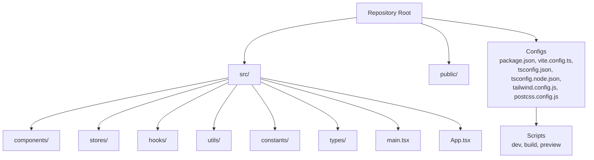
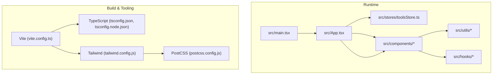
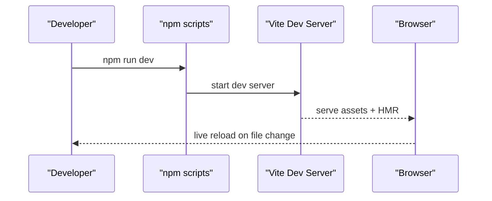
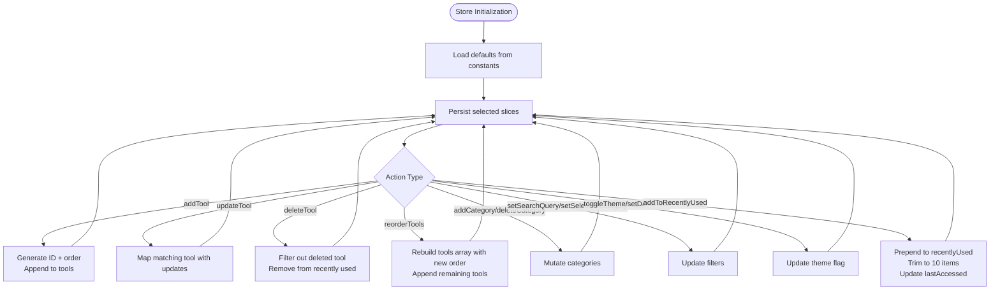
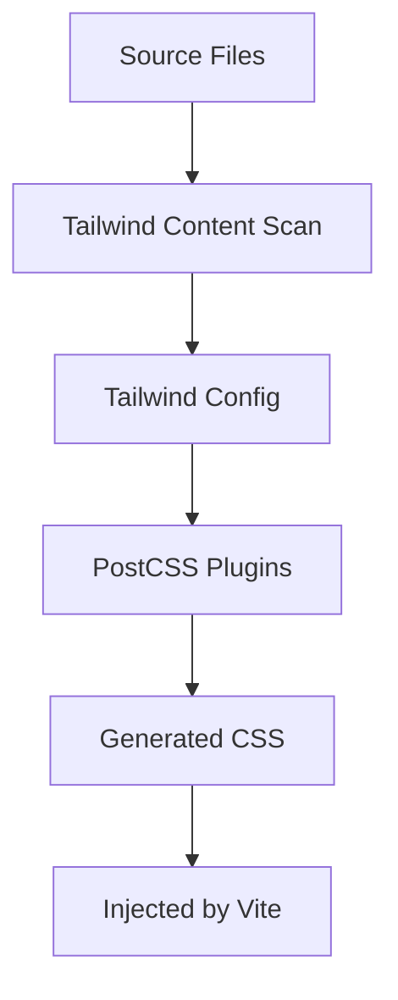
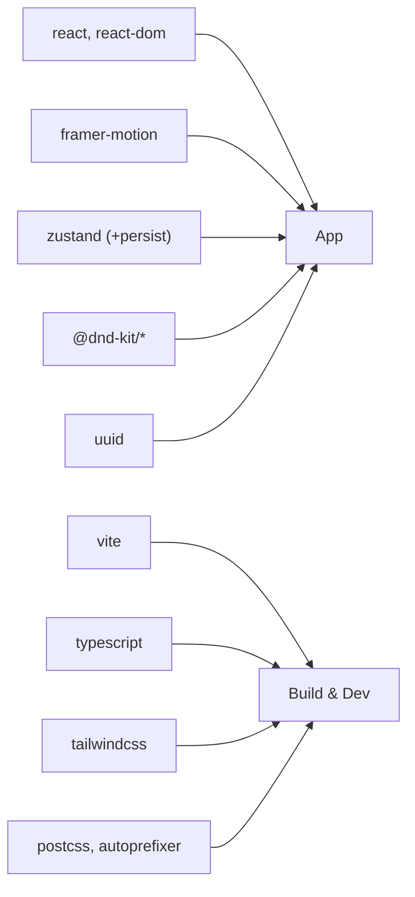

# Development Workflow

<cite>
**Referenced Files in This Document**
- [package.json](file://package.json)
- [vite.config.ts](file://vite.config.ts)
- [tsconfig.json](file://tsconfig.json)
- [tsconfig.node.json](file://tsconfig.node.json)
- [tailwind.config.js](file://tailwind.config.js)
- [postcss.config.js](file://postcss.config.js)
- [.gitignore](file://.gitignore)
- [src/main.tsx](file://src/main.tsx)
- [src/App.tsx](file://src/App.tsx)
- [src/stores/toolsStore.ts](file://src/stores/toolsStore.ts)
- [src/utils/cn.ts](file://src/utils/cn.ts)
- [src/hooks/useDebounce.ts](file://src/hooks/useDebounce.ts)
</cite>

## Table of Contents
1. [Introduction](#introduction)
2. [Project Structure](#project-structure)
3. [Core Components](#core-components)
4. [Architecture Overview](#architecture-overview)
5. [Detailed Component Analysis](#detailed-component-analysis)
6. [Dependency Analysis](#dependency-analysis)
7. [Performance Considerations](#performance-considerations)
8. [Troubleshooting Guide](#troubleshooting-guide)
9. [Conclusion](#conclusion)
10. [Appendices](#appendices)

## Introduction
This document describes the development workflow for the AIPulse project, covering environment setup, build and tooling configuration, TypeScript standards, Git practices, code quality, testing strategies, deployment, and contribution guidelines. It is designed to be accessible to contributors with varying levels of experience while ensuring consistency across development, review, and release processes.

## Project Structure
AIPulse is a React application built with Vite and TypeScript, styled with Tailwind CSS via PostCSS. The repository follows a feature-based organization under src, with dedicated folders for components, stores (state), hooks, utils, constants, and types. Path aliases simplify imports and improve readability.

**Section sources**
- [package.json](file://package.json#L1-L36)
- [vite.config.ts](file://vite.config.ts#L1-L19)
- [tsconfig.json](file://tsconfig.json#L1-L32)
- [tsconfig.node.json](file://tsconfig.node.json#L1-L11)
- [tailwind.config.js](file://tailwind.config.js#L1-L69)
- [postcss.config.js](file://postcss.config.js#L1-L7)
- [src/main.tsx](file://src/main.tsx#L1-L11)
- [src/App.tsx](file://src/App.tsx#L1-L122)

## Core Components
- Application bootstrap and rendering are handled in main.tsx, which mounts the root React element and renders the App component inside Strict Mode.
- The root App component orchestrates layout, theme application, and modal management, delegating feature-specific UI to components under components/.
- State management is implemented with Zustand in toolsStore.ts, providing CRUD operations for tools and categories, filtering, theming, and recently used tracking with persistence.
- Utility and hook helpers include cn (clsx + tailwind-merge) for conditional class merging and useDebounce for reactive input throttling.

Key implementation references:
- [Application entry](file://src/main.tsx#L1-L11)
- [Root component](file://src/App.tsx#L1-L122)
- [State store](file://src/stores/toolsStore.ts#L1-L177)
- [Class merging utility](file://src/utils/cn.ts#L1-L7)
- [Debounce hook](file://src/hooks/useDebounce.ts#L1-L18)

**Section sources**
- [src/main.tsx](file://src/main.tsx#L1-L11)
- [src/App.tsx](file://src/App.tsx#L1-L122)
- [src/stores/toolsStore.ts](file://src/stores/toolsStore.ts#L1-L177)
- [src/utils/cn.ts](file://src/utils/cn.ts#L1-L7)
- [src/hooks/useDebounce.ts](file://src/hooks/useDebounce.ts#L1-L18)

## Architecture Overview
The runtime architecture centers on React components, Zustand store, and UI primitives. Build-time tooling integrates Vite, TypeScript, Tailwind CSS, and PostCSS. Path aliases streamline imports across the codebase.

**Diagram sources**
- [src/main.tsx](file://src/main.tsx#L1-L11)
- [src/App.tsx](file://src/App.tsx#L1-L122)
- [src/stores/toolsStore.ts](file://src/stores/toolsStore.ts#L1-L177)
- [vite.config.ts](file://vite.config.ts#L1-L19)
- [tsconfig.json](file://tsconfig.json#L1-L32)
- [tsconfig.node.json](file://tsconfig.node.json#L1-L11)
- [tailwind.config.js](file://tailwind.config.js#L1-L69)
- [postcss.config.js](file://postcss.config.js#L1-L7)

## Detailed Component Analysis

### Build System and Development Server
- Scripts:
  - dev: starts the Vite dev server.
  - build: runs TypeScript emit followed by Vite production build.
  - preview: serves the production build locally for testing.
- Vite configuration:
  - React plugin enabled.
  - Path aliases configured for cleaner imports across the app.
- TypeScript configuration:
  - Strict mode enabled with comprehensive checks.
  - ESNext modules and DOM libraries included.
  - Path aliases mirrored in tsconfig.json for editor support.
  - Separate tsconfig.node.json for Vite config resolution.

**Diagram sources**
- [package.json](file://package.json#L6-L10)
- [vite.config.ts](file://vite.config.ts#L1-L19)

**Section sources**
- [package.json](file://package.json#L6-L10)
- [vite.config.ts](file://vite.config.ts#L1-L19)
- [tsconfig.json](file://tsconfig.json#L1-L32)
- [tsconfig.node.json](file://tsconfig.node.json#L1-L11)

### State Management with Zustand
The toolsStore encapsulates:
- Initial state: tools, categories, filters, theme, and recently used items.
- Actions: add/update/delete tools, reorder tools, manage categories, filter controls, theme toggles, and recently used tracking.
- Persistence: Zustand middleware persists selected slices of state to storage.
- Computed getters: filtered tools and recently used tools derived from current state.

**Diagram sources**
- [src/stores/toolsStore.ts](file://src/stores/toolsStore.ts#L1-L177)

**Section sources**
- [src/stores/toolsStore.ts](file://src/stores/toolsStore.ts#L1-L177)

### Styling Pipeline (Tailwind + PostCSS)
- Tailwind scans HTML and TypeScript/JSX files under src for class usage.
- Dark mode is controlled via a class on the root element, applied by the root App component.
- PostCSS applies Tailwind directives and autoprefixing during build.

**Diagram sources**
- [tailwind.config.js](file://tailwind.config.js#L1-L69)
- [postcss.config.js](file://postcss.config.js#L1-L7)
- [src/App.tsx](file://src/App.tsx#L19-L26)

**Section sources**
- [tailwind.config.js](file://tailwind.config.js#L1-L69)
- [postcss.config.js](file://postcss.config.js#L1-L7)
- [src/App.tsx](file://src/App.tsx#L19-L26)

### Utilities and Hooks
- cn merges and tidies class names using clsx and tailwind-merge, reducing conflicts and improving maintainability.
- useDebounce provides a simple hook to throttle updates for search inputs or similar reactive scenarios.

**Section sources**
- [src/utils/cn.ts](file://src/utils/cn.ts#L1-L7)
- [src/hooks/useDebounce.ts](file://src/hooks/useDebounce.ts#L1-L18)

## Dependency Analysis
- Runtime dependencies include React, React DOM, Framer Motion for animations, Zustand for state, DnD Kit for drag-and-drop, and UUID for identifiers.
- Build/runtime dependencies include Vite, TypeScript, Tailwind CSS, PostCSS, and related plugins.
- Path aliases are consistently defined in both Vite and TypeScript configurations to avoid drift.

**Diagram sources**
- [package.json](file://package.json#L22-L34)
- [package.json](file://package.json#L11-L21)
- [vite.config.ts](file://vite.config.ts#L1-L19)
- [tsconfig.json](file://tsconfig.json#L1-L32)

**Section sources**
- [package.json](file://package.json#L11-L34)
- [vite.config.ts](file://vite.config.ts#L7-L17)
- [tsconfig.json](file://tsconfig.json#L18-L27)

## Performance Considerations
- Prefer lazy loading for heavy components and images to reduce initial bundle size.
- Use the debounce hook for search inputs to minimize re-renders and store updates.
- Keep Tailwind utility usage scoped and avoid generating unused variants; leverage purge content globs to remove dead CSS.
- Split large components into smaller, memoized units to improve render performance.
- Monitor bundle size with Vite’s built-in analyzer plugin if added later.

[No sources needed since this section provides general guidance]

## Troubleshooting Guide
Common issues and resolutions:
- Import alias errors:
  - Ensure path aliases match between Vite and TypeScript configurations.
  - Verify tsconfig.json includes the same aliases as vite.config.ts.
- Tailwind classes not applying:
  - Confirm content globs include the relevant files.
  - Check dark mode class propagation from the root element.
- Dev server hot reload not working:
  - Restart the dev server after changing Vite or TypeScript configs.
  - Clear node_modules/.vite cache if stale state occurs.
- Build failures:
  - Run TypeScript checks separately to isolate type errors.
  - Validate PostCSS plugin order and presence.

**Section sources**
- [vite.config.ts](file://vite.config.ts#L7-L17)
- [tsconfig.json](file://tsconfig.json#L18-L27)
- [tailwind.config.js](file://tailwind.config.js#L3-L6)
- [src/App.tsx](file://src/App.tsx#L19-L26)

## Conclusion
AIPulse follows a modern, efficient development stack with clear separation of concerns, strong typing, and pragmatic state management. By adhering to the environment setup, build configuration, and contribution practices outlined here, contributors can collaborate effectively and deliver high-quality features consistently.

[No sources needed since this section summarizes without analyzing specific files]

## Appendices

### Development Environment Setup
- Node.js and package manager:
  - Use a Node.js version compatible with the project dependencies.
  - Install dependencies with your preferred package manager.
- IDE configuration recommendations:
  - Enable TypeScript integration and ESLint/Prettier extensions.
  - Configure path aliases resolution to improve IntelliSense accuracy.
- Environment variables:
  - No environment-specific variables are required by default; add .env files if backend integration is introduced.

**Section sources**
- [package.json](file://package.json#L11-L34)

### Build Process with Vite
- Development server:
  - Run the dev script to start Vite with hot module replacement.
  - Vite proxies React Fast Refresh for instant feedback.
- Production build:
  - The build script runs TypeScript emit then bundles assets for production.
  - Preview the production build locally to validate performance and correctness.
- Path aliases:
  - Use aliases to keep imports readable and maintainable across the codebase.

**Section sources**
- [package.json](file://package.json#L6-L10)
- [vite.config.ts](file://vite.config.ts#L7-L17)

### TypeScript Configuration
- Strict mode:
  - Strict type checking is enabled with comprehensive diagnostics.
- Compilation targets:
  - Targets modern JavaScript environments suitable for current browsers.
- Path aliases:
  - Aliases mirror Vite’s resolve.alias for seamless editor support.

**Section sources**
- [tsconfig.json](file://tsconfig.json#L2-L27)
- [tsconfig.node.json](file://tsconfig.node.json#L1-L11)
- [vite.config.ts](file://vite.config.ts#L7-L17)

### Git Workflow
- Branching:
  - Use feature branches prefixed with feature/, fix/, chore/, or docs/.
- Commit conventions:
  - Keep messages concise and descriptive; group related changes.
- Pull requests:
  - Open PRs early for visibility; ensure builds and tests pass before merging.
- Ignored files:
  - node_modules, dist, and IDE-specific files are ignored by default.

**Section sources**
- [.gitignore](file://.gitignore#L1-L25)

### Code Quality Practices
- Formatting:
  - Use Prettier for consistent formatting; integrate with your editor.
- Linting:
  - Use ESLint with React and TypeScript plugins; configure rules to match project style.
- Pre-commit hooks:
  - Add lint-staged and Husky to run linters and formatters before commits.

[No sources needed since this section provides general guidance]

### Testing Strategies
- Unit and component testing:
  - Use React Testing Library for component tests; focus on user-centric interactions.
- State management tests:
  - Test Zustand store actions and selectors in isolation; mock external dependencies as needed.
- Visual regression:
  - Consider screenshot testing for critical UI components if visual fidelity is important.

[No sources needed since this section provides general guidance]

### Deployment
- Build optimization:
  - Leverage Vite’s production build; ensure tree-shaking and minification are active.
- Asset bundling:
  - Vite handles asset hashing and splitting automatically.
- Hosting:
  - Deploy the dist output to static hosts or SPA-compatible platforms; ensure client-side routing fallback is configured.

**Section sources**
- [package.json](file://package.json#L6-L10)

### Contributing Guidelines
- Issues:
  - Provide clear reproduction steps, expected vs. actual behavior, and environment details.
- Feature requests:
  - Describe the problem being solved and proposed solution; include acceptance criteria.
- Code contributions:
  - Follow branch naming and commit message conventions.
  - Include tests and documentation updates where applicable.
  - Request reviews from maintainers; address feedback promptly.

[No sources needed since this section provides general guidance]