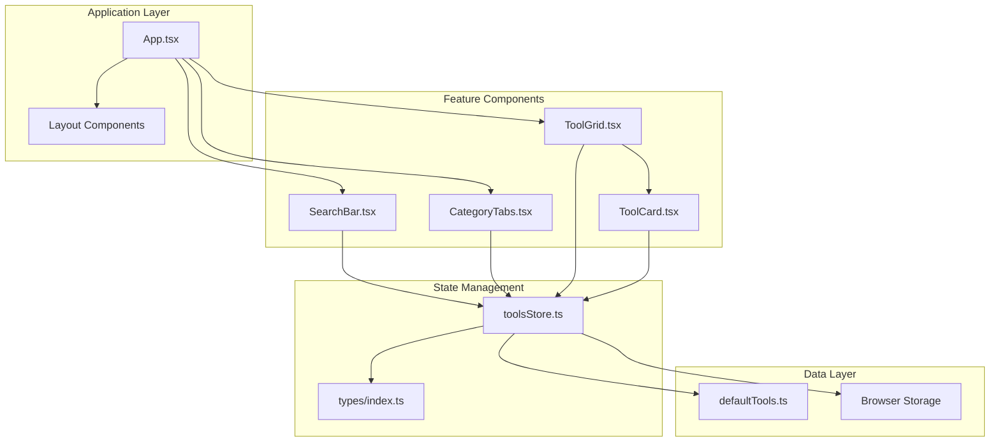
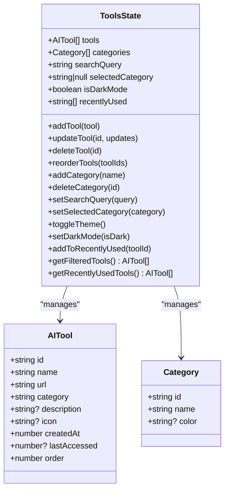
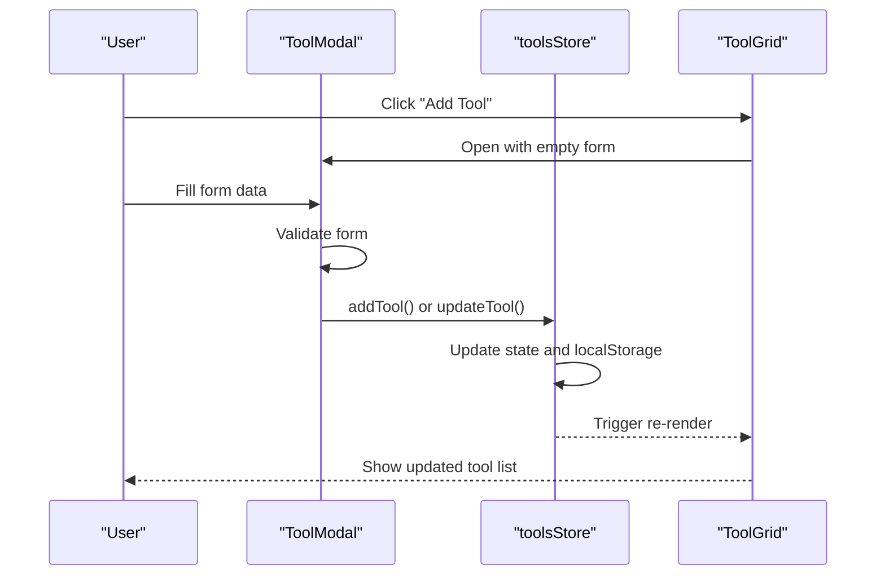
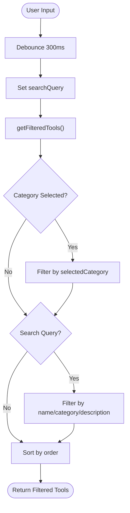
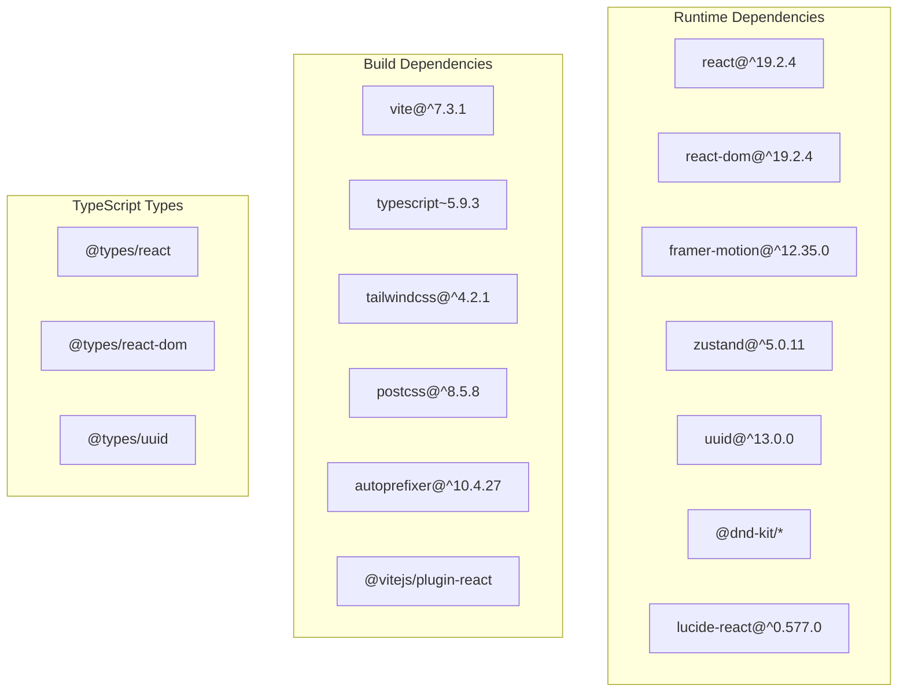

# Getting Started

<cite>
**Referenced Files in This Document**
- [package.json](file://package.json)
- [vite.config.ts](file://vite.config.ts)
- [tsconfig.json](file://tsconfig.json)
- [tsconfig.node.json](file://tsconfig.node.json)
- [index.html](file://index.html)
- [src/main.tsx](file://src/main.tsx)
- [src/App.tsx](file://src/App.tsx)
- [src/stores/toolsStore.ts](file://src/stores/toolsStore.ts)
- [src/constants/defaultTools.ts](file://src/constants/defaultTools.ts)
- [src/components/features/ToolGrid.tsx](file://src/components/features/ToolGrid.tsx)
- [src/components/features/SearchBar.tsx](file://src/components/features/SearchBar.tsx)
- [src/components/features/CategoryTabs.tsx](file://src/components/features/CategoryTabs.tsx)
- [src/components/features/ToolCard.tsx](file://src/components/features/ToolCard.tsx)
- [src/components/modals/ToolModal.tsx](file://src/components/modals/ToolModal.tsx)
- [src/types/index.ts](file://src/types/index.ts)
- [tailwind.config.js](file://tailwind.config.js)
- [postcss.config.js](file://postcss.config.js)
</cite>

## Table of Contents
1. [Introduction](#introduction)
2. [Prerequisites](#prerequisites)
3. [Installation](#installation)
4. [Development Workflow](#development-workflow)
5. [Basic Usage](#basic-usage)
6. [Project Structure](#project-structure)
7. [Architecture Overview](#architecture-overview)
8. [Detailed Component Analysis](#detailed-component-analysis)
9. [Dependency Analysis](#dependency-analysis)
10. [Performance Considerations](#performance-considerations)
11. [Troubleshooting Guide](#troubleshooting-guide)
12. [Conclusion](#conclusion)

## Introduction
AIPulse is a modern React application for organizing and managing AI tools. It provides a clean interface to browse, search, categorize, and customize your favorite AI services with a focus on productivity and personalization.

## Prerequisites
- Operating system: Windows, macOS, or Linux
- Node.js version: Compatible with the project's package configuration
- Package manager: npm or yarn
- Text editor or IDE with TypeScript support

Key configuration highlights:
- TypeScript compiler configured for ES2020 target and bundler module resolution
- Vite for fast development server and optimized builds
- Tailwind CSS for styling with dark mode support
- React 19 with strict mode enabled

**Section sources**
- [package.json](file://package.json#L1-L36)
- [tsconfig.json](file://tsconfig.json#L1-L32)
- [vite.config.ts](file://vite.config.ts#L1-L19)

## Installation
Follow these steps to set up the development environment:

1. Clone the repository to your local machine
2. Navigate to the project directory
3. Install dependencies using your preferred package manager:
   - npm: npm install
   - yarn: yarn install
4. Start the development server:
   - npm: npm run dev
   - yarn: yarn dev

The development server will start on http://localhost:5173 by default.

**Section sources**
- [package.json](file://package.json#L6-L10)
- [vite.config.ts](file://vite.config.ts#L5-L6)

## Development Workflow
The project uses Vite for development with the following characteristics:

- Hot Module Replacement (HMR): Automatic page refresh when files change
- TypeScript compilation: Transpiled to ES2020 with JSX support
- React Fast Refresh: Preserves component state during edits
- Alias imports: @ for src/, @components, @stores, @types, @utils, @constants, @hooks

Build process:
- Development: vite (HMR server)
- Production build: tsc && vite build
- Preview production: vite preview

**Section sources**
- [package.json](file://package.json#L6-L10)
- [vite.config.ts](file://vite.config.ts#L7-L17)
- [tsconfig.json](file://tsconfig.json#L3-L13)

## Basic Usage
Getting started with AIPulse:

1. Adding your first AI tool:
   - Click the "Add Your First Tool" button in the empty state
   - Fill in the tool details in the modal form
   - Choose from predefined icons or select a new category
   - Save to add the tool to your collection

2. Navigating categories:
   - Use the category tabs at the top to filter tools
   - Click "All" to reset filters
   - Categories are automatically generated from your tools

3. Using search functionality:
   - Type in the search bar to filter tools by name, category, or description
   - Results update in real-time with debounced input (300ms delay)

4. Managing tools:
   - Drag and drop to reorder tools within a category
   - Edit existing tools using the edit action
   - Delete tools with confirmation

**Section sources**
- [src/components/features/ToolGrid.tsx](file://src/components/features/ToolGrid.tsx#L58-L84)
- [src/components/features/SearchBar.tsx](file://src/components/features/SearchBar.tsx#L1-L42)
- [src/components/features/CategoryTabs.tsx](file://src/components/features/CategoryTabs.tsx#L1-L106)
- [src/components/modals/ToolModal.tsx](file://src/components/modals/ToolModal.tsx#L23-L48)

## Project Structure
The project follows a feature-based organization:

```
src/
├── components/
│   ├── features/     # Reusable UI features
│   ├── layout/       # Page layout components
│   ├── modals/       # Modal dialogs
│   └── ui/          # Primitive UI elements
├── stores/          # Zustand global state
├── constants/       # Default data and configuration
├── types/           # TypeScript interfaces
├── hooks/           # Custom React hooks
├── utils/           # Utility functions
├── App.tsx          # Root component
├── main.tsx         # Application entry point
└── index.css        # Global styles
```

Key directories and files:
- src/components/features/: Feature-rich components (ToolGrid, SearchBar, CategoryTabs)
- src/stores/: Centralized state management with persistence
- src/constants/: Default tools and categories
- src/types/: Strict type definitions
- vite.config.ts: Build configuration and aliases
- tailwind.config.js: Styling configuration with dark mode

**Section sources**
- [vite.config.ts](file://vite.config.ts#L7-L17)
- [tailwind.config.js](file://tailwind.config.js#L1-L69)

## Architecture Overview
AIPulse uses a component-driven architecture with centralized state management:



**Diagram sources**
- [src/App.tsx](file://src/App.tsx#L1-L122)
- [src/stores/toolsStore.ts](file://src/stores/toolsStore.ts#L1-L177)
- [src/components/features/ToolGrid.tsx](file://src/components/features/ToolGrid.tsx#L1-L112)
- [src/components/features/SearchBar.tsx](file://src/components/features/SearchBar.tsx#L1-L42)
- [src/components/features/CategoryTabs.tsx](file://src/components/features/CategoryTabs.tsx#L1-L106)

## Detailed Component Analysis

### State Management Architecture
The application uses Zustand for global state with persistence:



**Diagram sources**
- [src/stores/toolsStore.ts](file://src/stores/toolsStore.ts#L19-L51)
- [src/types/index.ts](file://src/types/index.ts#L1-L60)

### Tool Management Flow
Adding and editing tools follows a consistent workflow:



**Diagram sources**
- [src/components/modals/ToolModal.tsx](file://src/components/modals/ToolModal.tsx#L80-L108)
- [src/stores/toolsStore.ts](file://src/stores/toolsStore.ts#L25-L51)
- [src/components/features/ToolGrid.tsx](file://src/components/features/ToolGrid.tsx#L97-L110)

### Search and Filtering Logic
The filtering system combines multiple criteria:



**Diagram sources**
- [src/components/features/SearchBar.tsx](file://src/components/features/SearchBar.tsx#L9-L13)
- [src/stores/toolsStore.ts](file://src/stores/toolsStore.ts#L132-L156)

**Section sources**
- [src/stores/toolsStore.ts](file://src/stores/toolsStore.ts#L1-L177)
- [src/components/modals/ToolModal.tsx](file://src/components/modals/ToolModal.tsx#L1-L253)
- [src/components/features/ToolGrid.tsx](file://src/components/features/ToolGrid.tsx#L1-L112)

## Dependency Analysis
The project has a focused dependency graph:



**Diagram sources**
- [package.json](file://package.json#L22-L34)
- [package.json](file://package.json#L11-L21)

**Section sources**
- [package.json](file://package.json#L1-L36)

## Performance Considerations
- Memoization: ToolGrid uses useMemo to prevent unnecessary re-renders
- Debounced search: 300ms debounce reduces filtering frequency
- Virtual scrolling: Not implemented but could benefit large tool lists
- Lazy loading: Icons are loaded on demand via dynamic imports
- CSS optimization: Tailwind purges unused styles in production

## Troubleshooting Guide

### Common Setup Issues

**Node.js Version Problems**
- Ensure Node.js version compatibility with the project requirements
- Clear npm/yarn cache if experiencing dependency conflicts

**Port Conflicts**
- Vite defaults to port 5173; change in vite.config.ts if needed
- Use `npm run dev -- --port 3000` to specify a different port

**TypeScript Errors**
- Verify tsconfig.json settings match installed TypeScript version
- Check for missing type declarations in @types/

**Build Failures**
- Clean node_modules and reinstall dependencies
- Verify Vite and TypeScript versions are compatible

**Styling Issues**
- Ensure Tailwind CSS is properly configured
- Check that content paths in tailwind.config.js include all source files

**State Persistence Problems**
- Verify browser storage is enabled
- Check localStorage quota limits

**Section sources**
- [vite.config.ts](file://vite.config.ts#L5-L18)
- [tsconfig.json](file://tsconfig.json#L1-L32)
- [tailwind.config.js](file://tailwind.config.js#L1-L69)

## Conclusion
AIPulse provides a solid foundation for managing AI tools with modern web technologies. The combination of React, TypeScript, Vite, and Zustand creates a responsive and maintainable development experience. The project structure promotes scalability while keeping complexity manageable for individual contributors.

The development workflow emphasizes rapid iteration through hot reloading and efficient build processes, making it straightforward to add new features, improve existing components, or extend the tool management capabilities.