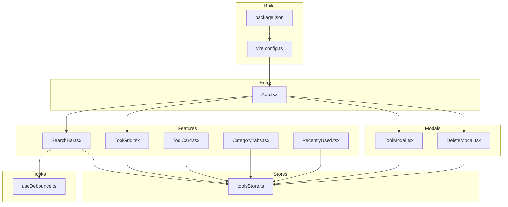
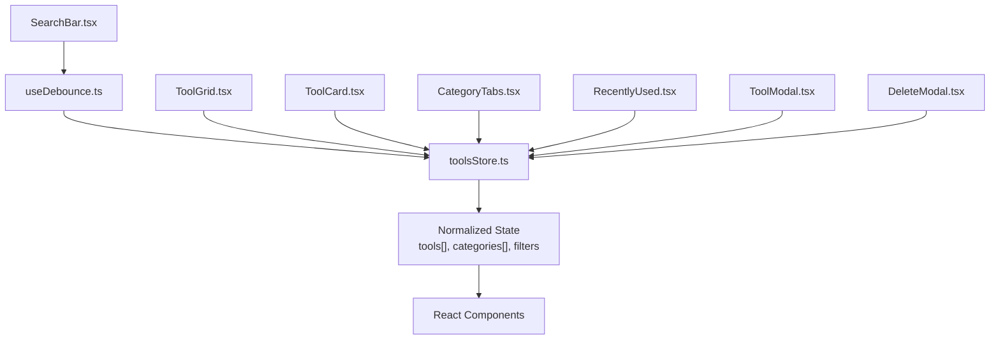
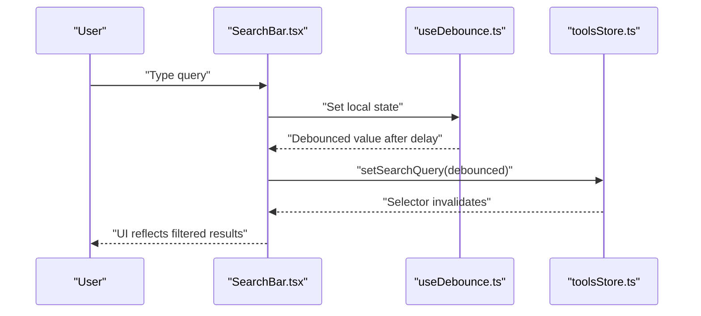
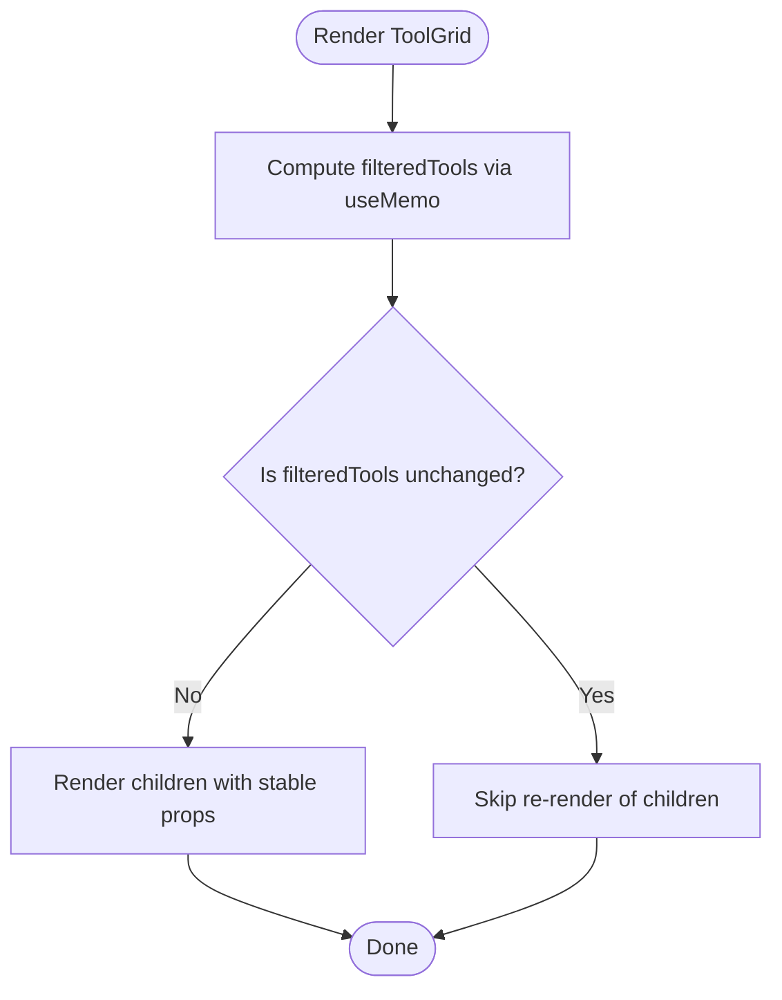
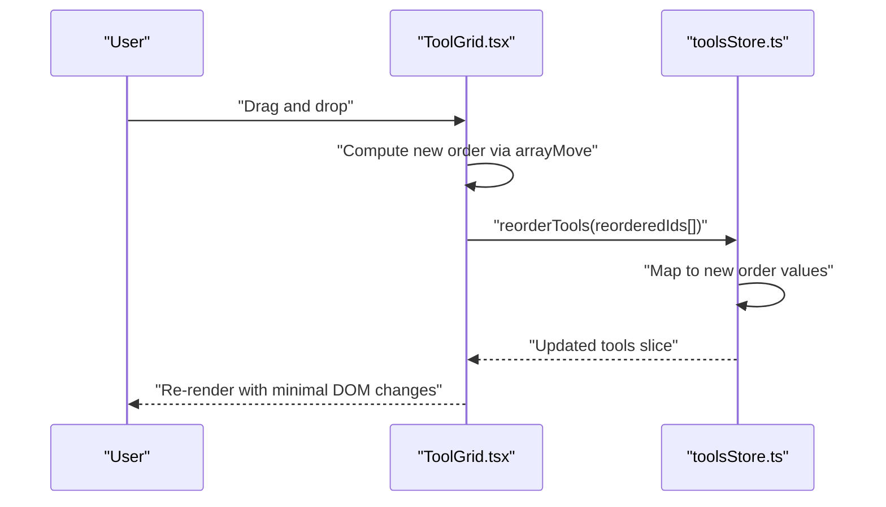
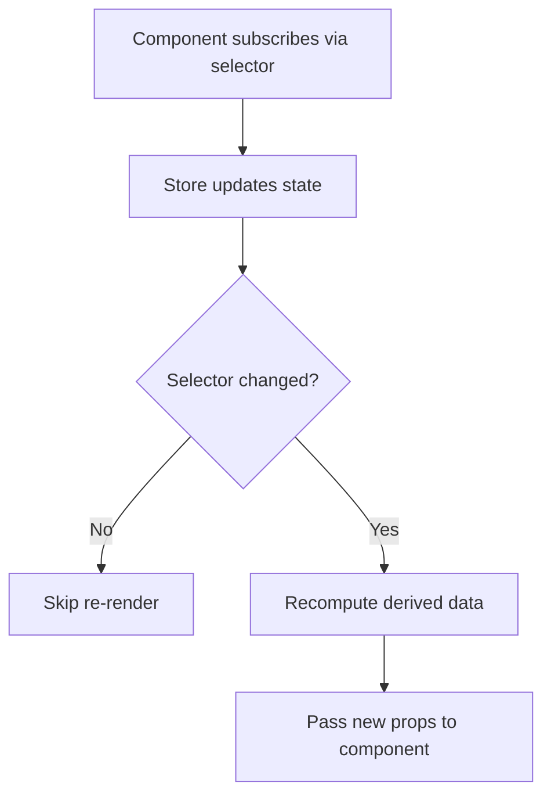
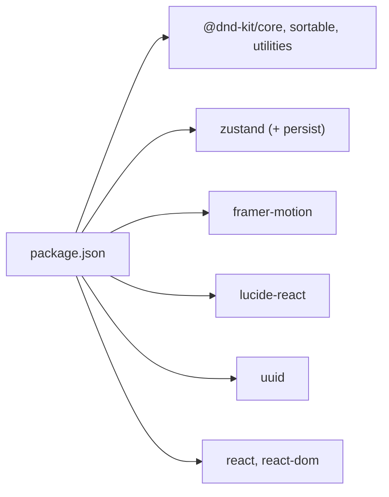

# Performance Optimization

<cite>
**Referenced Files in This Document**
- [useDebounce.ts](file://src/hooks/useDebounce.ts)
- [toolsStore.ts](file://src/stores/toolsStore.ts)
- [SearchBar.tsx](file://src/components/features/SearchBar.tsx)
- [ToolGrid.tsx](file://src/components/features/ToolGrid.tsx)
- [ToolCard.tsx](file://src/components/features/ToolCard.tsx)
- [CategoryTabs.tsx](file://src/components/features/CategoryTabs.tsx)
- [RecentlyUsed.tsx](file://src/components/features/RecentlyUsed.tsx)
- [ToolModal.tsx](file://src/components/modals/ToolModal.tsx)
- [DeleteModal.tsx](file://src/components/modals/DeleteModal.tsx)
- [App.tsx](file://src/App.tsx)
- [vite.config.ts](file://vite.config.ts)
- [package.json](file://package.json)
- [index.ts](file://src/types/index.ts)
</cite>

## Table of Contents
1. [Introduction](#introduction)
2. [Project Structure](#project-structure)
3. [Core Components](#core-components)
4. [Architecture Overview](#architecture-overview)
5. [Detailed Component Analysis](#detailed-component-analysis)
6. [Dependency Analysis](#dependency-analysis)
7. [Performance Considerations](#performance-considerations)
8. [Troubleshooting Guide](#troubleshooting-guide)
9. [Conclusion](#conclusion)
10. [Appendices](#appendices)

## Introduction
This document provides comprehensive performance optimization guidance for the AIPulse application. It focuses on practical techniques implemented in the codebase and recommended best practices to improve rendering performance, reduce bundle size, and enhance user experience metrics. Topics include debounced search, component memoization, drag-and-drop optimization, Zustand store patterns, lazy loading strategies, performance monitoring, and memory management.

## Project Structure
AIPulse follows a feature-based component organization with a clear separation of concerns:
- Hooks encapsulate reusable logic (e.g., debouncing).
- Stores manage global state via Zustand with persistence.
- Components are organized by features and UI modules.
- Vite provides build tooling and module resolution aliases.

**Diagram sources**
- [App.tsx](file://src/App.tsx#L1-L122)
- [SearchBar.tsx](file://src/components/features/SearchBar.tsx#L1-L42)
- [ToolGrid.tsx](file://src/components/features/ToolGrid.tsx#L1-L112)
- [ToolCard.tsx](file://src/components/features/ToolCard.tsx#L1-L141)
- [CategoryTabs.tsx](file://src/components/features/CategoryTabs.tsx#L1-L106)
- [RecentlyUsed.tsx](file://src/components/features/RecentlyUsed.tsx#L1-L101)
- [ToolModal.tsx](file://src/components/modals/ToolModal.tsx#L1-L253)
- [DeleteModal.tsx](file://src/components/modals/DeleteModal.tsx#L1-L67)
- [toolsStore.ts](file://src/stores/toolsStore.ts#L1-L177)
- [useDebounce.ts](file://src/hooks/useDebounce.ts#L1-L18)
- [vite.config.ts](file://vite.config.ts#L1-L19)
- [package.json](file://package.json#L1-L36)

**Section sources**
- [vite.config.ts](file://vite.config.ts#L1-L19)
- [package.json](file://package.json#L1-L36)

## Core Components
This section highlights the primary performance-critical components and their optimization strategies.

- Debounced Search
  - A local input state captures user input immediately.
  - A debounced value is derived with a delay to reduce store updates.
  - On change, the debounced value triggers a single store update, minimizing re-renders.

- Zustand Store
  - Centralized state with selectors for granular subscription.
  - Pure getters compute derived data efficiently.
  - Batched updates and normalized state reduce unnecessary renders.

- Drag-and-Drop Sorting
  - Efficient reordering via ID arrays to avoid deep state mutations.
  - Minimal DOM updates by updating only order indices.

- Memoization Patterns
  - useMemo caches filtered lists based on dependencies.
  - useCallback prevents prop instability for handlers passed down.

- Lazy Loading Strategies
  - Modals are conditionally rendered and mounted/unmounted to reduce initial payload.
  - Dynamic icon resolution avoids bundling unused icons.

**Section sources**
- [useDebounce.ts](file://src/hooks/useDebounce.ts#L1-L18)
- [toolsStore.ts](file://src/stores/toolsStore.ts#L1-L177)
- [SearchBar.tsx](file://src/components/features/SearchBar.tsx#L1-L42)
- [ToolGrid.tsx](file://src/components/features/ToolGrid.tsx#L1-L112)
- [ToolCard.tsx](file://src/components/features/ToolCard.tsx#L1-L141)
- [CategoryTabs.tsx](file://src/components/features/CategoryTabs.tsx#L1-L106)
- [RecentlyUsed.tsx](file://src/components/features/RecentlyUsed.tsx#L1-L101)
- [ToolModal.tsx](file://src/components/modals/ToolModal.tsx#L1-L253)
- [DeleteModal.tsx](file://src/components/modals/DeleteModal.tsx#L1-L67)

## Architecture Overview
The application uses a unidirectional data flow with Zustand for state management and React for rendering. Components subscribe to slices of state via selectors, ensuring minimal re-renders. Drag-and-drop operations update only the order field, avoiding deep re-computation.

**Diagram sources**
- [SearchBar.tsx](file://src/components/features/SearchBar.tsx#L1-L42)
- [useDebounce.ts](file://src/hooks/useDebounce.ts#L1-L18)
- [toolsStore.ts](file://src/stores/toolsStore.ts#L1-L177)
- [ToolGrid.tsx](file://src/components/features/ToolGrid.tsx#L1-L112)
- [ToolCard.tsx](file://src/components/features/ToolCard.tsx#L1-L141)
- [CategoryTabs.tsx](file://src/components/features/CategoryTabs.tsx#L1-L106)
- [RecentlyUsed.tsx](file://src/components/features/RecentlyUsed.tsx#L1-L101)
- [ToolModal.tsx](file://src/components/modals/ToolModal.tsx#L1-L253)
- [DeleteModal.tsx](file://src/components/modals/DeleteModal.tsx#L1-L67)

## Detailed Component Analysis

### Debounced Search Implementation
The debounced search pattern reduces frequent store writes and improves responsiveness during typing.

**Diagram sources**
- [SearchBar.tsx](file://src/components/features/SearchBar.tsx#L1-L42)
- [useDebounce.ts](file://src/hooks/useDebounce.ts#L1-L18)
- [toolsStore.ts](file://src/stores/toolsStore.ts#L94-L101)

Key points:
- Local state captures keystrokes instantly for smooth UI feedback.
- Debounce delay balances responsiveness and performance.
- Single store write per debounce cycle minimizes re-renders.

**Section sources**
- [useDebounce.ts](file://src/hooks/useDebounce.ts#L1-L18)
- [SearchBar.tsx](file://src/components/features/SearchBar.tsx#L1-L42)
- [toolsStore.ts](file://src/stores/toolsStore.ts#L94-L101)

### Component Memoization Strategies
Memoization prevents unnecessary re-computations and re-renders.

- useMemo in ToolGrid
  - Caches filtered tools based on dependencies to avoid repeated filtering.
  - Dependencies include the getter function and filter criteria.

- useCallback for handlers
  - Wrap event handlers passed to children to prevent prop identity churn.
  - Recommended for edit/delete callbacks in ToolGrid.

- React.memo for ToolCard
  - Wrap ToolCard to skip re-render when props are shallow-equal.
  - Ensure props are memoized upstream (e.g., via useMemo) for effectiveness.

**Diagram sources**
- [ToolGrid.tsx](file://src/components/features/ToolGrid.tsx#L30-L36)
- [ToolCard.tsx](file://src/components/features/ToolCard.tsx#L1-L141)

**Section sources**
- [ToolGrid.tsx](file://src/components/features/ToolGrid.tsx#L1-L112)
- [ToolCard.tsx](file://src/components/features/ToolCard.tsx#L1-L141)

### Drag-and-Drop Performance Optimization
Efficient sorting minimizes state mutations and re-renders.

**Diagram sources**
- [ToolGrid.tsx](file://src/components/features/ToolGrid.tsx#L46-L56)
- [toolsStore.ts](file://src/stores/toolsStore.ts#L53-L75)

Optimization highlights:
- Reordering operates on IDs and recomputes order indices.
- No deep cloning of unrelated fields; only order is updated.
- Sorting uses a stable strategy with minimal collision detection overhead.

**Section sources**
- [ToolGrid.tsx](file://src/components/features/ToolGrid.tsx#L1-L112)
- [toolsStore.ts](file://src/stores/toolsStore.ts#L53-L75)

### Zustand Store Optimization
Selectors and normalized state reduce re-renders and improve maintainability.

Best practices:
- Use narrow selectors to limit subscription scope.
- Keep state normalized (arrays of entities) for predictable updates.
- Prefer pure getters for derived computations to enable memoization.

**Diagram sources**
- [toolsStore.ts](file://src/stores/toolsStore.ts#L131-L164)

**Section sources**
- [toolsStore.ts](file://src/stores/toolsStore.ts#L1-L177)
- [index.ts](file://src/types/index.ts#L1-L60)

### Lazy Loading Strategies
Lazy loading reduces initial bundle size and improves time-to-first-byte.

- Conditional modal mounting
  - ToolModal and DeleteModal render only when needed.
  - Avoids loading heavy form logic until invoked.

- Dynamic icon resolution
  - Icons are resolved dynamically at runtime, preventing bundling unused assets.

- Route-based code splitting (recommended)
  - Split views (e.g., tool management) into separate chunks.
  - Load lazily when the route is accessed.

**Section sources**
- [ToolModal.tsx](file://src/components/modals/ToolModal.tsx#L1-L253)
- [DeleteModal.tsx](file://src/components/modals/DeleteModal.tsx#L1-L67)
- [ToolCard.tsx](file://src/components/features/ToolCard.tsx#L36-L43)

### Performance Monitoring, Bundle Analysis, and Profiling
- Build-time analysis
  - Use Vite’s built-in analyzer plugin to inspect bundle composition.
  - Identify large dependencies and optimize imports.

- Runtime profiling
  - Use React DevTools Profiler to detect long renders and bottlenecks.
  - Focus on components that re-render frequently under user interactions.

- Metrics to track
  - Largest Contentful Paint (LCP), First Input Delay (FID), Cumulative Layout Shift (CLS).
  - Measure after implementing memoization and lazy loading.

- Bundle optimization
  - Prefer tree-shaking-friendly libraries.
  - Use dynamic imports for heavy features not needed on initial load.

**Section sources**
- [vite.config.ts](file://vite.config.ts#L1-L19)
- [package.json](file://package.json#L1-L36)

### Memory Management Practices
- Event listeners and timers
  - Clear timeouts and intervals in cleanup effects to prevent leaks.
  - Debounce hook clears timeout on unmount.

- Modal lifecycle
  - Reset form state and close modals on unmount to avoid stale closures.

- Subscriptions
  - Ensure selectors unsubscribe automatically when components unmount.

**Section sources**
- [useDebounce.ts](file://src/hooks/useDebounce.ts#L11-L14)
- [ToolModal.tsx](file://src/components/modals/ToolModal.tsx#L33-L48)
- [DeleteModal.tsx](file://src/components/modals/DeleteModal.tsx#L17-L28)

## Dependency Analysis
External dependencies and their performance impact:
- @dnd-kit/*: Lightweight drag-and-drop with minimal overhead.
- framer-motion: Smooth animations; use motion only where necessary.
- lucide-react: SVG icons; consider lazy-loading icon bundles if needed.
- uuid: Small utility; negligible impact.
- zustand: Minimal footprint with middleware support.

**Diagram sources**
- [package.json](file://package.json#L22-L34)

**Section sources**
- [package.json](file://package.json#L1-L36)

## Performance Considerations
- Rendering performance
  - Prefer memoization for derived lists and handlers.
  - Avoid passing new objects/functions as props; memoize them.
  - Limit re-renders by narrowing selector scope.

- Bundle size
  - Remove unused icons and utilities.
  - Split routes and modals for on-demand loading.
  - Audit third-party packages regularly.

- User experience metrics
  - Keep interactions responsive; defer heavy work to idle callbacks if needed.
  - Use skeleton loaders for perceived performance during async operations.

[No sources needed since this section provides general guidance]

## Troubleshooting Guide
Common performance pitfalls and fixes:
- Unnecessary re-renders
  - Symptom: Components re-render on unrelated state changes.
  - Fix: Use narrow selectors and memoization; pass memoized props.

- Blocking operations
  - Symptom: UI freezes during filtering or sorting.
  - Fix: Move heavy computations off the main thread; use virtualization for large lists.

- Excessive store updates
  - Symptom: Frequent re-renders due to rapid state changes.
  - Fix: Debounce user input and batch updates where appropriate.

- Memory leaks
  - Symptom: Stale timers or subscriptions causing memory growth.
  - Fix: Clear timers and cancel subscriptions in cleanup.

**Section sources**
- [useDebounce.ts](file://src/hooks/useDebounce.ts#L11-L14)
- [SearchBar.tsx](file://src/components/features/SearchBar.tsx#L11-L13)
- [ToolGrid.tsx](file://src/components/features/ToolGrid.tsx#L46-L56)

## Conclusion
AIPulse employs several proven performance strategies: debounced search, memoization, efficient drag-and-drop updates, and selective state subscriptions. By extending these patterns—adding React.memo, useCallback, route-based code splitting, and rigorous profiling—the application can achieve even better rendering performance, smaller bundles, and improved user experience metrics.

[No sources needed since this section summarizes without analyzing specific files]

## Appendices

### Benchmarking and Testing Methodologies
- Synthetic benchmarks
  - Measure filtering throughput with varying dataset sizes.
  - Track drag-and-drop latency across different list lengths.

- Real-world testing
  - Use browser devtools to profile long tasks and layout thrashing.
  - Monitor CLS and FID in production via web vitals.

- Automated checks
  - Add tests asserting stable component renders under identical props.
  - Verify that memoized components skip re-renders consistently.

[No sources needed since this section provides general guidance]