# Project Overview

<cite>
**Referenced Files in This Document**
- [App.tsx](file://src/App.tsx)
- [main.tsx](file://src/main.tsx)
- [types/index.ts](file://src/types/index.ts)
- [stores/toolsStore.ts](file://src/stores/toolsStore.ts)
- [components/features/ToolGrid.tsx](file://src/components/features/ToolGrid.tsx)
- [components/features/CategoryTabs.tsx](file://src/components/features/CategoryTabs.tsx)
- [components/features/RecentlyUsed.tsx](file://src/components/features/RecentlyUsed.tsx)
- [components/features/SearchBar.tsx](file://src/components/features/SearchBar.tsx)
- [components/features/ThemeToggle.tsx](file://src/components/features/ThemeToggle.tsx)
- [components/features/ToolCard.tsx](file://src/components/features/ToolCard.tsx)
- [components/modals/ToolModal.tsx](file://src/components/modals/ToolModal.tsx)
- [components/modals/DeleteModal.tsx](file://src/components/modals/DeleteModal.tsx)
- [components/layout/Header.tsx](file://src/components/layout/Header.tsx)
- [components/layout/Footer.tsx](file://src/components/layout/Footer.tsx)
- [constants/defaultTools.ts](file://src/constants/defaultTools.ts)
- [package.json](file://package.json)
</cite>

## Table of Contents
1. [Introduction](#introduction)
2. [Project Structure](#project-structure)
3. [Core Components](#core-components)
4. [Architecture Overview](#architecture-overview)
5. [Detailed Component Analysis](#detailed-component-analysis)
6. [Dependency Analysis](#dependency-analysis)
7. [Performance Considerations](#performance-considerations)
8. [Troubleshooting Guide](#troubleshooting-guide)
9. [Conclusion](#conclusion)

## Introduction
AIPulse is a personal AI tool manager designed to help users organize, discover, and efficiently access their favorite AI applications. At its core, AIPulse provides a streamlined interface to manage a curated collection of AI tools, enabling quick navigation and persistent organization tailored to individual workflows.

Key value propositions:
- Centralized collection management with robust CRUD operations for AI tools
- Intelligent category-based organization and powerful search to quickly locate tools
- Seamless drag-and-drop reordering for personalized layouts
- Theme switching for comfortable usage across environments
- Recently used tools tracking to accelerate frequent access
- Browser integration via external AI tool URLs for instant launching

Target audience:
- AI enthusiasts who want a personalized dashboard of tools
- Professionals seeking efficient access to AI resources for daily tasks

## Project Structure
AIPulse follows a component-driven architecture built with modern React and TypeScript. The application is structured around a centralized store for state management and a set of reusable UI components. The layout is composed of header, main content area, and footer, with feature components handling search, categories, recently used tools, and tool grids. Modals support adding and editing tools, while constants define default categories and tools.

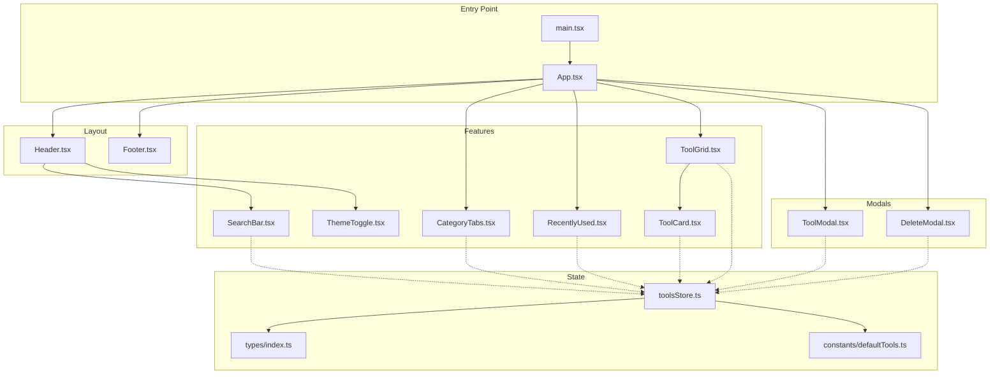

**Diagram sources**
- [main.tsx](file://src/main.tsx#L1-L11)
- [App.tsx](file://src/App.tsx#L1-L122)
- [components/layout/Header.tsx](file://src/components/layout/Header.tsx#L1-L83)
- [components/layout/Footer.tsx](file://src/components/layout/Footer.tsx#L1-L21)
- [components/features/CategoryTabs.tsx](file://src/components/features/CategoryTabs.tsx#L1-L106)
- [components/features/RecentlyUsed.tsx](file://src/components/features/RecentlyUsed.tsx#L1-L101)
- [components/features/ToolGrid.tsx](file://src/components/features/ToolGrid.tsx#L1-L112)
- [components/features/ToolCard.tsx](file://src/components/features/ToolCard.tsx#L1-L141)
- [components/features/SearchBar.tsx](file://src/components/features/SearchBar.tsx#L1-L42)
- [components/features/ThemeToggle.tsx](file://src/components/features/ThemeToggle.tsx#L1-L43)
- [components/modals/ToolModal.tsx](file://src/components/modals/ToolModal.tsx#L1-L253)
- [components/modals/DeleteModal.tsx](file://src/components/modals/DeleteModal.tsx#L1-L67)
- [stores/toolsStore.ts](file://src/stores/toolsStore.ts#L1-L177)
- [types/index.ts](file://src/types/index.ts#L1-L60)
- [constants/defaultTools.ts](file://src/constants/defaultTools.ts#L1-L101)

**Section sources**
- [main.tsx](file://src/main.tsx#L1-L11)
- [App.tsx](file://src/App.tsx#L1-L122)
- [package.json](file://package.json#L1-L36)

## Core Components
AIPulse centers on a single-page application with a responsive layout and a rich set of interactive features. The application’s state is managed through a Zustand store with persistence, enabling seamless user experiences across sessions. The UI is composed of modular components that encapsulate specific functionalities such as search, category filtering, tool display, and modals for CRUD operations.

Key capabilities:
- CRUD operations for AITool entries: create, read, update, delete
- Category management: add and remove categories; filter tools by category
- Search functionality: real-time search with debounced input and multi-field matching
- Drag-and-drop reordering: intuitive rearrangement of tools within the grid
- Theme switching: light/dark mode with persisted preference
- Recently used tools tracking: automatic history with timestamp updates
- Browser integration: opening external AI tool URLs in new tabs

Practical examples:
- Adding AI tools: open the add tool modal, fill in details, select a category, choose an icon, and save
- Organizing collections: filter by category, search for tools, and reorder using drag-and-drop
- Discovering new tools: use the search bar to find tools by name, category, or description

**Section sources**
- [types/index.ts](file://src/types/index.ts#L1-L60)
- [stores/toolsStore.ts](file://src/stores/toolsStore.ts#L1-L177)
- [components/features/ToolGrid.tsx](file://src/components/features/ToolGrid.tsx#L1-L112)
- [components/features/CategoryTabs.tsx](file://src/components/features/CategoryTabs.tsx#L1-L106)
- [components/features/SearchBar.tsx](file://src/components/features/SearchBar.tsx#L1-L42)
- [components/features/ThemeToggle.tsx](file://src/components/features/ThemeToggle.tsx#L1-L43)
- [components/features/RecentlyUsed.tsx](file://src/components/features/RecentlyUsed.tsx#L1-L101)
- [components/modals/ToolModal.tsx](file://src/components/modals/ToolModal.tsx#L1-L253)
- [components/modals/DeleteModal.tsx](file://src/components/modals/DeleteModal.tsx#L1-L67)

## Architecture Overview
AIPulse employs a modern React + TypeScript stack with the following architectural highlights:
- UI framework: React with TypeScript for type safety and developer productivity
- State management: Zustand for lightweight, scalable state with persistence
- UI library: Tailwind CSS for utility-first styling and responsive design
- Animations: Framer Motion for smooth transitions and micro-interactions
- Drag-and-drop: @dnd-kit for accessible and performant reordering
- Icons: Lucide React for consistent iconography
- Build tooling: Vite for fast development and optimized builds

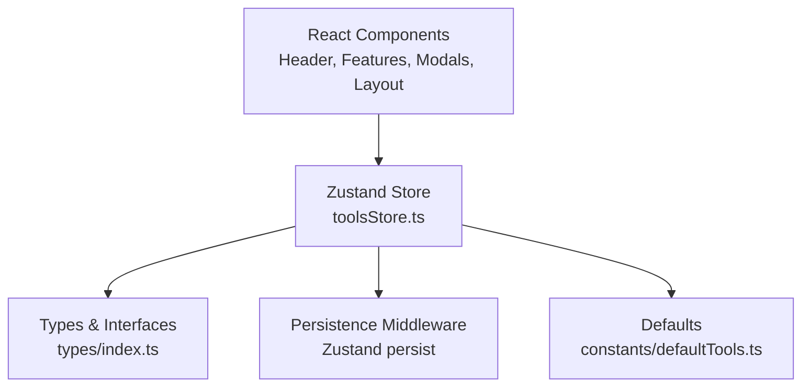

**Diagram sources**
- [stores/toolsStore.ts](file://src/stores/toolsStore.ts#L1-L177)
- [types/index.ts](file://src/types/index.ts#L1-L60)
- [constants/defaultTools.ts](file://src/constants/defaultTools.ts#L1-L101)

**Section sources**
- [package.json](file://package.json#L1-L36)
- [stores/toolsStore.ts](file://src/stores/toolsStore.ts#L1-L177)
- [types/index.ts](file://src/types/index.ts#L1-L60)

## Detailed Component Analysis

### Application Shell and Routing
The application initializes through a standard React root and renders the main App shell. The App component orchestrates layout, modals, and feature sections, applying theme classes and coordinating state-driven interactions.

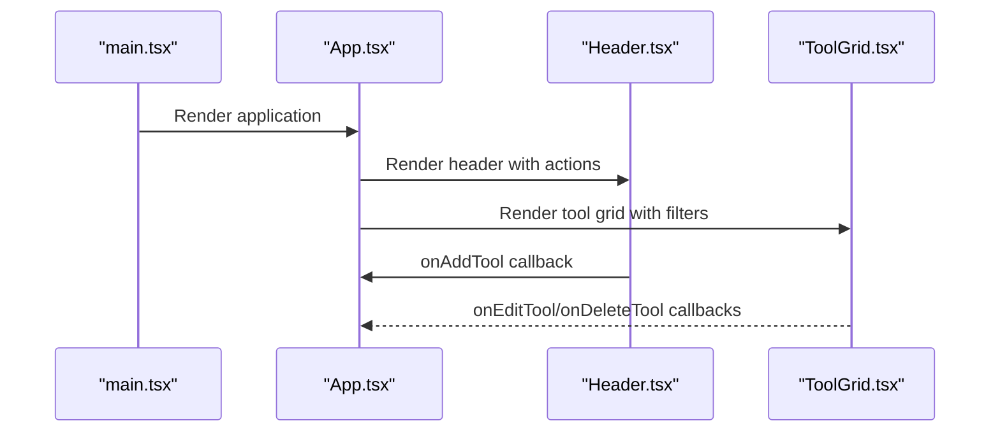

**Diagram sources**
- [main.tsx](file://src/main.tsx#L1-L11)
- [App.tsx](file://src/App.tsx#L1-L122)
- [components/layout/Header.tsx](file://src/components/layout/Header.tsx#L1-L83)
- [components/features/ToolGrid.tsx](file://src/components/features/ToolGrid.tsx#L1-L112)

**Section sources**
- [main.tsx](file://src/main.tsx#L1-L11)
- [App.tsx](file://src/App.tsx#L1-L122)

### State Management and Persistence
The Zustand store encapsulates all application state and actions, including CRUD operations for AITool, category management, filtering, theming, and recently used tracking. Persistence ensures that user preferences and data survive page reloads.

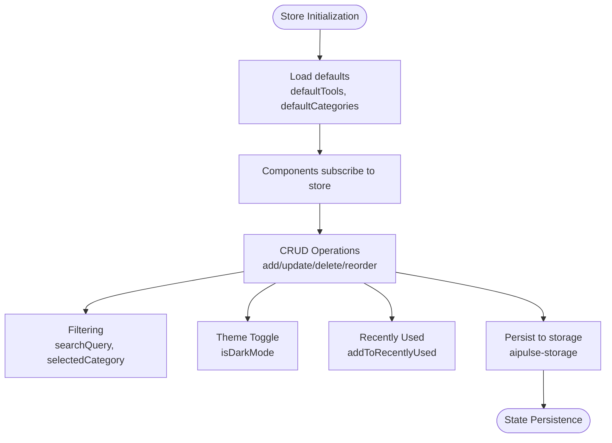

**Diagram sources**
- [stores/toolsStore.ts](file://src/stores/toolsStore.ts#L1-L177)
- [constants/defaultTools.ts](file://src/constants/defaultTools.ts#L1-L101)

**Section sources**
- [stores/toolsStore.ts](file://src/stores/toolsStore.ts#L1-L177)
- [types/index.ts](file://src/types/index.ts#L1-L60)

### Tool Management Workflow
The tool management workflow integrates modals, validation, and store actions to provide a seamless user experience for adding and editing tools.

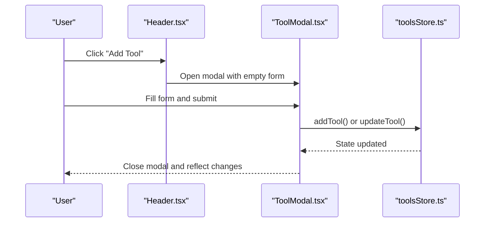

**Diagram sources**
- [components/layout/Header.tsx](file://src/components/layout/Header.tsx#L1-L83)
- [components/modals/ToolModal.tsx](file://src/components/modals/ToolModal.tsx#L1-L253)
- [stores/toolsStore.ts](file://src/stores/toolsStore.ts#L25-L51)

**Section sources**
- [components/modals/ToolModal.tsx](file://src/components/modals/ToolModal.tsx#L1-L253)
- [stores/toolsStore.ts](file://src/stores/toolsStore.ts#L25-L51)

### Drag-and-Drop Reordering
The ToolGrid leverages @dnd-kit to enable drag-and-drop reordering of tools. The implementation calculates new indices based on drag events and updates the store accordingly.

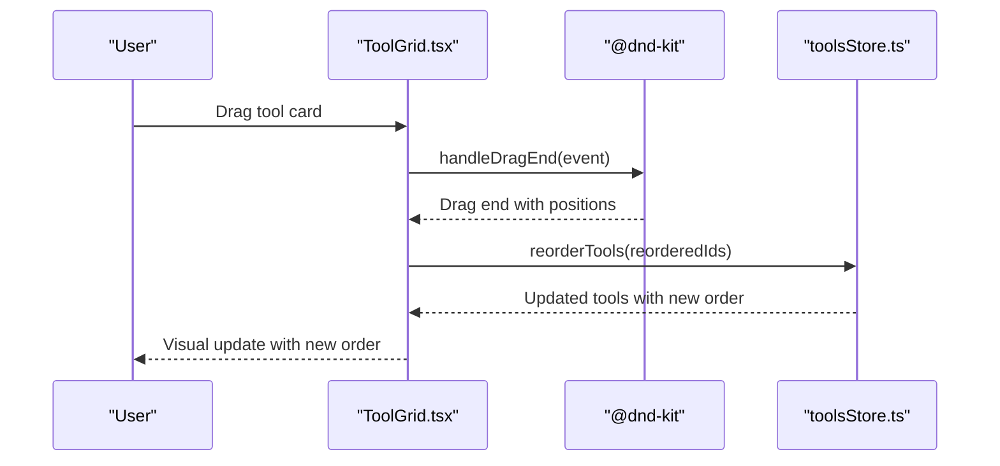

**Diagram sources**
- [components/features/ToolGrid.tsx](file://src/components/features/ToolGrid.tsx#L46-L56)
- [stores/toolsStore.ts](file://src/stores/toolsStore.ts#L53-L75)

**Section sources**
- [components/features/ToolGrid.tsx](file://src/components/features/ToolGrid.tsx#L1-L112)
- [stores/toolsStore.ts](file://src/stores/toolsStore.ts#L53-L75)

### Category-Based Organization
CategoryTabs provide an interactive tabbed interface to filter tools by category. The component dynamically computes counts and toggles selection state.

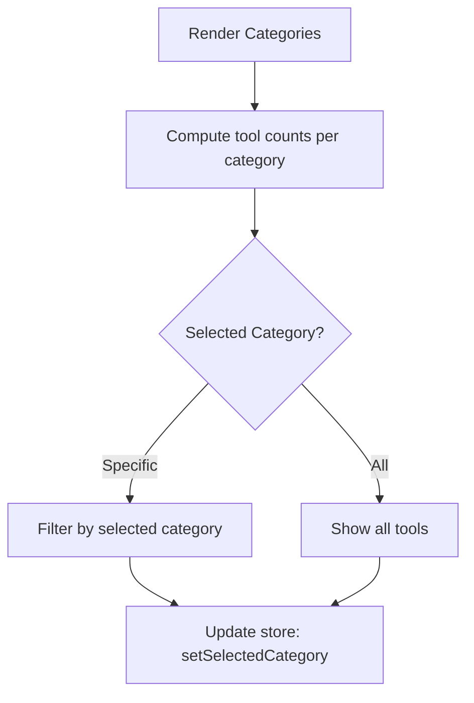

**Diagram sources**
- [components/features/CategoryTabs.tsx](file://src/components/features/CategoryTabs.tsx#L1-L106)
- [stores/toolsStore.ts](file://src/stores/toolsStore.ts#L99-L101)

**Section sources**
- [components/features/CategoryTabs.tsx](file://src/components/features/CategoryTabs.tsx#L1-L106)
- [stores/toolsStore.ts](file://src/stores/toolsStore.ts#L99-L101)

### Search Functionality
SearchBar integrates debounced input to update the store’s search query, enabling real-time filtering across tool names, categories, and descriptions.

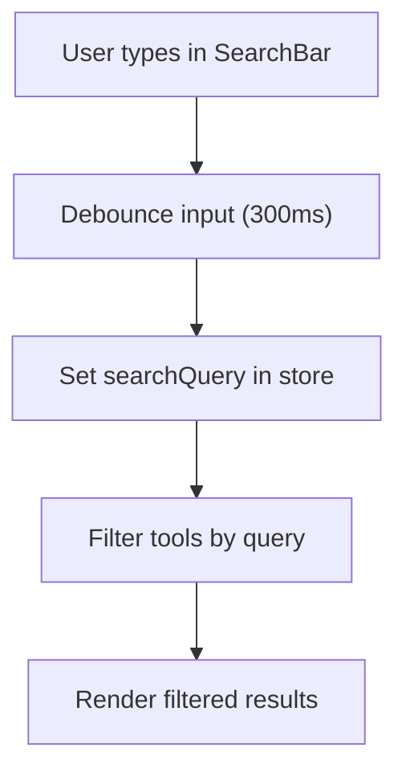

**Diagram sources**
- [components/features/SearchBar.tsx](file://src/components/features/SearchBar.tsx#L1-L42)
- [stores/toolsStore.ts](file://src/stores/toolsStore.ts#L95-L97)
- [stores/toolsStore.ts](file://src/stores/toolsStore.ts#L132-L156)

**Section sources**
- [components/features/SearchBar.tsx](file://src/components/features/SearchBar.tsx#L1-L42)
- [stores/toolsStore.ts](file://src/stores/toolsStore.ts#L95-L97)
- [stores/toolsStore.ts](file://src/stores/toolsStore.ts#L132-L156)

### Theme Switching
ThemeToggle manages theme state and applies appropriate classes to the document element, ensuring consistent styling across components.

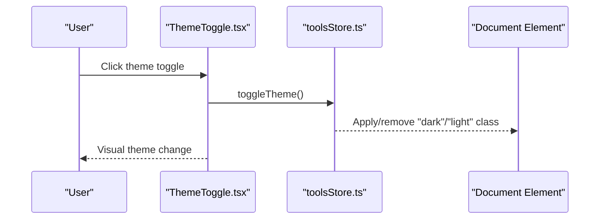

**Diagram sources**
- [components/features/ThemeToggle.tsx](file://src/components/features/ThemeToggle.tsx#L1-L43)
- [stores/toolsStore.ts](file://src/stores/toolsStore.ts#L104-L110)
- [App.tsx](file://src/App.tsx#L19-L26)

**Section sources**
- [components/features/ThemeToggle.tsx](file://src/components/features/ThemeToggle.tsx#L1-L43)
- [stores/toolsStore.ts](file://src/stores/toolsStore.ts#L104-L110)
- [App.tsx](file://src/App.tsx#L19-L26)

### Recently Used Tools Tracking
RecentlyUsed displays the most accessed tools and updates timestamps upon launch, maintaining a rolling history of up to ten items.

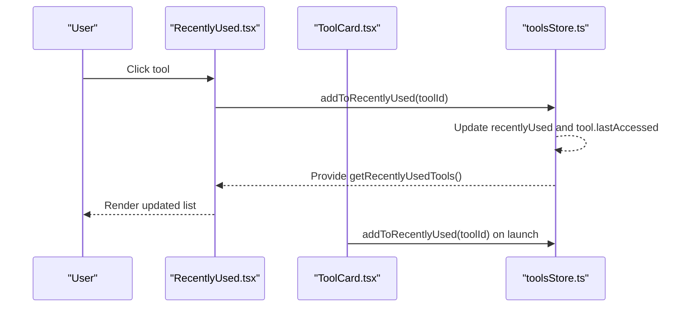

**Diagram sources**
- [components/features/RecentlyUsed.tsx](file://src/components/features/RecentlyUsed.tsx#L20-L23)
- [components/features/ToolCard.tsx](file://src/components/features/ToolCard.tsx#L41-L44)
- [stores/toolsStore.ts](file://src/stores/toolsStore.ts#L113-L129)
- [stores/toolsStore.ts](file://src/stores/toolsStore.ts#L158-L164)

**Section sources**
- [components/features/RecentlyUsed.tsx](file://src/components/features/RecentlyUsed.tsx#L1-L101)
- [components/features/ToolCard.tsx](file://src/components/features/ToolCard.tsx#L1-L141)
- [stores/toolsStore.ts](file://src/stores/toolsStore.ts#L113-L129)
- [stores/toolsStore.ts](file://src/stores/toolsStore.ts#L158-L164)

### Data Model Overview
The AITool entity and related interfaces define the structure for storing tool metadata, categories, and state actions.

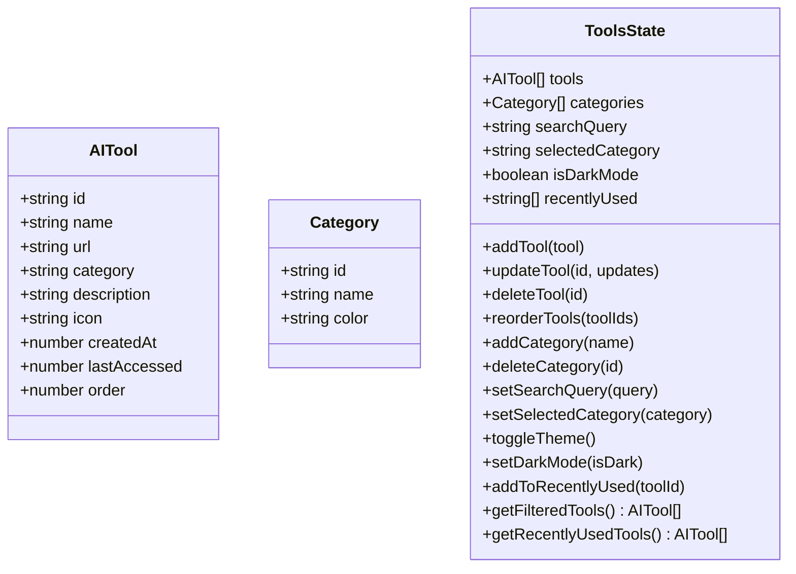

**Diagram sources**
- [types/index.ts](file://src/types/index.ts#L1-L60)

**Section sources**
- [types/index.ts](file://src/types/index.ts#L1-L60)

## Dependency Analysis
AIPulse relies on a focused set of libraries to deliver a modern, performant, and accessible experience. The dependency graph highlights core runtime dependencies and their roles.

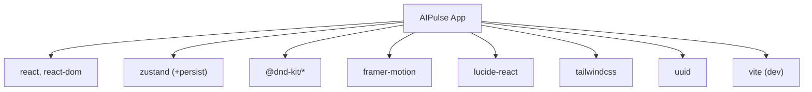

**Diagram sources**
- [package.json](file://package.json#L22-L34)

**Section sources**
- [package.json](file://package.json#L1-L36)

## Performance Considerations
- Debounced search input reduces unnecessary re-renders during typing
- Memoization of filtered tools prevents redundant computations
- Efficient drag-and-drop updates minimize DOM churn
- Persisted state avoids expensive initialization work on subsequent loads
- Lightweight animations enhance UX without impacting responsiveness

## Troubleshooting Guide
Common scenarios and resolutions:
- Tools not appearing after adding: verify the search query is cleared and category filter is reset
- Drag-and-drop not working: ensure the grid is not empty and the DnD context is properly initialized
- Theme not applying: check that the document element receives the correct theme class on mount
- Recently used list not updating: confirm the addToRecentlyUsed action is triggered on tool launch
- External URLs failing to open: verify URL validity and use the platform’s supported protocols

**Section sources**
- [components/features/ToolGrid.tsx](file://src/components/features/ToolGrid.tsx#L59-L84)
- [components/features/ThemeToggle.tsx](file://src/components/features/ThemeToggle.tsx#L9-L18)
- [components/features/RecentlyUsed.tsx](file://src/components/features/RecentlyUsed.tsx#L20-L23)
- [components/modals/ToolModal.tsx](file://src/components/modals/ToolModal.tsx#L50-L78)

## Conclusion
AIPulse delivers a cohesive solution for managing personal AI tool collections with a focus on usability, performance, and extensibility. Its modern React + TypeScript foundation, combined with targeted UI libraries and a robust state management strategy, enables a smooth and efficient user experience. Whether you are an AI enthusiast or a professional integrating AI tools into your workflow, AIPulse streamlines discovery, organization, and access to your digital AI toolkit.