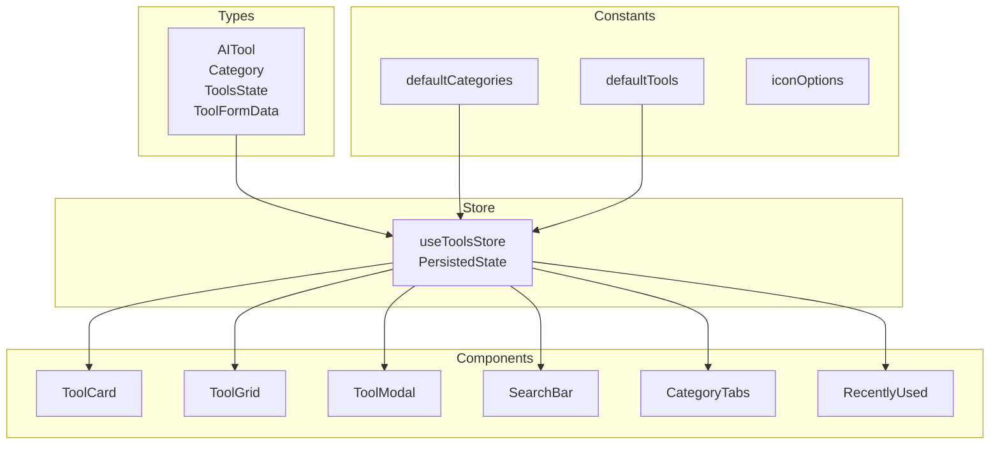
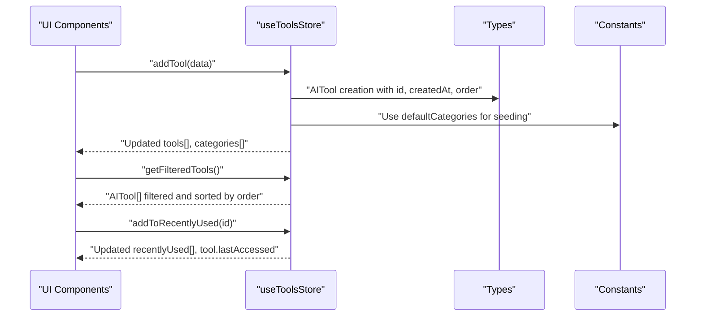
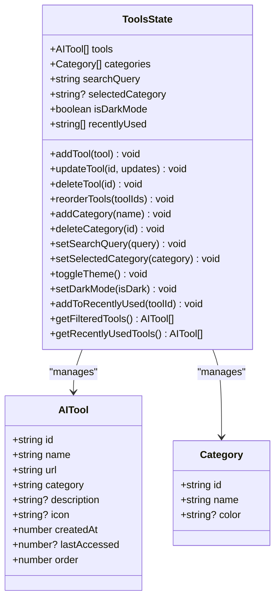
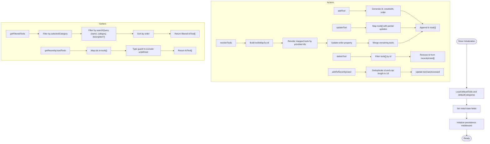
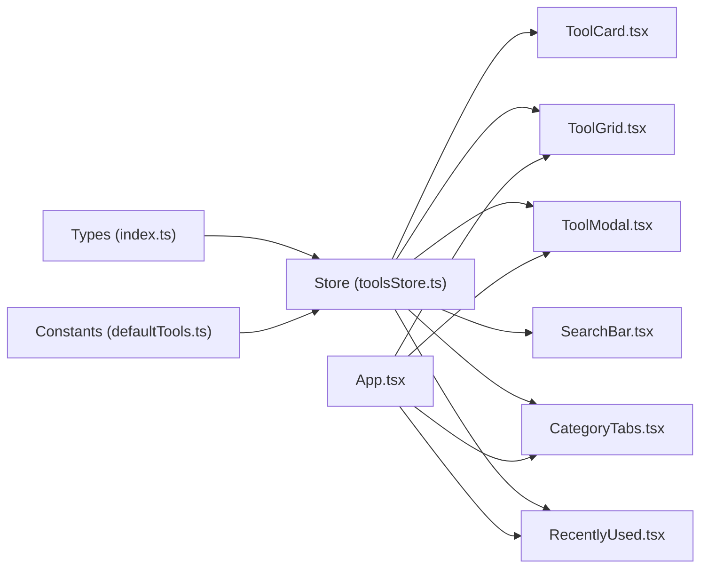

# Data Models & Types

<cite>
**Referenced Files in This Document**
- [index.ts](file://src/types/index.ts)
- [defaultTools.ts](file://src/constants/defaultTools.ts)
- [toolsStore.ts](file://src/stores/toolsStore.ts)
- [ToolCard.tsx](file://src/components/features/ToolCard.tsx)
- [ToolGrid.tsx](file://src/components/features/ToolGrid.tsx)
- [ToolModal.tsx](file://src/components/modals/ToolModal.tsx)
- [SearchBar.tsx](file://src/components/features/SearchBar.tsx)
- [CategoryTabs.tsx](file://src/components/features/CategoryTabs.tsx)
- [RecentlyUsed.tsx](file://src/components/features/RecentlyUsed.tsx)
- [App.tsx](file://src/App.tsx)
</cite>

## Table of Contents
1. [Introduction](#introduction)
2. [Project Structure](#project-structure)
3. [Core Components](#core-components)
4. [Architecture Overview](#architecture-overview)
5. [Detailed Component Analysis](#detailed-component-analysis)
6. [Dependency Analysis](#dependency-analysis)
7. [Performance Considerations](#performance-considerations)
8. [Troubleshooting Guide](#troubleshooting-guide)
9. [Conclusion](#conclusion)

## Introduction
This document provides comprehensive documentation for AIPulse data models and TypeScript interfaces. It focuses on the AITool and Category interfaces, the ToolsState contract, and the persisted state shape used for localStorage serialization. It also documents the defaultTools and defaultCategories constants, their initialization patterns, and how these types are enforced and transformed across the application. Practical examples of data validation, type safety, type guards, and optional property handling are included to guide developers in maintaining correctness and consistency.

## Project Structure
The data model layer is organized around three primary areas:
- Types: Strongly typed interfaces and form data contracts
- Constants: Default seed data for categories and tools
- Store: Zustand-managed state with persistence and derived getters

**Diagram sources**
- [index.ts](file://src/types/index.ts#L1-L60)
- [defaultTools.ts](file://src/constants/defaultTools.ts#L1-L101)
- [toolsStore.ts](file://src/stores/toolsStore.ts#L1-L177)
- [ToolCard.tsx](file://src/components/features/ToolCard.tsx#L1-L141)
- [ToolGrid.tsx](file://src/components/features/ToolGrid.tsx#L1-L112)
- [ToolModal.tsx](file://src/components/modals/ToolModal.tsx#L1-L253)
- [SearchBar.tsx](file://src/components/features/SearchBar.tsx#L1-L42)
- [CategoryTabs.tsx](file://src/components/features/CategoryTabs.tsx#L1-L106)
- [RecentlyUsed.tsx](file://src/components/features/RecentlyUsed.tsx#L1-L101)

**Section sources**
- [index.ts](file://src/types/index.ts#L1-L60)
- [defaultTools.ts](file://src/constants/defaultTools.ts#L1-L101)
- [toolsStore.ts](file://src/stores/toolsStore.ts#L1-L177)

## Core Components
This section documents the core TypeScript interfaces and constants that define the application’s data model.

- AITool interface
  - Purpose: Represents an AI tool entity with identifiers, metadata, timestamps, ordering, and optional fields.
  - Key properties:
    - id: string
    - name: string
    - url: string
    - category: string
    - description?: string
    - icon?: string
    - createdAt: number
    - lastAccessed?: number
    - order: number
  - Notes:
    - Optional fields enable flexible rendering and editing flows.
    - Timestamps are numeric epoch milliseconds for consistent sorting and comparisons.

- Category interface
  - Purpose: Defines a category used to group tools.
  - Key properties:
    - id: string
    - name: string
    - color?: string
  - Notes:
    - Optional color supports theming and visual grouping.

- ToolsState interface
  - Purpose: Contract for the Zustand store state and actions.
  - State fields:
    - tools: AITool[]
    - categories: Category[]
    - searchQuery: string
    - selectedCategory: string | null
    - isDarkMode: boolean
    - recentlyUsed: string[]
  - Actions:
    - CRUD for tools: addTool, updateTool, deleteTool, reorderTools
    - Category management: addCategory, deleteCategory
    - Filters: setSearchQuery, setSelectedCategory
    - Theme: toggleTheme, setDarkMode
    - Recently used: addToRecentlyUsed
  - Getters:
    - getFilteredTools(): AITool[]
    - getRecentlyUsedTools(): AITool[]
  - Notes:
    - Uses Partial updates for safe field-by-field edits.
    - Derived getters encapsulate filtering and sorting logic.

- PersistedState interface
  - Purpose: Shape used by the persistence middleware for localStorage serialization.
  - Fields:
    - tools: AITool[]
    - categories: Category[]
    - isDarkMode: boolean
    - recentlyUsed: string[]
  - Notes:
    - Ensures only relevant state is persisted.

- defaultTools and defaultCategories constants
  - Purpose: Seed data for initial application state.
  - Initialization pattern:
    - defaultCategories: Array of Category objects with id, name, and optional color.
    - defaultTools: Array of AITool objects with id, name, url, category, description, icon, createdAt, and order.
    - iconOptions: Enumerated list of supported icon names for selection.

- ToolFormData interface
  - Purpose: Form input contract for adding/editing tools.
  - Fields:
    - name: string
    - url: string
    - category: string
    - description: string
    - icon: string
  - Notes:
    - Mirrors AITool but excludes computed fields and optional fields are handled via defaults in forms.

**Section sources**
- [index.ts](file://src/types/index.ts#L1-L60)
- [defaultTools.ts](file://src/constants/defaultTools.ts#L1-L101)
- [toolsStore.ts](file://src/stores/toolsStore.ts#L7-L12)
- [toolsStore.ts](file://src/stores/toolsStore.ts#L14-L51)

## Architecture Overview
The data model architecture follows a unidirectional flow:
- Types define immutable contracts.
- Constants provide deterministic initial state.
- Store manages state transitions, persistence, and derived computations.
- Components consume state and dispatch actions.

**Diagram sources**
- [toolsStore.ts](file://src/stores/toolsStore.ts#L26-L75)
- [toolsStore.ts](file://src/stores/toolsStore.ts#L132-L164)
- [defaultTools.ts](file://src/constants/defaultTools.ts#L3-L10)
- [defaultTools.ts](file://src/constants/defaultTools.ts#L12-L73)

## Detailed Component Analysis

### AITool and Category Interfaces
These interfaces define the canonical shapes for tools and categories. They are consumed across the store and UI components.

**Diagram sources**
- [index.ts](file://src/types/index.ts#L1-L60)

**Section sources**
- [index.ts](file://src/types/index.ts#L1-L60)

### ToolsState Implementation and Persistence
The store encapsulates state transitions, persistence, and derived computations.

**Diagram sources**
- [toolsStore.ts](file://src/stores/toolsStore.ts#L14-L177)

**Section sources**
- [toolsStore.ts](file://src/stores/toolsStore.ts#L14-L177)

### Default Data Initialization
Default seed data ensures predictable initial state and provides a baseline for categories and tools.

- defaultCategories
  - Structure: Array of Category with id, name, optional color.
  - Usage: Initializes categories[] in the store.
- defaultTools
  - Structure: Array of AITool with id, name, url, category, description, icon, createdAt, order.
  - Usage: Initializes tools[] in the store.
- iconOptions
  - Structure: Array of icon names for selection.
  - Usage: Populates icon choices in forms.

**Section sources**
- [defaultTools.ts](file://src/constants/defaultTools.ts#L3-L10)
- [defaultTools.ts](file://src/constants/defaultTools.ts#L12-L73)
- [defaultTools.ts](file://src/constants/defaultTools.ts#L75-L101)

### UI Integration Patterns
Components consume strongly typed props and state, ensuring type safety and reducing runtime errors.

- ToolCard
  - Props: tool: AITool, onEdit, onDelete, index
  - Behavior: Renders optional description and icon; launches tool and updates recentlyUsed.
- ToolGrid
  - Behavior: Uses filtered tools from store; handles drag-and-drop reordering; empty-state messaging.
- ToolModal
  - Behavior: Validates form inputs, handles URL validation, and supports dynamic category creation.
- SearchBar
  - Behavior: Debounces input and updates searchQuery in store.
- CategoryTabs
  - Behavior: Computes counts per category and toggles selectedCategory.
- RecentlyUsed
  - Behavior: Displays up to six most recent tools and updates lastAccessed on click.

**Section sources**
- [ToolCard.tsx](file://src/components/features/ToolCard.tsx#L11-L16)
- [ToolCard.tsx](file://src/components/features/ToolCard.tsx#L36-L44)
- [ToolGrid.tsx](file://src/components/features/ToolGrid.tsx#L24-L28)
- [ToolGrid.tsx](file://src/components/features/ToolGrid.tsx#L46-L56)
- [ToolModal.tsx](file://src/components/modals/ToolModal.tsx#L9-L13)
- [ToolModal.tsx](file://src/components/modals/ToolModal.tsx#L50-L78)
- [SearchBar.tsx](file://src/components/features/SearchBar.tsx#L6-L18)
- [CategoryTabs.tsx](file://src/components/features/CategoryTabs.tsx#L5-L19)
- [RecentlyUsed.tsx](file://src/components/features/RecentlyUsed.tsx#L13-L23)

### Data Validation and Type Safety
- Form validation in ToolModal
  - Validates presence of name, url, and category.
  - Validates URL format using a dedicated validator.
  - Produces localized error messages keyed by ToolFormData fields.
- Type guards in store getters
  - getRecentlyUsedTools uses a type predicate to filter undefined entries after mapping ids to tools.
  - reorderTools uses a type predicate to ensure mapped tools are defined before constructing updated arrays.
- Optional property handling
  - description and icon are optional in AITool; components conditionally render content when present.
  - lastAccessed is optional; addToRecentlyUsed sets it upon access.

**Section sources**
- [ToolModal.tsx](file://src/components/modals/ToolModal.tsx#L50-L78)
- [toolsStore.ts](file://src/stores/toolsStore.ts#L158-L164)
- [toolsStore.ts](file://src/stores/toolsStore.ts#L53-L75)
- [ToolCard.tsx](file://src/components/features/ToolCard.tsx#L95-L99)
- [toolsStore.ts](file://src/stores/toolsStore.ts#L121-L129)

### Data Transformation Patterns
- Reordering tools
  - Transforms a list of ids into a new ordered array, updating the order property and preserving remaining tools.
- Recently used tracking
  - Maintains a capped list of up to ten tool ids, deduplicating on access and updating lastAccessed.
- Filtering and sorting
  - Filters by category and search query, then sorts by order for consistent presentation.

**Section sources**
- [toolsStore.ts](file://src/stores/toolsStore.ts#L53-L75)
- [toolsStore.ts](file://src/stores/toolsStore.ts#L113-L129)
- [toolsStore.ts](file://src/stores/toolsStore.ts#L132-L156)

## Dependency Analysis
The following diagram shows how types, constants, store, and components depend on each other.

**Diagram sources**
- [index.ts](file://src/types/index.ts#L1-L60)
- [defaultTools.ts](file://src/constants/defaultTools.ts#L1-L101)
- [toolsStore.ts](file://src/stores/toolsStore.ts#L1-L177)
- [ToolCard.tsx](file://src/components/features/ToolCard.tsx#L1-L141)
- [ToolGrid.tsx](file://src/components/features/ToolGrid.tsx#L1-L112)
- [ToolModal.tsx](file://src/components/modals/ToolModal.tsx#L1-L253)
- [SearchBar.tsx](file://src/components/features/SearchBar.tsx#L1-L42)
- [CategoryTabs.tsx](file://src/components/features/CategoryTabs.tsx#L1-L106)
- [RecentlyUsed.tsx](file://src/components/features/RecentlyUsed.tsx#L1-L101)
- [App.tsx](file://src/App.tsx#L1-L122)

**Section sources**
- [index.ts](file://src/types/index.ts#L1-L60)
- [defaultTools.ts](file://src/constants/defaultTools.ts#L1-L101)
- [toolsStore.ts](file://src/stores/toolsStore.ts#L1-L177)
- [App.tsx](file://src/App.tsx#L1-L122)

## Performance Considerations
- Memoization
  - ToolGrid uses memoization to avoid recomputing filtered tools unnecessarily.
- Sorting and filtering
  - Filtering and sorting occur in getters; keep queries concise and leverage category selection to reduce dataset size.
- Reordering
  - Reordering maps tools to a Map and rebuilds arrays; ensure tool lists are reasonably sized for smooth UX.
- Persistence
  - PersistedState includes only essential fields to minimize storage overhead.

[No sources needed since this section provides general guidance]

## Troubleshooting Guide
- URL validation failures
  - Symptom: Submit button disabled or error message appears.
  - Cause: URL does not parse as a valid URL.
  - Fix: Enter a properly formatted URL (with scheme).
- Missing optional fields
  - Symptom: Icons or descriptions not rendering.
  - Cause: Optional fields are absent.
  - Fix: Provide defaults in forms or conditionally render content.
- Recently used not updating
  - Symptom: Clicking tools does not change order or timestamps.
  - Cause: addToRecentlyUsed not invoked or lastAccessed not updated.
  - Fix: Ensure launch handlers call addToRecentlyUsed and store updates are persisted.
- Drag-and-drop reordering anomalies
  - Symptom: Tools reorder unexpectedly or lose order.
  - Cause: Incorrect toolIds passed to reorderTools.
  - Fix: Ensure the dragged item ids are passed in the correct order.

**Section sources**
- [ToolModal.tsx](file://src/components/modals/ToolModal.tsx#L50-L78)
- [toolsStore.ts](file://src/stores/toolsStore.ts#L113-L129)
- [toolsStore.ts](file://src/stores/toolsStore.ts#L53-L75)
- [ToolCard.tsx](file://src/components/features/ToolCard.tsx#L41-L44)

## Conclusion
AIPulse enforces strong data modeling through TypeScript interfaces, consistent initialization via constants, and robust store logic with persistence. Optional properties and type guards ensure graceful handling of missing data, while derived getters encapsulate filtering and sorting. The UI components remain type-safe and resilient, leveraging the store’s actions and getters to maintain a responsive and predictable user experience.