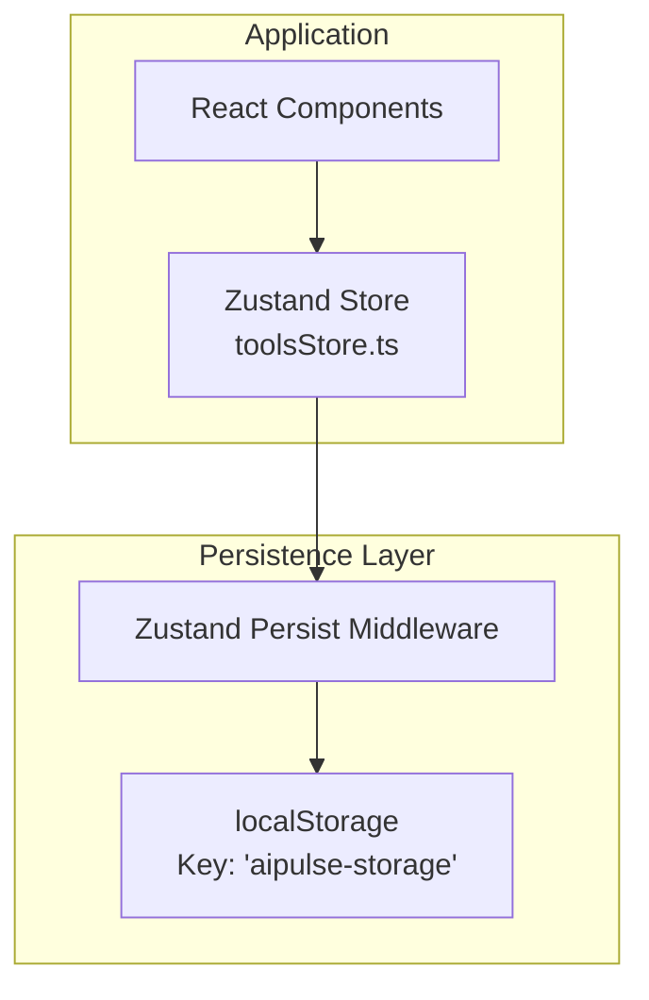
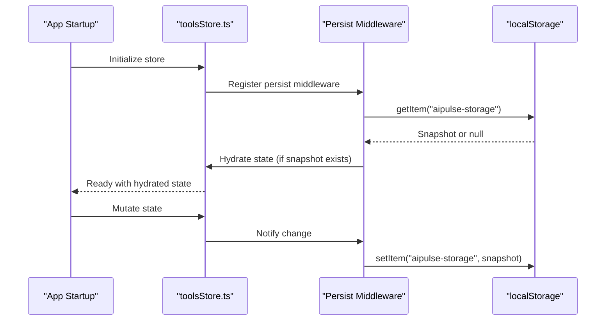
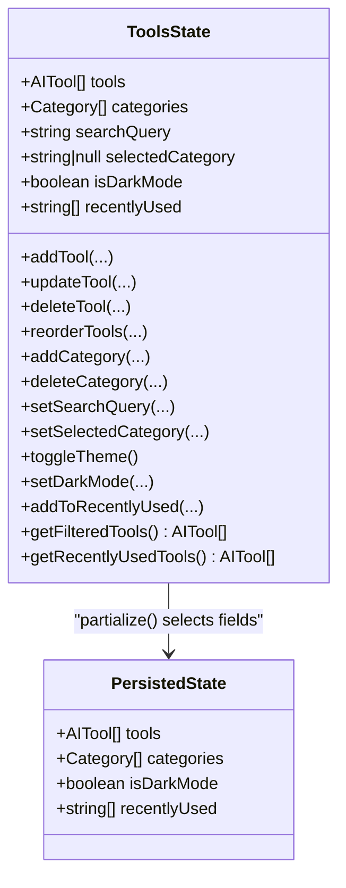
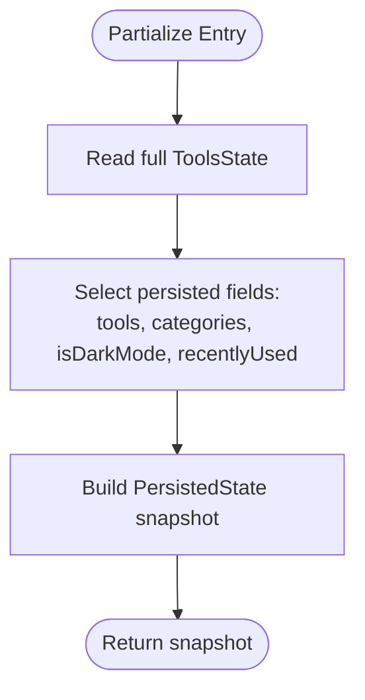
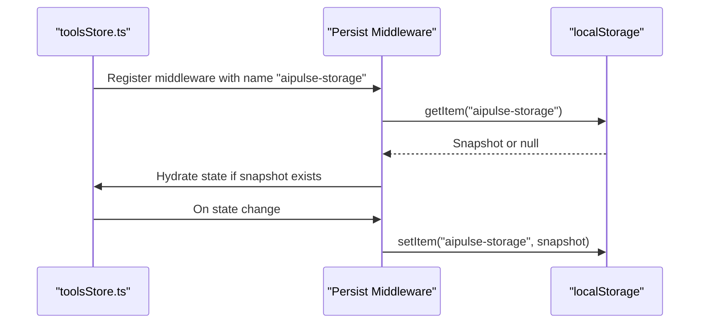
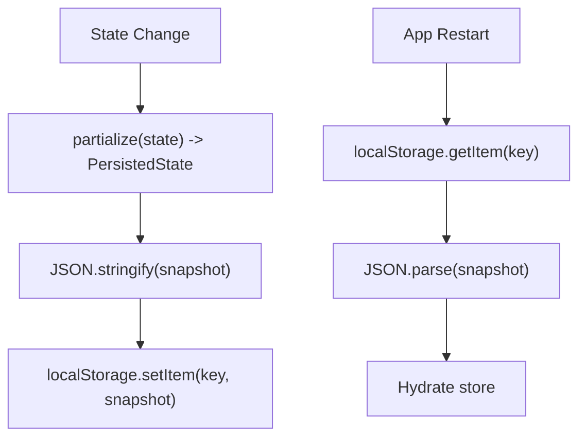
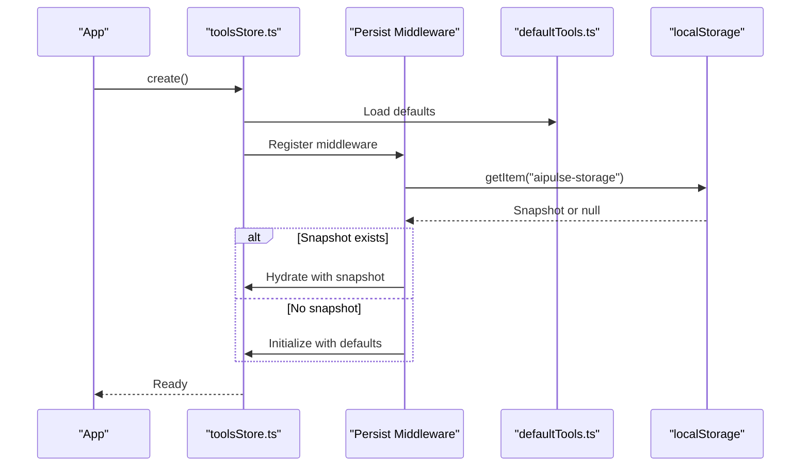
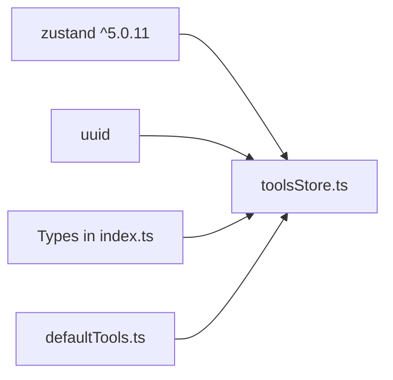

# Persistence Strategy

<cite>
**Referenced Files in This Document**
- [toolsStore.ts](file://src/stores/toolsStore.ts)
- [index.ts](file://src/types/index.ts)
- [defaultTools.ts](file://src/constants/defaultTools.ts)
- [main.tsx](file://src/main.tsx)
- [package.json](file://package.json)
</cite>

## Table of Contents
1. [Introduction](#introduction)
2. [Project Structure](#project-structure)
3. [Core Components](#core-components)
4. [Architecture Overview](#architecture-overview)
5. [Detailed Component Analysis](#detailed-component-analysis)
6. [Dependency Analysis](#dependency-analysis)
7. [Performance Considerations](#performance-considerations)
8. [Troubleshooting Guide](#troubleshooting-guide)
9. [Conclusion](#conclusion)

## Introduction
This document explains the Zustand persistence middleware implementation and the data persistence strategy used in the application. It focuses on how state is partitioned, serialized, synchronized with localStorage, hydrated on startup, and protected against common failure modes such as storage quota limits and corrupted data. It also outlines the PersistedState interface mapping, selective persistence approach, and provides guidance for customizing persistence and debugging synchronization issues.

## Project Structure
The persistence strategy is encapsulated within a single Zustand store that manages AI tools, categories, theme, and recently used items. The store is configured with the persist middleware to synchronize state to localStorage under a specific storage key. Defaults are provided by constants and types to ensure robust initialization and type safety.

**Diagram sources**
- [toolsStore.ts](file://src/stores/toolsStore.ts#L14-L176)
- [main.tsx](file://src/main.tsx#L1-L11)

**Section sources**
- [toolsStore.ts](file://src/stores/toolsStore.ts#L1-L177)
- [main.tsx](file://src/main.tsx#L1-L11)

## Core Components
- Zustand store with persist middleware: The store is created using Zustand’s factory and wrapped with the persist middleware. It defines initial state, actions, and selectors, and exposes a typed interface for consumers.
- PersistedState interface: A dedicated interface captures only the state fields that should be persisted, enabling selective persistence and explicit control over serialization.
- Storage key: The middleware is configured with a storage key “aipulse-storage” to namespace persisted data in localStorage.
- Partialize function: A partialize function selects which parts of the full state are persisted, aligning with the PersistedState interface.
- Automatic synchronization: The persist middleware automatically writes changes to localStorage and hydrates state on startup.

**Section sources**
- [toolsStore.ts](file://src/stores/toolsStore.ts#L7-L12)
- [toolsStore.ts](file://src/stores/toolsStore.ts#L14-L176)

## Architecture Overview
The persistence architecture integrates Zustand’s persist middleware with localStorage. On application startup, the middleware reads the stored snapshot and hydrates the store. Subsequent state changes are automatically written to localStorage. The PersistedState interface and partialize function ensure only intended fields are persisted.

**Diagram sources**
- [toolsStore.ts](file://src/stores/toolsStore.ts#L14-L176)

## Detailed Component Analysis

### PersistedState Interface and Selective Persistence
- Purpose: The PersistedState interface defines the subset of state fields that are persisted. This enables selective persistence and ensures only necessary data is stored.
- Fields included: tools, categories, isDarkMode, and recentlyUsed.
- Mapping: The partialize function transforms the full ToolsState into PersistedState, ensuring only the listed fields are serialized and stored.

**Diagram sources**
- [index.ts](file://src/types/index.ts#L19-L51)
- [toolsStore.ts](file://src/stores/toolsStore.ts#L7-L12)
- [toolsStore.ts](file://src/stores/toolsStore.ts#L166-L173)

**Section sources**
- [index.ts](file://src/types/index.ts#L19-L51)
- [toolsStore.ts](file://src/stores/toolsStore.ts#L7-L12)
- [toolsStore.ts](file://src/stores/toolsStore.ts#L166-L173)

### State Partitioning with Partialize
- Implementation: The partialize function receives the full ToolsState and returns a PersistedState object containing only the persisted fields.
- Effect: This ensures that transient or derived fields (e.g., searchQuery, selectedCategory) are not persisted, reducing storage footprint and avoiding stale state.

**Diagram sources**
- [toolsStore.ts](file://src/stores/toolsStore.ts#L166-L173)

**Section sources**
- [toolsStore.ts](file://src/stores/toolsStore.ts#L166-L173)

### Automatic Synchronization with localStorage
- Hydration on startup: The middleware reads the stored snapshot keyed by “aipulse-storage” and hydrates the store upon initialization.
- Continuous sync: Changes made to the persisted fields are automatically serialized and written to localStorage.
- Storage key: The middleware is configured with name: "aipulse-storage".

**Diagram sources**
- [toolsStore.ts](file://src/stores/toolsStore.ts#L14-L176)

**Section sources**
- [toolsStore.ts](file://src/stores/toolsStore.ts#L14-L176)

### State Serialization and Deserialization
- Serialization: The middleware serializes the PersistedState snapshot using JSON.stringify before storing it in localStorage.
- Deserialization: On hydration, the middleware parses the stored JSON and restores the state into the store.
- Transformation: The partialize function acts as a transformer to include only persisted fields during serialization.

**Diagram sources**
- [toolsStore.ts](file://src/stores/toolsStore.ts#L166-L173)
- [toolsStore.ts](file://src/stores/toolsStore.ts#L14-L176)

**Section sources**
- [toolsStore.ts](file://src/stores/toolsStore.ts#L166-L173)
- [toolsStore.ts](file://src/stores/toolsStore.ts#L14-L176)

### State Hydration on Application Startup
- Hydration behavior: On store creation, the middleware attempts to read the snapshot from localStorage and hydrate the store. If no snapshot exists, the store initializes with defaults.
- Defaults: Initial state values are provided by defaultTools and defaultCategories constants, ensuring predictable behavior when no persisted data is present.

**Diagram sources**
- [toolsStore.ts](file://src/stores/toolsStore.ts#L14-L176)
- [defaultTools.ts](file://src/constants/defaultTools.ts#L1-L101)

**Section sources**
- [toolsStore.ts](file://src/stores/toolsStore.ts#L14-L176)
- [defaultTools.ts](file://src/constants/defaultTools.ts#L1-L101)

### Initial State Fallback Mechanisms
- Default values: The store initializes with defaultTools and defaultCategories, ensuring the UI remains functional even if localStorage is empty or inaccessible.
- Fallback behavior: If hydration fails or returns null, the store falls back to default initial state.

**Section sources**
- [toolsStore.ts](file://src/stores/toolsStore.ts#L18-L23)
- [defaultTools.ts](file://src/constants/defaultTools.ts#L1-L101)

### Data Migration Strategies
- Versioning: The persist middleware does not provide built-in versioning. To migrate data in the future, consider:
  - Introducing a version field in the persisted snapshot.
  - Adding a migration function invoked during hydration to transform older snapshots into the current schema.
  - Using a separate migration step before hydration to update stored data.
- Backward compatibility: Keep the PersistedState interface minimal and additive to reduce breaking changes.

[No sources needed since this section provides general guidance]

### Error Handling for localStorage Operations
- Storage quota exceeded: Writing to localStorage may fail if the quota is exceeded. The persist middleware does not expose explicit error callbacks in this codebase. To handle this scenario:
  - Wrap localStorage.setItem in a try/catch and log errors.
  - Optionally disable persistence temporarily or clear non-essential entries.
- Corrupted data: If the stored snapshot is malformed, hydration may fail. To recover:
  - Validate the snapshot shape before hydration.
  - Provide a fallback to defaults if parsing fails.
  - Consider adding a backup snapshot or checksum to detect corruption.

[No sources needed since this section provides general guidance]

### Custom Persistence Configurations
- Custom storage key: Change the name field in the persist options to use a different key.
- Custom partialize: Adjust the partialize function to include or exclude additional fields.
- Custom storage backend: Replace localStorage with a custom StateStorage implementation if needed.

**Section sources**
- [toolsStore.ts](file://src/stores/toolsStore.ts#L166-L173)

### Debugging Techniques for State Synchronization Issues
- Enable logging: Temporarily log snapshot keys and sizes to monitor storage usage.
- Inspect localStorage: Use browser dev tools to inspect the “aipulse-storage” key and verify its contents.
- Verify hydration: Confirm that the store hydrates correctly on startup by checking initial state values.
- Test partialize: Ensure only intended fields are persisted by comparing the snapshot with the PersistedState interface.

[No sources needed since this section provides general guidance]

## Dependency Analysis
- Zustand version: The project depends on zustand ^5.0.11, which includes the persist middleware.
- Dependencies: The store relies on uuid for generating tool IDs and types for type safety.

**Diagram sources**
- [package.json](file://package.json#L22-L35)
- [toolsStore.ts](file://src/stores/toolsStore.ts#L1-L6)

**Section sources**
- [package.json](file://package.json#L22-L35)
- [toolsStore.ts](file://src/stores/toolsStore.ts#L1-L6)

## Performance Considerations
- Storage footprint: Persisting large arrays (e.g., tools, categories) increases localStorage usage. Consider limiting array sizes or deferring heavy fields.
- Serialization overhead: Frequent writes can impact performance. The middleware minimizes writes by batching changes, but avoid unnecessary state churn.
- Hydration cost: Large snapshots can slow down startup. Consider lazy hydration for non-critical data.

[No sources needed since this section provides general guidance]

## Troubleshooting Guide
- State not persisting:
  - Verify the storage key “aipulse-storage” exists in localStorage.
  - Ensure the store is created with the persist middleware and partialize is defined.
- State not hydrating:
  - Check that the snapshot is valid JSON and matches the PersistedState structure.
  - Confirm defaults are loaded when no snapshot is present.
- Storage quota exceeded:
  - Reduce persisted data or clear non-essential entries.
  - Consider migrating to IndexedDB for larger datasets.

[No sources needed since this section provides general guidance]

## Conclusion
The application uses Zustand’s persist middleware to selectively persist a curated subset of state to localStorage under the key “aipulse-storage.” The PersistedState interface and partialize function ensure controlled serialization, while defaults guarantee robust initialization. The middleware handles automatic hydration and synchronization. For production hardening, consider adding versioning, migration steps, and explicit error handling around localStorage operations.