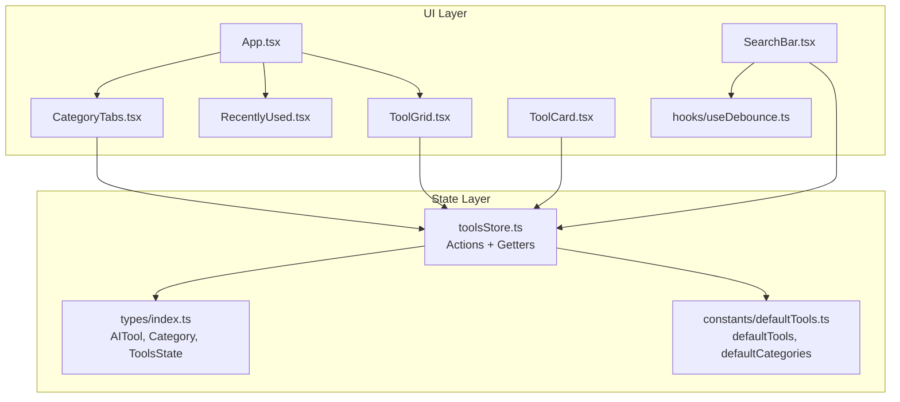
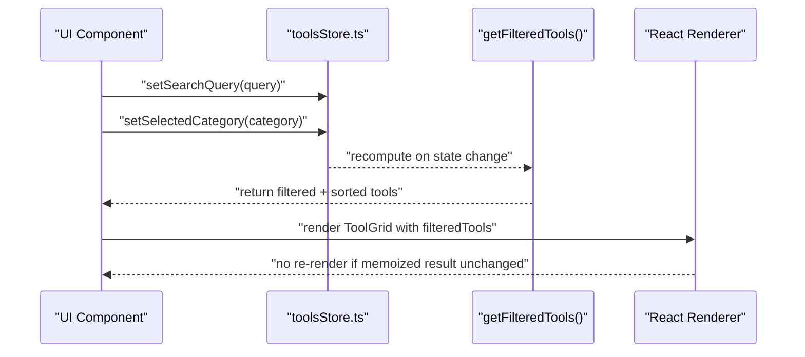
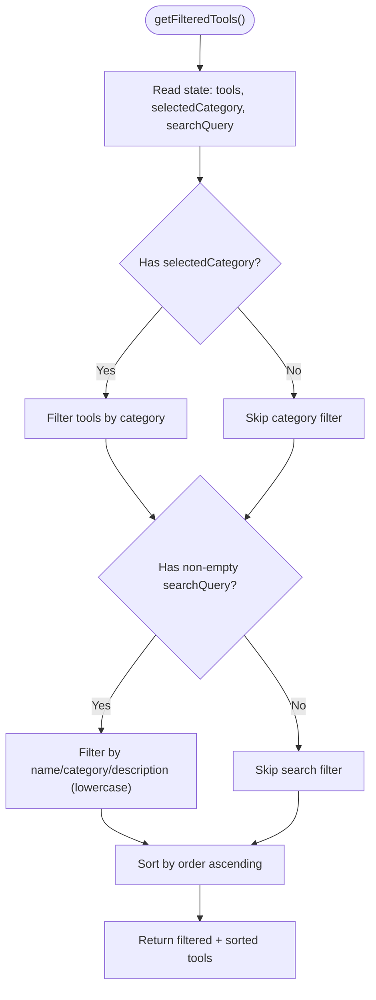
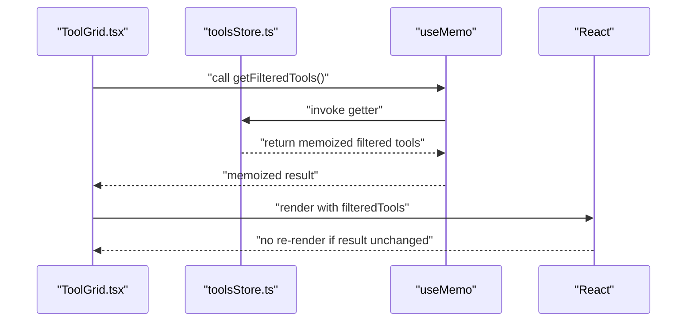
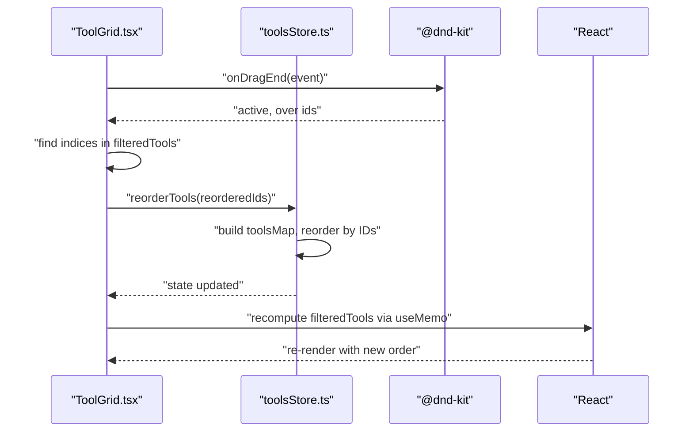
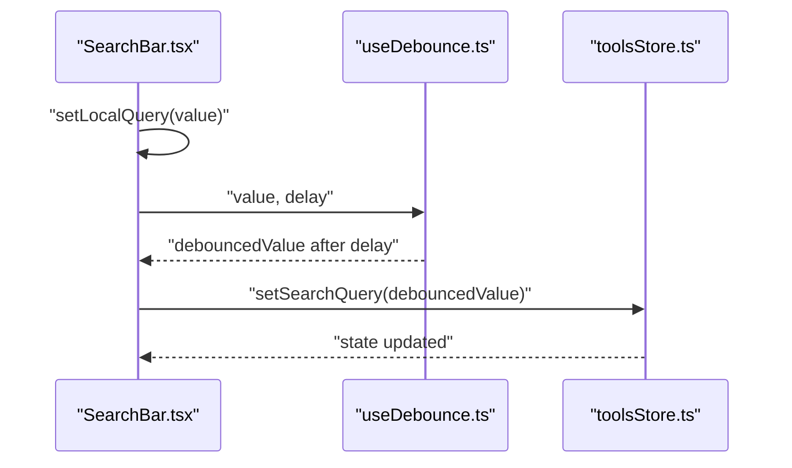
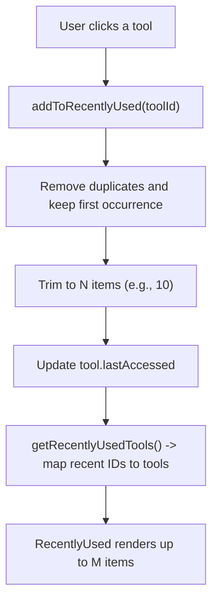
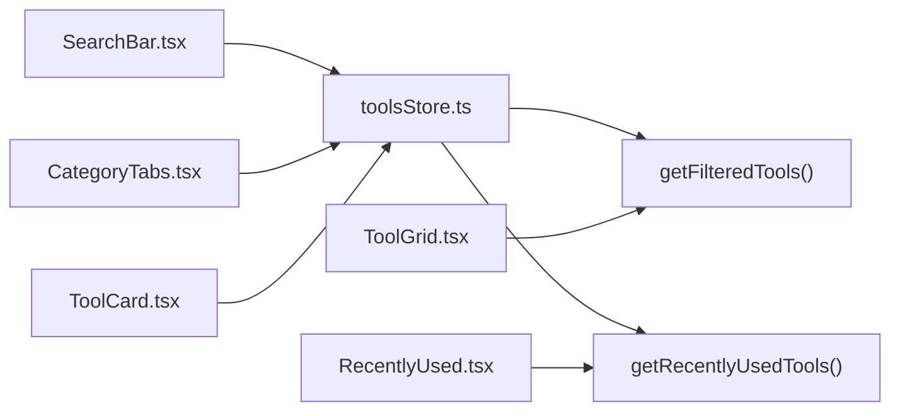

# Selectors & Performance

<cite>
**Referenced Files in This Document**
- [toolsStore.ts](file://src/stores/toolsStore.ts)
- [useDebounce.ts](file://src/hooks/useDebounce.ts)
- [ToolGrid.tsx](file://src/components/features/ToolGrid.tsx)
- [SearchBar.tsx](file://src/components/features/SearchBar.tsx)
- [RecentlyUsed.tsx](file://src/components/features/RecentlyUsed.tsx)
- [CategoryTabs.tsx](file://src/components/features/CategoryTabs.tsx)
- [ToolCard.tsx](file://src/components/features/ToolCard.tsx)
- [App.tsx](file://src/App.tsx)
- [index.ts](file://src/types/index.ts)
- [defaultTools.ts](file://src/constants/defaultTools.ts)
</cite>

## Table of Contents
1. [Introduction](#introduction)
2. [Project Structure](#project-structure)
3. [Core Components](#core-components)
4. [Architecture Overview](#architecture-overview)
5. [Detailed Component Analysis](#detailed-component-analysis)
6. [Dependency Analysis](#dependency-analysis)
7. [Performance Considerations](#performance-considerations)
8. [Troubleshooting Guide](#troubleshooting-guide)
9. [Conclusion](#conclusion)
10. [Appendices](#appendices)

## Introduction
This document focuses on state selectors and performance optimization techniques in AIPulse. It explains the getter patterns for filtering and sorting tools, recent usage tracking, and how selectors are implemented with memoization and derived computations. It also covers optimization strategies for drag-and-drop reordering, search debouncing, and minimizing component re-renders. Finally, it provides best practices for state subscriptions, selector composition, and profiling techniques to identify and resolve performance bottlenecks.

## Project Structure
AIPulse organizes state and UI features around a central Zustand store. Filtering and sorting logic live in the store getters, while UI components subscribe selectively to minimize re-renders. Debouncing is used for search input to reduce store updates. Drag-and-drop reordering is handled efficiently by updating indices and re-querying filtered results.

**Diagram sources**
- [toolsStore.ts](file://src/stores/toolsStore.ts#L1-L177)
- [index.ts](file://src/types/index.ts#L1-L60)
- [defaultTools.ts](file://src/constants/defaultTools.ts#L1-L101)
- [App.tsx](file://src/App.tsx#L1-L122)
- [CategoryTabs.tsx](file://src/components/features/CategoryTabs.tsx#L1-L106)
- [SearchBar.tsx](file://src/components/features/SearchBar.tsx#L1-L42)
- [RecentlyUsed.tsx](file://src/components/features/RecentlyUsed.tsx#L1-L101)
- [ToolGrid.tsx](file://src/components/features/ToolGrid.tsx#L1-L112)
- [ToolCard.tsx](file://src/components/features/ToolCard.tsx#L1-L141)
- [useDebounce.ts](file://src/hooks/useDebounce.ts#L1-L18)

**Section sources**
- [toolsStore.ts](file://src/stores/toolsStore.ts#L1-L177)
- [index.ts](file://src/types/index.ts#L1-L60)
- [defaultTools.ts](file://src/constants/defaultTools.ts#L1-L101)
- [App.tsx](file://src/App.tsx#L1-L122)

## Core Components
- State store with getters for derived computations:
  - getFilteredTools(): filters by category and search query, sorts by order.
  - getRecentlyUsedTools(): resolves recent IDs to tool objects.
- UI components subscribing to specific slices:
  - ToolGrid subscribes to filtered tools and drag-end events.
  - SearchBar debounces input before updating the store.
  - CategoryTabs subscribes to categories and selected category.
  - RecentlyUsed subscribes to recent tools and adds to recently used.
- Drag-and-drop reordering updates indices and re-queries filtered tools.

Key selector patterns:
- Computed getters encapsulate filtering and sorting logic.
- Memoized selectors prevent recomputation when inputs are unchanged.
- Derived state avoids duplicating computed arrays across components.

**Section sources**
- [toolsStore.ts](file://src/stores/toolsStore.ts#L131-L164)
- [ToolGrid.tsx](file://src/components/features/ToolGrid.tsx#L31-L33)
- [SearchBar.tsx](file://src/components/features/SearchBar.tsx#L6-L18)
- [CategoryTabs.tsx](file://src/components/features/CategoryTabs.tsx#L5-L19)
- [RecentlyUsed.tsx](file://src/components/features/RecentlyUsed.tsx#L13-L23)

## Architecture Overview
The system follows a unidirectional data flow:
- UI triggers actions (e.g., setSearchQuery, setSelectedCategory, reorderTools).
- Store updates state immutably.
- Components subscribe to derived selections (getFilteredTools, getRecentlyUsedTools).
- Memoization ensures derived results are reused until inputs change.

**Diagram sources**
- [toolsStore.ts](file://src/stores/toolsStore.ts#L94-L101)
- [toolsStore.ts](file://src/stores/toolsStore.ts#L131-L156)
- [ToolGrid.tsx](file://src/components/features/ToolGrid.tsx#L31-L33)

## Detailed Component Analysis

### Selector Implementation Strategies
- getFilteredTools():
  - Filters by selected category when present.
  - Applies case-insensitive substring search across name, category, and description.
  - Sorts by order to preserve manual ordering.
- getRecentlyUsedTools():
  - Resolves recent IDs to tool objects using a tools map.
  - Returns up to the first N items in recency order.

**Diagram sources**
- [toolsStore.ts](file://src/stores/toolsStore.ts#L131-L156)

**Section sources**
- [toolsStore.ts](file://src/stores/toolsStore.ts#L131-L156)

### Memoization Patterns
- ToolGrid uses useMemo to compute filtered tools once per render cycle, preventing repeated recomputation when unrelated props change.
- Dependencies include getFilteredTools, tools, searchQuery, and selectedCategory to ensure correctness.

**Diagram sources**
- [ToolGrid.tsx](file://src/components/features/ToolGrid.tsx#L31-L33)
- [toolsStore.ts](file://src/stores/toolsStore.ts#L131-L156)

**Section sources**
- [ToolGrid.tsx](file://src/components/features/ToolGrid.tsx#L31-L33)

### Efficient Filtering Algorithms
- getFilteredTools() performs two passes:
  - Single pass filter by category.
  - Single pass filter by search query with substring checks.
- Sorting is performed once after filtering, leveraging native sort stability and numeric comparison.
- Complexity:
  - Filtering: O(n) per condition.
  - Sorting: O(k log k) where k is filtered count.
  - Overall: O(n + k log k).

**Section sources**
- [toolsStore.ts](file://src/stores/toolsStore.ts#L131-L156)

### Drag-and-Drop Reordering Optimization
- On drag end, ToolGrid computes a new order by mapping filtered tools to their new positions and calls reorderTools with IDs.
- reorderTools:
  - Builds a map of tools by ID for O(1) lookup.
  - Produces a reordered list preserving order properties.
  - Appends any tools not included in the drag operation.
- This approach minimizes re-computation by updating indices once and letting subsequent renders rely on memoized filtered results.

**Diagram sources**
- [ToolGrid.tsx](file://src/components/features/ToolGrid.tsx#L46-L56)
- [toolsStore.ts](file://src/stores/toolsStore.ts#L53-L75)

**Section sources**
- [ToolGrid.tsx](file://src/components/features/ToolGrid.tsx#L46-L56)
- [toolsStore.ts](file://src/stores/toolsStore.ts#L53-L75)

### Search Debouncing
- SearchBar maintains a local query state and debounces it with a 300ms delay.
- On each debounced value change, setSearchQuery is invoked to update the store.
- This reduces the number of store updates and derived computations during typing.

**Diagram sources**
- [SearchBar.tsx](file://src/components/features/SearchBar.tsx#L6-L18)
- [useDebounce.ts](file://src/hooks/useDebounce.ts#L1-L18)
- [toolsStore.ts](file://src/stores/toolsStore.ts#L94-L97)

**Section sources**
- [SearchBar.tsx](file://src/components/features/SearchBar.tsx#L6-L18)
- [useDebounce.ts](file://src/hooks/useDebounce.ts#L1-L18)
- [toolsStore.ts](file://src/stores/toolsStore.ts#L94-L97)

### Recent Usage Tracking
- getRecentlyUsedTools() resolves recent IDs to tools using a map built from the tools array.
- addToRecentlyUsed() prepends the clicked tool ID and trims to a fixed-size history, while updating lastAccessed timestamps.
- RecentlyUsed displays a collapsible list of recent tools and opens links in a new tab.

**Diagram sources**
- [toolsStore.ts](file://src/stores/toolsStore.ts#L112-L129)
- [toolsStore.ts](file://src/stores/toolsStore.ts#L158-L164)
- [RecentlyUsed.tsx](file://src/components/features/RecentlyUsed.tsx#L13-L23)

**Section sources**
- [toolsStore.ts](file://src/stores/toolsStore.ts#L112-L129)
- [toolsStore.ts](file://src/stores/toolsStore.ts#L158-L164)
- [RecentlyUsed.tsx](file://src/components/features/RecentlyUsed.tsx#L13-L23)

### State Derivation Techniques and Computed Properties
- Derived computations are centralized in getters:
  - getFilteredTools(): category + search + sort.
  - getRecentlyUsedTools(): map recent IDs to tools.
- Components subscribe to minimal state slices:
  - ToolGrid subscribes to filtered tools and drag handlers.
  - SearchBar subscribes to setSearchQuery and local state.
  - CategoryTabs subscribes to categories and selected category.
- This reduces re-renders because only components depending on specific getters recompute.

**Section sources**
- [toolsStore.ts](file://src/stores/toolsStore.ts#L131-L164)
- [ToolGrid.tsx](file://src/components/features/ToolGrid.tsx#L31-L33)
- [SearchBar.tsx](file://src/components/features/SearchBar.tsx#L6-L18)
- [CategoryTabs.tsx](file://src/components/features/CategoryTabs.tsx#L5-L19)

## Dependency Analysis
- Store getters depend on:
  - tools array.
  - selectedCategory and searchQuery for filtering.
  - recentlyUsed array for recency.
- UI components depend on:
  - Store actions for mutations.
  - Store getters for derived selections.
- External libraries:
  - @dnd-kit for drag-and-drop.
  - framer-motion for animations.
  - lucide-react for icons.

**Diagram sources**
- [toolsStore.ts](file://src/stores/toolsStore.ts#L131-L164)
- [ToolGrid.tsx](file://src/components/features/ToolGrid.tsx#L31-L33)
- [SearchBar.tsx](file://src/components/features/SearchBar.tsx#L6-L18)
- [CategoryTabs.tsx](file://src/components/features/CategoryTabs.tsx#L5-L19)
- [RecentlyUsed.tsx](file://src/components/features/RecentlyUsed.tsx#L13-L23)
- [ToolCard.tsx](file://src/components/features/ToolCard.tsx#L18-L29)

**Section sources**
- [toolsStore.ts](file://src/stores/toolsStore.ts#L131-L164)
- [ToolGrid.tsx](file://src/components/features/ToolGrid.tsx#L31-L33)
- [SearchBar.tsx](file://src/components/features/SearchBar.tsx#L6-L18)
- [CategoryTabs.tsx](file://src/components/features/CategoryTabs.tsx#L5-L19)
- [RecentlyUsed.tsx](file://src/components/features/RecentlyUsed.tsx#L13-L23)
- [ToolCard.tsx](file://src/components/features/ToolCard.tsx#L18-L29)

## Performance Considerations
- Memoization:
  - Use useMemo for derived arrays to avoid re-creating lists on every render.
  - Ensure dependencies include all inputs that affect the result (e.g., tools, searchQuery, selectedCategory).
- Filtering:
  - Keep filters simple and early-exit when conditions are absent.
  - Use substring checks with lowercase normalization for readability and performance.
- Sorting:
  - Sort once after filtering; avoid repeated sorts.
  - Prefer numeric comparisons for order fields.
- Drag-and-drop:
  - Update indices in batch (reorderTools) to minimize intermediate recomputations.
  - Compute new order from filtered list to avoid stale indices.
- Debouncing:
  - Use a moderate debounce delay (e.g., 300ms) to balance responsiveness and performance.
- Component re-renders:
  - Subscribe to narrow slices of state to limit re-renders.
  - Use shallow equality checks for props to avoid unnecessary updates.
- Large datasets:
  - Consider pagination or virtualization for long lists.
  - Cache frequently accessed subsets (e.g., per-category lists) if needed.
- Animations:
  - Keep animation durations reasonable; excessive delays can feel sluggish.
- Storage persistence:
  - Persist only necessary fields to reduce serialization overhead.

[No sources needed since this section provides general guidance]

## Troubleshooting Guide
Common issues and remedies:
- Excessive re-renders:
  - Verify useMemo dependencies include all inputs (tools, searchQuery, selectedCategory).
  - Ensure components subscribe to minimal state slices.
- Slow filtering:
  - Confirm search query trimming and lowercase normalization are applied.
  - Avoid expensive regex operations; stick to substring checks.
- Drag-and-drop glitches:
  - Ensure reorderTools updates indices consistently and appends missing tools.
  - Recompute filteredTools after reorder to reflect new order.
- Debounce not taking effect:
  - Check debounce delay and useEffect cleanup.
  - Ensure setSearchQuery is called only on debounced value changes.
- Recently used not updating:
  - Confirm addToRecentlyUsed is triggered on click and deduplicates IDs.
  - Verify getRecentlyUsedTools() uses a tools map for fast resolution.

**Section sources**
- [ToolGrid.tsx](file://src/components/features/ToolGrid.tsx#L31-L33)
- [toolsStore.ts](file://src/stores/toolsStore.ts#L94-L97)
- [toolsStore.ts](file://src/stores/toolsStore.ts#L112-L129)
- [toolsStore.ts](file://src/stores/toolsStore.ts#L158-L164)
- [useDebounce.ts](file://src/hooks/useDebounce.ts#L1-L18)

## Conclusion
AIPulse employs a clean separation of concerns: state mutations occur in the store, while derived computations are encapsulated in getters. Components subscribe to narrow slices and leverage memoization to minimize re-renders. Optimizations include debounced search updates, efficient filtering and sorting, and batched drag-and-drop reordering. Following the best practices outlined here will help maintain smooth interactions and predictable performance as the dataset grows.

[No sources needed since this section summarizes without analyzing specific files]

## Appendices

### Best Practices Checklist
- Encapsulate derived logic in getters; avoid duplicating computations in components.
- Use useMemo with precise dependencies for derived arrays.
- Debounce user input before updating store state.
- Batch state updates (e.g., reorderTools) to reduce intermediate recomputations.
- Keep filters simple and early-exit when conditions are absent.
- Subscribe to minimal state slices to reduce re-renders.
- Profile rendering and store updates to identify hotspots.

[No sources needed since this section provides general guidance]