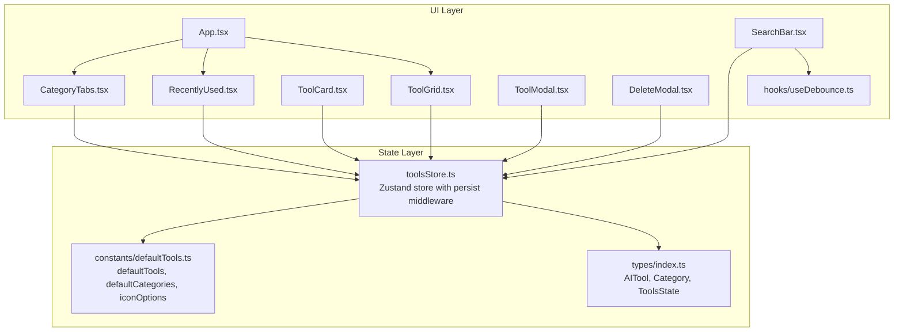
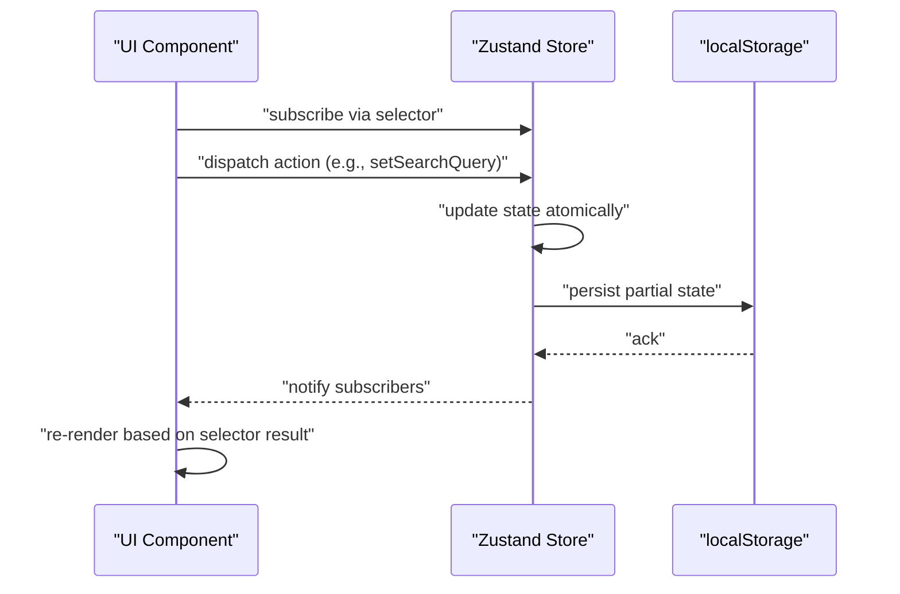
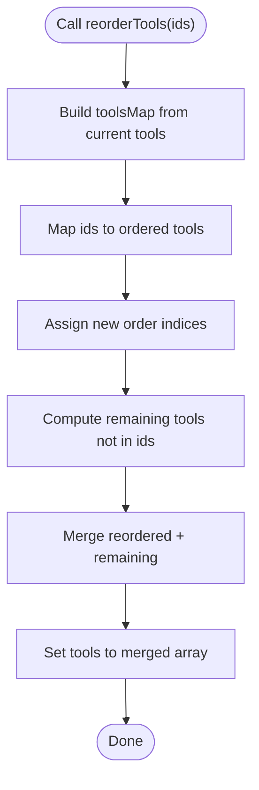
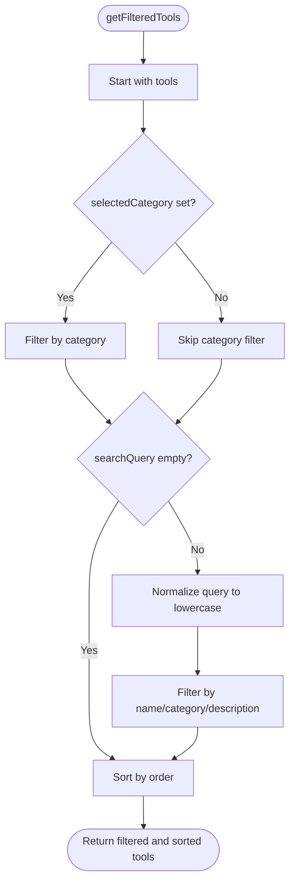
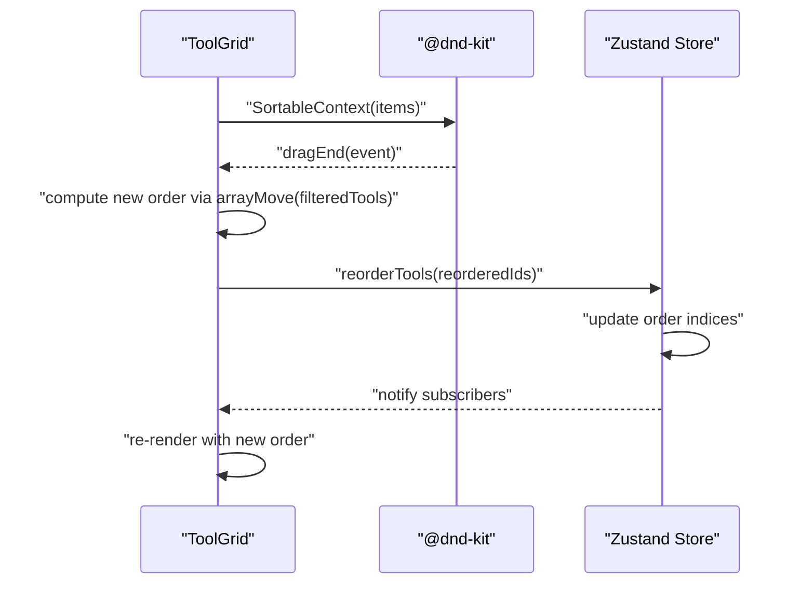
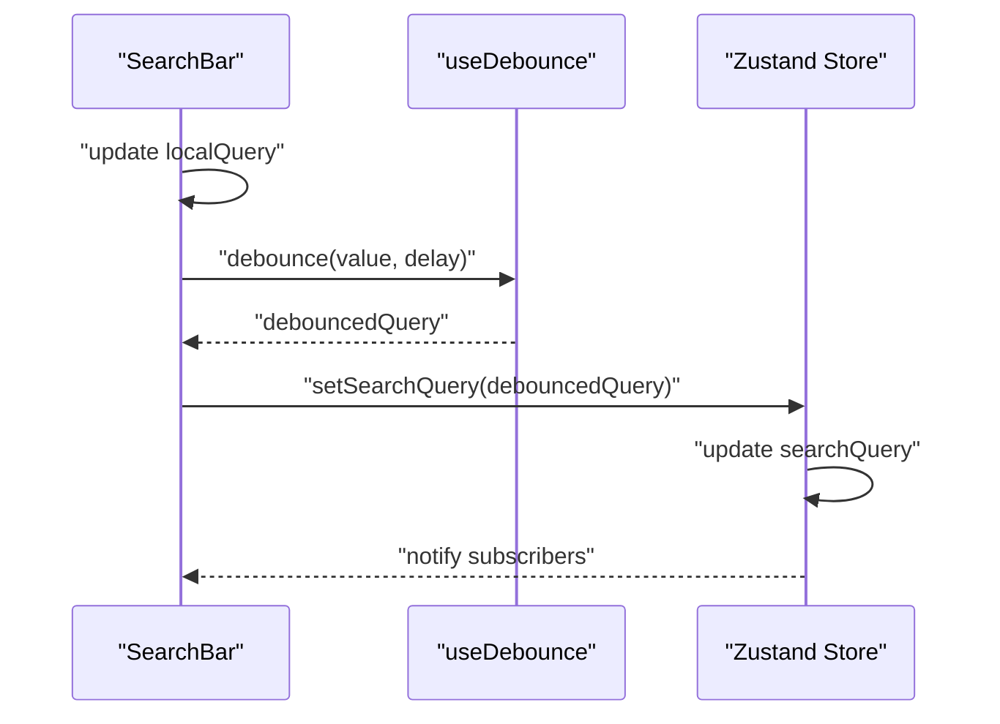
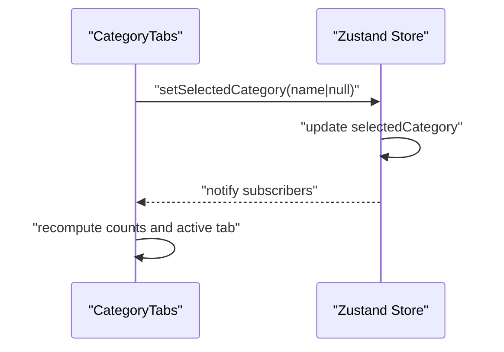
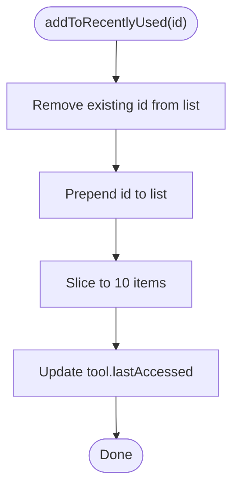
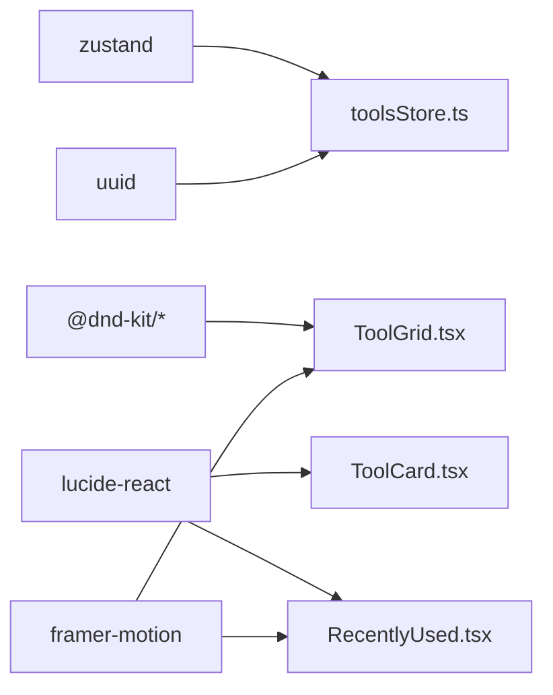

# State Management

<cite>
**Referenced Files in This Document**
- [toolsStore.ts](file://src/stores/toolsStore.ts)
- [index.ts](file://src/types/index.ts)
- [defaultTools.ts](file://src/constants/defaultTools.ts)
- [App.tsx](file://src/App.tsx)
- [ToolGrid.tsx](file://src/components/features/ToolGrid.tsx)
- [ToolCard.tsx](file://src/components/features/ToolCard.tsx)
- [SearchBar.tsx](file://src/components/features/SearchBar.tsx)
- [CategoryTabs.tsx](file://src/components/features/CategoryTabs.tsx)
- [RecentlyUsed.tsx](file://src/components/features/RecentlyUsed.tsx)
- [ToolModal.tsx](file://src/components/modals/ToolModal.tsx)
- [DeleteModal.tsx](file://src/components/modals/DeleteModal.tsx)
- [useDebounce.ts](file://src/hooks/useDebounce.ts)
- [package.json](file://package.json)
</cite>

## Table of Contents
1. [Introduction](#introduction)
2. [Project Structure](#project-structure)
3. [Core Components](#core-components)
4. [Architecture Overview](#architecture-overview)
5. [Detailed Component Analysis](#detailed-component-analysis)
6. [Dependency Analysis](#dependency-analysis)
7. [Performance Considerations](#performance-considerations)
8. [Troubleshooting Guide](#troubleshooting-guide)
9. [Conclusion](#conclusion)

## Introduction
This document explains the state management architecture of AIPulse built with Zustand. It focuses on the toolsStore.ts implementation, the ToolsState interface, CRUD operations, filtering and ordering logic, drag-and-drop reordering, and persistence via localStorage. It also covers selector patterns for efficient re-renders, subscription strategies, and practical examples of common state operations. Finally, it outlines error handling, validation, and recovery mechanisms for corrupted data.

## Project Structure
The state management is centralized in a single Zustand store with supporting types, defaults, and UI components that subscribe to and mutate the store.

**Diagram sources**
- [toolsStore.ts](file://src/stores/toolsStore.ts#L1-L177)
- [index.ts](file://src/types/index.ts#L1-L60)
- [defaultTools.ts](file://src/constants/defaultTools.ts#L1-L101)
- [App.tsx](file://src/App.tsx#L1-L122)
- [CategoryTabs.tsx](file://src/components/features/CategoryTabs.tsx#L1-L106)
- [SearchBar.tsx](file://src/components/features/SearchBar.tsx#L1-L42)
- [ToolGrid.tsx](file://src/components/features/ToolGrid.tsx#L1-L112)
- [ToolCard.tsx](file://src/components/features/ToolCard.tsx#L1-L141)
- [RecentlyUsed.tsx](file://src/components/features/RecentlyUsed.tsx#L1-L101)
- [ToolModal.tsx](file://src/components/modals/ToolModal.tsx#L1-L253)
- [DeleteModal.tsx](file://src/components/modals/DeleteModal.tsx#L1-L67)
- [useDebounce.ts](file://src/hooks/useDebounce.ts#L1-L18)

**Section sources**
- [toolsStore.ts](file://src/stores/toolsStore.ts#L1-L177)
- [index.ts](file://src/types/index.ts#L1-L60)
- [defaultTools.ts](file://src/constants/defaultTools.ts#L1-L101)
- [App.tsx](file://src/App.tsx#L1-L122)

## Core Components
- Zustand store with persist middleware: Provides state shape, actions, getters, and automatic localStorage persistence.
- Types: Define AITool, Category, and ToolsState interfaces for strict typing.
- Defaults: Provide initial categories and tools, plus icon options.
- UI components: Subscribe to the store via selectors, trigger actions, and render derived views.

Key responsibilities:
- State shape: tools[], categories[], searchQuery, selectedCategory, isDarkMode, recentlyUsed[]
- Actions: CRUD for tools and categories, filter controls, theme toggles, recently used tracking, and drag-and-drop reordering.
- Getters: getFilteredTools() and getRecentlyUsedTools() for derived computations.
- Persistence: partialize to localStorage with a consistent key.

**Section sources**
- [toolsStore.ts](file://src/stores/toolsStore.ts#L14-L177)
- [index.ts](file://src/types/index.ts#L19-L51)
- [defaultTools.ts](file://src/constants/defaultTools.ts#L3-L101)

## Architecture Overview
The store is created with Zustand’s create and wrapped with persist middleware. The middleware serializes only a subset of state (PersistedState) to localStorage under a fixed key. Components subscribe to the store using selectors to minimize re-renders.

**Diagram sources**
- [toolsStore.ts](file://src/stores/toolsStore.ts#L14-L177)

## Detailed Component Analysis

### ToolsState and Store Shape
- ToolsState defines the entire state contract: arrays for tools and categories, search and selection filters, theme flag, and recently used identifiers.
- Actions include addTool, updateTool, deleteTool, reorderTools, addCategory, deleteCategory, setSearchQuery, setSelectedCategory, toggleTheme, setDarkMode, addToRecentlyUsed, and two getters for derived lists.

Implementation highlights:
- Atomic updates via set() to ensure immutability and predictable re-renders.
- Derived getters compute filtered and sorted views without duplicating data.
- Order property on tools supports deterministic sorting and drag-and-drop reordering.

**Section sources**
- [index.ts](file://src/types/index.ts#L19-L51)
- [toolsStore.ts](file://src/stores/toolsStore.ts#L14-L177)

### CRUD Operations
- addTool: Generates a unique id, sets creation timestamp, assigns order based on current length, and appends to tools.
- updateTool: Maps over tools to merge updates for the matching id.
- deleteTool: Filters out the tool and removes any references from recentlyUsed.
- reorderTools: Reorders tools by rebuilding a map from ids to tools, applying new indices, and appending any remaining tools unchanged.

**Diagram sources**
- [toolsStore.ts](file://src/stores/toolsStore.ts#L53-L75)

**Section sources**
- [toolsStore.ts](file://src/stores/toolsStore.ts#L26-L75)

### Filtering and Sorting
- Category filtering: If selectedCategory is set, filter tools by category name.
- Search filtering: If searchQuery is non-empty, match against name, category, and optional description (case-insensitive).
- Sorting: Sort by order ascending to maintain user-defined sequence.

**Diagram sources**
- [toolsStore.ts](file://src/stores/toolsStore.ts#L132-L156)

**Section sources**
- [toolsStore.ts](file://src/stores/toolsStore.ts#L94-L156)

### Drag-and-Drop Reordering
- ToolGrid subscribes to getFilteredTools and exposes filtered tools to @dnd-kit.
- On drag end, computes new order using arrayMove on the filtered list and calls reorderTools with the new ids.
- ToolCard integrates with useSortable for drag handles and animations.

**Diagram sources**
- [ToolGrid.tsx](file://src/components/features/ToolGrid.tsx#L30-L56)
- [ToolCard.tsx](file://src/components/features/ToolCard.tsx#L18-L29)
- [toolsStore.ts](file://src/stores/toolsStore.ts#L53-L75)

**Section sources**
- [ToolGrid.tsx](file://src/components/features/ToolGrid.tsx#L30-L56)
- [ToolCard.tsx](file://src/components/features/ToolCard.tsx#L18-L29)
- [toolsStore.ts](file://src/stores/toolsStore.ts#L53-L75)

### Search Functionality
- SearchBar maintains a local input state and debounces updates using useDebounce.
- Debounced value triggers setSearchQuery in the store, which immediately filters tools via getFilteredTools.
- Clear button resets both local and store state.

**Diagram sources**
- [SearchBar.tsx](file://src/components/features/SearchBar.tsx#L6-L18)
- [useDebounce.ts](file://src/hooks/useDebounce.ts#L3-L17)
- [toolsStore.ts](file://src/stores/toolsStore.ts#L95-L97)

**Section sources**
- [SearchBar.tsx](file://src/components/features/SearchBar.tsx#L6-L18)
- [useDebounce.ts](file://src/hooks/useDebounce.ts#L3-L17)
- [toolsStore.ts](file://src/stores/toolsStore.ts#L95-L97)

### Category-Based Filtering
- CategoryTabs displays categories and counts of tools per category.
- Clicking a category toggles selection; clicking again clears selection.
- The store getter getFilteredTools applies category filtering.

**Diagram sources**
- [CategoryTabs.tsx](file://src/components/features/CategoryTabs.tsx#L5-L19)
- [toolsStore.ts](file://src/stores/toolsStore.ts#L99-L101)

**Section sources**
- [CategoryTabs.tsx](file://src/components/features/CategoryTabs.tsx#L5-L19)
- [toolsStore.ts](file://src/stores/toolsStore.ts#L99-L101)

### Recently Used Tracking
- addToRecentlyUsed prepends the tool id and slices to a maximum of 10 entries.
- It also updates the tool’s lastAccessed timestamp.
- getRecentlyUsedTools derives the list by mapping ids to tools.

**Diagram sources**
- [toolsStore.ts](file://src/stores/toolsStore.ts#L113-L129)

**Section sources**
- [toolsStore.ts](file://src/stores/toolsStore.ts#L113-L129)

### Theme and Preferences
- toggleTheme flips isDarkMode.
- setDarkMode forces a specific theme value.
- The App component reads isDarkMode and applies a global class to the document element.

**Section sources**
- [toolsStore.ts](file://src/stores/toolsStore.ts#L104-L110)
- [App.tsx](file://src/App.tsx#L17-L26)

### Modals and Forms
- ToolModal handles add/edit flows, validates form data, and calls addTool or updateTool.
- DeleteModal triggers deleteTool after confirmation.
- Both rely on store actions and categories list.

**Section sources**
- [ToolModal.tsx](file://src/components/modals/ToolModal.tsx#L24-L108)
- [DeleteModal.tsx](file://src/components/modals/DeleteModal.tsx#L13-L28)
- [toolsStore.ts](file://src/stores/toolsStore.ts#L26-L51)

### Persistence and Migration
- Middleware name: aipulse-storage
- partialize selects tools, categories, isDarkMode, and recentlyUsed for persistence.
- No explicit migration function is provided; future migrations can be added to the persist config.

**Section sources**
- [toolsStore.ts](file://src/stores/toolsStore.ts#L166-L175)

## Dependency Analysis
- Zustand: Core state management library.
- @dnd-kit: Drag-and-drop orchestration for reordering.
- uuid: Unique id generation for tools and categories.
- lucide-react: Icons used across components.
- framer-motion: Animations for smooth UX.

**Diagram sources**
- [package.json](file://package.json#L22-L34)
- [toolsStore.ts](file://src/stores/toolsStore.ts#L1-L6)
- [ToolGrid.tsx](file://src/components/features/ToolGrid.tsx#L1-L22)
- [ToolCard.tsx](file://src/components/features/ToolCard.tsx#L1-L9)
- [RecentlyUsed.tsx](file://src/components/features/RecentlyUsed.tsx#L1-L7)

**Section sources**
- [package.json](file://package.json#L22-L34)

## Performance Considerations
- Selector-based subscriptions: Components subscribe to narrow slices via selectors (e.g., getFilteredTools, addToRecentlyUsed) to avoid unnecessary re-renders.
- Memoization: ToolGrid uses useMemo around getFilteredTools to prevent recomputation on each render pass.
- Debounced search: SearchBar uses a debounce hook to reduce frequent store updates during typing.
- Efficient ordering: reorderTools rebuilds a map and updates only order properties, minimizing churn.
- Derived getters: getFilteredTools and getRecentlyUsedTools compute on demand rather than storing duplicates.

Recommendations:
- Keep selectors pure and fast; avoid heavy computations inside them.
- Consider batching related updates if needed, though Zustand’s atomic set already batches within a single dispatch.
- For very large datasets, consider pagination or virtualization in ToolGrid.

**Section sources**
- [ToolGrid.tsx](file://src/components/features/ToolGrid.tsx#L31-L33)
- [SearchBar.tsx](file://src/components/features/SearchBar.tsx#L8-L13)
- [useDebounce.ts](file://src/hooks/useDebounce.ts#L3-L17)
- [toolsStore.ts](file://src/stores/toolsStore.ts#L53-L75)

## Troubleshooting Guide
Common issues and remedies:
- Corrupted or incompatible localStorage data:
  - Symptoms: Unexpected state after reload, missing tools/categories, or invalid ids.
  - Recovery: Remove or rename the localStorage key "aipulse-storage" to reset to defaults. Alternatively, extend the persist config with a migration function to normalize legacy shapes.
- Search not updating:
  - Verify setSearchQuery is called from the debounced value and that getFilteredTools is used for rendering.
- Drag-and-drop not working:
  - Ensure filteredTools is passed to SortableContext and that reorderTools receives ids in the new order.
- Recently used not appearing:
  - Confirm addToRecentlyUsed is invoked on launch and that getRecentlyUsedTools is used to derive the list.

Validation and error handling in the codebase:
- Form validation in ToolModal checks presence of required fields and validates URLs before dispatching add/update.
- DeleteModal confirms deletion before calling deleteTool.

**Section sources**
- [toolsStore.ts](file://src/stores/toolsStore.ts#L166-L175)
- [ToolModal.tsx](file://src/components/modals/ToolModal.tsx#L50-L78)
- [DeleteModal.tsx](file://src/components/modals/DeleteModal.tsx#L17-L28)

## Conclusion
AIPulse employs a clean, scalable Zustand store with a well-defined state shape, robust CRUD and filtering logic, and efficient selectors for reactivity. Persistence is handled via the persist middleware with a focused partialize strategy. The UI components integrate tightly with the store using selectors and memoization, ensuring responsive and performant interactions. Extending the store with migrations and further validations would improve resilience against data corruption and evolving requirements.