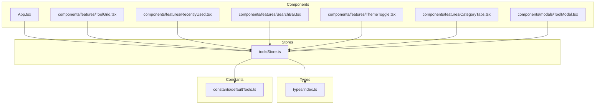
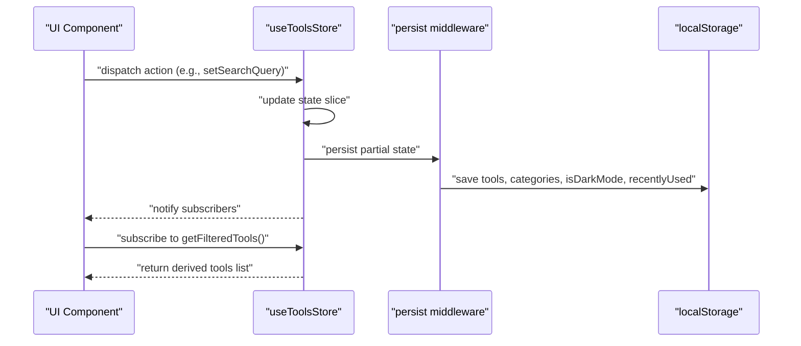
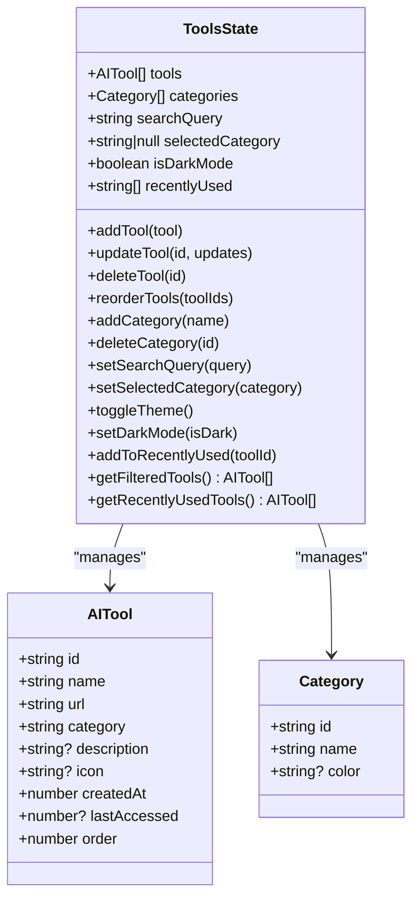
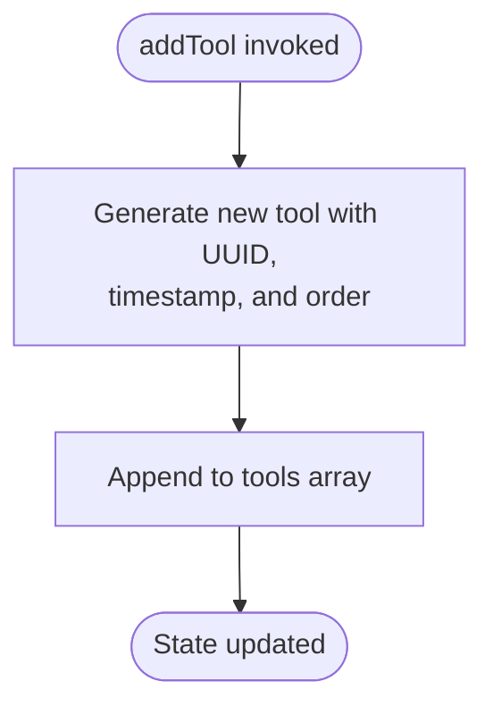
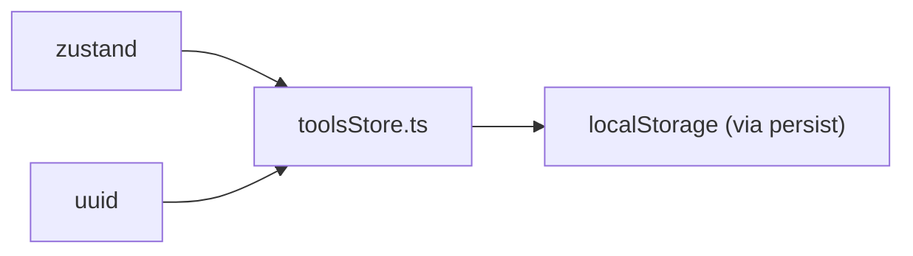

# Store Architecture

<cite>
**Referenced Files in This Document**
- [toolsStore.ts](file://src/stores/toolsStore.ts)
- [index.ts](file://src/types/index.ts)
- [defaultTools.ts](file://src/constants/defaultTools.ts)
- [App.tsx](file://src/App.tsx)
- [ToolGrid.tsx](file://src/components/features/ToolGrid.tsx)
- [RecentlyUsed.tsx](file://src/components/features/RecentlyUsed.tsx)
- [SearchBar.tsx](file://src/components/features/SearchBar.tsx)
- [ThemeToggle.tsx](file://src/components/features/ThemeToggle.tsx)
- [CategoryTabs.tsx](file://src/components/features/CategoryTabs.tsx)
- [ToolModal.tsx](file://src/components/modals/ToolModal.tsx)
- [package.json](file://package.json)
</cite>

## Table of Contents
1. [Introduction](#introduction)
2. [Project Structure](#project-structure)
3. [Core Components](#core-components)
4. [Architecture Overview](#architecture-overview)
5. [Detailed Component Analysis](#detailed-component-analysis)
6. [Dependency Analysis](#dependency-analysis)
7. [Performance Considerations](#performance-considerations)
8. [Troubleshooting Guide](#troubleshooting-guide)
9. [Conclusion](#conclusion)
10. [Appendices](#appendices)

## Introduction
This document explains the Zustand store architecture used in AIPulse. It covers the createStore pattern implementation, the state shape defined by the ToolsState interface, and how action creators are organized. It documents the store initialization with default values, CRUD and filter operations, theme management, and recently used tracking. It also describes the persist middleware configuration, state partitioning strategy, and performance optimization techniques. Finally, it provides usage patterns, action dispatching, and state subscription methods.

## Project Structure
The store is implemented in a dedicated module and consumed by multiple UI components. The store integrates with React components through hooks, enabling reactive updates across the application.

**Diagram sources**
- [toolsStore.ts](file://src/stores/toolsStore.ts#L1-L177)
- [index.ts](file://src/types/index.ts#L1-L60)
- [defaultTools.ts](file://src/constants/defaultTools.ts#L1-L101)
- [App.tsx](file://src/App.tsx#L1-L122)
- [ToolGrid.tsx](file://src/components/features/ToolGrid.tsx#L1-L112)
- [RecentlyUsed.tsx](file://src/components/features/RecentlyUsed.tsx#L1-L101)
- [SearchBar.tsx](file://src/components/features/SearchBar.tsx#L1-L42)
- [ThemeToggle.tsx](file://src/components/features/ThemeToggle.tsx#L1-L43)
- [CategoryTabs.tsx](file://src/components/features/CategoryTabs.tsx#L1-L106)
- [ToolModal.tsx](file://src/components/modals/ToolModal.tsx#L1-L253)

**Section sources**
- [toolsStore.ts](file://src/stores/toolsStore.ts#L1-L177)
- [index.ts](file://src/types/index.ts#L1-L60)
- [defaultTools.ts](file://src/constants/defaultTools.ts#L1-L101)
- [App.tsx](file://src/App.tsx#L1-L122)

## Core Components
- Zustand store with typed state and actions
- ToolsState interface defines the state shape and action signatures
- Default tools and categories loaded at initialization
- Persist middleware configured to save selected parts of state
- Getter functions for derived state computations

Key implementation references:
- Store creation and actions: [toolsStore.ts](file://src/stores/toolsStore.ts#L14-L177)
- State shape and action signatures: [index.ts](file://src/types/index.ts#L19-L51)
- Defaults for tools and categories: [defaultTools.ts](file://src/constants/defaultTools.ts#L3-L73)

**Section sources**
- [toolsStore.ts](file://src/stores/toolsStore.ts#L14-L177)
- [index.ts](file://src/types/index.ts#L19-L51)
- [defaultTools.ts](file://src/constants/defaultTools.ts#L3-L73)

## Architecture Overview
The store uses Zustand’s functional store pattern with a middleware wrapper for persistence. Components subscribe to specific slices of state using selector functions, minimizing re-renders. The store exposes actions for CRUD operations, filtering, theming, and recently used tracking, along with getters for computed views.

**Diagram sources**
- [toolsStore.ts](file://src/stores/toolsStore.ts#L14-L177)
- [SearchBar.tsx](file://src/components/features/SearchBar.tsx#L6-L18)
- [ToolGrid.tsx](file://src/components/features/ToolGrid.tsx#L31-L33)

## Detailed Component Analysis

### ToolsState Interface
Defines the state shape and action signatures. It includes:
- Arrays for tools and categories
- Filters: searchQuery and selectedCategory
- Theme preference: isDarkMode
- Recently used tracking: recentlyUsed
- Actions for CRUD, category management, filters, theme, and recently used
- Getters for filtered tools and recently used tools

Implementation references:
- [index.ts](file://src/types/index.ts#L19-L51)

**Diagram sources**
- [index.ts](file://src/types/index.ts#L1-L51)

**Section sources**
- [index.ts](file://src/types/index.ts#L1-L51)

### Store Initialization and Defaults
The store initializes with:
- Tools array seeded from defaults
- Categories array seeded from defaults
- searchQuery empty string
- selectedCategory null
- isDarkMode true
- recentlyUsed empty array

References:
- [toolsStore.ts](file://src/stores/toolsStore.ts#L18-L23)
- [defaultTools.ts](file://src/constants/defaultTools.ts#L3-L73)

**Section sources**
- [toolsStore.ts](file://src/stores/toolsStore.ts#L18-L23)
- [defaultTools.ts](file://src/constants/defaultTools.ts#L3-L73)

### CRUD Operations
- addTool: generates a new tool with UUID, timestamp, and order, then appends to tools
- updateTool: maps over tools to apply partial updates
- deleteTool: removes tool by ID and clears from recentlyUsed
- reorderTools: reorders tools by provided IDs and updates order properties

References:
- [toolsStore.ts](file://src/stores/toolsStore.ts#L26-L75)

**Diagram sources**
- [toolsStore.ts](file://src/stores/toolsStore.ts#L26-L36)

**Section sources**
- [toolsStore.ts](file://src/stores/toolsStore.ts#L26-L75)

### Category Management
- addCategory: creates a new category with UUID and appends to categories
- deleteCategory: filters out category by ID

References:
- [toolsStore.ts](file://src/stores/toolsStore.ts#L77-L92)

**Section sources**
- [toolsStore.ts](file://src/stores/toolsStore.ts#L77-L92)

### Filter Operations
- setSearchQuery: sets the search query
- setSelectedCategory: sets the selected category or null

References:
- [toolsStore.ts](file://src/stores/toolsStore.ts#L94-L101)

**Section sources**
- [toolsStore.ts](file://src/stores/toolsStore.ts#L94-L101)

### Theme Operations
- toggleTheme: flips isDarkMode
- setDarkMode: sets isDarkMode explicitly

References:
- [toolsStore.ts](file://src/stores/toolsStore.ts#L103-L110)

**Section sources**
- [toolsStore.ts](file://src/stores/toolsStore.ts#L103-L110)

### Recently Used Tracking
- addToRecentlyUsed: prepends toolId to recentlyUsed (limit 10) and updates lastAccessed timestamp

References:
- [toolsStore.ts](file://src/stores/toolsStore.ts#L112-L129)

**Section sources**
- [toolsStore.ts](file://src/stores/toolsStore.ts#L112-L129)

### Derived State Getters
- getFilteredTools: filters by category and search query, sorts by order
- getRecentlyUsedTools: maps recentlyUsed IDs to tool objects

References:
- [toolsStore.ts](file://src/stores/toolsStore.ts#L131-L164)

**Section sources**
- [toolsStore.ts](file://src/stores/toolsStore.ts#L131-L164)

### Persist Middleware Configuration
- Middleware name: aipulse-storage
- Partialized state: tools, categories, isDarkMode, recentlyUsed
- Enables persistence across browser sessions

References:
- [toolsStore.ts](file://src/stores/toolsStore.ts#L166-L175)

**Section sources**
- [toolsStore.ts](file://src/stores/toolsStore.ts#L166-L175)

### Store Usage Patterns Across Components
- ToolGrid subscribes to tools and filtered tools via getFilteredTools
- SearchBar updates searchQuery with debounced input
- ThemeToggle toggles theme and applies class to document
- CategoryTabs manages category selection and counts
- ToolModal handles add/update flows and category creation
- App applies theme class on mount and renders modals

References:
- [ToolGrid.tsx](file://src/components/features/ToolGrid.tsx#L31-L33)
- [SearchBar.tsx](file://src/components/features/SearchBar.tsx#L6-L18)
- [ThemeToggle.tsx](file://src/components/features/ThemeToggle.tsx#L6-L18)
- [CategoryTabs.tsx](file://src/components/features/CategoryTabs.tsx#L6-L19)
- [ToolModal.tsx](file://src/components/modals/ToolModal.tsx#L24-L108)
- [App.tsx](file://src/App.tsx#L17-L26)

**Section sources**
- [ToolGrid.tsx](file://src/components/features/ToolGrid.tsx#L31-L33)
- [SearchBar.tsx](file://src/components/features/SearchBar.tsx#L6-L18)
- [ThemeToggle.tsx](file://src/components/features/ThemeToggle.tsx#L6-L18)
- [CategoryTabs.tsx](file://src/components/features/CategoryTabs.tsx#L6-L19)
- [ToolModal.tsx](file://src/components/modals/ToolModal.tsx#L24-L108)
- [App.tsx](file://src/App.tsx#L17-L26)

## Dependency Analysis
The store depends on:
- Zustand for state management
- uuid for generating IDs
- localStorage via persist middleware for persistence

References:
- [toolsStore.ts](file://src/stores/toolsStore.ts#L1-L5)
- [package.json](file://package.json#L32-L33)

**Diagram sources**
- [toolsStore.ts](file://src/stores/toolsStore.ts#L1-L5)
- [package.json](file://package.json#L32-L33)

**Section sources**
- [toolsStore.ts](file://src/stores/toolsStore.ts#L1-L5)
- [package.json](file://package.json#L32-L33)

## Performance Considerations
- Selector-based subscriptions: Components subscribe to narrow slices of state to minimize re-renders
- Memoization: ToolGrid uses useMemo to compute filtered tools only when dependencies change
- Debounced search: SearchBar delays updates to reduce frequent state writes
- Efficient filtering and sorting: getFilteredTools performs category and text filtering then sorts by order
- Partial persistence: Only essential slices are persisted to localStorage

References:
- [ToolGrid.tsx](file://src/components/features/ToolGrid.tsx#L31-L33)
- [SearchBar.tsx](file://src/components/features/SearchBar.tsx#L8-L13)
- [toolsStore.ts](file://src/stores/toolsStore.ts#L131-L156)

**Section sources**
- [ToolGrid.tsx](file://src/components/features/ToolGrid.tsx#L31-L33)
- [SearchBar.tsx](file://src/components/features/SearchBar.tsx#L8-L13)
- [toolsStore.ts](file://src/stores/toolsStore.ts#L131-L156)

## Troubleshooting Guide
Common issues and resolutions:
- State not updating after action: Ensure components subscribe using selector functions and that actions mutate state immutably
- Persisted state not loading: Verify the middleware name and partialize function match the stored keys
- Recently used not clearing: Confirm deleteTool also removes entries from recentlyUsed
- Theme not applying: Check that ThemeToggle applies the correct class to document.documentElement

References:
- [toolsStore.ts](file://src/stores/toolsStore.ts#L166-L175)
- [ThemeToggle.tsx](file://src/components/features/ThemeToggle.tsx#L10-L18)

**Section sources**
- [toolsStore.ts](file://src/stores/toolsStore.ts#L166-L175)
- [ThemeToggle.tsx](file://src/components/features/ThemeToggle.tsx#L10-L18)

## Conclusion
AIPulse employs a clean, typed Zustand store with a clear separation of concerns. The ToolsState interface defines a robust contract for state and actions. The store’s initialization, CRUD operations, filtering, theming, and recently used tracking are implemented efficiently with memoization and debouncing. The persist middleware ensures a seamless user experience across sessions by saving only essential state slices.

## Appendices

### Action Dispatching Examples
- Dispatching filters: [SearchBar.tsx](file://src/components/features/SearchBar.tsx#L8-L13)
- Dispatching theme toggle: [ThemeToggle.tsx](file://src/components/features/ThemeToggle.tsx#L7-L18)
- Dispatching CRUD operations: [ToolModal.tsx](file://src/components/modals/ToolModal.tsx#L88-L108)

### State Subscription Methods
- Subscribe to entire state: [App.tsx](file://src/App.tsx#L17-L17)
- Subscribe to specific slice: [SearchBar.tsx](file://src/components/features/SearchBar.tsx#L8-L8)
- Subscribe to derived state: [ToolGrid.tsx](file://src/components/features/ToolGrid.tsx#L31-L33)