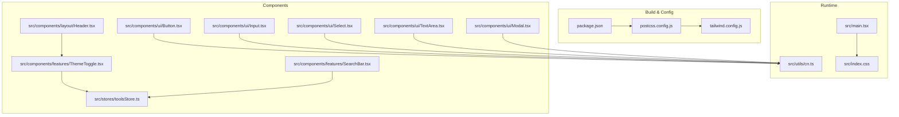
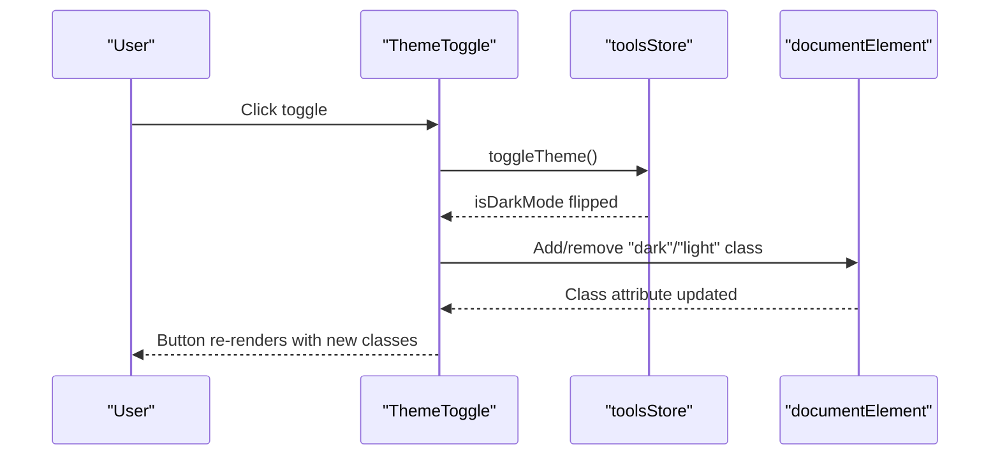
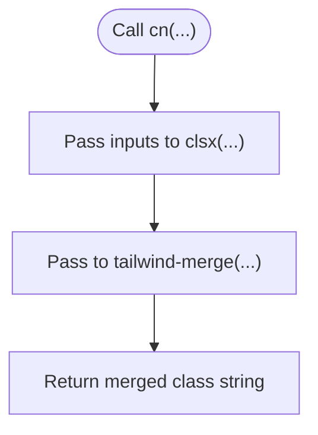
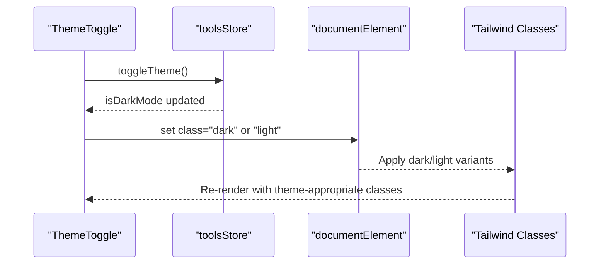
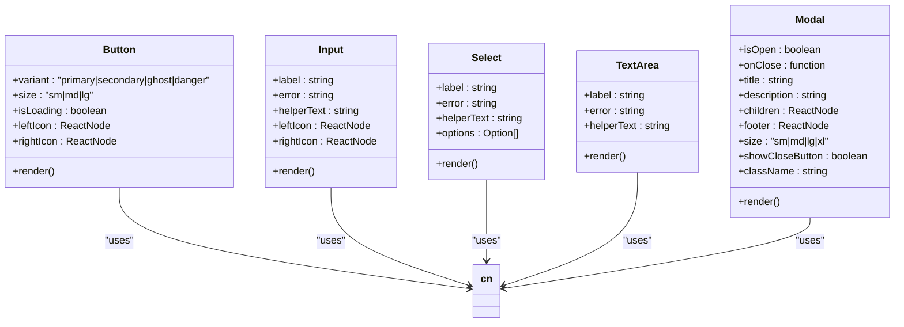
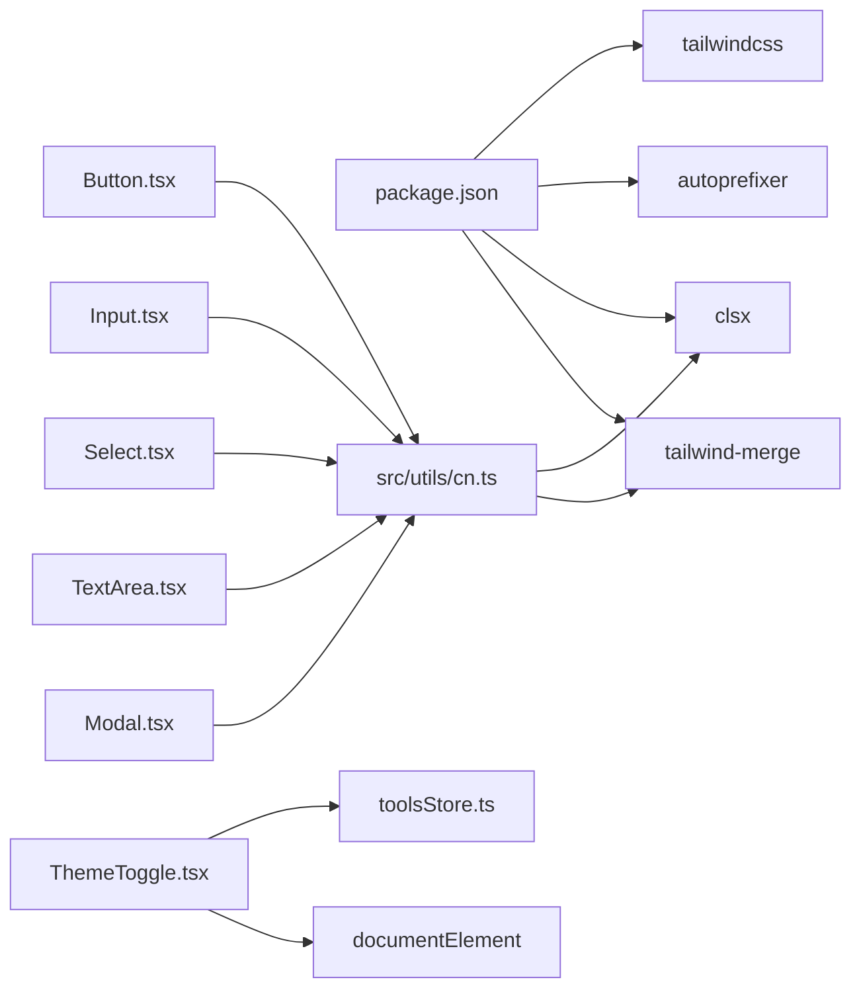

# Styling Architecture

<cite>
**Referenced Files in This Document**
- [tailwind.config.js](file://tailwind.config.js)
- [postcss.config.js](file://postcss.config.js)
- [package.json](file://package.json)
- [src/index.css](file://src/index.css)
- [src/utils/cn.ts](file://src/utils/cn.ts)
- [src/components/ui/Button.tsx](file://src/components/ui/Button.tsx)
- [src/components/ui/Input.tsx](file://src/components/ui/Input.tsx)
- [src/components/ui/Select.tsx](file://src/components/ui/Select.tsx)
- [src/components/ui/TextArea.tsx](file://src/components/ui/TextArea.tsx)
- [src/components/ui/Modal.tsx](file://src/components/ui/Modal.tsx)
- [src/components/features/ThemeToggle.tsx](file://src/components/features/ThemeToggle.tsx)
- [src/components/layout/Header.tsx](file://src/components/layout/Header.tsx)
- [src/components/features/SearchBar.tsx](file://src/components/features/SearchBar.tsx)
- [src/stores/toolsStore.ts](file://src/stores/toolsStore.ts)
- [src/main.tsx](file://src/main.tsx)
- [vite.config.ts](file://vite.config.ts)
</cite>

## Table of Contents
1. [Introduction](#introduction)
2. [Project Structure](#project-structure)
3. [Core Components](#core-components)
4. [Architecture Overview](#architecture-overview)
5. [Detailed Component Analysis](#detailed-component-analysis)
6. [Dependency Analysis](#dependency-analysis)
7. [Performance Considerations](#performance-considerations)
8. [Troubleshooting Guide](#troubleshooting-guide)
9. [Conclusion](#conclusion)
10. [Appendices](#appendices)

## Introduction
This document describes the styling architecture and utility-first design system of AIPulse built with Tailwind CSS. It covers the Tailwind configuration, custom color palette, typography, animations, and dark mode strategy. It documents the clsx and tailwind-merge integration via the cn utility function, component styling patterns, responsive design, and the custom CSS layer. It also provides guidelines for extending the design system, maintaining design tokens, and optimizing styling performance.

## Project Structure
The styling pipeline is organized around Tailwind CSS, PostCSS, and a small set of custom utilities and global styles:
- Tailwind configuration defines design tokens and customizations.
- PostCSS orchestrates Tailwind and Autoprefixer.
- A cn utility composes conditional Tailwind classes safely.
- Global CSS establishes base resets, custom utilities, and dark/light mode styles.
- UI components apply design tokens consistently across the app.
- ThemeToggle and the tools store coordinate dark/light mode state and DOM classes.

**Diagram sources**
- [tailwind.config.js](file://tailwind.config.js#L1-L69)
- [postcss.config.js](file://postcss.config.js#L1-L7)
- [package.json](file://package.json#L1-L36)
- [src/index.css](file://src/index.css#L1-L141)
- [src/utils/cn.ts](file://src/utils/cn.ts#L1-L7)
- [src/components/ui/Button.tsx](file://src/components/ui/Button.tsx#L1-L88)
- [src/components/ui/Input.tsx](file://src/components/ui/Input.tsx#L1-L74)
- [src/components/ui/Select.tsx](file://src/components/ui/Select.tsx#L1-L61)
- [src/components/ui/TextArea.tsx](file://src/components/ui/TextArea.tsx#L1-L45)
- [src/components/ui/Modal.tsx](file://src/components/ui/Modal.tsx#L1-L128)
- [src/components/layout/Header.tsx](file://src/components/layout/Header.tsx#L1-L83)
- [src/stores/toolsStore.ts](file://src/stores/toolsStore.ts#L1-L177)
- [src/components/features/ThemeToggle.tsx](file://src/components/features/ThemeToggle.tsx#L1-L43)
- [src/components/features/SearchBar.tsx](file://src/components/features/SearchBar.tsx#L1-L42)
- [src/main.tsx](file://src/main.tsx#L1-L11)

**Section sources**
- [tailwind.config.js](file://tailwind.config.js#L1-L69)
- [postcss.config.js](file://postcss.config.js#L1-L7)
- [package.json](file://package.json#L1-L36)
- [src/index.css](file://src/index.css#L1-L141)
- [src/utils/cn.ts](file://src/utils/cn.ts#L1-L7)
- [src/main.tsx](file://src/main.tsx#L1-L11)

## Core Components
- Tailwind configuration: Defines content paths, dark mode strategy, custom colors, typography, animations, keyframes, and transition durations.
- PostCSS configuration: Enables Tailwind and Autoprefixer.
- cn utility: Merges and deduplicates conditional Tailwind classes using clsx and tailwind-merge.
- Global CSS: Provides base element resets, custom utilities, focus-visible outlines, selection styles, transitions, and dark/light mode overrides.
- ThemeToggle and tools store: Manage theme state and apply class attributes to the document element for dark/light mode.
- UI components: Buttons, Inputs, Selects, TextAreas, and Modals consistently apply design tokens and responsive utilities.

**Section sources**
- [tailwind.config.js](file://tailwind.config.js#L1-L69)
- [postcss.config.js](file://postcss.config.js#L1-L7)
- [src/utils/cn.ts](file://src/utils/cn.ts#L1-L7)
- [src/index.css](file://src/index.css#L1-L141)
- [src/components/features/ThemeToggle.tsx](file://src/components/features/ThemeToggle.tsx#L1-L43)
- [src/stores/toolsStore.ts](file://src/stores/toolsStore.ts#L1-L177)
- [src/components/ui/Button.tsx](file://src/components/ui/Button.tsx#L1-L88)
- [src/components/ui/Input.tsx](file://src/components/ui/Input.tsx#L1-L74)
- [src/components/ui/Select.tsx](file://src/components/ui/Select.tsx#L1-L61)
- [src/components/ui/TextArea.tsx](file://src/components/ui/TextArea.tsx#L1-L45)
- [src/components/ui/Modal.tsx](file://src/components/ui/Modal.tsx#L1-L128)

## Architecture Overview
The styling architecture follows a strict utility-first approach:
- Design tokens live in Tailwind’s theme configuration.
- Components compose classes via the cn utility to avoid specificity conflicts.
- Global CSS ensures consistent resets and cross-component behaviors.
- Dark mode is controlled by a class applied to the document element and reflected in the store.

**Diagram sources**
- [src/components/features/ThemeToggle.tsx](file://src/components/features/ThemeToggle.tsx#L1-L43)
- [src/stores/toolsStore.ts](file://src/stores/toolsStore.ts#L104-L110)
- [src/index.css](file://src/index.css#L90-L98)

## Detailed Component Analysis

### Tailwind Configuration
- Content scanning includes HTML and TypeScript/TSX sources.
- Dark mode uses a class strategy.
- Custom color palette:
  - primary: default, dark, light
  - background: dark, card, cardHover, light, cardLight
  - text: primary, secondary, muted, primaryLight
  - border: DEFAULT, light
- Typography: sans family configured.
- Animations and keyframes: slide-in, fade-in, scale-in, bounce-subtle.
- Transition duration: 400ms extension.
- Plugins: none currently.

**Section sources**
- [tailwind.config.js](file://tailwind.config.js#L1-L69)

### cn Utility and clsx/tailwind-merge Integration
- Purpose: Safely merge conditional Tailwind classes while resolving conflicts.
- Implementation: Combines clsx for conditionals and tailwind-merge for deduplication.
- Usage: Applied across all form controls and UI components to compose base, variant, and size classes.

**Diagram sources**
- [src/utils/cn.ts](file://src/utils/cn.ts#L1-L7)

**Section sources**
- [src/utils/cn.ts](file://src/utils/cn.ts#L1-L7)
- [src/components/ui/Button.tsx](file://src/components/ui/Button.tsx#L45-L51)
- [src/components/ui/Input.tsx](file://src/components/ui/Input.tsx#L43-L51)
- [src/components/ui/Select.tsx](file://src/components/ui/Select.tsx#L30-L36)
- [src/components/ui/TextArea.tsx](file://src/components/ui/TextArea.tsx#L22-L28)
- [src/components/ui/Modal.tsx](file://src/components/ui/Modal.tsx#L77-L82)

### Color System and Accessibility
- Semantic tokens:
  - primary family drives interactive states and accents.
  - background tokens support dark and light surfaces and cards.
  - text tokens differentiate primary, secondary, muted, and light variants.
  - border tokens provide subtle and strong borders.
- Contrast and accessibility:
  - Focus-visible outline uses primary for keyboard navigation visibility.
  - Input autofill styles adapt text/background per theme to maintain readability.
- Brand accents:
  - Primary color is used for hover, active, and focus states across components.

**Section sources**
- [tailwind.config.js](file://tailwind.config.js#L10-L34)
- [src/index.css](file://src/index.css#L71-L81)
- [src/index.css](file://src/index.css#L124-L140)
- [src/components/ui/Button.tsx](file://src/components/ui/Button.tsx#L29-L40)
- [src/components/ui/Input.tsx](file://src/components/ui/Input.tsx#L43-L51)
- [src/components/ui/Select.tsx](file://src/components/ui/Select.tsx#L30-L36)
- [src/components/ui/TextArea.tsx](file://src/components/ui/TextArea.tsx#L22-L28)

### Typography and Animation Tokens
- Font family: Inter-based stack for readable web typography.
- Animations: Slide-in, fade-in, scale-in, bounce-subtle for micro-interactions.
- Transitions: Extended 400ms duration and transition-colors defaults for consistent motion.

**Section sources**
- [tailwind.config.js](file://tailwind.config.js#L35-L43)
- [tailwind.config.js](file://tailwind.config.js#L62-L64)
- [src/index.css](file://src/index.css#L83-L88)

### Dark Mode Strategy
- Strategy: class-based dark mode targeting document element.
- Automatic system detection: Not implemented in code; relies on manual toggle.
- Manual toggling: ThemeToggle updates the document class and store state.
- CSS variable fallbacks: None present; styling relies on Tailwind color tokens.
- Color-scheme hints: .dark and .light classes set color-scheme for native controls.

**Diagram sources**
- [src/components/features/ThemeToggle.tsx](file://src/components/features/ThemeToggle.tsx#L9-L18)
- [src/stores/toolsStore.ts](file://src/stores/toolsStore.ts#L104-L110)
- [src/index.css](file://src/index.css#L90-L98)

**Section sources**
- [tailwind.config.js](file://tailwind.config.js#L7-L7)
- [src/components/features/ThemeToggle.tsx](file://src/components/features/ThemeToggle.tsx#L1-L43)
- [src/stores/toolsStore.ts](file://src/stores/toolsStore.ts#L104-L110)
- [src/index.css](file://src/index.css#L90-L98)

### Global Styles and Custom Utilities
- Base resets: box sizing, smooth scrolling.
- Custom scrollbar: width, track, thumb, hover states, and hide utility.
- Line clamp utilities: two-line clamp via WebKit stacking.
- Animation utilities: fadeIn animation and animate-fade-in class.
- Focus-visible: primary outline with offset.
- Selection: translucent blue on selection.
- Transition defaults: transition-colors for color/border transitions.
- Dark/light classes: color-scheme hints.
- Button active scaling: subtle press-down transform.
- Smooth scrolling: html behavior.
- Drag handles: prevent text selection on role="button".
- Card lift: hover elevation with transition.
- Autofill: theme-aware text/background for inputs.

**Section sources**
- [src/index.css](file://src/index.css#L1-L141)

### Component Styling Patterns
- Buttons:
  - Base: alignment, font, transitions, focus ring, disabled states.
  - Variants: primary, secondary, ghost, danger with appropriate backgrounds, borders, and hover/focus states.
  - Sizes: compact, medium, large with consistent padding and gap.
  - Loading state: spinner and reduced opacity.
- Inputs, Selects, TextAreas:
  - Consistent background, border, rounded corners, padding, and focus states.
  - Left/right icons positioned absolutely with proper padding adjustments.
  - Error states: red borders and ring with fade-in animation.
  - Helper/error text with semantic colors.
- Modal:
  - Backdrop with blur and click-to-close.
  - Container with size variants, borders, and rounded corners.
  - Header/footer slots with consistent spacing and borders.
  - Escape key handling and body overflow control.

**Diagram sources**
- [src/components/ui/Button.tsx](file://src/components/ui/Button.tsx#L1-L88)
- [src/components/ui/Input.tsx](file://src/components/ui/Input.tsx#L1-L74)
- [src/components/ui/Select.tsx](file://src/components/ui/Select.tsx#L1-L61)
- [src/components/ui/TextArea.tsx](file://src/components/ui/TextArea.tsx#L1-L45)
- [src/components/ui/Modal.tsx](file://src/components/ui/Modal.tsx#L1-L128)
- [src/utils/cn.ts](file://src/utils/cn.ts#L1-L7)

**Section sources**
- [src/components/ui/Button.tsx](file://src/components/ui/Button.tsx#L1-L88)
- [src/components/ui/Input.tsx](file://src/components/ui/Input.tsx#L1-L74)
- [src/components/ui/Select.tsx](file://src/components/ui/Select.tsx#L1-L61)
- [src/components/ui/TextArea.tsx](file://src/components/ui/TextArea.tsx#L1-L45)
- [src/components/ui/Modal.tsx](file://src/components/ui/Modal.tsx#L1-L128)

### Responsive Design Implementation
- Breakpoints and responsive utilities are applied directly in components via Tailwind modifiers (e.g., sm:, lg:).
- Examples:
  - Header logo and text visibility change at small breakpoints.
  - Action buttons switch between compact and expanded forms.
  - Search bar container grows to a max width at larger screens.

**Section sources**
- [src/components/layout/Header.tsx](file://src/components/layout/Header.tsx#L17-L78)
- [src/components/features/SearchBar.tsx](file://src/components/features/SearchBar.tsx#L21-L39)

### Theme Management and Store Integration
- Store initializes with dark mode enabled and persists state.
- ThemeToggle toggles the flag and updates the document class accordingly.
- Components consume theme-aware tokens (e.g., dark:border, light:border) to render appropriately.

**Section sources**
- [src/stores/toolsStore.ts](file://src/stores/toolsStore.ts#L22-L22)
- [src/stores/toolsStore.ts](file://src/stores/toolsStore.ts#L104-L110)
- [src/components/features/ThemeToggle.tsx](file://src/components/features/ThemeToggle.tsx#L9-L18)
- [src/components/ui/Input.tsx](file://src/components/ui/Input.tsx#L43-L51)
- [src/components/ui/Select.tsx](file://src/components/ui/Select.tsx#L30-L36)
- [src/components/ui/TextArea.tsx](file://src/components/ui/TextArea.tsx#L22-L28)
- [src/components/ui/Modal.tsx](file://src/components/ui/Modal.tsx#L77-L82)
- [src/components/layout/Header.tsx](file://src/components/layout/Header.tsx#L17-L17)

## Dependency Analysis
- Build-time:
  - Tailwind CSS and PostCSS are dev/runtime dependencies.
  - Vite resolves aliases for internal modules.
- Runtime:
  - cn depends on clsx and tailwind-merge.
  - Components depend on cn and Tailwind tokens.
  - ThemeToggle depends on toolsStore and applies classes to documentElement.

**Diagram sources**
- [package.json](file://package.json#L11-L34)
- [src/utils/cn.ts](file://src/utils/cn.ts#L1-L7)
- [src/components/ui/Button.tsx](file://src/components/ui/Button.tsx#L1-L2)
- [src/components/ui/Input.tsx](file://src/components/ui/Input.tsx#L1-L2)
- [src/components/ui/Select.tsx](file://src/components/ui/Select.tsx#L1-L3)
- [src/components/ui/TextArea.tsx](file://src/components/ui/TextArea.tsx#L1-L2)
- [src/components/ui/Modal.tsx](file://src/components/ui/Modal.tsx#L1-L4)
- [src/components/features/ThemeToggle.tsx](file://src/components/features/ThemeToggle.tsx#L1-L4)
- [src/stores/toolsStore.ts](file://src/stores/toolsStore.ts#L1-L2)

**Section sources**
- [package.json](file://package.json#L11-L34)
- [vite.config.ts](file://vite.config.ts#L7-L16)
- [src/utils/cn.ts](file://src/utils/cn.ts#L1-L7)
- [src/components/ui/Button.tsx](file://src/components/ui/Button.tsx#L1-L2)
- [src/components/ui/Input.tsx](file://src/components/ui/Input.tsx#L1-L2)
- [src/components/ui/Select.tsx](file://src/components/ui/Select.tsx#L1-L3)
- [src/components/ui/TextArea.tsx](file://src/components/ui/TextArea.tsx#L1-L2)
- [src/components/ui/Modal.tsx](file://src/components/ui/Modal.tsx#L1-L4)
- [src/components/features/ThemeToggle.tsx](file://src/components/features/ThemeToggle.tsx#L1-L4)
- [src/stores/toolsStore.ts](file://src/stores/toolsStore.ts#L1-L2)

## Performance Considerations
- Unused CSS purging:
  - Tailwind’s content globs scan index.html and src/**/*.{js,ts,jsx,tsx}, ensuring purge removes unused classes during production builds.
- Critical path optimization:
  - Global base/components/utilities are included via @tailwind directives to avoid FOUC.
  - Minimal custom CSS reduces repaint cost.
- Bundle size considerations:
  - Keep the number of unique classes small; prefer variants and sizes defined in the theme.
  - Avoid excessive inline conditional classes; rely on cn to merge efficiently.
  - Limit custom keyframes and animations to essential ones.

**Section sources**
- [tailwind.config.js](file://tailwind.config.js#L3-L6)
- [src/index.css](file://src/index.css#L1-L3)

## Troubleshooting Guide
- Classes not applying:
  - Verify content paths in Tailwind config include the relevant files.
  - Ensure cn is used to merge conditional classes instead of plain concatenation.
- Dark mode not switching:
  - Confirm ThemeToggle updates the document class and store state.
  - Check that .dark/.light classes are present in global CSS.
- Focus or selection styles not visible:
  - Confirm focus-visible outline and selection styles are loaded.
- Input autofill readability issues:
  - Ensure dark/light autofill rules match current theme.

**Section sources**
- [tailwind.config.js](file://tailwind.config.js#L3-L6)
- [src/utils/cn.ts](file://src/utils/cn.ts#L1-L7)
- [src/components/features/ThemeToggle.tsx](file://src/components/features/ThemeToggle.tsx#L9-L18)
- [src/index.css](file://src/index.css#L71-L81)
- [src/index.css](file://src/index.css#L124-L140)

## Conclusion
AIPulse employs a clean, utility-first styling architecture centered on Tailwind CSS and a small set of custom utilities. The design system is defined in configuration and extended through global CSS and component-level composition. Dark mode is managed via a class strategy coordinated by the store and ThemeToggle. Following the patterns documented here ensures consistency, performance, and maintainability.

## Appendices

### Extending the Design System
- Add new tokens:
  - Extend colors, spacing, typography, or animation in Tailwind config.
  - Introduce new variants/sizes in components and export consistent props.
- Create custom utilities:
  - Add new utilities in global CSS and reference them in components.
- Maintain design tokens:
  - Prefer semantic names (e.g., text-primary, border) over hardcoded values.
  - Keep cn usage consistent to avoid specificity conflicts.

### Guidelines for Component Styling
- Use cn to merge base, variant, and conditional classes.
- Prefer theme tokens over hard-coded values.
- Keep responsive modifiers explicit and minimal.
- Avoid overriding global styles; encapsulate changes within components or utilities.

### Maintaining Design Tokens
- Centralize tokens in Tailwind config.
- Use semantic names for colors and typography.
- Document token usage in components and update globally when changing themes.