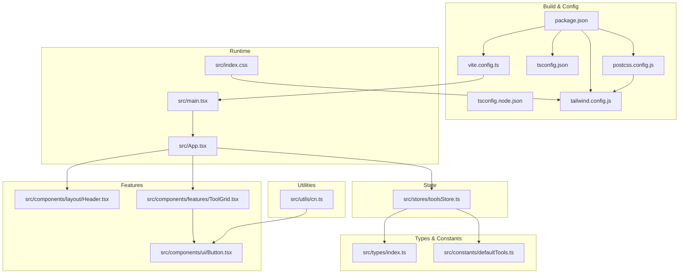
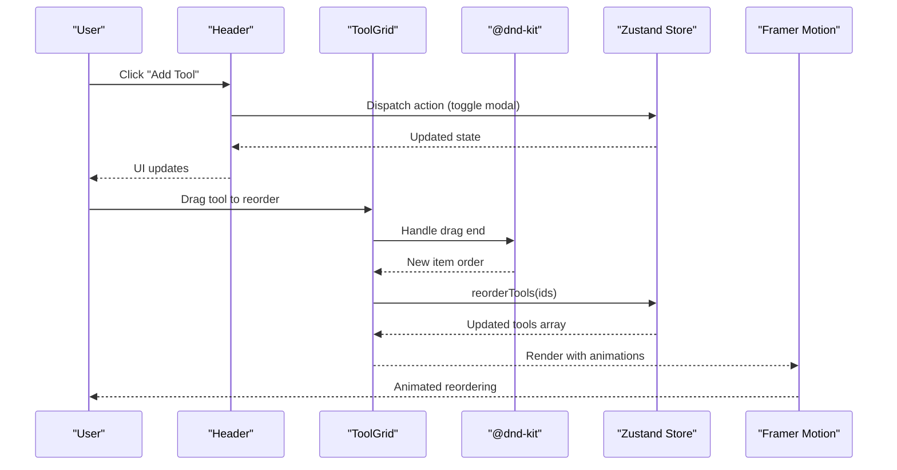
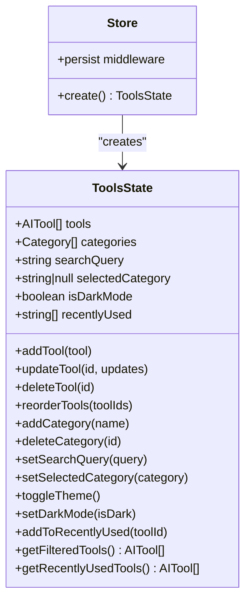
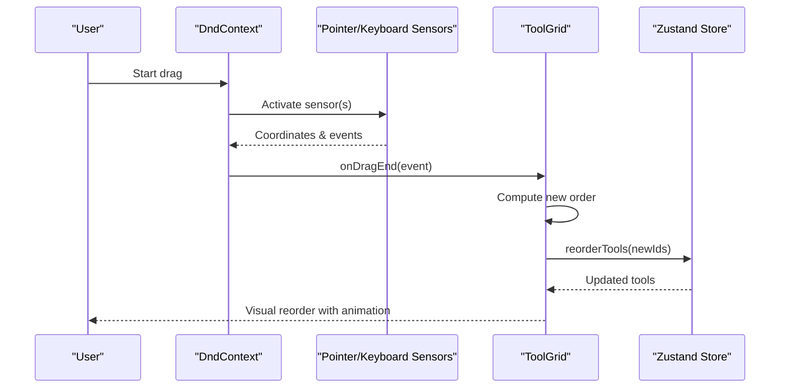
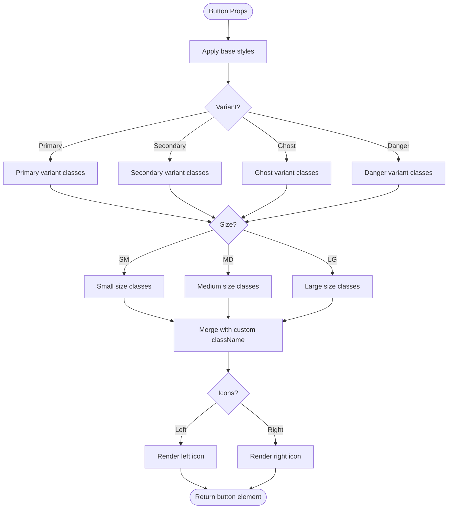
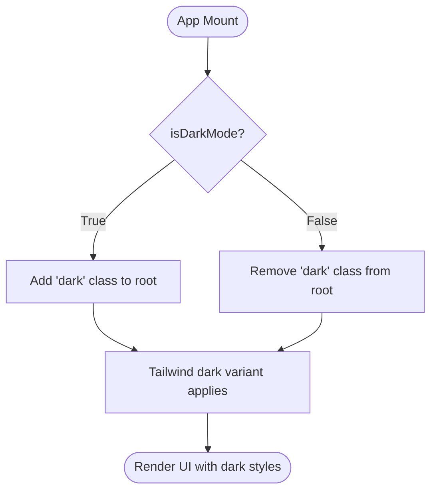

# Technology Stack & Dependencies

<cite>
**Referenced Files in This Document**
- [package.json](file://package.json)
- [vite.config.ts](file://vite.config.ts)
- [tsconfig.json](file://tsconfig.json)
- [tsconfig.node.json](file://tsconfig.node.json)
- [tailwind.config.js](file://tailwind.config.js)
- [postcss.config.js](file://postcss.config.js)
- [src/main.tsx](file://src/main.tsx)
- [src/App.tsx](file://src/App.tsx)
- [src/index.css](file://src/index.css)
- [src/stores/toolsStore.ts](file://src/stores/toolsStore.ts)
- [src/utils/cn.ts](file://src/utils/cn.ts)
- [src/components/features/ToolGrid.tsx](file://src/components/features/ToolGrid.tsx)
- [src/components/ui/Button.tsx](file://src/components/ui/Button.tsx)
- [src/components/layout/Header.tsx](file://src/components/layout/Header.tsx)
- [src/types/index.ts](file://src/types/index.ts)
- [src/constants/defaultTools.ts](file://src/constants/defaultTools.ts)
</cite>

## Table of Contents
1. [Introduction](#introduction)
2. [Project Structure](#project-structure)
3. [Core Components](#core-components)
4. [Architecture Overview](#architecture-overview)
5. [Detailed Component Analysis](#detailed-component-analysis)
6. [Dependency Analysis](#dependency-analysis)
7. [Performance Considerations](#performance-considerations)
8. [Troubleshooting Guide](#troubleshooting-guide)
9. [Conclusion](#conclusion)
10. [Appendices](#appendices)

## Introduction
This document provides comprehensive technology stack documentation for AIPulse, a modern React-based frontend application. It covers the core frameworks and libraries, build configuration, styling pipeline, and state management patterns. The goal is to help developers understand the current tech choices, their interactions, and how to evolve the stack responsibly.

## Project Structure
The project follows a conventional React application layout with a clear separation of concerns:
- Application entry point and rendering lifecycle
- Feature components and UI primitives
- State management via a lightweight store
- Utility functions and type definitions
- Build configuration for Vite, TypeScript, and Tailwind CSS

**Diagram sources**
- [vite.config.ts](file://vite.config.ts#L1-L19)
- [tsconfig.json](file://tsconfig.json#L1-L32)
- [tsconfig.node.json](file://tsconfig.node.json#L1-L11)
- [tailwind.config.js](file://tailwind.config.js#L1-L69)
- [postcss.config.js](file://postcss.config.js#L1-L7)
- [package.json](file://package.json#L1-L36)
- [src/main.tsx](file://src/main.tsx#L1-L11)
- [src/App.tsx](file://src/App.tsx#L1-L122)
- [src/index.css](file://src/index.css#L1-L141)
- [src/components/layout/Header.tsx](file://src/components/layout/Header.tsx#L1-L83)
- [src/components/features/ToolGrid.tsx](file://src/components/features/ToolGrid.tsx#L1-L112)
- [src/components/ui/Button.tsx](file://src/components/ui/Button.tsx#L1-L88)
- [src/stores/toolsStore.ts](file://src/stores/toolsStore.ts#L1-L177)
- [src/types/index.ts](file://src/types/index.ts#L1-L60)
- [src/constants/defaultTools.ts](file://src/constants/defaultTools.ts#L1-L101)
- [src/utils/cn.ts](file://src/utils/cn.ts#L1-L7)

**Section sources**
- [package.json](file://package.json#L1-L36)
- [vite.config.ts](file://vite.config.ts#L1-L19)
- [tsconfig.json](file://tsconfig.json#L1-L32)
- [tsconfig.node.json](file://tsconfig.node.json#L1-L11)
- [tailwind.config.js](file://tailwind.config.js#L1-L69)
- [postcss.config.js](file://postcss.config.js#L1-L7)
- [src/main.tsx](file://src/main.tsx#L1-L11)
- [src/App.tsx](file://src/App.tsx#L1-L122)
- [src/index.css](file://src/index.css#L1-L141)

## Core Components
This section documents the primary technologies and their roles in the application.

- React 19.2.4
  - Runtime framework for building user interfaces. Used throughout the application for components, state hooks, and rendering.
  - Verified in the project’s dependencies and entry point rendering.

- TypeScript 5.9.3
  - Provides static typing across the codebase, enabling safer development and better tooling.
  - Compiler options configured for ESNext modules, strictness, and bundler resolution.

- Vite 7.3.1
  - Build tool and dev server. Provides fast HMR, optimized production builds, and path aliases.
  - Scripts and plugin configuration enable React Fast Refresh and path aliasing.

- Zustand 5.0.11
  - Lightweight state management with minimal boilerplate. Used for global tool management, filtering, theme, and recent usage tracking.
  - Persists state to localStorage for persistence across sessions.

- @dnd-kit/core 6.3.1 and related sortable utilities
  - Implements drag-and-drop reordering of tools with keyboard and pointer sensors.
  - Integrated with Framer Motion for smooth animations during drag interactions.

- Framer Motion 12.35.0
  - Adds declarative animations to transitions, modals, and interactive elements.
  - Used extensively in layout components and UI primitives.

- Lucide React 0.577.0
  - SVG icon library integrated across components for consistent visual language.
  - Icons are used in buttons, header actions, and empty states.

- Tailwind CSS 4.2.1
  - Utility-first CSS framework with custom theme, dark mode, animations, and keyframes.
  - PostCSS pipeline processes Tailwind directives and vendor prefixes.

- Development Dependencies
  - React TypeScript types, PostCSS, autoprefixer, and Vite React plugin support development ergonomics and build correctness.

**Section sources**
- [package.json](file://package.json#L11-L34)
- [src/main.tsx](file://src/main.tsx#L1-L11)
- [src/App.tsx](file://src/App.tsx#L1-L122)
- [src/stores/toolsStore.ts](file://src/stores/toolsStore.ts#L1-L177)
- [src/components/features/ToolGrid.tsx](file://src/components/features/ToolGrid.tsx#L1-L112)
- [src/components/ui/Button.tsx](file://src/components/ui/Button.tsx#L1-L88)
- [tailwind.config.js](file://tailwind.config.js#L1-L69)
- [postcss.config.js](file://postcss.config.js#L1-L7)

## Architecture Overview
The application follows a unidirectional data flow pattern:
- UI components render based on Zustand-managed state.
- User interactions trigger actions in the store, updating state and re-rendering affected components.
- Drag-and-drop interactions leverage @dnd-kit to compute new ordering, which is persisted via Zustand.
- Animations are applied declaratively using Framer Motion for transitions and micro-interactions.
- Styling is generated via Tailwind CSS with a custom theme and dark mode support.

**Diagram sources**
- [src/components/layout/Header.tsx](file://src/components/layout/Header.tsx#L1-L83)
- [src/components/features/ToolGrid.tsx](file://src/components/features/ToolGrid.tsx#L1-L112)
- [src/stores/toolsStore.ts](file://src/stores/toolsStore.ts#L53-L75)
- [src/App.tsx](file://src/App.tsx#L28-L51)

## Detailed Component Analysis

### State Management with Zustand
Zustand provides a minimal, ergonomic API for managing global state:
- Stores typed actions and getters for filtering, sorting, and theme toggling.
- Persists selected keys to localStorage to maintain user preferences across sessions.
- Integrates with React components via hooks for reactive updates.

**Diagram sources**
- [src/stores/toolsStore.ts](file://src/stores/toolsStore.ts#L19-L51)
- [src/stores/toolsStore.ts](file://src/stores/toolsStore.ts#L131-L156)

**Section sources**
- [src/stores/toolsStore.ts](file://src/stores/toolsStore.ts#L1-L177)
- [src/types/index.ts](file://src/types/index.ts#L19-L51)

### Drag-and-Drop Implementation with @dnd-kit
The drag-and-drop system integrates with the filtered tool list:
- Sensors detect pointer and keyboard interactions with activation constraints.
- Collision detection and sorting strategy compute new indices.
- Reordering updates the store, which triggers re-rendering with animations.

**Diagram sources**
- [src/components/features/ToolGrid.tsx](file://src/components/features/ToolGrid.tsx#L35-L56)
- [src/stores/toolsStore.ts](file://src/stores/toolsStore.ts#L53-L75)

**Section sources**
- [src/components/features/ToolGrid.tsx](file://src/components/features/ToolGrid.tsx#L1-L112)
- [src/stores/toolsStore.ts](file://src/stores/toolsStore.ts#L53-L75)

### UI Primitive: Button with Tailwind Utilities
The Button component demonstrates utility-first styling and responsive behavior:
- Variant and size props map to Tailwind classes for consistent styling.
- Uses the cn utility for merging and deduplicating classes.
- Integrates Lucide icons and loading states.

**Diagram sources**
- [src/components/ui/Button.tsx](file://src/components/ui/Button.tsx#L12-L82)
- [src/utils/cn.ts](file://src/utils/cn.ts#L1-L7)

**Section sources**
- [src/components/ui/Button.tsx](file://src/components/ui/Button.tsx#L1-L88)
- [src/utils/cn.ts](file://src/utils/cn.ts#L1-L7)

### Dark Mode Implementation
Dark mode is implemented using a class-based approach:
- The store manages a theme flag.
- On mount, the app applies the appropriate class to the root element.
- Tailwind’s dark mode variant targets the class to switch styles.

**Diagram sources**
- [src/App.tsx](file://src/App.tsx#L19-L26)
- [tailwind.config.js](file://tailwind.config.js#L7-L7)

**Section sources**
- [src/App.tsx](file://src/App.tsx#L17-L26)
- [tailwind.config.js](file://tailwind.config.js#L7-L7)
- [src/index.css](file://src/index.css#L90-L98)

## Dependency Analysis
This section outlines the technology stack, version alignment, and rationale for each choice.

- React 19.2.4
  - Rationale: Latest stable React with concurrent features and improved developer experience.
  - Compatibility: Aligned with React TypeScript types and Vite’s React plugin.

- TypeScript 5.9.3
  - Rationale: Strong typing, excellent IDE support, and incremental adoption.
  - Compatibility: Matches React 19 and Vite’s bundler module resolution.

- Vite 7.3.1
  - Rationale: Fast dev server, optimized builds, and first-class React support.
  - Path Aliases: Resolved via vite.config.ts for clean imports across the app.

- Zustand 5.0.11
  - Rationale: Minimal API, no boilerplate, and easy persistence with middleware.
  - Integration: Works seamlessly with TypeScript types and React hooks.

- @dnd-kit/core 6.3.1 and related packages
  - Rationale: Accessible, flexible, and performant drag-and-drop solution.
  - Integration: Complements Framer Motion for smooth animations.

- Framer Motion 12.35.0
  - Rationale: Declarative animations, gesture support, and SSR-friendly.
  - Integration: Used for page transitions, micro-interactions, and modal entrances.

- Lucide React 0.577.0
  - Rationale: Consistent, open-source iconography with zero runtime overhead.
  - Integration: Imported directly into components for clarity.

- Tailwind CSS 4.2.1
  - Rationale: Utility-first CSS with powerful customization and dark mode.
  - PostCSS Pipeline: Tailwind and Autoprefixer process styles at build time.

- Development Dependencies
  - React TypeScript types, PostCSS, autoprefixer, and Vite React plugin ensure a robust development experience.

**Section sources**
- [package.json](file://package.json#L11-L34)
- [vite.config.ts](file://vite.config.ts#L7-L16)
- [tsconfig.json](file://tsconfig.json#L8-L13)
- [tailwind.config.js](file://tailwind.config.js#L1-L69)
- [postcss.config.js](file://postcss.config.js#L1-L7)

## Performance Considerations
- Use of Zustand reduces unnecessary re-renders by providing granular selectors and immutable updates.
- Memoization in components (e.g., filtered tools) prevents redundant computations.
- Tailwind’s JIT mode and purging content paths minimize CSS bundle size.
- Vite’s native ES modules and tree-shaking reduce bundle size and improve load times.
- Prefer lazy-loading heavy components and deferring non-critical assets.

## Troubleshooting Guide
Common issues and resolutions:
- Type errors after dependency updates
  - Ensure TypeScript and React types align with the installed React version.
  - Verify tsconfig module resolution and bundler settings.

- Tailwind utilities not applying
  - Confirm content paths in Tailwind config include all relevant files.
  - Check PostCSS configuration and that Tailwind directives are present in index.css.

- Vite path aliases not resolving
  - Validate vite.config.ts aliases and tsconfig.json paths.
  - Restart the dev server after making changes.

- Drag-and-drop not working
  - Verify @dnd-kit imports and that DndContext wraps the sortable items.
  - Ensure sensors are configured and collision detection is set appropriately.

**Section sources**
- [tsconfig.json](file://tsconfig.json#L18-L27)
- [vite.config.ts](file://vite.config.ts#L7-L16)
- [tailwind.config.js](file://tailwind.config.js#L3-L5)
- [postcss.config.js](file://postcss.config.js#L1-L7)

## Conclusion
AIPulse leverages a modern, cohesive frontend stack built around React 19, TypeScript, and Vite. Zustand simplifies state management, @dnd-kit enables intuitive drag-and-drop, Framer Motion enhances UX with smooth animations, and Tailwind CSS delivers a scalable styling system with dark mode. The build configuration emphasizes developer productivity and performance, while the type system ensures reliability across the codebase.

## Appendices

### Build Configuration Highlights
- Path Aliases
  - Aliases defined in Vite and TypeScript for cleaner imports across the app.
  - Ensures consistent navigation and reduces relative path complexity.

- TypeScript Compilation Settings
  - ESNext target and module with bundler resolution for optimal Vite integration.
  - Strict mode enabled for safer development.
  - JSX transform configured for React components.

- Tailwind CSS Customization
  - Custom colors, fonts, animations, and keyframes tailored to the application’s design system.
  - Dark mode configured via class strategy for seamless theme switching.

**Section sources**
- [vite.config.ts](file://vite.config.ts#L7-L16)
- [tsconfig.json](file://tsconfig.json#L3-L13)
- [tailwind.config.js](file://tailwind.config.js#L8-L65)
- [src/index.css](file://src/index.css#L1-L3)

### Version Compatibility Notes and Upgrade Paths
- React 19.2.4
  - Upgrade path: Align TypeScript and React types; test Suspense boundaries and concurrent features.
  - Compatibility: Vite React plugin supports latest React versions.

- TypeScript 5.9.3
  - Upgrade path: Incrementally update compiler options; address strictness warnings.
  - Compatibility: Vite’s bundler module resolution works well with modern TS versions.

- Vite 7.3.1
  - Upgrade path: Review plugin updates; ensure path aliases remain valid.
  - Compatibility: React Fast Refresh and HMR work reliably with latest versions.

- Zustand 5.0.11
  - Upgrade path: Check middleware APIs; ensure persistence configuration remains intact.
  - Compatibility: No breaking changes reported for typical usage patterns.

- @dnd-kit/core 6.3.1
  - Upgrade path: Verify sensor configurations and collision detection.
  - Compatibility: Stable API with frequent minor updates.

- Framer Motion 12.35.0
  - Upgrade path: Validate animation props and gesture configurations.
  - Compatibility: Backward compatible with React 18+.

- Lucide React 0.577.0
  - Upgrade path: Replace deprecated icon names; check component props.
  - Compatibility: Lightweight and frequently updated.

- Tailwind CSS 4.2.1
  - Upgrade path: Review custom theme changes; update keyframes and animations.
  - Compatibility: PostCSS pipeline remains stable across versions.

**Section sources**
- [package.json](file://package.json#L11-L34)
- [vite.config.ts](file://vite.config.ts#L1-L19)
- [tsconfig.json](file://tsconfig.json#L1-L32)
- [tailwind.config.js](file://tailwind.config.js#L1-L69)

### Dependency Alternatives
- State Management
  - Recoil: Fine-grained atom-based state with advanced selector composition.
  - Jotai: Small, atomic approach with functional patterns.
  - Redux Toolkit: Predictable global state with mature tooling.

- Drag-and-Drop
  - React Beautiful DnD: Mature solution with extensive documentation.
  - React Hook Form: If forms are involved, consider form-focused solutions.

- Animations
  - React Spring: Physics-based animation library with imperative control.
  - GSAP: Advanced motion graphics with timeline controls.

- Styling
  - Styled Components: CSS-in-JS with component scoping.
  - Sass/Less: Traditional preprocessors for modular stylesheets.

- Build Tool
  - Webpack: More verbose but highly customizable for complex setups.
  - Next.js: If full-stack or static site generation is desired.

**Section sources**
- [src/stores/toolsStore.ts](file://src/stores/toolsStore.ts#L1-L177)
- [src/components/features/ToolGrid.tsx](file://src/components/features/ToolGrid.tsx#L1-L112)
- [src/components/ui/Button.tsx](file://src/components/ui/Button.tsx#L1-L88)
- [tailwind.config.js](file://tailwind.config.js#L1-L69)