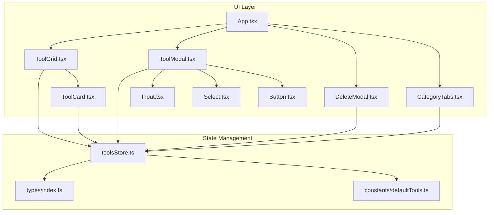
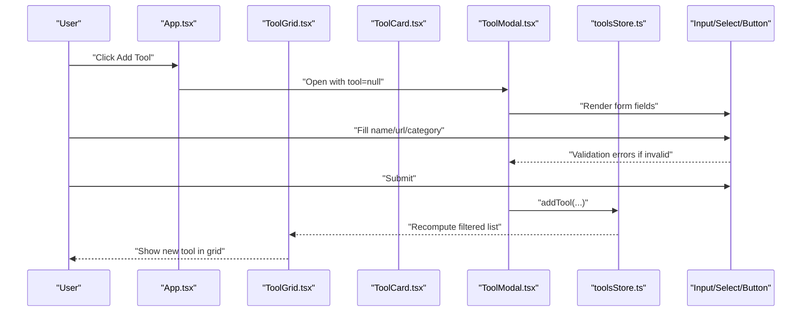
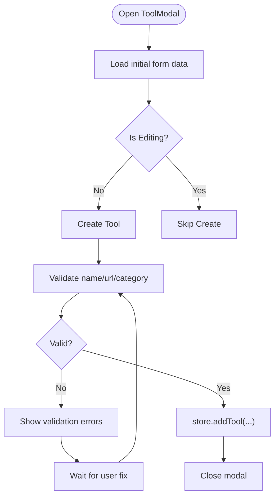
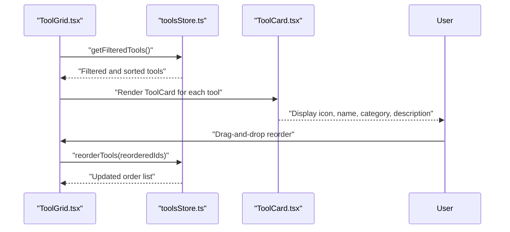
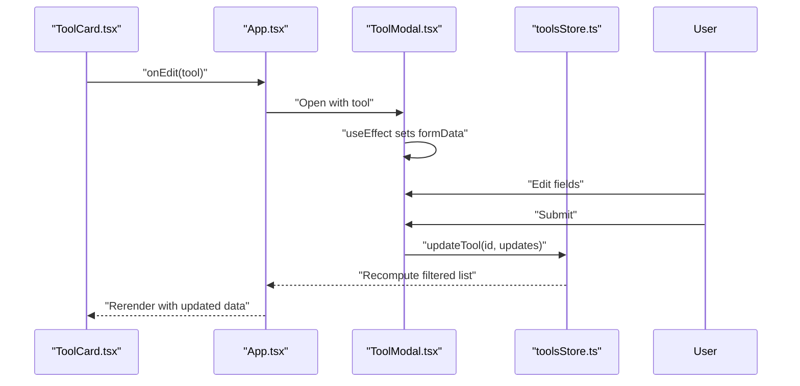
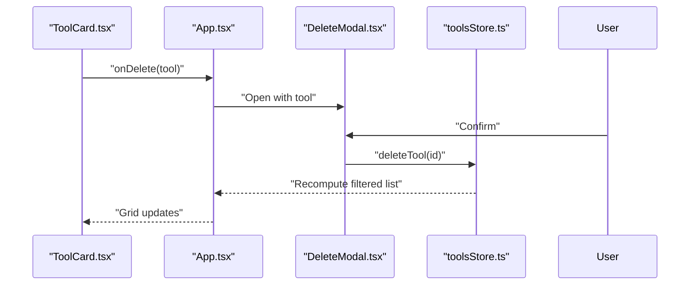
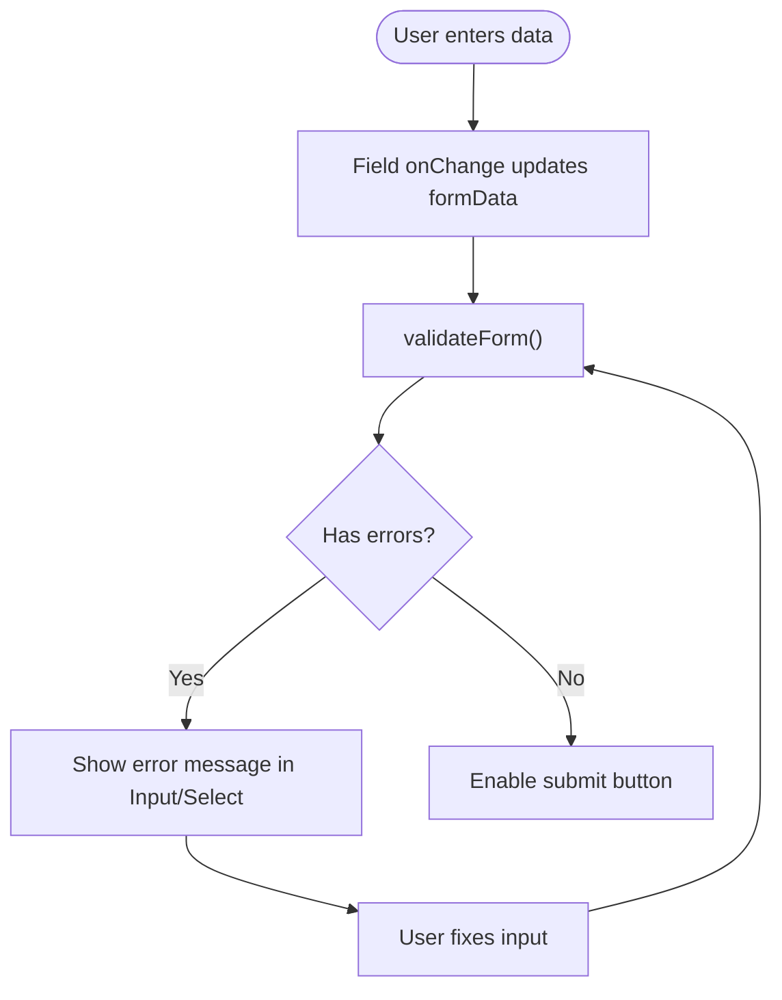
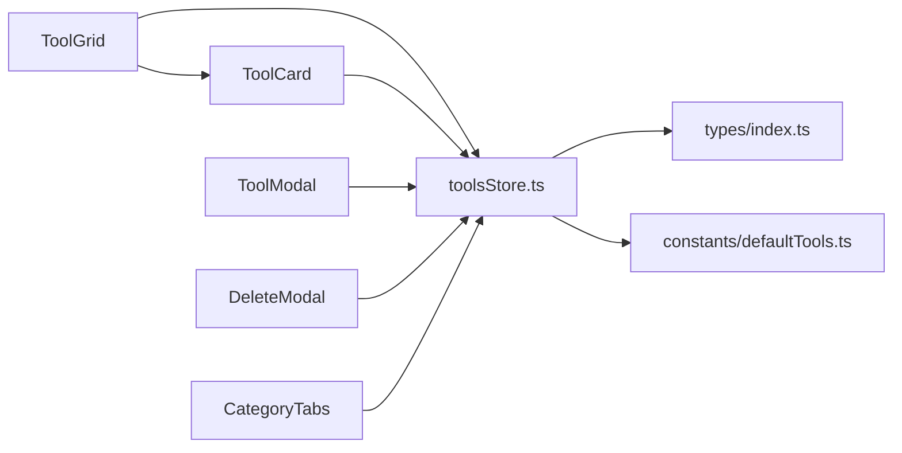

# CRUD Operations

<cite>
**Referenced Files in This Document**
- [App.tsx](file://src/App.tsx)
- [toolsStore.ts](file://src/stores/toolsStore.ts)
- [ToolModal.tsx](file://src/components/modals/ToolModal.tsx)
- [DeleteModal.tsx](file://src/components/modals/DeleteModal.tsx)
- [ToolGrid.tsx](file://src/components/features/ToolGrid.tsx)
- [ToolCard.tsx](file://src/components/features/ToolCard.tsx)
- [CategoryTabs.tsx](file://src/components/features/CategoryTabs.tsx)
- [Input.tsx](file://src/components/ui/Input.tsx)
- [Select.tsx](file://src/components/ui/Select.tsx)
- [Button.tsx](file://src/components/ui/Button.tsx)
- [index.ts](file://src/types/index.ts)
- [defaultTools.ts](file://src/constants/defaultTools.ts)
</cite>

## Table of Contents
1. [Introduction](#introduction)
2. [Project Structure](#project-structure)
3. [Core Components](#core-components)
4. [Architecture Overview](#architecture-overview)
5. [Detailed Component Analysis](#detailed-component-analysis)
6. [Dependency Analysis](#dependency-analysis)
7. [Performance Considerations](#performance-considerations)
8. [Troubleshooting Guide](#troubleshooting-guide)
9. [Conclusion](#conclusion)

## Introduction
This document provides comprehensive documentation for the CRUD operations in the AIPulse tool management system. It covers the Create, Read, Update, and Delete workflows, including form validation, category assignment, icon selection, filtering, ordering, and user feedback mechanisms. The goal is to help developers and product teams understand how tools are managed end-to-end, from UI interactions to persistent storage.

## Project Structure
The tool management system is organized around a central Zustand store that manages tools, categories, filters, and recent usage. UI components render tools and expose modals for editing and deleting. The store persists state to local storage for continuity across sessions.

**Diagram sources**
- [App.tsx](file://src/App.tsx#L1-L122)
- [ToolGrid.tsx](file://src/components/features/ToolGrid.tsx#L1-L112)
- [ToolCard.tsx](file://src/components/features/ToolCard.tsx#L1-L141)
- [ToolModal.tsx](file://src/components/modals/ToolModal.tsx#L1-L253)
- [DeleteModal.tsx](file://src/components/modals/DeleteModal.tsx#L1-L67)
- [CategoryTabs.tsx](file://src/components/features/CategoryTabs.tsx#L1-L106)
- [Input.tsx](file://src/components/ui/Input.tsx#L1-L74)
- [Select.tsx](file://src/components/ui/Select.tsx#L1-L61)
- [Button.tsx](file://src/components/ui/Button.tsx#L1-L88)
- [toolsStore.ts](file://src/stores/toolsStore.ts#L1-L177)
- [index.ts](file://src/types/index.ts#L1-L60)
- [defaultTools.ts](file://src/constants/defaultTools.ts#L1-L101)

**Section sources**
- [App.tsx](file://src/App.tsx#L1-L122)
- [toolsStore.ts](file://src/stores/toolsStore.ts#L1-L177)
- [index.ts](file://src/types/index.ts#L1-L60)
- [defaultTools.ts](file://src/constants/defaultTools.ts#L1-L101)

## Core Components
- toolsStore: Centralized state for tools, categories, filters, theme, and recently used items. Implements CRUD operations and derived getters for filtered and ordered lists.
- ToolModal: Form UI for creating and editing tools with validation, category creation, and icon selection.
- ToolGrid: Renders filtered tools in a responsive grid with drag-and-drop reordering and empty-state handling.
- ToolCard: Individual tool card with launch, edit, and delete actions; integrates with drag-and-drop.
- DeleteModal: Confirmation dialog for deletion with loading state and UX delay.
- CategoryTabs: Category navigation with counts and selection state.
- UI primitives: Input, Select, and Button components that propagate validation errors and loading states.

**Section sources**
- [toolsStore.ts](file://src/stores/toolsStore.ts#L14-L177)
- [ToolModal.tsx](file://src/components/modals/ToolModal.tsx#L1-L253)
- [ToolGrid.tsx](file://src/components/features/ToolGrid.tsx#L1-L112)
- [ToolCard.tsx](file://src/components/features/ToolCard.tsx#L1-L141)
- [DeleteModal.tsx](file://src/components/modals/DeleteModal.tsx#L1-L67)
- [CategoryTabs.tsx](file://src/components/features/CategoryTabs.tsx#L1-L106)
- [Input.tsx](file://src/components/ui/Input.tsx#L1-L74)
- [Select.tsx](file://src/components/ui/Select.tsx#L1-L61)
- [Button.tsx](file://src/components/ui/Button.tsx#L1-L88)

## Architecture Overview
The system follows a unidirectional data flow:
- UI components trigger actions via the store.
- Store mutations update state immutably and persist to local storage.
- Derived getters compute filtered and sorted views for rendering.
- Modals encapsulate validation and user feedback.

**Diagram sources**
- [App.tsx](file://src/App.tsx#L28-L51)
- [ToolGrid.tsx](file://src/components/features/ToolGrid.tsx#L30-L33)
- [ToolCard.tsx](file://src/components/features/ToolCard.tsx#L18-L141)
- [ToolModal.tsx](file://src/components/modals/ToolModal.tsx#L23-L108)
- [toolsStore.ts](file://src/stores/toolsStore.ts#L25-L36)
- [Input.tsx](file://src/components/ui/Input.tsx#L12-L74)
- [Select.tsx](file://src/components/ui/Select.tsx#L17-L61)
- [Button.tsx](file://src/components/ui/Button.tsx#L12-L88)

## Detailed Component Analysis

### Create Operation Workflow
- Trigger: App opens ToolModal with tool=null.
- Form fields: name, url, category, description, icon.
- Validation: Name and URL required; URL validated via URL constructor; Category required.
- Category creation: Option to create a new category inline; adds to store and selects it.
- Icon selection: Grid of Lucide icons; user selects one.
- Submission: On submit, if valid, store.addTool creates a new tool with generated ID, timestamp, and order.
- Feedback: Loading state during submission; modal closes on success.

**Diagram sources**
- [ToolModal.tsx](file://src/components/modals/ToolModal.tsx#L23-L108)
- [toolsStore.ts](file://src/stores/toolsStore.ts#L25-L36)
- [Input.tsx](file://src/components/ui/Input.tsx#L12-L74)
- [Select.tsx](file://src/components/ui/Select.tsx#L17-L61)

**Section sources**
- [ToolModal.tsx](file://src/components/modals/ToolModal.tsx#L15-L108)
- [toolsStore.ts](file://src/stores/toolsStore.ts#L25-L36)
- [defaultTools.ts](file://src/constants/defaultTools.ts#L75-L101)

### Read Operation Implementation
- Filtering: Store.getFilteredTools applies category and search query filters, then sorts by order.
- Rendering: ToolGrid renders filtered tools; empty state shown when no tools match.
- Sorting: Drag-and-drop reordering updates indices; store.reorderTools rebuilds order list and persists.

**Diagram sources**
- [ToolGrid.tsx](file://src/components/features/ToolGrid.tsx#L30-L56)
- [ToolCard.tsx](file://src/components/features/ToolCard.tsx#L18-L141)
- [toolsStore.ts](file://src/stores/toolsStore.ts#L53-L75)
- [toolsStore.ts](file://src/stores/toolsStore.ts#L132-L156)

**Section sources**
- [ToolGrid.tsx](file://src/components/features/ToolGrid.tsx#L30-L112)
- [ToolCard.tsx](file://src/components/features/ToolCard.tsx#L18-L141)
- [toolsStore.ts](file://src/stores/toolsStore.ts#L132-L156)
- [CategoryTabs.tsx](file://src/components/features/CategoryTabs.tsx#L8-L19)

### Update Operation Details
- Trigger: Click edit on ToolCard opens ToolModal pre-filled with tool data.
- Real-time validation: Form validates on submit; Input/Select components show errors.
- Change tracking: Form state updates incrementally; submission merges changes via store.updateTool.
- State persistence: Store updates tool in place; derived getters reflect changes immediately.

**Diagram sources**
- [ToolCard.tsx](file://src/components/features/ToolCard.tsx#L10-L16)
- [App.tsx](file://src/App.tsx#L33-L36)
- [ToolModal.tsx](file://src/components/modals/ToolModal.tsx#L33-L48)
- [ToolModal.tsx](file://src/components/modals/ToolModal.tsx#L88-L108)
- [toolsStore.ts](file://src/stores/toolsStore.ts#L38-L44)

**Section sources**
- [ToolModal.tsx](file://src/components/modals/ToolModal.tsx#L33-L108)
- [toolsStore.ts](file://src/stores/toolsStore.ts#L38-L44)
- [Input.tsx](file://src/components/ui/Input.tsx#L12-L74)
- [Select.tsx](file://src/components/ui/Select.tsx#L17-L61)

### Delete Operation Mechanics
- Trigger: Click delete on ToolCard opens DeleteModal with selected tool.
- Confirmation: Dialog shows warning and requires explicit confirmation.
- Cascade effects: Store.deleteTool removes tool and cleans up from recentlyUsed list.
- Data cleanup: No additional cascades; only the tool and its recent usage entries are removed.

**Diagram sources**
- [ToolCard.tsx](file://src/components/features/ToolCard.tsx#L117-L124)
- [App.tsx](file://src/App.tsx#L38-L41)
- [DeleteModal.tsx](file://src/components/modals/DeleteModal.tsx#L17-L28)
- [toolsStore.ts](file://src/stores/toolsStore.ts#L46-L51)

**Section sources**
- [DeleteModal.tsx](file://src/components/modals/DeleteModal.tsx#L13-L67)
- [toolsStore.ts](file://src/stores/toolsStore.ts#L46-L51)

### Form Validation Strategies and Error Handling
- Client-side validation: ToolModal.validateForm checks presence of name, URL, and category; URL validated via URL constructor.
- Real-time feedback: Input and Select components accept error props and display messages with red borders.
- Disabled states: Submit button disabled until required fields are present; loading state prevents duplicate submissions.
- User feedback: Modal footer buttons support isLoading; DeleteModal simulates delay for UX.

**Diagram sources**
- [ToolModal.tsx](file://src/components/modals/ToolModal.tsx#L50-L69)
- [Input.tsx](file://src/components/ui/Input.tsx#L60-L65)
- [Select.tsx](file://src/components/ui/Select.tsx#L47-L52)
- [Button.tsx](file://src/components/ui/Button.tsx#L52-L53)

**Section sources**
- [ToolModal.tsx](file://src/components/modals/ToolModal.tsx#L50-L87)
- [Input.tsx](file://src/components/ui/Input.tsx#L12-L74)
- [Select.tsx](file://src/components/ui/Select.tsx#L17-L61)
- [Button.tsx](file://src/components/ui/Button.tsx#L12-L88)

### Data Integrity and Duplicate Detection
- Unique identifiers: Tools and categories use UUIDs generated at creation time.
- Ordering integrity: Reordering updates each tool’s order field; remaining tools are appended to preserve completeness.
- Category integrity: Deleting a category does not remove tools; only the category definition is removed.
- URL integrity: URL validation ensures malformed URLs are rejected before persistence.

**Section sources**
- [toolsStore.ts](file://src/stores/toolsStore.ts#L27-L32)
- [toolsStore.ts](file://src/stores/toolsStore.ts#L53-L75)
- [toolsStore.ts](file://src/stores/toolsStore.ts#L88-L92)
- [ToolModal.tsx](file://src/components/modals/ToolModal.tsx#L71-L78)

## Dependency Analysis
- UI depends on store actions and types.
- ToolGrid depends on store getters for filtered tools and on ToolCard for rendering.
- ToolCard depends on store for drag-and-drop and recently used updates.
- ToolModal depends on store for add/update and category creation.
- DeleteModal depends on store for deletion.
- CategoryTabs depends on store for category list and counts.

**Diagram sources**
- [ToolGrid.tsx](file://src/components/features/ToolGrid.tsx#L18-L20)
- [ToolCard.tsx](file://src/components/features/ToolCard.tsx#L8-L20)
- [ToolModal.tsx](file://src/components/modals/ToolModal.tsx#L24-L29)
- [DeleteModal.tsx](file://src/components/modals/DeleteModal.tsx#L15-L15)
- [CategoryTabs.tsx](file://src/components/features/CategoryTabs.tsx#L6-L6)
- [toolsStore.ts](file://src/stores/toolsStore.ts#L1-L12)
- [index.ts](file://src/types/index.ts#L1-L60)
- [defaultTools.ts](file://src/constants/defaultTools.ts#L1-L101)

**Section sources**
- [ToolGrid.tsx](file://src/components/features/ToolGrid.tsx#L18-L20)
- [ToolCard.tsx](file://src/components/features/ToolCard.tsx#L8-L20)
- [ToolModal.tsx](file://src/components/modals/ToolModal.tsx#L24-L29)
- [DeleteModal.tsx](file://src/components/modals/DeleteModal.tsx#L15-L15)
- [CategoryTabs.tsx](file://src/components/features/CategoryTabs.tsx#L6-L6)
- [toolsStore.ts](file://src/stores/toolsStore.ts#L1-L12)
- [index.ts](file://src/types/index.ts#L1-L60)
- [defaultTools.ts](file://src/constants/defaultTools.ts#L1-L101)

## Performance Considerations
- Memoization: ToolGrid uses useMemo to avoid recomputing filtered tools unnecessarily.
- Sorting cost: Reordering triggers a map/reduce operation; keep tool lists reasonable in size.
- Rendering: ToolCard animations and drag handles are lightweight; avoid heavy computations in render.
- Persistence: Store persists to local storage; consider throttling frequent writes if needed.

[No sources needed since this section provides general guidance]

## Troubleshooting Guide
- Validation failures:
  - Name missing: Ensure name is not empty.
  - URL invalid: Must be a valid URL; check protocol and host.
  - Category missing: Choose an existing category or create a new one.
- Submit disabled:
  - Required fields must be filled; enablement depends on name, URL, and category presence.
- Deletion not working:
  - Ensure a tool is selected; confirm dialog must be accepted.
- Drag-and-drop issues:
  - Verify filtered list is not empty; ensure tools have unique IDs.
- Theme not applying:
  - Check App effect toggling dark mode class on document element.

**Section sources**
- [ToolModal.tsx](file://src/components/modals/ToolModal.tsx#L50-L87)
- [ToolGrid.tsx](file://src/components/features/ToolGrid.tsx#L58-L84)
- [DeleteModal.tsx](file://src/components/modals/DeleteModal.tsx#L17-L28)
- [App.tsx](file://src/App.tsx#L19-L26)

## Conclusion
The AIPulse tool management system provides a cohesive CRUD experience with robust validation, intuitive UI, and reliable state persistence. The store-driven architecture ensures predictable updates, while UI components deliver immediate feedback and smooth interactions. The design supports extensibility for future enhancements such as duplicate detection, advanced filtering, and batch operations.