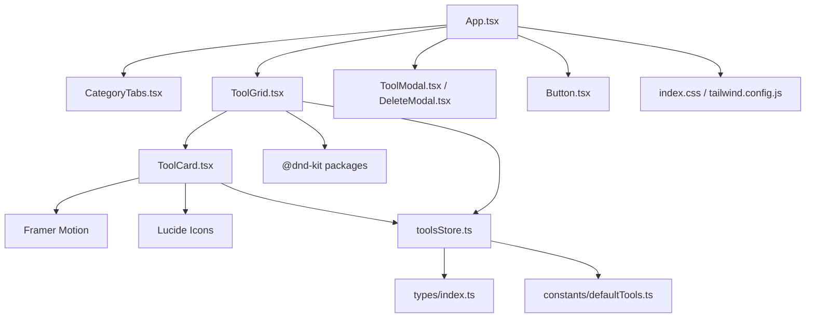
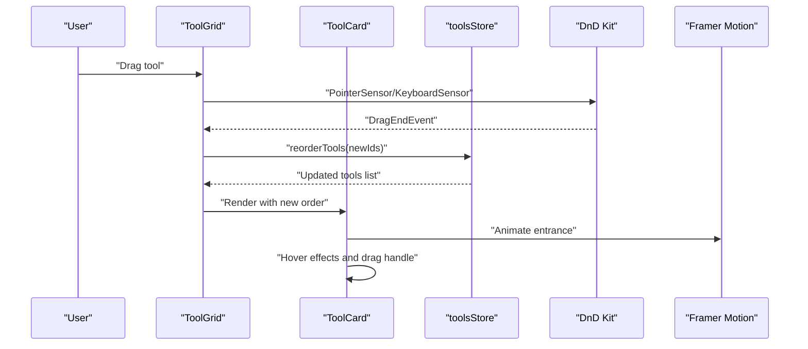
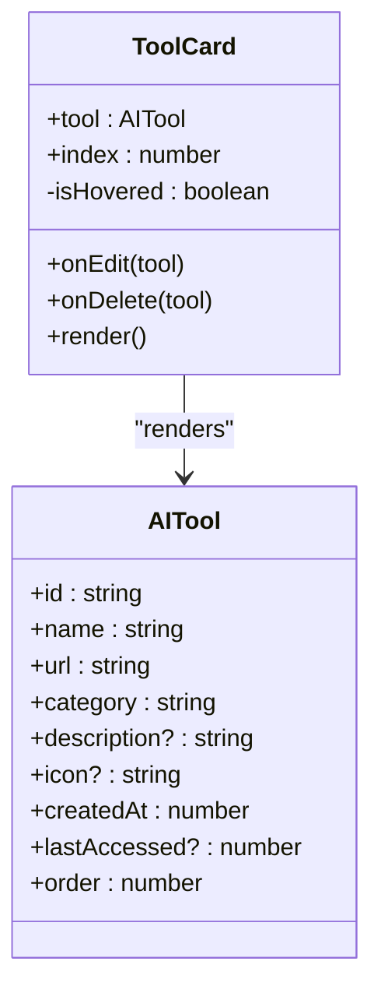
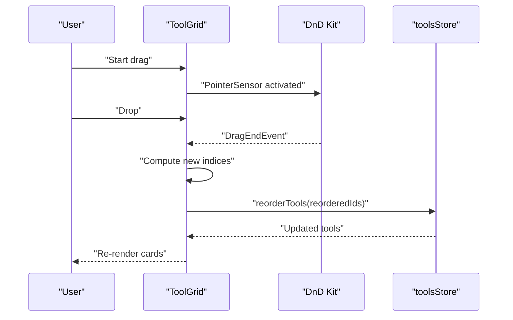
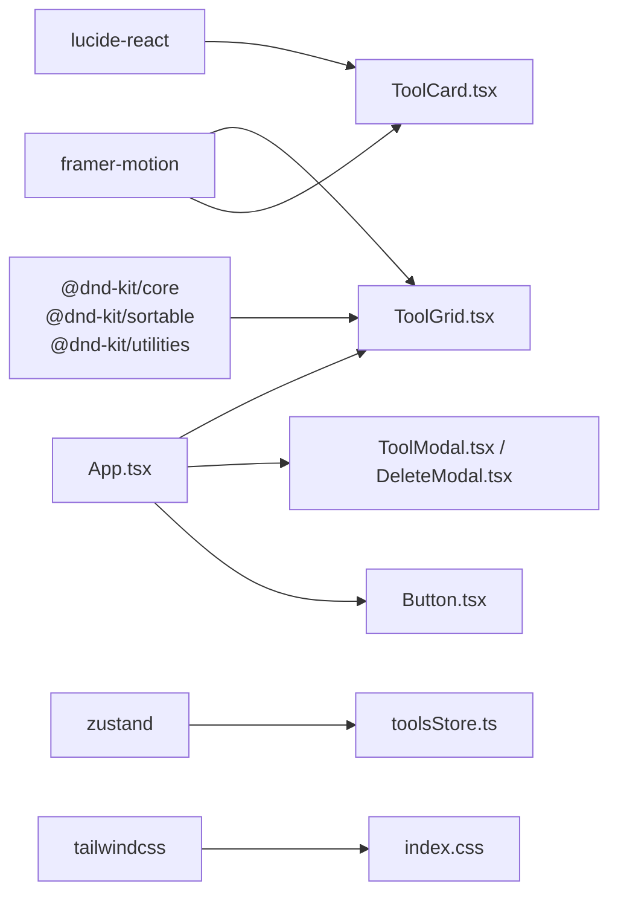

# Tool Display Components

<cite>
**Referenced Files in This Document**
- [ToolCard.tsx](file://src/components/features/ToolCard.tsx)
- [ToolGrid.tsx](file://src/components/features/ToolGrid.tsx)
- [toolsStore.ts](file://src/stores/toolsStore.ts)
- [index.ts](file://src/types/index.ts)
- [defaultTools.ts](file://src/constants/defaultTools.ts)
- [cn.ts](file://src/utils/cn.ts)
- [Button.tsx](file://src/components/ui/Button.tsx)
- [App.tsx](file://src/App.tsx)
- [index.css](file://src/index.css)
- [tailwind.config.js](file://tailwind.config.js)
- [ToolModal.tsx](file://src/components/modals/ToolModal.tsx)
- [DeleteModal.tsx](file://src/components/modals/DeleteModal.tsx)
- [CategoryTabs.tsx](file://src/components/features/CategoryTabs.tsx)
- [package.json](file://package.json)
</cite>

## Table of Contents
1. [Introduction](#introduction)
2. [Project Structure](#project-structure)
3. [Core Components](#core-components)
4. [Architecture Overview](#architecture-overview)
5. [Detailed Component Analysis](#detailed-component-analysis)
6. [Dependency Analysis](#dependency-analysis)
7. [Performance Considerations](#performance-considerations)
8. [Accessibility Features](#accessibility-features)
9. [Responsive Design and Theming](#responsive-design-and-theming)
10. [Troubleshooting Guide](#troubleshooting-guide)
11. [Conclusion](#conclusion)
12. [Appendices](#appendices)

## Introduction
This document provides comprehensive documentation for the tool display components in AIPulse, focusing on the ToolCard and ToolGrid components. It explains dynamic icon rendering, hover states, interactive elements, drag-and-drop integration using DnD Kit, Framer Motion animations, accessibility features, responsive design, and theming. It also covers customization patterns, styling overrides, and integration with other UI components.

## Project Structure
The tool display system centers around two primary components:
- ToolCard: Individual tool card with dynamic icon rendering, hover states, and action buttons.
- ToolGrid: Container that manages filtering, sorting, and drag-and-drop reordering via DnD Kit and Framer Motion.

These components integrate with a Zustand store for state management, TypeScript types for type safety, and Tailwind CSS for styling and theming.

**Diagram sources**
- [App.tsx](file://src/App.tsx#L1-L122)
- [CategoryTabs.tsx](file://src/components/features/CategoryTabs.tsx#L1-L106)
- [ToolGrid.tsx](file://src/components/features/ToolGrid.tsx#L1-L112)
- [ToolCard.tsx](file://src/components/features/ToolCard.tsx#L1-L141)
- [toolsStore.ts](file://src/stores/toolsStore.ts#L1-L177)
- [index.ts](file://src/types/index.ts#L1-L60)
- [defaultTools.ts](file://src/constants/defaultTools.ts#L1-L101)
- [ToolModal.tsx](file://src/components/modals/ToolModal.tsx#L1-L253)
- [DeleteModal.tsx](file://src/components/modals/DeleteModal.tsx#L1-L67)
- [Button.tsx](file://src/components/ui/Button.tsx#L1-L88)
- [index.css](file://src/index.css#L1-L141)
- [tailwind.config.js](file://tailwind.config.js#L1-L69)
- [package.json](file://package.json#L1-L36)

**Section sources**
- [App.tsx](file://src/App.tsx#L1-L122)
- [ToolGrid.tsx](file://src/components/features/ToolGrid.tsx#L1-L112)
- [ToolCard.tsx](file://src/components/features/ToolCard.tsx#L1-L141)
- [toolsStore.ts](file://src/stores/toolsStore.ts#L1-L177)
- [index.ts](file://src/types/index.ts#L1-L60)
- [defaultTools.ts](file://src/constants/defaultTools.ts#L1-L101)
- [index.css](file://src/index.css#L1-L141)
- [tailwind.config.js](file://tailwind.config.js#L1-L69)
- [package.json](file://package.json#L1-L36)

## Core Components
- ToolCard: Renders a single AI tool with dynamic icon, title, category badge, optional description, edit/delete actions, and a launch button. Implements hover states, drag handle visibility, and Framer Motion animations.
- ToolGrid: Provides filtering and sorting of tools, integrates DnD Kit for drag-and-drop reordering, and renders ToolCard instances in a responsive grid.

Key responsibilities:
- Dynamic icon rendering using Lucide icons mapped by name.
- Hover-triggered opacity transitions for edit/delete and drag handle.
- Framer Motion for entrance animations and hover/tap interactions.
- DnD Kit for pointer and keyboard interactions with visual feedback.
- Zustand store for CRUD operations, filtering, and ordering.

**Section sources**
- [ToolCard.tsx](file://src/components/features/ToolCard.tsx#L1-L141)
- [ToolGrid.tsx](file://src/components/features/ToolGrid.tsx#L1-L112)
- [toolsStore.ts](file://src/stores/toolsStore.ts#L1-L177)
- [index.ts](file://src/types/index.ts#L1-L60)

## Architecture Overview
The tool display architecture follows a unidirectional data flow:
- UI components render based on store state.
- User interactions trigger actions in the store.
- Store updates propagate to dependent components.

**Diagram sources**
- [ToolGrid.tsx](file://src/components/features/ToolGrid.tsx#L35-L56)
- [ToolCard.tsx](file://src/components/features/ToolCard.tsx#L47-L59)
- [toolsStore.ts](file://src/stores/toolsStore.ts#L53-L75)

## Detailed Component Analysis

### ToolCard Component
ToolCard renders a single tool with:
- Icon area: Dynamic icon rendering using Lucide icons by name, with a fallback icon if missing.
- Title section: Tool name and category badge.
- Description: Optional, clamped to two lines.
- Action buttons: Edit and Delete (visible on hover), and Launch (with Framer Motion hover/tap).

Interactive elements:
- Hover state toggles opacity for drag handle and action buttons.
- Drag handle uses DnD Kit attributes/listeners for grab affordance.
- Launch button opens the tool URL in a new tab and records recent usage.

Animations and transitions:
- Entrance animation with staggered delay based on index.
- Hover lift, shadow, and slight translation on hover.
- Dragging state reduces opacity and adds rotation for visual feedback.

Accessibility:
- Buttons include aria-labels for Edit and Delete.
- Focus-visible outlines applied globally for keyboard navigation.

Styling and theming:
- Uses Tailwind classes with dark/light variants.
- Responsive padding and spacing.
- Motion variants for hover/tap states.

Customization and overrides:
- Override icon rendering by setting the icon field to a valid Lucide icon name.
- Adjust hover effects by modifying the hover classes and motion props.
- Customize layout by adjusting the inner div structure and spacing classes.

Integration patterns:
- Works with ToolGrid for drag-and-drop reordering.
- Integrates with ToolModal and DeleteModal for editing and deletion.

**Section sources**
- [ToolCard.tsx](file://src/components/features/ToolCard.tsx#L1-L141)
- [cn.ts](file://src/utils/cn.ts#L1-L7)
- [index.css](file://src/index.css#L71-L75)

#### ToolCard Class Diagram

**Diagram sources**
- [ToolCard.tsx](file://src/components/features/ToolCard.tsx#L11-L16)
- [index.ts](file://src/types/index.ts#L1-L11)

### ToolGrid Component
ToolGrid manages:
- Filtering: Applies category and search filters via the store.
- Sorting: Uses DnD Kit with keyboard and pointer sensors.
- Reordering: On drag end, computes new order and persists via store.
- Empty state: Renders a friendly message with optional add button.

Layout:
- Responsive grid with 1–4 columns depending on viewport.
- Uses motion wrappers for empty state transitions.

Integration:
- Passes edit/delete handlers and add handler to ToolCard.
- Uses SortableContext with rectSortingStrategy for accurate collisions.

**Section sources**
- [ToolGrid.tsx](file://src/components/features/ToolGrid.tsx#L1-L112)
- [package.json](file://package.json#L22-L26)

#### ToolGrid Sequence Diagram

**Diagram sources**
- [ToolGrid.tsx](file://src/components/features/ToolGrid.tsx#L35-L56)
- [toolsStore.ts](file://src/stores/toolsStore.ts#L53-L75)

### Store Integration and Data Model
The toolsStore provides:
- CRUD operations for tools and categories.
- Filtering and sorting helpers.
- Theme toggling and recently used tracking.
- Persistence via Zustand middleware.

AITool and ToolsState define the data contract and actions used by components.

**Section sources**
- [toolsStore.ts](file://src/stores/toolsStore.ts#L1-L177)
- [index.ts](file://src/types/index.ts#L1-L60)
- [defaultTools.ts](file://src/constants/defaultTools.ts#L1-L101)

### UI Utilities and Styling
- cn utility merges Tailwind classes safely.
- Button component supports variants, sizes, and loading states.
- Global focus-visible styles and dark/light mode classes.
- Tailwind config defines primary/background/text/border palettes and animations.

**Section sources**
- [cn.ts](file://src/utils/cn.ts#L1-L7)
- [Button.tsx](file://src/components/ui/Button.tsx#L1-L88)
- [index.css](file://src/index.css#L71-L98)
- [tailwind.config.js](file://tailwind.config.js#L1-L69)

## Dependency Analysis
External libraries:
- DnD Kit: Core, Sortable, and Utilities for drag-and-drop.
- Framer Motion: Animations and gesture handling.
- Lucide React: Icons for dynamic rendering.
- Zustand: Global state management with persistence.
- Tailwind CSS: Utility-first styling and theme tokens.

Internal dependencies:
- ToolGrid depends on ToolCard and DnD Kit.
- ToolCard depends on DnD Kit, Framer Motion, Lucide icons, and the store.
- App composes ToolGrid and modals, applies theme class.

**Diagram sources**
- [package.json](file://package.json#L22-L34)
- [ToolGrid.tsx](file://src/components/features/ToolGrid.tsx#L1-L112)
- [ToolCard.tsx](file://src/components/features/ToolCard.tsx#L1-L141)
- [toolsStore.ts](file://src/stores/toolsStore.ts#L1-L177)
- [index.css](file://src/index.css#L1-L141)
- [App.tsx](file://src/App.tsx#L1-L122)

**Section sources**
- [package.json](file://package.json#L1-L36)
- [ToolGrid.tsx](file://src/components/features/ToolGrid.tsx#L1-L112)
- [ToolCard.tsx](file://src/components/features/ToolCard.tsx#L1-L141)
- [toolsStore.ts](file://src/stores/toolsStore.ts#L1-L177)
- [index.css](file://src/index.css#L1-L141)
- [App.tsx](file://src/App.tsx#L1-L122)

## Performance Considerations
- Staggered entrance animations: ToolCard uses a per-item delay to avoid simultaneous heavy animations.
- Memoized filtering: ToolGrid computes filtered tools via useMemo to prevent unnecessary re-renders.
- Efficient reordering: toolsStore updates only the order property and merges remaining tools.
- Lightweight drag visuals: CSS transforms and minimal DOM changes during drag.

Recommendations:
- Keep icon names consistent with Lucide icon library to avoid runtime fallbacks.
- Prefer server-side filtering for very large datasets; client-side filtering is acceptable for moderate sizes.
- Debounce search input to reduce filter churn.

**Section sources**
- [ToolCard.tsx](file://src/components/features/ToolCard.tsx#L50-L52)
- [ToolGrid.tsx](file://src/components/features/ToolGrid.tsx#L33-L33)
- [toolsStore.ts](file://src/stores/toolsStore.ts#L53-L75)

## Accessibility Features
- ARIA labels: Edit and Delete buttons include aria-labels for assistive technologies.
- Keyboard navigation: DnD Kit KeyboardSensor enables keyboard-driven dragging.
- Focus styles: Global focus-visible outline ensures keyboard users see focus.
- Screen reader support: Descriptive labels and semantic button usage.

Considerations:
- Ensure color contrast meets WCAG guidelines across dark/light themes.
- Provide skip links or landmarks for complex pages if extended.

**Section sources**
- [ToolCard.tsx](file://src/components/features/ToolCard.tsx#L113-L121)
- [ToolGrid.tsx](file://src/components/features/ToolGrid.tsx#L41-L43)
- [index.css](file://src/index.css#L71-L75)

## Responsive Design and Theming
- Responsive grid: ToolGrid uses Tailwind’s responsive grid classes to adapt columns across breakpoints.
- Dark/light theme: Tailwind’s darkMode class toggled by App; theme tokens defined centrally.
- Motion transitions: Smooth entrance and hover animations enhance usability on all devices.

Cross-browser compatibility:
- Framer Motion and DnD Kit target modern browsers; ensure polyfills if supporting legacy environments.
- Tailwind utilities are widely supported; test on target browsers.

**Section sources**
- [ToolGrid.tsx](file://src/components/features/ToolGrid.tsx#L97-L107)
- [App.tsx](file://src/App.tsx#L19-L26)
- [tailwind.config.js](file://tailwind.config.js#L7-L69)
- [index.css](file://src/index.css#L90-L98)

## Troubleshooting Guide
Common issues and resolutions:
- Drag handle not visible: Ensure ToolCard hover state is reachable; check z-index and absolute positioning.
- Icons not rendering: Verify icon name matches Lucide icon export; fallback icon is used if missing.
- Reordering not working: Confirm DnD Kit sensors are configured and SortableContext items match filtered tools.
- Theme not applying: Ensure dark class is toggled on document element and Tailwind darkMode is set to class.

Debug tips:
- Log filtered tools and dragged indices to confirm correct ordering.
- Inspect computed styles for hover and drag states.
- Validate store state after drag end to ensure persistence.

**Section sources**
- [ToolCard.tsx](file://src/components/features/ToolCard.tsx#L62-L71)
- [ToolGrid.tsx](file://src/components/features/ToolGrid.tsx#L88-L96)
- [toolsStore.ts](file://src/stores/toolsStore.ts#L53-L75)
- [App.tsx](file://src/App.tsx#L19-L26)

## Conclusion
The tool display components in AIPulse combine dynamic icon rendering, smooth animations, robust drag-and-drop reordering, and thoughtful accessibility to deliver a polished user experience. The modular architecture, clear data contracts, and consistent theming enable easy customization and integration with other UI elements.

## Appendices

### Customization Examples
- Change icon set: Update the icon field to any Lucide icon name; fallback ensures rendering.
- Modify hover effects: Adjust hover classes and motion props in ToolCard.
- Customize grid: Adjust grid column classes in ToolGrid for different layouts.
- Override animations: Tune motion variants and delays in ToolCard and ToolGrid.

**Section sources**
- [ToolCard.tsx](file://src/components/features/ToolCard.tsx#L77-L82)
- [ToolGrid.tsx](file://src/components/features/ToolGrid.tsx#L97-L107)

### Integration Patterns
- Editing tools: Use ToolModal with ToolCard’s onEdit callback.
- Deleting tools: Use DeleteModal with ToolCard’s onDelete callback.
- Adding tools: Trigger ToolModal from ToolGrid’s add handler.
- Filtering: Use CategoryTabs and search input to update store filters.

**Section sources**
- [ToolModal.tsx](file://src/components/modals/ToolModal.tsx#L1-L253)
- [DeleteModal.tsx](file://src/components/modals/DeleteModal.tsx#L1-L67)
- [CategoryTabs.tsx](file://src/components/features/CategoryTabs.tsx#L1-L106)
- [App.tsx](file://src/App.tsx#L28-L51)