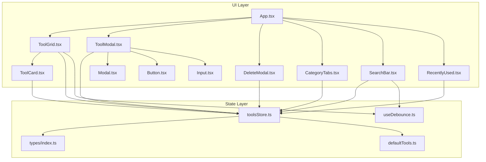
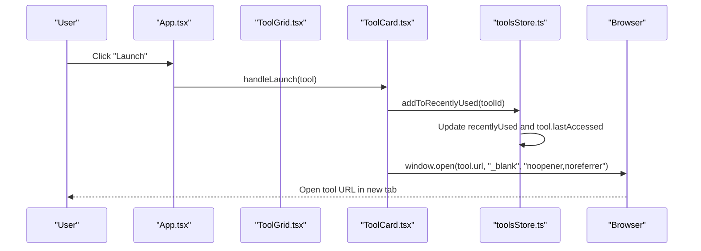
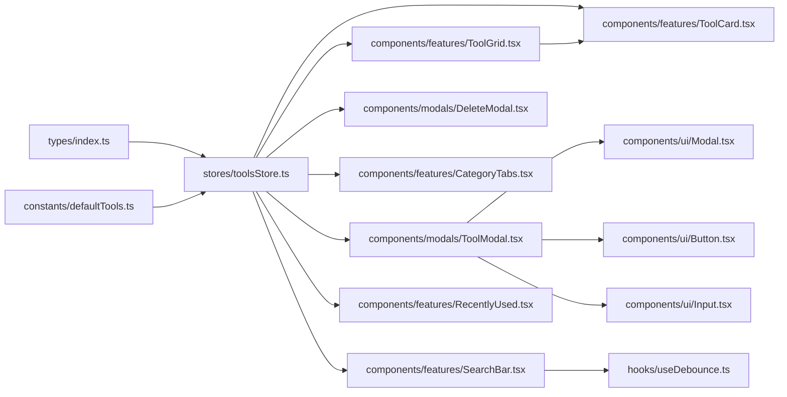

# Tool Lifecycle Management

<cite>
**Referenced Files in This Document**
- [toolsStore.ts](file://src/stores/toolsStore.ts)
- [defaultTools.ts](file://src/constants/defaultTools.ts)
- [index.ts](file://src/types/index.ts)
- [App.tsx](file://src/App.tsx)
- [ToolGrid.tsx](file://src/components/features/ToolGrid.tsx)
- [ToolCard.tsx](file://src/components/features/ToolCard.tsx)
- [ToolModal.tsx](file://src/components/modals/ToolModal.tsx)
- [DeleteModal.tsx](file://src/components/modals/DeleteModal.tsx)
- [CategoryTabs.tsx](file://src/components/features/CategoryTabs.tsx)
- [SearchBar.tsx](file://src/components/features/SearchBar.tsx)
- [RecentlyUsed.tsx](file://src/components/features/RecentlyUsed.tsx)
- [Modal.tsx](file://src/components/ui/Modal.tsx)
- [Button.tsx](file://src/components/ui/Button.tsx)
- [Input.tsx](file://src/components/ui/Input.tsx)
- [useDebounce.ts](file://src/hooks/useDebounce.ts)
</cite>

## Table of Contents
1. [Introduction](#introduction)
2. [Project Structure](#project-structure)
3. [Core Components](#core-components)
4. [Architecture Overview](#architecture-overview)
5. [Detailed Component Analysis](#detailed-component-analysis)
6. [Dependency Analysis](#dependency-analysis)
7. [Performance Considerations](#performance-considerations)
8. [Troubleshooting Guide](#troubleshooting-guide)
9. [Conclusion](#conclusion)

## Introduction
This document explains the complete tool lifecycle management in AIPulse, covering the end-to-end journey from creation to deletion. It details state transitions, metadata updates, persistence cycles, initialization with defaults, validation during creation and editing, launch behavior including recently used tracking, URL validation, and external integration. It also documents organization features such as drag-and-drop reordering, category changes, and search indexing, along with metadata management for descriptions, URLs, icons, and categorization. Validation rules, error handling, and user interaction patterns are included to help developers and operators maintain and extend the system effectively.

## Project Structure
AIPulse organizes tool lifecycle logic around a central Zustand store with supporting UI components and modals. The store manages tools, categories, filters, theme, and recently used entries. UI components render the tool grid, cards, modals, category tabs, search bar, and recently used panel. Types define the shape of tools and state. Defaults initialize categories and example tools.

**Diagram sources**
- [App.tsx](file://src/App.tsx#L1-L122)
- [ToolGrid.tsx](file://src/components/features/ToolGrid.tsx#L1-L112)
- [ToolCard.tsx](file://src/components/features/ToolCard.tsx#L1-L141)
- [ToolModal.tsx](file://src/components/modals/ToolModal.tsx#L1-L253)
- [DeleteModal.tsx](file://src/components/modals/DeleteModal.tsx#L1-L67)
- [CategoryTabs.tsx](file://src/components/features/CategoryTabs.tsx#L1-L106)
- [SearchBar.tsx](file://src/components/features/SearchBar.tsx#L1-L42)
- [RecentlyUsed.tsx](file://src/components/features/RecentlyUsed.tsx#L1-L101)
- [Modal.tsx](file://src/components/ui/Modal.tsx#L1-L128)
- [Button.tsx](file://src/components/ui/Button.tsx#L1-L88)
- [Input.tsx](file://src/components/ui/Input.tsx#L1-L74)
- [toolsStore.ts](file://src/stores/toolsStore.ts#L1-L177)
- [index.ts](file://src/types/index.ts#L1-L60)
- [defaultTools.ts](file://src/constants/defaultTools.ts#L1-L101)
- [useDebounce.ts](file://src/hooks/useDebounce.ts#L1-L18)

**Section sources**
- [App.tsx](file://src/App.tsx#L1-L122)
- [toolsStore.ts](file://src/stores/toolsStore.ts#L1-L177)
- [index.ts](file://src/types/index.ts#L1-L60)
- [defaultTools.ts](file://src/constants/defaultTools.ts#L1-L101)

## Core Components
- Tools store: Centralized state for tools, categories, filters, theme, and recently used. Provides CRUD operations, filtering, ordering, and persistence via a Zustand middleware.
- Tool grid and card: Render tools, support drag-and-drop reordering, and launch tools with recently used tracking.
- Tool modal: Handles creation and editing with form validation, category creation, and icon selection.
- Delete modal: Confirms and executes tool deletion.
- Category tabs and search bar: Filter tools by category and search query.
- Recently used panel: Displays and launches recently accessed tools.
- UI primitives: Modal, Button, Input used across forms and modals.

Key responsibilities:
- Initialization: Loads default categories and example tools, sets up persisted state.
- Creation: Generates IDs, timestamps, and order; validates inputs; persists changes.
- Editing: Updates metadata and maintains order; validates inputs.
- Deletion: Removes tools and cleans up references in recently used list.
- Organization: Supports category filtering, search indexing, and drag reordering.
- Launch: Tracks recently used and opens URLs in a new tab with security attributes.

**Section sources**
- [toolsStore.ts](file://src/stores/toolsStore.ts#L1-L177)
- [ToolGrid.tsx](file://src/components/features/ToolGrid.tsx#L1-L112)
- [ToolCard.tsx](file://src/components/features/ToolCard.tsx#L1-L141)
- [ToolModal.tsx](file://src/components/modals/ToolModal.tsx#L1-L253)
- [DeleteModal.tsx](file://src/components/modals/DeleteModal.tsx#L1-L67)
- [CategoryTabs.tsx](file://src/components/features/CategoryTabs.tsx#L1-L106)
- [SearchBar.tsx](file://src/components/features/SearchBar.tsx#L1-L42)
- [RecentlyUsed.tsx](file://src/components/features/RecentlyUsed.tsx#L1-L101)

## Architecture Overview
The tool lifecycle follows a unidirectional data flow:
- UI triggers actions via handlers and events.
- Store updates state immutably and persists it.
- UI re-renders based on derived state (filters, ordering).
- External integrations occur during tool launch (browser navigation).

**Diagram sources**
- [ToolCard.tsx](file://src/components/features/ToolCard.tsx#L41-L44)
- [toolsStore.ts](file://src/stores/toolsStore.ts#L112-L129)

**Section sources**
- [ToolCard.tsx](file://src/components/features/ToolCard.tsx#L1-L141)
- [toolsStore.ts](file://src/stores/toolsStore.ts#L1-L177)

## Detailed Component Analysis

### Tools Store (State Management)
The store encapsulates:
- Initial state: tools, categories, search query, selected category, theme, recently used.
- Tool CRUD: addTool, updateTool, deleteTool, reorderTools.
- Category management: addCategory, deleteCategory.
- Filters: setSearchQuery, setSelectedCategory, getFilteredTools.
- Theme: toggleTheme, setDarkMode.
- Recently used: addToRecentlyUsed, getRecentlyUsedTools.
- Persistence: Zustand middleware to persist tools, categories, theme, and recently used.

Initialization and defaults:
- Loads default categories and example tools.
- Assigns UUIDs, timestamps, and initial order during creation.

Filtering and sorting:
- Filters by selected category and search query (name, category, description).
- Sorts by order for display stability.

Reordering:
- Rebuilds order indices based on drag-and-drop reordering.

Recently used:
- Maintains a capped list of recent tool IDs and updates lastAccessed timestamps.

Validation and constraints:
- Validation occurs in the modal (URL format, required fields).
- Category constraints enforced by category options and optional creation flow.

Persistence:
- Persists tools, categories, theme, and recently used to storage.

**Section sources**
- [toolsStore.ts](file://src/stores/toolsStore.ts#L1-L177)
- [defaultTools.ts](file://src/constants/defaultTools.ts#L1-L101)
- [index.ts](file://src/types/index.ts#L1-L60)

### Tool Creation and Editing (ToolModal)
Creation flow:
- Opens modal with empty form or pre-filled edit form.
- Validates required fields and URL format.
- On submit, adds tool with generated ID, timestamp, and order.

Editing flow:
- Pre-populates form with current tool metadata.
- Validates and updates tool in store.

Validation:
- Name required.
- URL required and must be a valid URL.
- Category required.

Category creation:
- Option to create a new category inline, then selects it.

Icon selection:
- Presents a grid of icon options for quick selection.

Form state and UX:
- Debounces submission, disables save button until valid, and shows loading state.

**Section sources**
- [ToolModal.tsx](file://src/components/modals/ToolModal.tsx#L1-L253)
- [Input.tsx](file://src/components/ui/Input.tsx#L1-L74)
- [Button.tsx](file://src/components/ui/Button.tsx#L1-L88)
- [Modal.tsx](file://src/components/ui/Modal.tsx#L1-L128)

### Tool Deletion (DeleteModal)
- Confirms deletion with a warning message.
- On confirmation, removes tool from store and clears any references in recently used.

UX:
- Loading state simulates a short delay for better feedback.
- Escape key and backdrop click close the modal.

**Section sources**
- [DeleteModal.tsx](file://src/components/modals/DeleteModal.tsx#L1-L67)

### Tool Launch and Recently Used Tracking
- Launching a tool:
  - Adds tool to recently used list (capped to latest 10).
  - Updates lastAccessed timestamp.
  - Opens URL in a new tab with security attributes.

- Recently used panel:
  - Displays up to six most recent tools.
  - Allows quick launch with updated tracking.

**Section sources**
- [ToolCard.tsx](file://src/components/features/ToolCard.tsx#L41-L44)
- [RecentlyUsed.tsx](file://src/components/features/RecentlyUsed.tsx#L20-L23)
- [toolsStore.ts](file://src/stores/toolsStore.ts#L112-L129)

### Tool Organization (Category Filtering, Search, Drag-and-Drop)
- Category filtering:
  - CategoryTabs displays categories with counts and toggles selection.
  - Selected category filters tools; clicking again clears filter.

- Search indexing:
  - SearchBar debounces input and updates search query.
  - getFilteredTools searches across name, category, and description.

- Drag-and-drop reordering:
  - ToolGrid integrates DnD Kit sensors and sortable context.
  - On drag end, computes new order and updates all affected tools.

- Sorting:
  - Tools are sorted by order after filtering.

**Section sources**
- [CategoryTabs.tsx](file://src/components/features/CategoryTabs.tsx#L1-L106)
- [SearchBar.tsx](file://src/components/features/SearchBar.tsx#L1-L42)
- [useDebounce.ts](file://src/hooks/useDebounce.ts#L1-L18)
- [ToolGrid.tsx](file://src/components/features/ToolGrid.tsx#L1-L112)
- [toolsStore.ts](file://src/stores/toolsStore.ts#L132-L156)

### Tool Rendering and Interactions (ToolCard)
- Renders tool metadata: icon, name, category, description.
- Hover actions: edit and delete buttons appear.
- Launch button triggers recently used tracking and opens URL.
- Drag handle enables reordering via DnD Kit.

**Section sources**
- [ToolCard.tsx](file://src/components/features/ToolCard.tsx#L1-L141)

### Application Orchestration (App)
- Manages modal visibility and selected tool context.
- Applies theme class to document element.
- Passes handlers to ToolGrid for edit/delete/add actions.

**Section sources**
- [App.tsx](file://src/App.tsx#L1-L122)

## Dependency Analysis
The system exhibits clear separation of concerns:
- UI components depend on the store for state and actions.
- Store depends on types and defaults for shape and initialization.
- Utilities (debounce) support UI responsiveness.
- No circular dependencies observed among major modules.

**Diagram sources**
- [index.ts](file://src/types/index.ts#L1-L60)
- [defaultTools.ts](file://src/constants/defaultTools.ts#L1-L101)
- [toolsStore.ts](file://src/stores/toolsStore.ts#L1-L177)
- [ToolGrid.tsx](file://src/components/features/ToolGrid.tsx#L1-L112)
- [ToolCard.tsx](file://src/components/features/ToolCard.tsx#L1-L141)
- [ToolModal.tsx](file://src/components/modals/ToolModal.tsx#L1-L253)
- [DeleteModal.tsx](file://src/components/modals/DeleteModal.tsx#L1-L67)
- [CategoryTabs.tsx](file://src/components/features/CategoryTabs.tsx#L1-L106)
- [SearchBar.tsx](file://src/components/features/SearchBar.tsx#L1-L42)
- [RecentlyUsed.tsx](file://src/components/features/RecentlyUsed.tsx#L1-L101)
- [Modal.tsx](file://src/components/ui/Modal.tsx#L1-L128)
- [Button.tsx](file://src/components/ui/Button.tsx#L1-L88)
- [Input.tsx](file://src/components/ui/Input.tsx#L1-L74)
- [useDebounce.ts](file://src/hooks/useDebounce.ts#L1-L18)

**Section sources**
- [toolsStore.ts](file://src/stores/toolsStore.ts#L1-L177)
- [index.ts](file://src/types/index.ts#L1-L60)
- [defaultTools.ts](file://src/constants/defaultTools.ts#L1-L101)

## Performance Considerations
- Filtering and sorting:
  - getFilteredTools runs per render; memoize where appropriate if performance becomes a concern.
- Drag-and-drop:
  - arrayMove and reorderTools rebuild orders; keep lists reasonably sized for smooth interactions.
- Debouncing:
  - Search debouncing prevents excessive store updates.
- Rendering:
  - ToolCard animations and DnD transforms are lightweight; avoid heavy computations in render paths.

[No sources needed since this section provides general guidance]

## Troubleshooting Guide
Common issues and resolutions:
- URL validation failures:
  - Ensure URLs include protocol (e.g., https://). Validation checks for a valid URL constructor input.
- Category not selectable:
  - Verify category exists in store or use the “Create new category” option in the modal.
- Tool not appearing after creation:
  - Confirm filters are cleared; search query or category filter may hide the tool.
- Drag-and-drop not working:
  - Ensure DnD sensors are enabled and sortable context items match filtered tools.
- Recently used not updating:
  - Launch via the card’s Launch button to trigger addToRecentlyUsed; verify recentlyUsed list is not empty.

**Section sources**
- [ToolModal.tsx](file://src/components/modals/ToolModal.tsx#L50-L78)
- [ToolGrid.tsx](file://src/components/features/ToolGrid.tsx#L46-L56)
- [ToolCard.tsx](file://src/components/features/ToolCard.tsx#L41-L44)
- [toolsStore.ts](file://src/stores/toolsStore.ts#L112-L129)

## Conclusion
AIPulse implements a robust tool lifecycle with clear state boundaries, comprehensive validation, and intuitive organization features. The store centralizes persistence and derived logic, while UI components provide responsive interactions for creation, editing, deletion, launching, filtering, and reordering. The design supports scalability and maintainability, enabling future enhancements such as duplicate detection, advanced categorization, and richer metadata.