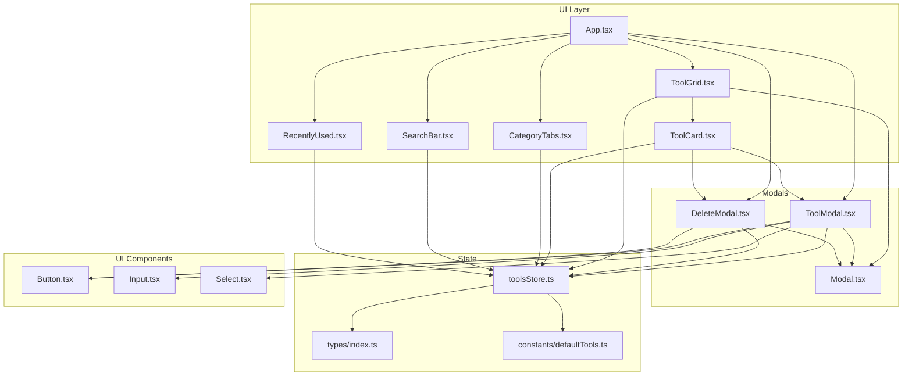
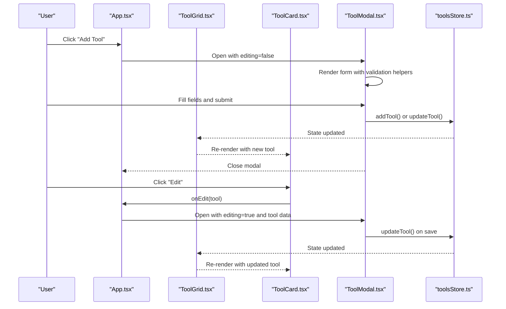
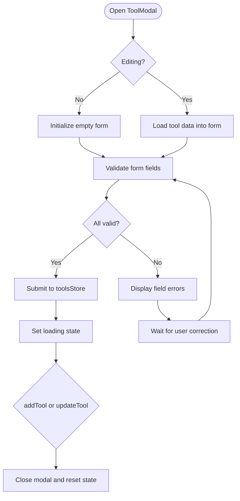
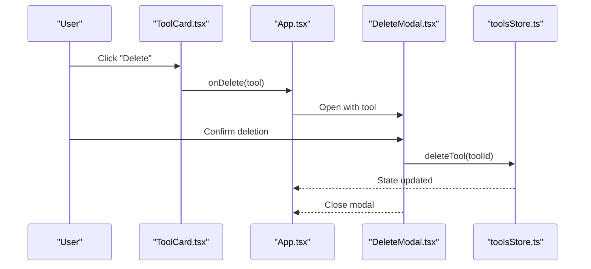
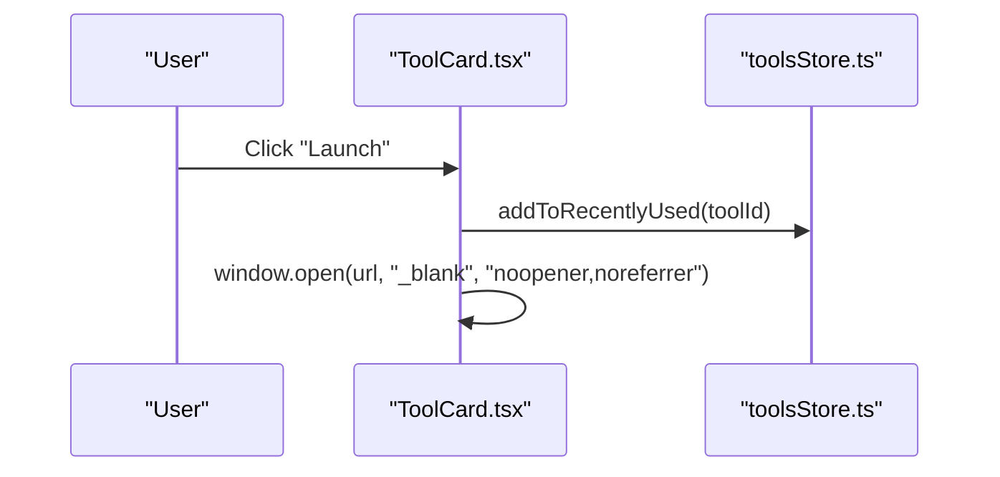
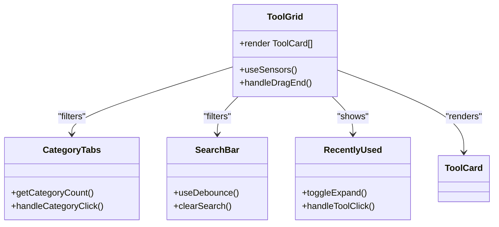
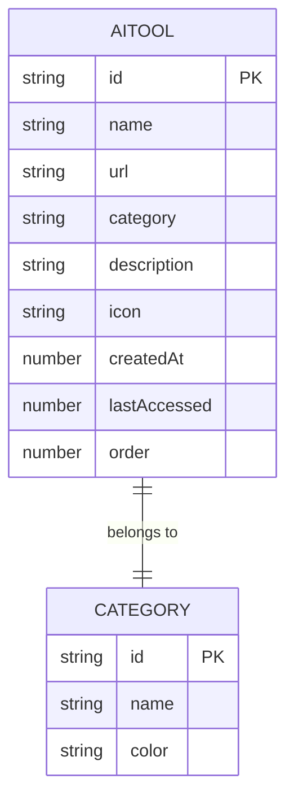
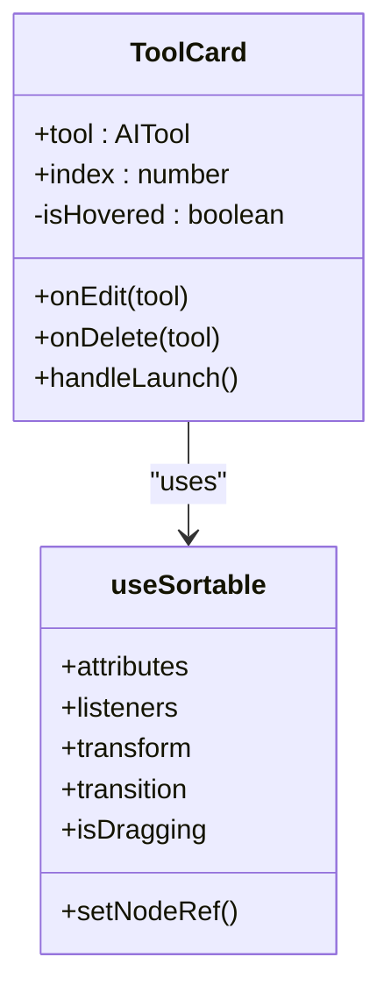
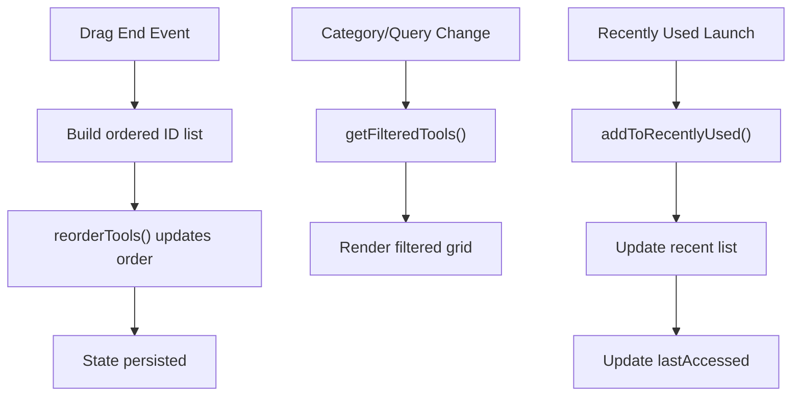
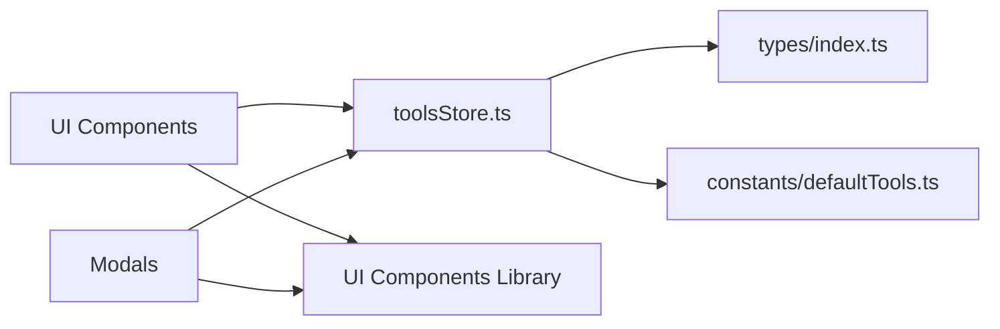

# Tool Management System

<cite>
**Referenced Files in This Document**
- [App.tsx](file://src/App.tsx)
- [ToolModal.tsx](file://src/components/modals/ToolModal.tsx)
- [DeleteModal.tsx](file://src/components/modals/DeleteModal.tsx)
- [ToolCard.tsx](file://src/components/features/ToolCard.tsx)
- [ToolGrid.tsx](file://src/components/features/ToolGrid.tsx)
- [CategoryTabs.tsx](file://src/components/features/CategoryTabs.tsx)
- [SearchBar.tsx](file://src/components/features/SearchBar.tsx)
- [RecentlyUsed.tsx](file://src/components/features/RecentlyUsed.tsx)
- [Modal.tsx](file://src/components/ui/Modal.tsx)
- [Button.tsx](file://src/components/ui/Button.tsx)
- [Input.tsx](file://src/components/ui/Input.tsx)
- [Select.tsx](file://src/components/ui/Select.tsx)
- [toolsStore.ts](file://src/stores/toolsStore.ts)
- [index.ts](file://src/types/index.ts)
- [defaultTools.ts](file://src/constants/defaultTools.ts)
- [useDebounce.ts](file://src/hooks/useDebounce.ts)
</cite>

## Table of Contents
1. [Introduction](#introduction)
2. [Project Structure](#project-structure)
3. [Core Components](#core-components)
4. [Architecture Overview](#architecture-overview)
5. [Detailed Component Analysis](#detailed-component-analysis)
6. [Dependency Analysis](#dependency-analysis)
7. [Performance Considerations](#performance-considerations)
8. [Troubleshooting Guide](#troubleshooting-guide)
9. [Conclusion](#conclusion)
10. [Appendices](#appendices)

## Introduction
This document provides comprehensive tool management documentation for the AIPulse application. It covers the complete lifecycle of AI tools: creation, editing, deletion, launching, and organization. The system integrates form validation, category assignment, icon selection, drag-and-drop reordering, category-based filtering, search functionality, and persistent state management. It also documents the ToolCard component, modal workflows, and error handling strategies.

## Project Structure
The tool management system is organized around a central Zustand store that manages tools, categories, filters, and recently used items. UI components encapsulate presentation and user interactions, while modals provide focused workflows for creating and deleting tools.

**Diagram sources**
- [App.tsx](file://src/App.tsx#L1-L122)
- [ToolGrid.tsx](file://src/components/features/ToolGrid.tsx#L1-L112)
- [ToolCard.tsx](file://src/components/features/ToolCard.tsx#L1-L141)
- [CategoryTabs.tsx](file://src/components/features/CategoryTabs.tsx#L1-L106)
- [SearchBar.tsx](file://src/components/features/SearchBar.tsx#L1-L42)
- [RecentlyUsed.tsx](file://src/components/features/RecentlyUsed.tsx#L1-L101)
- [ToolModal.tsx](file://src/components/modals/ToolModal.tsx#L1-L253)
- [DeleteModal.tsx](file://src/components/modals/DeleteModal.tsx#L1-L67)
- [Modal.tsx](file://src/components/ui/Modal.tsx#L1-L128)
- [Button.tsx](file://src/components/ui/Button.tsx#L1-L88)
- [Input.tsx](file://src/components/ui/Input.tsx#L1-L74)
- [Select.tsx](file://src/components/ui/Select.tsx#L1-L61)
- [toolsStore.ts](file://src/stores/toolsStore.ts#L1-L177)
- [index.ts](file://src/types/index.ts#L1-L60)
- [defaultTools.ts](file://src/constants/defaultTools.ts#L1-L101)

**Section sources**
- [App.tsx](file://src/App.tsx#L1-L122)
- [toolsStore.ts](file://src/stores/toolsStore.ts#L1-L177)
- [index.ts](file://src/types/index.ts#L1-L60)
- [defaultTools.ts](file://src/constants/defaultTools.ts#L1-L101)

## Core Components
- ToolModal: Handles tool creation and editing with form validation, category assignment, and icon selection.
- ToolCard: Renders individual tools with interactive elements, drag handles, and launch actions.
- ToolGrid: Manages the grid layout, drag-and-drop reordering, and empty state handling.
- CategoryTabs: Provides category-based filtering with counts and active state indicators.
- SearchBar: Implements debounced search with clear functionality.
- DeleteModal: Confirms and executes tool deletion with loading states.
- toolsStore: Centralized state management for tools, categories, filters, and recently used items.
- UI Components: Modal, Button, Input, and Select provide reusable form controls and modal infrastructure.

**Section sources**
- [ToolModal.tsx](file://src/components/modals/ToolModal.tsx#L1-L253)
- [ToolCard.tsx](file://src/components/features/ToolCard.tsx#L1-L141)
- [ToolGrid.tsx](file://src/components/features/ToolGrid.tsx#L1-L112)
- [CategoryTabs.tsx](file://src/components/features/CategoryTabs.tsx#L1-L106)
- [SearchBar.tsx](file://src/components/features/SearchBar.tsx#L1-L42)
- [DeleteModal.tsx](file://src/components/modals/DeleteModal.tsx#L1-L67)
- [toolsStore.ts](file://src/stores/toolsStore.ts#L1-L177)
- [Modal.tsx](file://src/components/ui/Modal.tsx#L1-L128)
- [Button.tsx](file://src/components/ui/Button.tsx#L1-L88)
- [Input.tsx](file://src/components/ui/Input.tsx#L1-L74)
- [Select.tsx](file://src/components/ui/Select.tsx#L1-L61)

## Architecture Overview
The system follows a unidirectional data flow pattern:
- UI components trigger actions via the toolsStore.
- The store updates state and persists it using Zustand middleware.
- Components re-render based on state changes.
- Modals encapsulate focused workflows with validation and loading states.

**Diagram sources**
- [App.tsx](file://src/App.tsx#L28-L51)
- [ToolGrid.tsx](file://src/components/features/ToolGrid.tsx#L24-L28)
- [ToolCard.tsx](file://src/components/features/ToolCard.tsx#L11-L16)
- [ToolModal.tsx](file://src/components/modals/ToolModal.tsx#L23-L48)
- [toolsStore.ts](file://src/stores/toolsStore.ts#L26-L51)

## Detailed Component Analysis

### Tool Creation and Editing Workflow (ToolModal)
The ToolModal component manages both creation and editing of tools:
- Form state initialization for new vs existing tools.
- Real-time validation for name, URL, and category.
- Category selection with support for creating new categories.
- Icon selection from a predefined set.
- Submission handling with loading states and persistence via toolsStore.

**Diagram sources**
- [ToolModal.tsx](file://src/components/modals/ToolModal.tsx#L33-L48)
- [ToolModal.tsx](file://src/components/modals/ToolModal.tsx#L50-L69)
- [ToolModal.tsx](file://src/components/modals/ToolModal.tsx#L80-L108)
- [toolsStore.ts](file://src/stores/toolsStore.ts#L26-L51)

**Section sources**
- [ToolModal.tsx](file://src/components/modals/ToolModal.tsx#L1-L253)
- [Input.tsx](file://src/components/ui/Input.tsx#L1-L74)
- [Select.tsx](file://src/components/ui/Select.tsx#L1-L61)
- [Button.tsx](file://src/components/ui/Button.tsx#L1-L88)
- [Modal.tsx](file://src/components/ui/Modal.tsx#L1-L128)

### Tool Deletion Workflow (DeleteModal)
The DeleteModal provides a confirmation dialog for tool removal:
- Confirmation prompt with destructive warning.
- Loading state during deletion operation.
- Persistence via toolsStore.deleteTool.
- Cascade cleanup of recently used entries.

**Diagram sources**
- [ToolCard.tsx](file://src/components/features/ToolCard.tsx#L117-L123)
- [App.tsx](file://src/App.tsx#L38-L51)
- [DeleteModal.tsx](file://src/components/modals/DeleteModal.tsx#L13-L28)
- [toolsStore.ts](file://src/stores/toolsStore.ts#L46-L51)

**Section sources**
- [DeleteModal.tsx](file://src/components/modals/DeleteModal.tsx#L1-L67)
- [toolsStore.ts](file://src/stores/toolsStore.ts#L46-L51)

### Tool Launch Functionality
ToolCard integrates with external AI tool URLs:
- Launch action updates recently used list and opens URL in a new tab.
- Browser window management uses secure flags for safety.

**Diagram sources**
- [ToolCard.tsx](file://src/components/features/ToolCard.tsx#L41-L44)
- [RecentlyUsed.tsx](file://src/components/features/RecentlyUsed.tsx#L20-L23)
- [toolsStore.ts](file://src/stores/toolsStore.ts#L113-L129)

**Section sources**
- [ToolCard.tsx](file://src/components/features/ToolCard.tsx#L1-L141)
- [RecentlyUsed.tsx](file://src/components/features/RecentlyUsed.tsx#L1-L101)
- [toolsStore.ts](file://src/stores/toolsStore.ts#L112-L129)

### Tool Organization Features
- Drag-and-drop reordering using @dnd-kit with keyboard and pointer sensors.
- Category-based filtering with active state and counts.
- Search functionality with debounced queries and clear controls.
- Recently used tools with expandable list and quick launch.

**Diagram sources**
- [ToolGrid.tsx](file://src/components/features/ToolGrid.tsx#L35-L56)
- [CategoryTabs.tsx](file://src/components/features/CategoryTabs.tsx#L8-L19)
- [SearchBar.tsx](file://src/components/features/SearchBar.tsx#L6-L18)
- [RecentlyUsed.tsx](file://src/components/features/RecentlyUsed.tsx#L13-L23)

**Section sources**
- [ToolGrid.tsx](file://src/components/features/ToolGrid.tsx#L1-L112)
- [CategoryTabs.tsx](file://src/components/features/CategoryTabs.tsx#L1-L106)
- [SearchBar.tsx](file://src/components/features/SearchBar.tsx#L1-L42)
- [RecentlyUsed.tsx](file://src/components/features/RecentlyUsed.tsx#L1-L101)
- [useDebounce.ts](file://src/hooks/useDebounce.ts#L1-L18)

### Tool Metadata Management
Metadata includes identifiers, URLs, categories, descriptions, icons, timestamps, and ordering. The system ensures data integrity through:
- Validation for required fields.
- URL format verification.
- Unique IDs and auto-generated order values.
- Consistent persistence across sessions.

**Diagram sources**
- [index.ts](file://src/types/index.ts#L1-L60)
- [defaultTools.ts](file://src/constants/defaultTools.ts#L12-L73)

**Section sources**
- [index.ts](file://src/types/index.ts#L1-L60)
- [defaultTools.ts](file://src/constants/defaultTools.ts#L1-L101)

### ToolCard Component Implementation
ToolCard renders individual tools with:
- Dynamic icon rendering from LucideIcons.
- Hover states for edit/delete actions.
- Drag handle integration with @dnd-kit.
- Smooth animations and transitions.
- Launch button with external link icon.

**Diagram sources**
- [ToolCard.tsx](file://src/components/features/ToolCard.tsx#L11-L29)
- [ToolCard.tsx](file://src/components/features/ToolCard.tsx#L22-L34)

**Section sources**
- [ToolCard.tsx](file://src/components/features/ToolCard.tsx#L1-L141)

### Bulk Operations and Data Integrity
- Bulk reorder: ToolGrid triggers reorderTools with the new order IDs, updating each tool's order property.
- Category filtering: CategoryTabs toggles selectedCategory, affecting getFilteredTools.
- Search filtering: SearchBar updates searchQuery via debounced input, impacting getFilteredTools.
- Recently used: addToRecentlyUsed maintains up to 10 items and updates lastAccessed timestamps.

**Diagram sources**
- [ToolGrid.tsx](file://src/components/features/ToolGrid.tsx#L46-L56)
- [toolsStore.ts](file://src/stores/toolsStore.ts#L53-L75)
- [toolsStore.ts](file://src/stores/toolsStore.ts#L132-L156)
- [toolsStore.ts](file://src/stores/toolsStore.ts#L113-L129)

**Section sources**
- [ToolGrid.tsx](file://src/components/features/ToolGrid.tsx#L1-L112)
- [toolsStore.ts](file://src/stores/toolsStore.ts#L53-L75)
- [toolsStore.ts](file://src/stores/toolsStore.ts#L132-L156)
- [toolsStore.ts](file://src/stores/toolsStore.ts#L113-L129)

## Dependency Analysis
The system exhibits low coupling and high cohesion:
- UI components depend on toolsStore for state and actions.
- Modals encapsulate workflows and reduce component complexity.
- Shared UI components (Modal, Button, Input, Select) provide consistent behavior.
- Zustand middleware ensures persistence without tight coupling to storage mechanisms.

**Diagram sources**
- [toolsStore.ts](file://src/stores/toolsStore.ts#L1-L177)
- [index.ts](file://src/types/index.ts#L1-L60)
- [defaultTools.ts](file://src/constants/defaultTools.ts#L1-L101)

**Section sources**
- [toolsStore.ts](file://src/stores/toolsStore.ts#L1-L177)
- [index.ts](file://src/types/index.ts#L1-L60)
- [defaultTools.ts](file://src/constants/defaultTools.ts#L1-L101)

## Performance Considerations
- Debounced search reduces filter recalculations during typing.
- Memoized filtered tools prevent unnecessary re-renders.
- Drag-and-drop uses efficient array movement and minimal state updates.
- Persistent state avoids expensive computations on app load.
- Icon rendering leverages dynamic component resolution; limit rendered icons to visible subset.

## Troubleshooting Guide
Common issues and resolutions:
- Invalid URL errors: The ToolModal validates URLs using a URL constructor; ensure absolute URLs with proper scheme.
- Duplicate tools: The system relies on unique IDs; avoid submitting tools with existing IDs.
- Validation failures: Required fields (name, URL, category) must pass validation before submission.
- Category creation: Use the "+ Create new category" option to add new categories dynamically.
- Modal closing: Escape key support and backdrop clicks close modals; ensure proper state resets after close.
- Drag-and-drop not working: Verify @dnd-kit sensors are configured and SortableContext wraps the grid.

**Section sources**
- [ToolModal.tsx](file://src/components/modals/ToolModal.tsx#L50-L78)
- [ToolModal.tsx](file://src/components/modals/ToolModal.tsx#L110-L117)
- [Modal.tsx](file://src/components/ui/Modal.tsx#L37-L54)
- [ToolGrid.tsx](file://src/components/features/ToolGrid.tsx#L35-L44)

## Conclusion
The AIPulse tool management system provides a robust, user-friendly interface for organizing AI tools. Its modular architecture, comprehensive validation, and persistent state management ensure reliability and scalability. The integration of drag-and-drop, filtering, search, and recently used features creates an efficient workflow for managing diverse tool collections.

## Appendices
- Example operations:
  - Create tool: Open ToolModal, fill required fields, select category, choose icon, submit.
  - Edit tool: Click edit on ToolCard, modify fields, submit changes.
  - Delete tool: Click delete on ToolCard, confirm in DeleteModal.
  - Reorder tools: Drag ToolCard items within ToolGrid; order updates automatically.
  - Filter by category: Click category tabs to toggle filters.
  - Search tools: Type in SearchBar; results update after debounce.
  - Launch tool: Click "Launch" on ToolCard or in RecentlyUsed list.