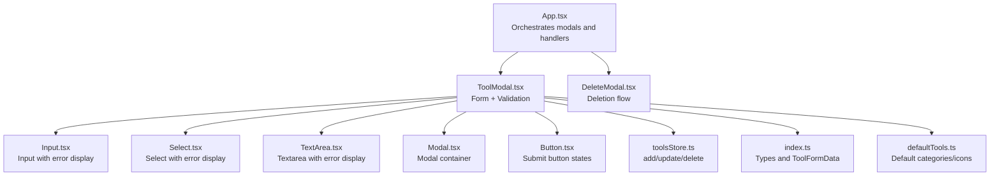
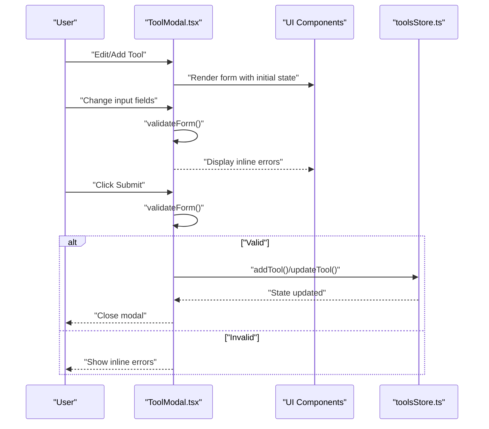
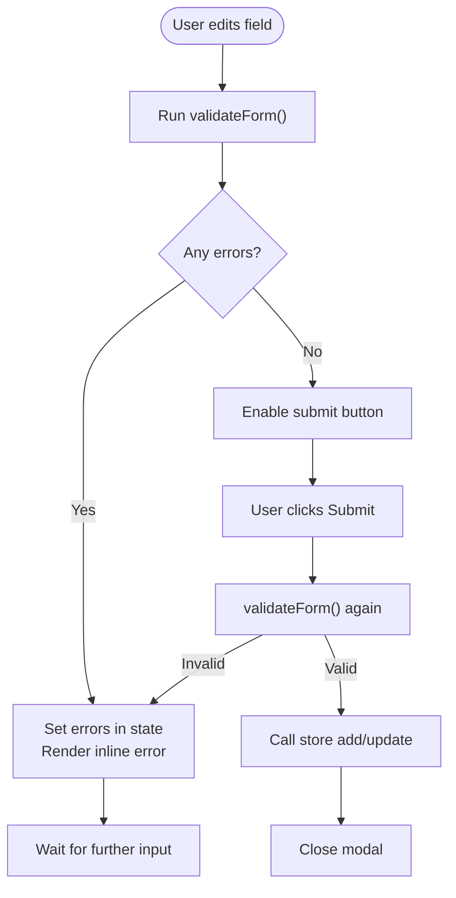
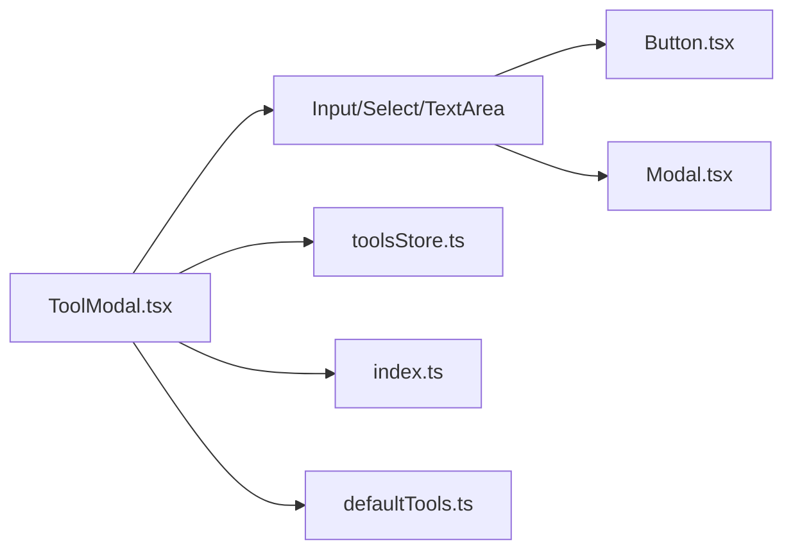

# Validation and Error Handling

<cite>
**Referenced Files in This Document**
- [ToolModal.tsx](file://src/components/modals/ToolModal.tsx)
- [Input.tsx](file://src/components/ui/Input.tsx)
- [Select.tsx](file://src/components/ui/Select.tsx)
- [TextArea.tsx](file://src/components/ui/TextArea.tsx)
- [Modal.tsx](file://src/components/ui/Modal.tsx)
- [Button.tsx](file://src/components/ui/Button.tsx)
- [toolsStore.ts](file://src/stores/toolsStore.ts)
- [index.ts](file://src/types/index.ts)
- [defaultTools.ts](file://src/constants/defaultTools.ts)
- [App.tsx](file://src/App.tsx)
- [DeleteModal.tsx](file://src/components/modals/DeleteModal.tsx)
- [useDebounce.ts](file://src/hooks/useDebounce.ts)
</cite>

## Table of Contents
1. [Introduction](#introduction)
2. [Project Structure](#project-structure)
3. [Core Components](#core-components)
4. [Architecture Overview](#architecture-overview)
5. [Detailed Component Analysis](#detailed-component-analysis)
6. [Dependency Analysis](#dependency-analysis)
7. [Performance Considerations](#performance-considerations)
8. [Troubleshooting Guide](#troubleshooting-guide)
9. [Conclusion](#conclusion)

## Introduction
This document explains validation and error handling for tool management operations in the application. It covers form validation rules (required fields, URL format validation), real-time feedback mechanisms (inline error messages, field highlighting), and the validation lifecycle from initial input through submission and error resolution. It also documents strategies for handling invalid URLs, network failures, and validation violations, along with user feedback via modal footers, button states, and visual cues. Edge cases such as empty forms, malformed URLs, and concurrent modification conflicts are addressed, and practical examples of validation implementation and user experience optimization are included.

## Project Structure
The validation and error handling system centers around:
- A modal-driven form for adding/editing tools
- Reusable UI components that support error display and field highlighting
- A centralized store for tool and category operations
- Type definitions that shape validation expectations

**Diagram sources**
- [App.tsx](file://src/App.tsx#L106-L117)
- [ToolModal.tsx](file://src/components/modals/ToolModal.tsx#L1-L253)
- [Input.tsx](file://src/components/ui/Input.tsx#L1-L74)
- [Select.tsx](file://src/components/ui/Select.tsx#L1-L61)
- [TextArea.tsx](file://src/components/ui/TextArea.tsx#L1-L45)
- [Modal.tsx](file://src/components/ui/Modal.tsx#L1-L128)
- [Button.tsx](file://src/components/ui/Button.tsx#L1-L88)
- [toolsStore.ts](file://src/stores/toolsStore.ts#L1-L177)
- [index.ts](file://src/types/index.ts#L1-L60)
- [defaultTools.ts](file://src/constants/defaultTools.ts#L1-L101)
- [DeleteModal.tsx](file://src/components/modals/DeleteModal.tsx#L1-L67)

**Section sources**
- [App.tsx](file://src/App.tsx#L106-L117)
- [ToolModal.tsx](file://src/components/modals/ToolModal.tsx#L1-L253)
- [Input.tsx](file://src/components/ui/Input.tsx#L1-L74)
- [Select.tsx](file://src/components/ui/Select.tsx#L1-L61)
- [TextArea.tsx](file://src/components/ui/TextArea.tsx#L1-L45)
- [Modal.tsx](file://src/components/ui/Modal.tsx#L1-L128)
- [Button.tsx](file://src/components/ui/Button.tsx#L1-L88)
- [toolsStore.ts](file://src/stores/toolsStore.ts#L1-L177)
- [index.ts](file://src/types/index.ts#L1-L60)
- [defaultTools.ts](file://src/constants/defaultTools.ts#L1-L101)
- [DeleteModal.tsx](file://src/components/modals/DeleteModal.tsx#L1-L67)

## Core Components
- Form validation and submission: Implemented in the modal component with a dedicated validator and URL checker.
- Real-time error display: UI components render inline error messages and highlight invalid fields.
- Form state management: Local state holds form data and errors; store manages persistence and updates.
- User feedback: Loading states on buttons, modal footers, and controlled enable/disable states.

Key responsibilities:
- Required field validation for name, URL, and category
- URL format validation using native URL constructor
- Inline error messaging and field highlighting
- Controlled submit flow with loading states and modal closure

**Section sources**
- [ToolModal.tsx](file://src/components/modals/ToolModal.tsx#L50-L108)
- [Input.tsx](file://src/components/ui/Input.tsx#L43-L62)
- [Select.tsx](file://src/components/ui/Select.tsx#L30-L49)
- [TextArea.tsx](file://src/components/ui/TextArea.tsx#L22-L33)
- [Button.tsx](file://src/components/ui/Button.tsx#L42-L53)

## Architecture Overview
The validation lifecycle is driven by user interactions within the modal and enforced before store mutations occur.

**Diagram sources**
- [ToolModal.tsx](file://src/components/modals/ToolModal.tsx#L50-L108)
- [Input.tsx](file://src/components/ui/Input.tsx#L43-L62)
- [Select.tsx](file://src/components/ui/Select.tsx#L30-L49)
- [TextArea.tsx](file://src/components/ui/TextArea.tsx#L22-L33)
- [toolsStore.ts](file://src/stores/toolsStore.ts#L26-L44)

## Detailed Component Analysis

### Form Validation Rules and Implementation
- Required fields:
  - Name: Non-empty after trimming
  - URL: Non-empty after trimming; validated via URL constructor
  - Category: Non-empty after trimming
- Duplicate detection:
  - Not implemented in the current codebase; consider adding pre-submission checks against existing tools if needed
- Real-time validation feedback:
  - Errors are stored in local state keyed by field name
  - UI components render error messages and apply red border/highlight styles
- Form state management:
  - Local state tracks formData and errors
  - A computed validity flag enables/disables the submit button
  - Modal resets state when opened/closed

**Diagram sources**
- [ToolModal.tsx](file://src/components/modals/ToolModal.tsx#L50-L108)
- [Input.tsx](file://src/components/ui/Input.tsx#L43-L62)
- [Select.tsx](file://src/components/ui/Select.tsx#L30-L49)
- [TextArea.tsx](file://src/components/ui/TextArea.tsx#L22-L33)

**Section sources**
- [ToolModal.tsx](file://src/components/modals/ToolModal.tsx#L50-L108)
- [Input.tsx](file://src/components/ui/Input.tsx#L43-L62)
- [Select.tsx](file://src/components/ui/Select.tsx#L30-L49)
- [TextArea.tsx](file://src/components/ui/TextArea.tsx#L22-L33)

### Error Handling Strategies
- Invalid URLs:
  - Detected via URL constructor; error message indicates invalid format
- Network failures:
  - No explicit network calls in the current code; if external APIs are introduced, wrap fetch calls in try/catch and surface user-friendly messages
- Validation violations:
  - Immediate inline feedback; submit disabled until form becomes valid
- Concurrent modification conflicts:
  - Not implemented; consider optimistic updates with conflict resolution or server-side validation if persistence is extended

User feedback mechanisms:
- Toast notifications: Not present in the current codebase; consider integrating a toast library for global notifications
- Inline error messages: Rendered below each field when error exists
- Field highlighting: Red borders and focus rings applied via shared UI components
- Button states: Loading spinner and disabled state during submission

**Section sources**
- [ToolModal.tsx](file://src/components/modals/ToolModal.tsx#L71-L78)
- [Input.tsx](file://src/components/ui/Input.tsx#L43-L62)
- [Select.tsx](file://src/components/ui/Select.tsx#L30-L49)
- [Button.tsx](file://src/components/ui/Button.tsx#L42-L53)

### Validation Lifecycle: From Input to Resolution
- Initial input:
  - Fields update local formData; errors reset when editing a tool
- Real-time validation:
  - Errors appear immediately for invalid entries
- Submission:
  - Final validation runs; on success, store mutation occurs; modal closes
- Error resolution:
  - User corrects input; errors clear automatically; submit button re-enables

Edge cases handled:
- Empty forms: Required field errors prevent submission
- Malformed URLs: URL constructor throws, triggering validation error
- Category creation: Dedicated flow allows creating new categories inline

**Section sources**
- [ToolModal.tsx](file://src/components/modals/ToolModal.tsx#L33-L48)
- [ToolModal.tsx](file://src/components/modals/ToolModal.tsx#L50-L69)
- [ToolModal.tsx](file://src/components/modals/ToolModal.tsx#L110-L117)

### Example: URL Validation Implementation
- The URL validation leverages the browser’s URL constructor to detect malformed URLs.
- On failure, a user-facing error is set for the URL field.

Implementation reference:
- [URL validation function](file://src/components/modals/ToolModal.tsx#L71-L78)

**Section sources**
- [ToolModal.tsx](file://src/components/modals/ToolModal.tsx#L71-L78)

### Example: Error Boundary Handling
- Current code does not implement React error boundaries; however, UI components render gracefully when errors are present.
- Recommendation: Wrap modals with an error boundary to catch rendering errors and display a friendly message.

[No sources needed since this section provides general guidance]

### Example: User Experience Optimization
- Debouncing:
  - A debounce hook is available for potential use with search or auto-save scenarios.
- Loading states:
  - Buttons display loading spinners during submission to prevent double-clicks.
- Modal transitions:
  - Smooth animations improve perceived responsiveness.

**Section sources**
- [useDebounce.ts](file://src/hooks/useDebounce.ts#L1-L18)
- [Button.tsx](file://src/components/ui/Button.tsx#L42-L53)
- [Modal.tsx](file://src/components/ui/Modal.tsx#L57-L126)

## Dependency Analysis
The validation and error handling system depends on:
- UI components for rendering errors and highlighting
- Store actions for persistence and updates
- Types for consistent validation rules

**Diagram sources**
- [ToolModal.tsx](file://src/components/modals/ToolModal.tsx#L1-L253)
- [Input.tsx](file://src/components/ui/Input.tsx#L1-L74)
- [Select.tsx](file://src/components/ui/Select.tsx#L1-L61)
- [TextArea.tsx](file://src/components/ui/TextArea.tsx#L1-L45)
- [Button.tsx](file://src/components/ui/Button.tsx#L1-L88)
- [Modal.tsx](file://src/components/ui/Modal.tsx#L1-L128)
- [toolsStore.ts](file://src/stores/toolsStore.ts#L1-L177)
- [index.ts](file://src/types/index.ts#L1-L60)
- [defaultTools.ts](file://src/constants/defaultTools.ts#L1-L101)

**Section sources**
- [ToolModal.tsx](file://src/components/modals/ToolModal.tsx#L1-L253)
- [Input.tsx](file://src/components/ui/Input.tsx#L1-L74)
- [Select.tsx](file://src/components/ui/Select.tsx#L1-L61)
- [TextArea.tsx](file://src/components/ui/TextArea.tsx#L1-L45)
- [Button.tsx](file://src/components/ui/Button.tsx#L1-L88)
- [Modal.tsx](file://src/components/ui/Modal.tsx#L1-L128)
- [toolsStore.ts](file://src/stores/toolsStore.ts#L1-L177)
- [index.ts](file://src/types/index.ts#L1-L60)
- [defaultTools.ts](file://src/constants/defaultTools.ts#L1-L101)

## Performance Considerations
- Keep validation lightweight by avoiding expensive computations per keystroke.
- Debounce heavy operations (e.g., search or auto-save) using the provided hook.
- Minimize re-renders by updating only necessary state slices in the store.

[No sources needed since this section provides general guidance]

## Troubleshooting Guide
Common issues and resolutions:
- Submit button remains disabled:
  - Ensure required fields are filled; check that validation clears on correction
- URL error persists after fixing:
  - Confirm the URL passes the URL constructor test; remove extra whitespace
- Category selection shows error:
  - Verify a valid category is selected or create a new one inline
- Modal does not close after save:
  - Check that submission resolves and the modal’s onClose callback is invoked

Related references:
- [Form validation and submission](file://src/components/modals/ToolModal.tsx#L50-L108)
- [UI error rendering](file://src/components/ui/Input.tsx#L43-L62)
- [Button loading state](file://src/components/ui/Button.tsx#L42-L53)

**Section sources**
- [ToolModal.tsx](file://src/components/modals/ToolModal.tsx#L50-L108)
- [Input.tsx](file://src/components/ui/Input.tsx#L43-L62)
- [Button.tsx](file://src/components/ui/Button.tsx#L42-L53)

## Conclusion
The application implements robust client-side validation for tool management with immediate, inline feedback and clear user affordances. Required fields, URL format validation, and category selection are enforced before store mutations. While network failures and duplicates are not currently handled, the architecture supports easy extension for these scenarios. The UI components consistently communicate errors and guide users toward successful submissions.