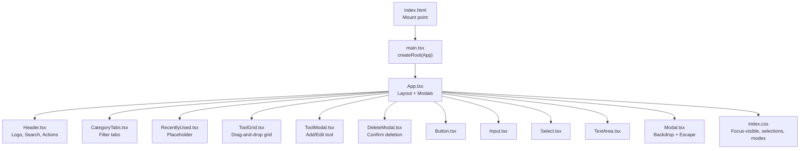
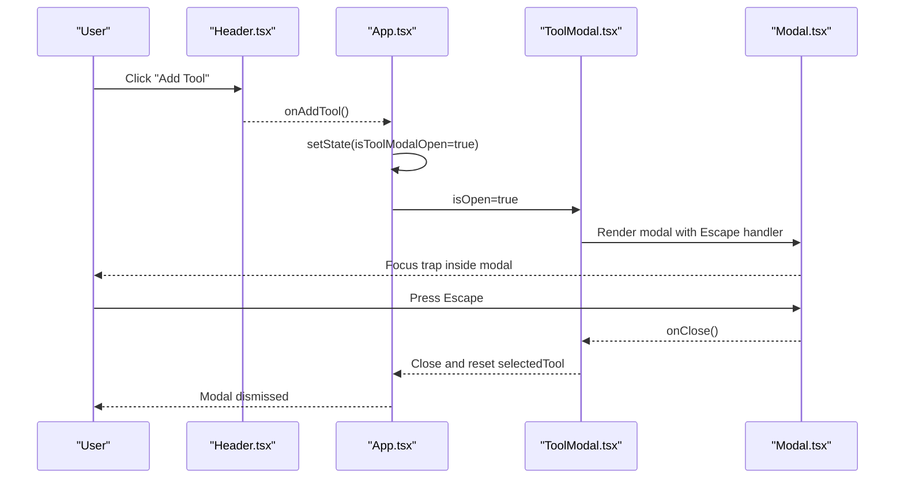
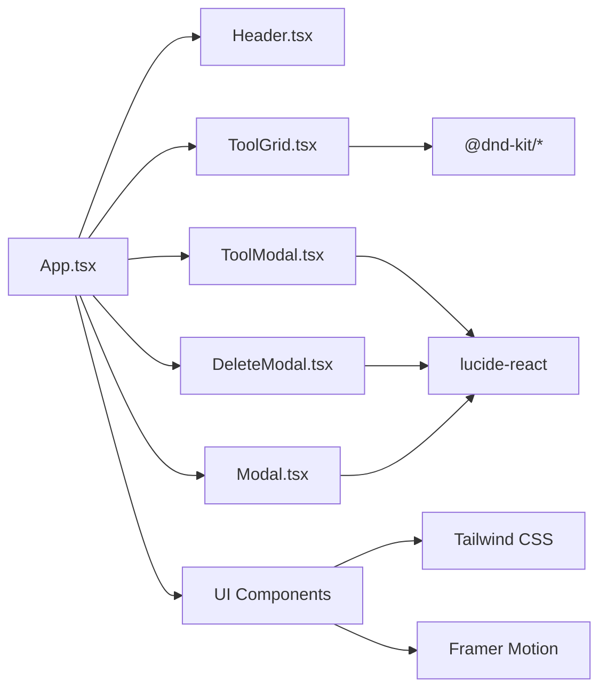

# Accessibility & Keyboard Navigation

<cite>
**Referenced Files in This Document**
- [App.tsx](file://src/App.tsx)
- [main.tsx](file://src/main.tsx)
- [index.css](file://src/index.css)
- [Header.tsx](file://src/components/layout/Header.tsx)
- [Modal.tsx](file://src/components/ui/Modal.tsx)
- [ToolModal.tsx](file://src/components/modals/ToolModal.tsx)
- [DeleteModal.tsx](file://src/components/modals/DeleteModal.tsx)
- [Button.tsx](file://src/components/ui/Button.tsx)
- [Input.tsx](file://src/components/ui/Input.tsx)
- [Select.tsx](file://src/components/ui/Select.tsx)
- [TextArea.tsx](file://src/components/ui/TextArea.tsx)
- [CategoryTabs.tsx](file://src/components/features/CategoryTabs.tsx)
- [ToolGrid.tsx](file://src/components/features/ToolGrid.tsx)
- [index.html](file://index.html)
- [package.json](file://package.json)
</cite>

## Table of Contents
1. [Introduction](#introduction)
2. [Project Structure](#project-structure)
3. [Core Components](#core-components)
4. [Architecture Overview](#architecture-overview)
5. [Detailed Component Analysis](#detailed-component-analysis)
6. [Dependency Analysis](#dependency-analysis)
7. [Performance Considerations](#performance-considerations)
8. [Troubleshooting Guide](#troubleshooting-guide)
9. [Conclusion](#conclusion)
10. [Appendices](#appendices)

## Introduction
This document provides comprehensive accessibility guidance for the AIPulse application. It focuses on ARIA attributes, semantic HTML, screen reader support, keyboard navigation, focus management, tab order, color contrast, text alternatives for icons, assistive technology compatibility, focus traps in modals, meaningful error messages, and keyboard-only operation. It also outlines testing approaches, automated strategies, manual verification procedures, WCAG compliance expectations, and accessibility audit processes grounded in the current codebase.

## Project Structure
AIPulse is a React application built with TypeScript, Tailwind CSS, and Framer Motion. The UI is composed of reusable components under src/components/ui and feature-specific components under src/components/features, organized by layout and modals. Global styles and focus-visible indicators are defined in src/index.css. The app mounts into index.html via src/main.tsx.

**Diagram sources**
- [index.html](file://index.html#L1-L17)
- [main.tsx](file://src/main.tsx#L1-L11)
- [App.tsx](file://src/App.tsx#L1-L122)
- [Header.tsx](file://src/components/layout/Header.tsx#L1-L83)
- [CategoryTabs.tsx](file://src/components/features/CategoryTabs.tsx#L1-L106)
- [ToolGrid.tsx](file://src/components/features/ToolGrid.tsx#L1-L112)
- [ToolModal.tsx](file://src/components/modals/ToolModal.tsx#L1-L253)
- [DeleteModal.tsx](file://src/components/modals/DeleteModal.tsx#L1-L67)
- [Button.tsx](file://src/components/ui/Button.tsx#L1-L88)
- [Input.tsx](file://src/components/ui/Input.tsx#L1-L74)
- [Select.tsx](file://src/components/ui/Select.tsx#L1-L61)
- [TextArea.tsx](file://src/components/ui/TextArea.tsx#L1-L45)
- [Modal.tsx](file://src/components/ui/Modal.tsx#L1-L128)
- [index.css](file://src/index.css#L1-L141)

**Section sources**
- [index.html](file://index.html#L1-L17)
- [main.tsx](file://src/main.tsx#L1-L11)
- [App.tsx](file://src/App.tsx#L1-L122)
- [index.css](file://src/index.css#L1-L141)

## Core Components
- Layout and Navigation
  - Header: Provides logo, search bar, theme toggle, settings, and add-tool actions. Uses semantic button elements with accessible labels for icons.
  - CategoryTabs: Interactive horizontal tabs for filtering tools; uses buttons with dynamic active states and counts.
  - ToolGrid: Renders a responsive grid of tools with drag-and-drop reordering via @dnd-kit, supporting keyboard sensors.

- Forms and Inputs
  - Input, Select, TextArea: Provide labeled inputs with optional icons, helper/error text, and focus-visible styles.
  - Button: Standardized button component with variants, sizes, loading states, and focus management.

- Modals
  - Modal: Base modal container with backdrop, Escape key handling, and pointer-events isolation.
  - ToolModal: Form modal for adding/editing tools with validation, error messaging, and category creation flow.
  - DeleteModal: Confirmation modal with destructive action and loading states.

- Theming and Focus
  - index.css: Defines focus-visible outline, selection styles, dark/light mode color-scheme toggles, and input autofill themes.

**Section sources**
- [Header.tsx](file://src/components/layout/Header.tsx#L1-L83)
- [CategoryTabs.tsx](file://src/components/features/CategoryTabs.tsx#L1-L106)
- [ToolGrid.tsx](file://src/components/features/ToolGrid.tsx#L1-L112)
- [Input.tsx](file://src/components/ui/Input.tsx#L1-L74)
- [Select.tsx](file://src/components/ui/Select.tsx#L1-L61)
- [TextArea.tsx](file://src/components/ui/TextArea.tsx#L1-L45)
- [Button.tsx](file://src/components/ui/Button.tsx#L1-L88)
- [Modal.tsx](file://src/components/ui/Modal.tsx#L1-L128)
- [ToolModal.tsx](file://src/components/modals/ToolModal.tsx#L1-L253)
- [DeleteModal.tsx](file://src/components/modals/DeleteModal.tsx#L1-L67)
- [index.css](file://src/index.css#L71-L141)

## Architecture Overview
The application’s accessibility architecture centers on:
- Semantic markup and role-free primitives styled appropriately.
- Explicit ARIA attributes where native semantics are insufficient.
- Keyboard-first navigation with focus management and Escape-to-close modals.
- Consistent focus-visible styles and color-scheme-aware theming.
- Form validation with programmatically associated labels and error announcements.

**Diagram sources**
- [Header.tsx](file://src/components/layout/Header.tsx#L62-L76)
- [App.tsx](file://src/App.tsx#L28-L51)
- [ToolModal.tsx](file://src/components/modals/ToolModal.tsx#L132-L153)
- [Modal.tsx](file://src/components/ui/Modal.tsx#L37-L54)

## Detailed Component Analysis

### Focus Management and Keyboard Navigation
- Focus Visible Styles
  - The global focus-visible outline ensures keyboard operability and discoverability across interactive elements.
- Escape-to-Dismiss Modals
  - Modal.tsx registers a global Escape key listener while open and disables body scroll to maintain focus within the modal.
- Keyboard Sensors for Drag-and-Drop
  - ToolGrid.tsx configures keyboard sensors for @dnd-kit, enabling keyboard navigation and manipulation of tool cards.

Recommendations aligned with current implementation:
- Ensure focus moves into modals on open and returns to trigger elements on close.
- Provide visible focus indicators for all interactive elements.
- Use aria-modal and aria-hidden on background elements when modals are open.

**Section sources**
- [index.css](file://src/index.css#L71-L75)
- [Modal.tsx](file://src/components/ui/Modal.tsx#L37-L54)
- [ToolGrid.tsx](file://src/components/features/ToolGrid.tsx#L35-L44)

### ARIA Attributes and Screen Reader Support
- Buttons
  - Header.tsx uses aria-label for icon-only buttons to provide accessible names for screen readers.
  - Modal.tsx applies aria-label to the close button for clarity.
- Labels and Associations
  - Input.tsx, Select.tsx, and TextArea.tsx render explicit label elements associated with inputs, improving screen reader announcements.
- Roles and Landmarks
  - Use semantic HTML elements (header, main, section) and landmarks as appropriate. Consider adding role="region" and aria-labelledby for custom sections if needed.

Guidelines:
- Prefer native elements (button, input, select) over generic divs with click handlers.
- Provide aria-describedby for complex controls referencing helper text or error messages.
- Announce dynamic changes (e.g., validation errors) using aria-live regions.

**Section sources**
- [Header.tsx](file://src/components/layout/Header.tsx#L58-L76)
- [Modal.tsx](file://src/components/ui/Modal.tsx#L104-L108)
- [Input.tsx](file://src/components/ui/Input.tsx#L28-L33)
- [Select.tsx](file://src/components/ui/Select.tsx#L21-L26)
- [TextArea.tsx](file://src/components/ui/TextArea.tsx#L14-L19)

### Color Contrast and Text Alternatives
- Color Scheme Awareness
  - index.css toggles color-scheme for dark/light modes, ensuring proper contrast checks per mode.
- Contrast Requirements
  - WCAG AA requires at least 4.5:1 for normal text and 3:1 for large text. Verify against the active theme.
- Icons Without Text
  - Header.tsx and Modal.tsx provide aria-labels for purely icon buttons, ensuring screen readers announce intent.

Recommendations:
- Test contrast ratios using tools like axe, Lighthouse, or browser extensions.
- Avoid conveying information through color alone; pair icons with text or aria-labels.

**Section sources**
- [index.css](file://src/index.css#L90-L98)
- [Header.tsx](file://src/components/layout/Header.tsx#L58-L76)
- [Modal.tsx](file://src/components/ui/Modal.tsx#L104-L108)

### Managing Focus Traps in Modals
Current behavior:
- Modal.tsx prevents background scroll and isolates pointer events inside the modal container.
- Escape key closes the modal.

Recommended enhancements:
- Move focus into the modal on open and trap focus within modal boundaries.
- On close, return focus to the triggering element.
- Optionally add role="dialog", aria-modal="true", and aria-labelledby/aria-describedby for richer semantics.

**Section sources**
- [Modal.tsx](file://src/components/ui/Modal.tsx#L37-L54)

### Meaningful Error Messages
- Validation and Messaging
  - ToolModal.tsx validates required fields and displays localized error messages below inputs.
  - Input.tsx, Select.tsx, and TextArea.tsx render error text with appropriate styles.

Best practices:
- Associate error text with inputs using aria-describedby.
- Present errors immediately upon invalidation or submission.
- Provide suggestions or next steps for correction.

**Section sources**
- [ToolModal.tsx](file://src/components/modals/ToolModal.tsx#L50-L69)
- [Input.tsx](file://src/components/ui/Input.tsx#L60-L65)
- [Select.tsx](file://src/components/ui/Select.tsx#L47-L52)
- [TextArea.tsx](file://src/components/ui/TextArea.tsx#L31-L36)

### Keyboard-Only Operation
- Buttons and Controls
  - All interactive elements are native buttons or inputs, enabling keyboard activation.
- Drag-and-Drop Accessibility
  - ToolGrid.tsx integrates keyboard sensors for @dnd-kit, allowing keyboard reordering of items.
- Tab Order
  - Maintain logical tab order: header actions, filter tabs, tool grid, then modal controls if present.

Recommendations:
- Ensure all interactive elements are reachable via Tab.
- Provide visible focus indicators for all focusable elements.
- Avoid hidden focusable elements; use visibility or tabindex management judiciously.

**Section sources**
- [Button.tsx](file://src/components/ui/Button.tsx#L42-L51)
- [ToolGrid.tsx](file://src/components/features/ToolGrid.tsx#L35-L44)
- [Header.tsx](file://src/components/layout/Header.tsx#L52-L77)

### Semantic HTML Structure
- Native Elements
  - Input.tsx, Select.tsx, TextArea.tsx use native HTML elements for form controls.
  - Button.tsx renders a native button element.
- Layout Regions
  - App.tsx organizes content into header, main, and footer regions using semantic containers.

Recommendations:
- Prefer native elements for semantics and built-in accessibility features.
- Use heading hierarchy (h1–h6) appropriately and avoid skipping levels.

**Section sources**
- [Input.tsx](file://src/components/ui/Input.tsx#L40-L52)
- [Select.tsx](file://src/components/ui/Select.tsx#L28-L44)
- [TextArea.tsx](file://src/components/ui/TextArea.tsx#L20-L29)
- [Button.tsx](file://src/components/ui/Button.tsx#L42-L51)
- [App.tsx](file://src/App.tsx#L69-L104)

### Assistive Technology Compatibility
- Screen Readers
  - aria-labels on icon-only buttons and explicit labels for inputs improve screen reader announcements.
- Dynamic Content
  - ToolGrid.tsx uses motion components; ensure dynamic updates are announced via aria-live regions if needed.
- Theming
  - index.css supports both dark and light modes; test with screen readers in both modes.

Recommendations:
- Test with NVDA, JAWS, VoiceOver, and Narrator.
- Validate animations and transitions do not interfere with focus or announcements.

**Section sources**
- [Header.tsx](file://src/components/layout/Header.tsx#L58-L76)
- [Input.tsx](file://src/components/ui/Input.tsx#L28-L33)
- [index.css](file://src/index.css#L90-L98)

## Dependency Analysis
- External Libraries
  - @dnd-kit/core, @dnd-kit/sortable, @dnd-kit/utilities enable accessible drag-and-drop with keyboard sensors.
  - lucide-react provides SVG icons used as accessible text alternatives.
  - framer-motion adds animations; ensure they do not hide focus or trap keyboard navigation.
- Theming and Utilities
  - Tailwind CSS and index.css define focus-visible styles, color-schemes, and input autofill themes.

**Diagram sources**
- [App.tsx](file://src/App.tsx#L1-L122)
- [ToolGrid.tsx](file://src/components/features/ToolGrid.tsx#L1-L112)
- [ToolModal.tsx](file://src/components/modals/ToolModal.tsx#L1-L253)
- [DeleteModal.tsx](file://src/components/modals/DeleteModal.tsx#L1-L67)
- [Header.tsx](file://src/components/layout/Header.tsx#L1-L83)
- [Modal.tsx](file://src/components/ui/Modal.tsx#L1-L128)
- [Button.tsx](file://src/components/ui/Button.tsx#L1-L88)
- [Input.tsx](file://src/components/ui/Input.tsx#L1-L74)
- [Select.tsx](file://src/components/ui/Select.tsx#L1-L61)
- [TextArea.tsx](file://src/components/ui/TextArea.tsx#L1-L45)
- [package.json](file://package.json#L22-L34)

**Section sources**
- [package.json](file://package.json#L22-L34)

## Performance Considerations
- Focus-visible styles and transitions are lightweight; ensure they do not introduce layout thrashing.
- Modal rendering uses AnimatePresence; keep animations short to preserve keyboard responsiveness.
- Drag-and-drop reordering is efficient but ensure frequent reflows are minimized by stable item IDs.

[No sources needed since this section provides general guidance]

## Troubleshooting Guide
Common issues and resolutions:
- Escape key does not close modal
  - Confirm Modal.tsx registers and removes the keydown listener and toggles body overflow.
- Focus lost after modal close
  - Ensure focus is returned to the trigger element on close.
- Low contrast in themed mode
  - Re-check contrast ratios against the active color scheme and adjust tokens accordingly.
- Screen reader skips form errors
  - Associate error text with inputs via aria-describedby and ensure error messages appear on invalidation.

**Section sources**
- [Modal.tsx](file://src/components/ui/Modal.tsx#L37-L54)
- [ToolModal.tsx](file://src/components/modals/ToolModal.tsx#L50-L69)
- [index.css](file://src/index.css#L90-L98)

## Conclusion
AIPulse demonstrates strong foundations in accessibility through semantic HTML, focus-visible styles, keyboard-first components, and Escape-to-dismiss modals. To reach WCAG AA/AAA compliance, implement robust focus traps in modals, enhance ARIA attributes where native semantics are insufficient, validate color contrast across themes, and adopt comprehensive automated and manual testing strategies.

[No sources needed since this section summarizes without analyzing specific files]

## Appendices

### WCAG Compliance Expectations
- Level AA (minimum)
  - Sufficient color contrast, focus management, keyboard accessibility, and readable text alternatives.
- Level AAA (enhanced)
  - Additional contrast targets, reduced motion preferences, and improved error identification.

[No sources needed since this section provides general guidance]

### Accessibility Testing Approaches
- Automated Testing
  - Use axe-core, Lighthouse, Pa11y, or similar tools in CI pipelines to flag contrast, missing labels, and keyboard traps.
- Manual Verification
  - Navigate entirely via keyboard, verify screen reader announcements, and confirm focus flow and modal behavior.
- Audit Process
  - Conduct periodic audits focusing on forms, modals, drag-and-drop, and theme-dependent contrast.

[No sources needed since this section provides general guidance]