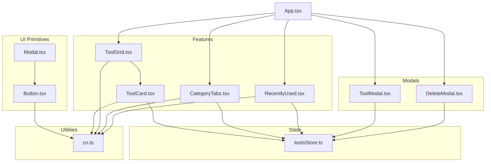
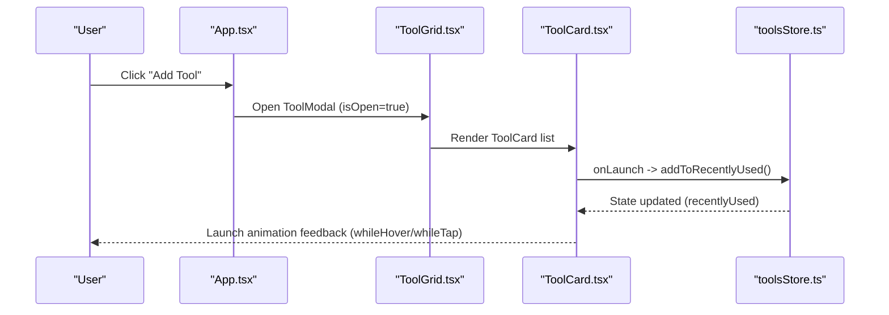
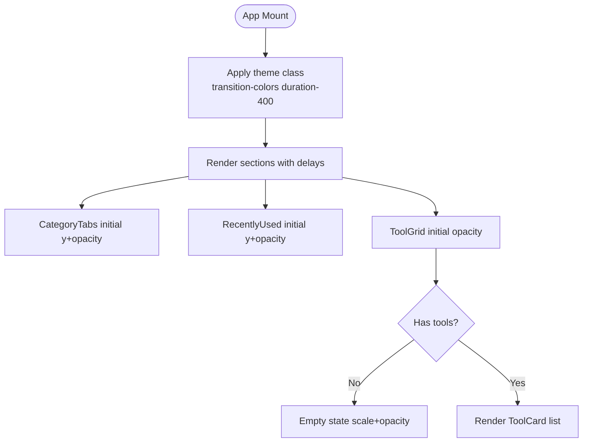
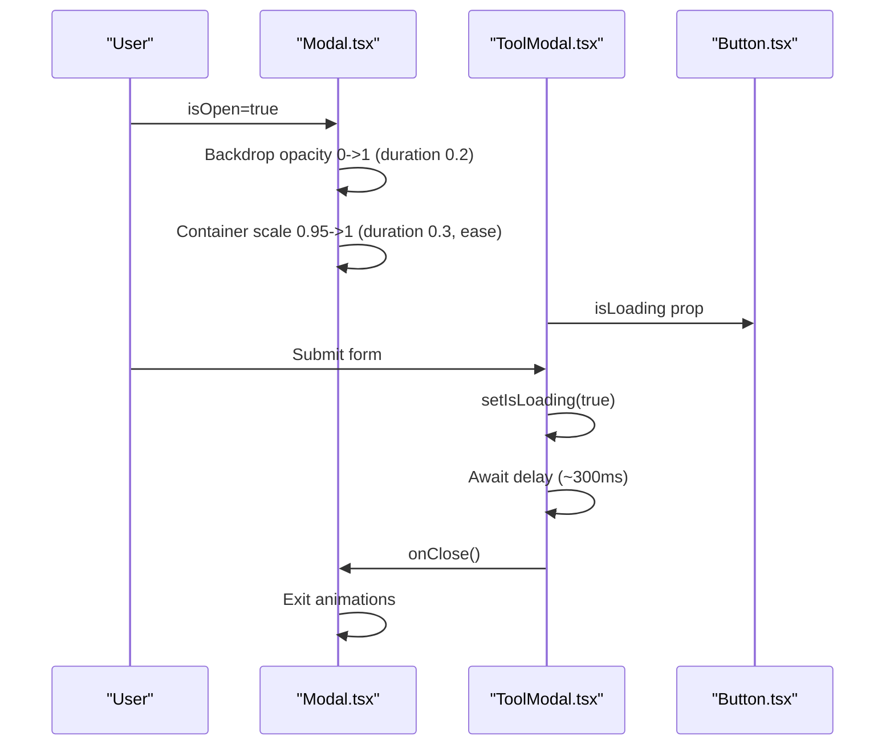
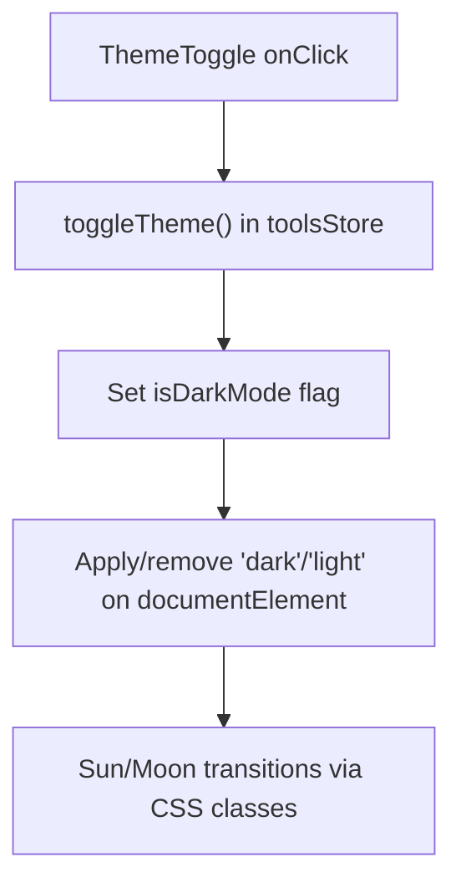
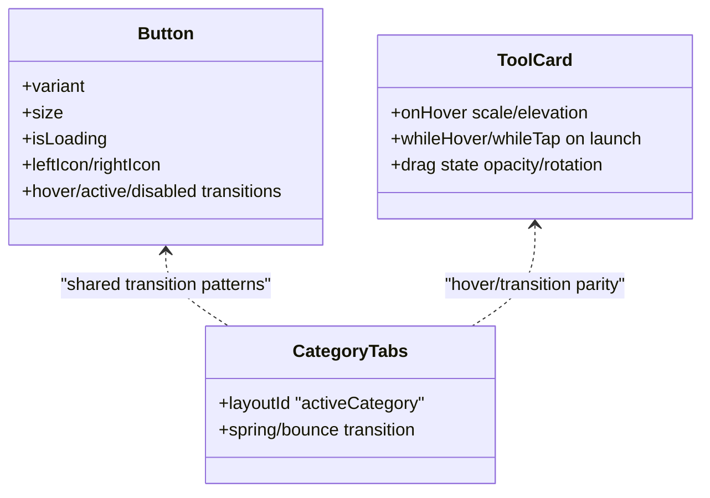
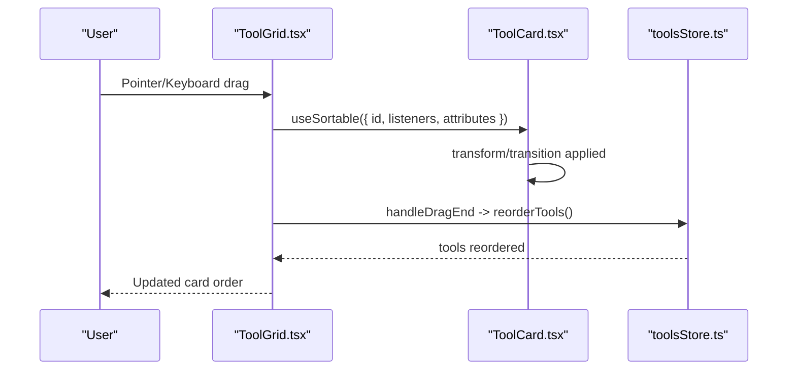
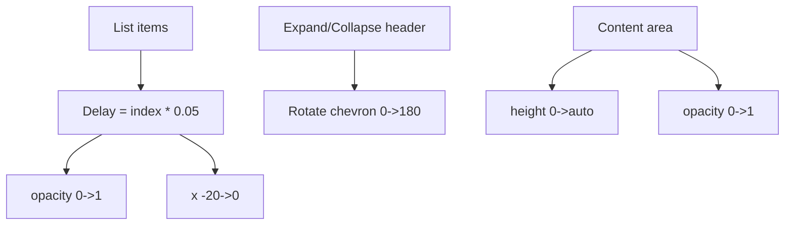
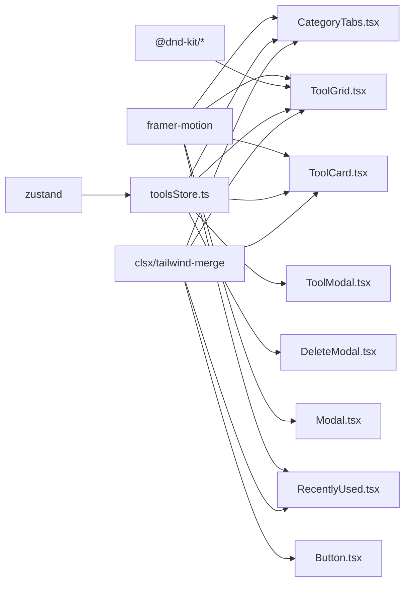

# Animations & Interactive Elements

<cite>
**Referenced Files in This Document**
- [App.tsx](file://src/App.tsx)
- [Button.tsx](file://src/components/ui/Button.tsx)
- [Modal.tsx](file://src/components/ui/Modal.tsx)
- [ThemeToggle.tsx](file://src/components/features/ThemeToggle.tsx)
- [CategoryTabs.tsx](file://src/components/features/CategoryTabs.tsx)
- [RecentlyUsed.tsx](file://src/components/features/RecentlyUsed.tsx)
- [ToolCard.tsx](file://src/components/features/ToolCard.tsx)
- [ToolGrid.tsx](file://src/components/features/ToolGrid.tsx)
- [ToolModal.tsx](file://src/components/modals/ToolModal.tsx)
- [DeleteModal.tsx](file://src/components/modals/DeleteModal.tsx)
- [toolsStore.ts](file://src/stores/toolsStore.ts)
- [cn.ts](file://src/utils/cn.ts)
- [index.ts](file://src/types/index.ts)
- [defaultTools.ts](file://src/constants/defaultTools.ts)
- [package.json](file://package.json)
</cite>

## Table of Contents
1. [Introduction](#introduction)
2. [Project Structure](#project-structure)
3. [Core Components](#core-components)
4. [Architecture Overview](#architecture-overview)
5. [Detailed Component Analysis](#detailed-component-analysis)
6. [Dependency Analysis](#dependency-analysis)
7. [Performance Considerations](#performance-considerations)
8. [Troubleshooting Guide](#troubleshooting-guide)
9. [Conclusion](#conclusion)
10. [Appendices](#appendices)

## Introduction
This document explains the AIPulse animation system and interactive elements. It focuses on how Framer Motion is integrated for entrance/exit animations, hover effects, and state transitions; how timing and easing are configured; and how performance is optimized. It also documents interactive behaviors such as button states, modal transitions, theme switching animations, and drag-and-drop feedback. Finally, it provides guidelines for creating smooth micro-interactions, managing animation queues, and ensuring accessibility with reduced motion preferences, along with patterns for animation composition and cross-component coordination.

## Project Structure
AIPulse organizes animations primarily around:
- UI primitives with subtle transitions (Button, Modal)
- Feature components with Framer Motion-driven entrances and interactions (CategoryTabs, RecentlyUsed, ToolCard, ToolGrid)
- Store-managed state that triggers animations (toolsStore)
- Utility helpers for class merging (cn)

**Diagram sources**
- [App.tsx](file://src/App.tsx#L53-L118)
- [Button.tsx](file://src/components/ui/Button.tsx#L1-L88)
- [Modal.tsx](file://src/components/ui/Modal.tsx#L1-L128)
- [CategoryTabs.tsx](file://src/components/features/CategoryTabs.tsx#L1-L106)
- [RecentlyUsed.tsx](file://src/components/features/RecentlyUsed.tsx#L1-L101)
- [ToolCard.tsx](file://src/components/features/ToolCard.tsx#L1-L141)
- [ToolGrid.tsx](file://src/components/features/ToolGrid.tsx#L1-L112)
- [ToolModal.tsx](file://src/components/modals/ToolModal.tsx#L1-L253)
- [DeleteModal.tsx](file://src/components/modals/DeleteModal.tsx#L1-L67)
- [toolsStore.ts](file://src/stores/toolsStore.ts#L1-L177)
- [cn.ts](file://src/utils/cn.ts#L1-L7)

**Section sources**
- [App.tsx](file://src/App.tsx#L1-L122)
- [package.json](file://package.json#L22-L34)

## Core Components
- Button: Provides hover, active, and loading states with CSS transitions and an inline spinner during loading.
- Modal: Uses Framer Motion for backdrop and container entrance/exit with controlled keyboard and pointer events.
- ThemeToggle: Toggles sun/moon icons with transitions and applies theme classes to the document element.
- CategoryTabs: Animated tab selection with layoutId for smooth background transitions.
- RecentlyUsed: Collapsible list with staggered item animations and expand/collapse transitions.
- ToolCard: Hover states, launch button press effect, drag feedback, and staggered entrance.
- ToolGrid: Drag-and-drop orchestration with Framer Motion empty-state animations.
- ToolModal / DeleteModal: Form submission with simulated delays and loading states; footer buttons drive actions.

**Section sources**
- [Button.tsx](file://src/components/ui/Button.tsx#L1-L88)
- [Modal.tsx](file://src/components/ui/Modal.tsx#L1-L128)
- [ThemeToggle.tsx](file://src/components/features/ThemeToggle.tsx#L1-L43)
- [CategoryTabs.tsx](file://src/components/features/CategoryTabs.tsx#L1-L106)
- [RecentlyUsed.tsx](file://src/components/features/RecentlyUsed.tsx#L1-L101)
- [ToolCard.tsx](file://src/components/features/ToolCard.tsx#L1-L141)
- [ToolGrid.tsx](file://src/components/features/ToolGrid.tsx#L1-L112)
- [ToolModal.tsx](file://src/components/modals/ToolModal.tsx#L1-L253)
- [DeleteModal.tsx](file://src/components/modals/DeleteModal.tsx#L1-L67)

## Architecture Overview
AIPulse composes animations across three layers:
- Primitive UI layer: Button and Modal define baseline transitions and motion-ready props.
- Feature layer: Components like CategoryTabs, RecentlyUsed, ToolCard, and ToolGrid apply Framer Motion for entrances, exits, and interactions.
- State layer: toolsStore manages UI-visible state (theme, filters, selections) that triggers animations.

**Diagram sources**
- [App.tsx](file://src/App.tsx#L28-L51)
- [ToolGrid.tsx](file://src/components/features/ToolGrid.tsx#L1-L112)
- [ToolCard.tsx](file://src/components/features/ToolCard.tsx#L1-L141)
- [toolsStore.ts](file://src/stores/toolsStore.ts#L112-L129)

## Detailed Component Analysis

### Entrance and Page Transitions
- App.tsx applies page-wide entrance with staggered sections and a theme-aware background transition.
- ToolGrid renders an empty-state with a subtle entrance when the tool list is empty.
- CategoryTabs and RecentlyUsed animate their initial appearance and subsequent state changes.

**Diagram sources**
- [App.tsx](file://src/App.tsx#L54-L99)
- [ToolGrid.tsx](file://src/components/features/ToolGrid.tsx#L58-L84)
- [CategoryTabs.tsx](file://src/components/features/CategoryTabs.tsx#L21-L25)
- [RecentlyUsed.tsx](file://src/components/features/RecentlyUsed.tsx#L25-L29)

**Section sources**
- [App.tsx](file://src/App.tsx#L53-L101)
- [ToolGrid.tsx](file://src/components/features/ToolGrid.tsx#L58-L84)
- [CategoryTabs.tsx](file://src/components/features/CategoryTabs.tsx#L21-L25)
- [RecentlyUsed.tsx](file://src/components/features/RecentlyUsed.tsx#L25-L29)

### Modal Transitions and Interactions
- Modal.tsx wraps content in AnimatePresence and defines backdrop and container animations with distinct durations and easing.
- ToolModal and DeleteModal use Button components with isLoading states and footer actions to manage transitions and user feedback.

**Diagram sources**
- [Modal.tsx](file://src/components/ui/Modal.tsx#L57-L125)
- [ToolModal.tsx](file://src/components/modals/ToolModal.tsx#L80-L108)
- [Button.tsx](file://src/components/ui/Button.tsx#L55-L76)

**Section sources**
- [Modal.tsx](file://src/components/ui/Modal.tsx#L56-L126)
- [ToolModal.tsx](file://src/components/modals/ToolModal.tsx#L80-L108)
- [DeleteModal.tsx](file://src/components/modals/DeleteModal.tsx#L17-L28)

### Theme Switching Animation
- ThemeToggle toggles sun/moon icons with opacity and rotation transitions.
- App.tsx and ThemeToggle apply/remove theme classes on mount and toggle.

**Diagram sources**
- [ThemeToggle.tsx](file://src/components/features/ThemeToggle.tsx#L20-L41)
- [toolsStore.ts](file://src/stores/toolsStore.ts#L103-L106)
- [App.tsx](file://src/App.tsx#L19-L26)

**Section sources**
- [ThemeToggle.tsx](file://src/components/features/ThemeToggle.tsx#L6-L18)
- [toolsStore.ts](file://src/stores/toolsStore.ts#L103-L106)
- [App.tsx](file://src/App.tsx#L19-L26)

### Hover Effects and State Transitions
- Button: CSS transitions for hover, active, disabled, and loading states.
- ToolCard: Hover scaling and elevation; launch button uses whileHover/whileTap; drag state alters opacity and rotation.
- CategoryTabs: Active tab background animates via layoutId spring/bounce.

**Diagram sources**
- [Button.tsx](file://src/components/ui/Button.tsx#L27-L51)
- [ToolCard.tsx](file://src/components/features/ToolCard.tsx#L119-L135)
- [CategoryTabs.tsx](file://src/components/features/CategoryTabs.tsx#L39-L84)

**Section sources**
- [Button.tsx](file://src/components/ui/Button.tsx#L27-L51)
- [ToolCard.tsx](file://src/components/features/ToolCard.tsx#L119-L135)
- [CategoryTabs.tsx](file://src/components/features/CategoryTabs.tsx#L39-L84)

### Drag-and-Drop Feedback
- ToolGrid integrates @dnd-kit sensors and context; ToolCard uses useSortable for drag feedback and transforms.
- Staggered entrance delays create a pleasing cascade when cards render.

**Diagram sources**
- [ToolGrid.tsx](file://src/components/features/ToolGrid.tsx#L35-L56)
- [ToolCard.tsx](file://src/components/features/ToolCard.tsx#L22-L34)
- [toolsStore.ts](file://src/stores/toolsStore.ts#L53-L75)

**Section sources**
- [ToolGrid.tsx](file://src/components/features/ToolGrid.tsx#L35-L56)
- [ToolCard.tsx](file://src/components/features/ToolCard.tsx#L22-L34)
- [toolsStore.ts](file://src/stores/toolsStore.ts#L53-L75)

### Micro-interactions and Animation Composition
- Staggered entrances: ToolGrid empty state and RecentlyUsed items use per-item delays.
- Expand/collapse: RecentlyUsed header chevron rotates; content animates height with opacity.
- Form UX: ToolModal/DeleteModal introduce a short delay before state changes to improve perceived responsiveness.

**Diagram sources**
- [RecentlyUsed.tsx](file://src/components/features/RecentlyUsed.tsx#L66-L71)
- [RecentlyUsed.tsx](file://src/components/features/RecentlyUsed.tsx#L50-L57)
- [ToolGrid.tsx](file://src/components/features/ToolGrid.tsx#L61-L64)

**Section sources**
- [RecentlyUsed.tsx](file://src/components/features/RecentlyUsed.tsx#L50-L57)
- [RecentlyUsed.tsx](file://src/components/features/RecentlyUsed.tsx#L66-L71)
- [ToolGrid.tsx](file://src/components/features/ToolGrid.tsx#L61-L64)

## Dependency Analysis
- Framer Motion is used for entrances/exits and gestures across components.
- @dnd-kit provides drag-and-drop orchestration and transforms.
- Zustand manages state that drives animations (theme, filters, selections).
- Tailwind and clsx/tailwind-merge provide responsive, theme-aware styles.

**Diagram sources**
- [package.json](file://package.json#L22-L34)
- [Modal.tsx](file://src/components/ui/Modal.tsx#L1-L2)
- [CategoryTabs.tsx](file://src/components/features/CategoryTabs.tsx#L1)
- [RecentlyUsed.tsx](file://src/components/features/RecentlyUsed.tsx#L1)
- [ToolCard.tsx](file://src/components/features/ToolCard.tsx#L1-L2)
- [ToolGrid.tsx](file://src/components/features/ToolGrid.tsx#L1-L17)
- [toolsStore.ts](file://src/stores/toolsStore.ts#L1-L2)
- [Button.tsx](file://src/components/ui/Button.tsx#L1-L2)
- [cn.ts](file://src/utils/cn.ts#L1-L6)

**Section sources**
- [package.json](file://package.json#L22-L34)
- [toolsStore.ts](file://src/stores/toolsStore.ts#L1-L2)

## Performance Considerations
- Prefer transform and opacity for animations to leverage GPU acceleration.
- Use AnimatePresence to clean up exiting nodes and avoid unnecessary re-renders.
- Keep transition durations reasonable (e.g., 0.2–0.3s) to balance responsiveness and perceived smoothness.
- Staggering should be bounded (as seen with index-based delays) to prevent queue overload.
- Avoid heavy computations inside animation callbacks; precompute where possible.
- Use CSS transitions for simple state changes (Button) and reserve Framer Motion for complex choreography.

[No sources needed since this section provides general guidance]

## Troubleshooting Guide
- Modals not closing or backdrop not appearing:
  - Verify AnimatePresence wrapping and isOpen prop propagation.
  - Confirm click-to-close handlers and escape key listener cleanup.
- Theme toggle not applying:
  - Ensure theme class application on documentElement and useEffect dependencies.
- Drag-and-drop not updating order:
  - Check handleDragEnd logic and reorderTools mapping to ids.
- Staggered animations lagging:
  - Reduce per-item delay or cap the maximum number of staggered items.

**Section sources**
- [Modal.tsx](file://src/components/ui/Modal.tsx#L37-L54)
- [ThemeToggle.tsx](file://src/components/features/ThemeToggle.tsx#L9-L18)
- [ToolGrid.tsx](file://src/components/features/ToolGrid.tsx#L46-L56)
- [toolsStore.ts](file://src/stores/toolsStore.ts#L53-L75)

## Conclusion
AIPulse employs a layered animation strategy: simple CSS transitions for immediate feedback, Framer Motion for complex entrances/exits and interactions, and Zustand-driven state changes to trigger coordinated motion. The system balances polish with performance, supports theme transitions, and integrates drag-and-drop with smooth feedback. Following the guidelines below ensures consistent, accessible, and efficient micro-interactions across the app.

[No sources needed since this section summarizes without analyzing specific files]

## Appendices

### Animation Timing and Easing Reference
- Modal backdrop: duration 0.2
- Modal container: duration 0.3 with a custom easing curve
- CategoryTabs active indicator: spring with bounce and duration 0.6
- Staggered entrances: delay = index × 0.05
- RecentlyUsed expand/collapse: duration 0.3
- Page sections: delays 0.2–0.35 after initial load
- Button transitions: duration 300ms for most state changes

**Section sources**
- [Modal.tsx](file://src/components/ui/Modal.tsx#L61-L76)
- [CategoryTabs.tsx](file://src/components/features/CategoryTabs.tsx#L40-L84)
- [RecentlyUsed.tsx](file://src/components/features/RecentlyUsed.tsx#L50-L57)
- [App.tsx](file://src/App.tsx#L76-L92)
- [Button.tsx](file://src/components/ui/Button.tsx#L27)

### Accessibility and Reduced Motion
- Prefer CSS transitions for basic hover/active states.
- Avoid long-running or frequent animations in interactive elements.
- Consider detecting reduced motion preferences and adjusting durations or disabling motion where appropriate.

[No sources needed since this section provides general guidance]