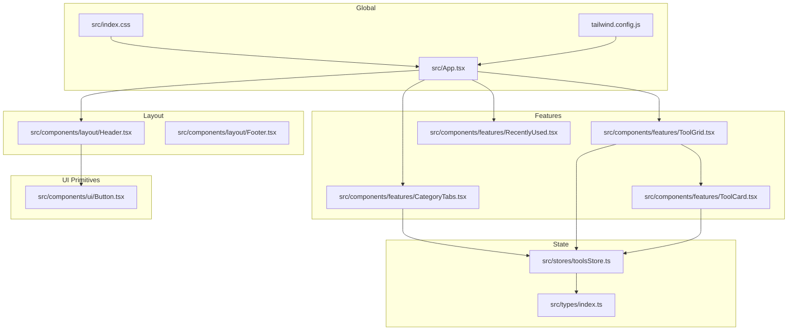
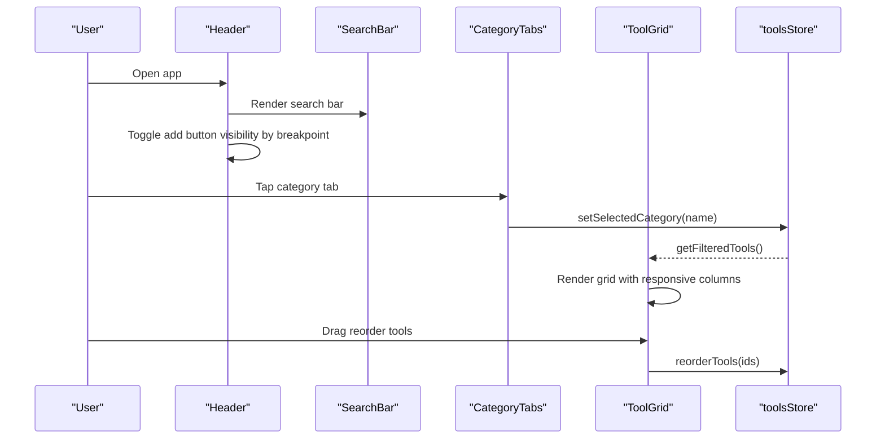
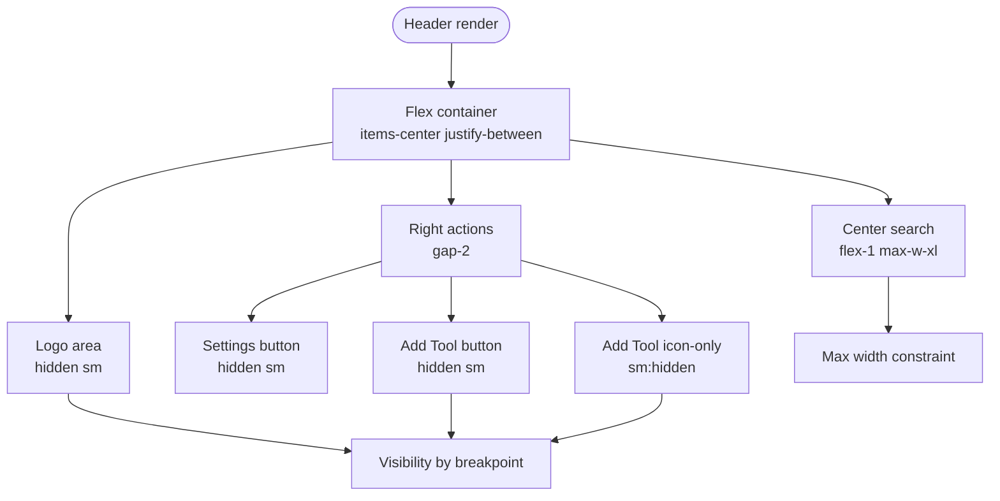
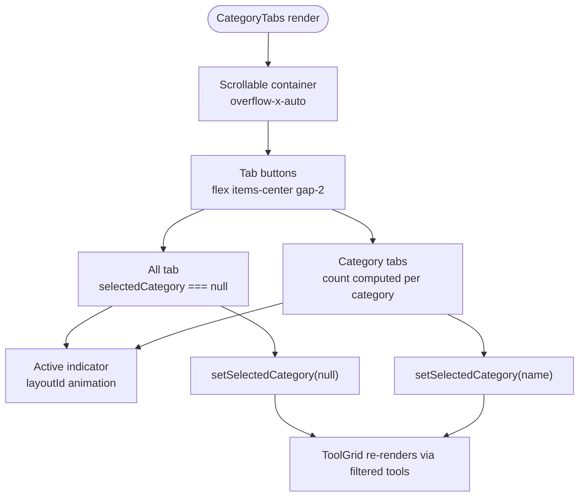
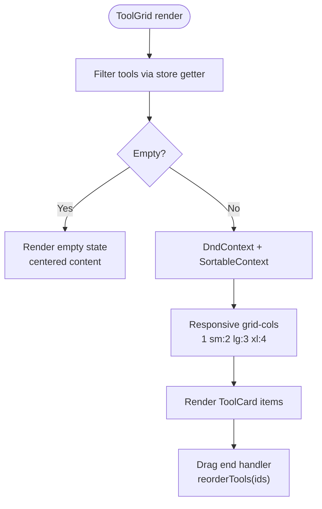
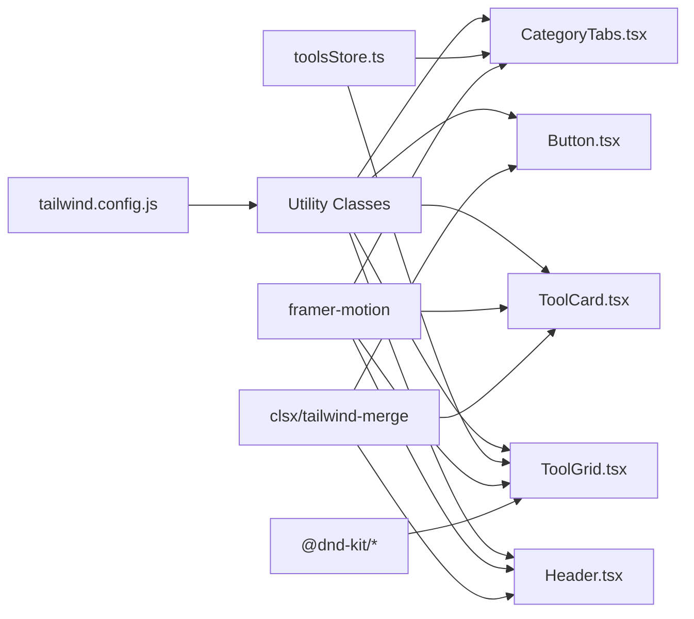

# Responsive Design & Layout

<cite>
**Referenced Files in This Document**
- [tailwind.config.js](file://tailwind.config.js)
- [src/index.css](file://src/index.css)
- [src/App.tsx](file://src/App.tsx)
- [src/components/layout/Header.tsx](file://src/components/layout/Header.tsx)
- [src/components/features/CategoryTabs.tsx](file://src/components/features/CategoryTabs.tsx)
- [src/components/features/ToolGrid.tsx](file://src/components/features/ToolGrid.tsx)
- [src/components/features/ToolCard.tsx](file://src/components/features/ToolCard.tsx)
- [src/components/ui/Button.tsx](file://src/components/ui/Button.tsx)
- [src/utils/cn.ts](file://src/utils/cn.ts)
- [src/stores/toolsStore.ts](file://src/stores/toolsStore.ts)
- [src/types/index.ts](file://src/types/index.ts)
- [package.json](file://package.json)
</cite>

## Table of Contents
1. [Introduction](#introduction)
2. [Project Structure](#project-structure)
3. [Core Components](#core-components)
4. [Architecture Overview](#architecture-overview)
5. [Detailed Component Analysis](#detailed-component-analysis)
6. [Dependency Analysis](#dependency-analysis)
7. [Performance Considerations](#performance-considerations)
8. [Troubleshooting Guide](#troubleshooting-guide)
9. [Conclusion](#conclusion)

## Introduction
This document explains AIPulse's responsive design architecture with a mobile-first approach using Tailwind CSS utility classes. It covers breakpoint management, adaptive grid layouts, header navigation behavior across screen sizes, category tabs responsiveness, and tool grid adaptation. It also details the flexbox and grid layout systems, spacing utilities, typography scaling, visual hierarchy maintenance, touch-friendly interaction patterns, and performance optimizations for mobile experiences.

## Project Structure
AIPulse follows a component-based architecture with clear separation of concerns:
- Global styling and Tailwind configuration define the design system and responsive utilities.
- Layout components (Header, Footer) manage global navigation and branding.
- Feature components (CategoryTabs, ToolGrid, ToolCard) implement content and interaction logic.
- UI primitives (Button) provide reusable, accessible components.
- State management (Zustand) centralizes data and derived computations.

**Diagram sources**
- [src/App.tsx](file://src/App.tsx#L1-L122)
- [src/components/layout/Header.tsx](file://src/components/layout/Header.tsx#L1-L83)
- [src/components/features/CategoryTabs.tsx](file://src/components/features/CategoryTabs.tsx#L1-L106)
- [src/components/features/ToolGrid.tsx](file://src/components/features/ToolGrid.tsx#L1-L112)
- [src/components/features/ToolCard.tsx](file://src/components/features/ToolCard.tsx#L1-L141)
- [src/components/ui/Button.tsx](file://src/components/ui/Button.tsx#L1-L88)
- [src/stores/toolsStore.ts](file://src/stores/toolsStore.ts#L1-L177)
- [src/types/index.ts](file://src/types/index.ts#L1-L60)
- [tailwind.config.js](file://tailwind.config.js#L1-L69)
- [src/index.css](file://src/index.css#L1-L141)

**Section sources**
- [src/App.tsx](file://src/App.tsx#L1-L122)
- [tailwind.config.js](file://tailwind.config.js#L1-L69)
- [src/index.css](file://src/index.css#L1-L141)

## Core Components
- Tailwind CSS configuration defines responsive breakpoints, colors, animations, transitions, and custom utilities.
- Global CSS establishes base styles, focus visibility, selection styles, and theme-aware components.
- App orchestrates layout, applies theme classes, and manages modal states.
- Header adapts logo, search bar, and action buttons across breakpoints.
- CategoryTabs provide horizontal scrolling with active state animations.
- ToolGrid uses a responsive grid with drag-and-drop reordering.
- ToolCard implements hover states, drag handles, and touch-friendly actions.
- Button provides consistent sizing and interaction patterns across components.

**Section sources**
- [tailwind.config.js](file://tailwind.config.js#L1-L69)
- [src/index.css](file://src/index.css#L1-L141)
- [src/App.tsx](file://src/App.tsx#L1-L122)
- [src/components/layout/Header.tsx](file://src/components/layout/Header.tsx#L1-L83)
- [src/components/features/CategoryTabs.tsx](file://src/components/features/CategoryTabs.tsx#L1-L106)
- [src/components/features/ToolGrid.tsx](file://src/components/features/ToolGrid.tsx#L1-L112)
- [src/components/features/ToolCard.tsx](file://src/components/features/ToolCard.tsx#L1-L141)
- [src/components/ui/Button.tsx](file://src/components/ui/Button.tsx#L1-L88)

## Architecture Overview
AIPulse employs a mobile-first responsive strategy:
- Breakpoints: sm (640px), lg (1024px), xl (1280px).
- Grid: 1 column on small screens, scaling to 2–4 columns on larger screens.
- Flexbox: center-aligned header with flexible search and action areas.
- Spacing: consistent padding and gaps using Tailwind spacing utilities.
- Typography: scalable text sizes with semantic hierarchy.
- Animations: Framer Motion for entrance and interactive feedback.
- State: Zustand store manages filters, categories, and theme.

**Diagram sources**
- [src/components/layout/Header.tsx](file://src/components/layout/Header.tsx#L1-L83)
- [src/components/features/CategoryTabs.tsx](file://src/components/features/CategoryTabs.tsx#L1-L106)
- [src/components/features/ToolGrid.tsx](file://src/components/features/ToolGrid.tsx#L1-L112)
- [src/stores/toolsStore.ts](file://src/stores/toolsStore.ts#L1-L177)

## Detailed Component Analysis

### Responsive Breakpoints and Media Queries
- Breakpoint classes drive responsive behavior:
  - sm: 640px and up
  - lg: 1024px and up
  - xl: 1280px and up
- These are Tailwind defaults configured in the Tailwind configuration file.
- Utility classes like grid-cols-1 sm:grid-cols-2 lg:grid-cols-3 xl:grid-cols-4 control the grid density across screen sizes.

**Section sources**
- [tailwind.config.js](file://tailwind.config.js#L1-L69)
- [src/components/features/ToolGrid.tsx](file://src/components/features/ToolGrid.tsx#L97-L107)

### Header Navigation Behavior Across Screen Sizes
- Fixed positioning with backdrop blur and border for depth.
- Centered search bar with max-width constraint.
- Action buttons adapt:
  - Settings and Add Tool visible on medium+ screens.
  - Add Tool reduced to icon-only on smaller screens.
- Logo visibility toggled at the small breakpoint.
- Motion animations provide smooth entrance and staggered child elements.

**Diagram sources**
- [src/components/layout/Header.tsx](file://src/components/layout/Header.tsx#L11-L82)

**Section sources**
- [src/components/layout/Header.tsx](file://src/components/layout/Header.tsx#L1-L83)

### Category Tabs Responsiveness
- Horizontal scrolling container with hidden scrollbar.
- Active tab indicator uses layoutId for smooth spring animation.
- Counts per category displayed inline with active state styling.
- Dynamic filtering via store updates triggers grid re-render.

**Diagram sources**
- [src/components/features/CategoryTabs.tsx](file://src/components/features/CategoryTabs.tsx#L1-L106)
- [src/stores/toolsStore.ts](file://src/stores/toolsStore.ts#L94-L101)

**Section sources**
- [src/components/features/CategoryTabs.tsx](file://src/components/features/CategoryTabs.tsx#L1-L106)
- [src/stores/toolsStore.ts](file://src/stores/toolsStore.ts#L94-L101)

### Tool Grid Adaptation
- Responsive grid columns:
  - 1 column on extra-small screens
  - 2 columns from small breakpoint
  - 3 columns from large breakpoint
  - 4 columns from extra-large breakpoint
- Gap scaling ensures adequate spacing on larger screens.
- Empty state with centered content and call-to-action.
- Drag-and-drop reordering with keyboard support.

**Diagram sources**
- [src/components/features/ToolGrid.tsx](file://src/components/features/ToolGrid.tsx#L30-L111)
- [src/stores/toolsStore.ts](file://src/stores/toolsStore.ts#L132-L156)

**Section sources**
- [src/components/features/ToolGrid.tsx](file://src/components/features/ToolGrid.tsx#L1-L112)
- [src/stores/toolsStore.ts](file://src/stores/toolsStore.ts#L132-L156)

### ToolCard Interaction Patterns
- Hover states reveal edit/delete controls and lift effect.
- Drag handle appears on hover; visibility controlled by state.
- Touch-friendly affordances: larger hit targets, clear icons, and subtle shadows.
- Motion feedback on interactive elements (launch button).

**Section sources**
- [src/components/features/ToolCard.tsx](file://src/components/features/ToolCard.tsx#L1-L141)

### Flexbox and Grid Layout Systems
- Flexbox:
  - Header uses a horizontal flex container with center alignment and justified spacing.
  - CategoryTabs use a flex row with min-width to enable horizontal scrolling.
- Grid:
  - ToolGrid uses a responsive CSS grid with Tailwind classes for column counts and gaps.
- Spacing:
  - Consistent padding and margins across components using Tailwind spacing utilities.
- Typography:
  - Semantic text sizes and weights; responsive scaling via utility classes.

**Section sources**
- [src/components/layout/Header.tsx](file://src/components/layout/Header.tsx#L19-L78)
- [src/components/features/CategoryTabs.tsx](file://src/components/features/CategoryTabs.tsx#L26-L103)
- [src/components/features/ToolGrid.tsx](file://src/components/features/ToolGrid.tsx#L97-L107)
- [src/index.css](file://src/index.css#L14-L18)

### Spacing Utilities and Typography Scaling
- Spacing:
  - Padding utilities (py, px) and gap utilities control internal and external spacing.
  - Responsive padding on main content (sm:px-6 lg:px-8).
- Typography:
  - Font families and weights are defined in Tailwind configuration.
  - Text sizes scale appropriately across breakpoints for readability.

**Section sources**
- [src/App.tsx](file://src/App.tsx#L73-L101)
- [tailwind.config.js](file://tailwind.config.js#L35-L37)
- [src/index.css](file://src/index.css#L14-L18)

### Visual Hierarchy and Touch-Friendly Patterns
- Visual hierarchy:
  - Primary brand color for highlights and active states.
  - Clear contrast between foreground and background across themes.
  - Card borders and subtle shadows enhance depth.
- Touch-friendly:
  - Button sizes and paddings optimized for thumb-friendly taps.
  - Icons paired with text for clarity.
  - Hover and focus states clearly indicated.

**Section sources**
- [src/components/ui/Button.tsx](file://src/components/ui/Button.tsx#L27-L51)
- [src/components/features/ToolCard.tsx](file://src/components/features/ToolCard.tsx#L102-L136)
- [src/index.css](file://src/index.css#L72-L75)

## Dependency Analysis
Key dependencies and their roles in responsive design:
- Tailwind CSS: Provides utility classes for responsive breakpoints, spacing, and layout.
- Framer Motion: Adds entrance animations and interactive feedback.
- Zustand: Centralized state for filtering, sorting, and theme.
- clsx/tailwind-merge: Safely merges Tailwind classes to avoid conflicts.
- dnd-kit: Enables drag-and-drop reordering with keyboard accessibility.

**Diagram sources**
- [tailwind.config.js](file://tailwind.config.js#L1-L69)
- [src/components/layout/Header.tsx](file://src/components/layout/Header.tsx#L1-L83)
- [src/components/features/ToolGrid.tsx](file://src/components/features/ToolGrid.tsx#L1-L112)
- [src/components/features/CategoryTabs.tsx](file://src/components/features/CategoryTabs.tsx#L1-L106)
- [src/components/features/ToolCard.tsx](file://src/components/features/ToolCard.tsx#L1-L141)
- [src/components/ui/Button.tsx](file://src/components/ui/Button.tsx#L1-L88)
- [src/stores/toolsStore.ts](file://src/stores/toolsStore.ts#L1-L177)
- [package.json](file://package.json#L22-L34)

**Section sources**
- [package.json](file://package.json#L22-L34)
- [src/utils/cn.ts](file://src/utils/cn.ts#L1-L7)

## Performance Considerations
- Minimize layout thrashing:
  - Prefer Tailwind utility classes over dynamic CSS-in-JS.
  - Use CSS transforms for animations (Framer Motion).
- Optimize rendering:
  - Memoize derived data (filtered tools) to prevent unnecessary re-renders.
  - Use stable keys for list items to improve diffing.
- Bundle and build:
  - Tailwind purging configured to target source files.
  - Vite builds optimize assets and code splitting.
- Accessibility:
  - Ensure sufficient color contrast and focus visibility.
  - Provide keyboard navigation for drag-and-drop interactions.

[No sources needed since this section provides general guidance]

## Troubleshooting Guide
- Grid columns not adapting:
  - Verify responsive grid classes on the grid container.
  - Confirm store-derived filtered tools are passed to the grid.
- Category tabs overflow:
  - Ensure the container has horizontal scrolling enabled and hidden scrollbar utility.
  - Check that active indicator animation uses layoutId consistently.
- Header actions overlap on small screens:
  - Confirm breakpoint-specific visibility classes for action buttons.
  - Validate that the search bar maintains its max-width constraint.
- Drag-and-drop not working:
  - Ensure DndContext wraps SortableContext with correct items and strategy.
  - Verify sensor activation constraints and keyboard coordinates.

**Section sources**
- [src/components/features/ToolGrid.tsx](file://src/components/features/ToolGrid.tsx#L87-L109)
- [src/components/features/CategoryTabs.tsx](file://src/components/features/CategoryTabs.tsx#L26-L103)
- [src/components/layout/Header.tsx](file://src/components/layout/Header.tsx#L17-L77)
- [src/stores/toolsStore.ts](file://src/stores/toolsStore.ts#L132-L156)

## Conclusion
AIPulse implements a robust mobile-first responsive design using Tailwind CSS utilities, consistent breakpoints, and adaptive grid layouts. The header navigation, category tabs, and tool grid all respond gracefully across screen sizes. Combined with thoughtful spacing, typography scaling, and motion feedback, the interface remains accessible and performant on mobile devices. The architecture’s clear separation of concerns and state-driven filtering ensures predictable behavior and maintainability.