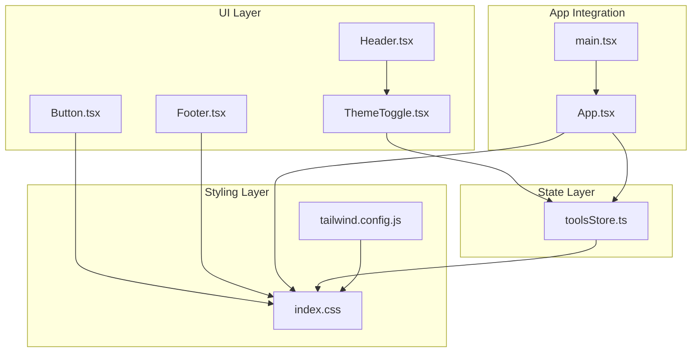
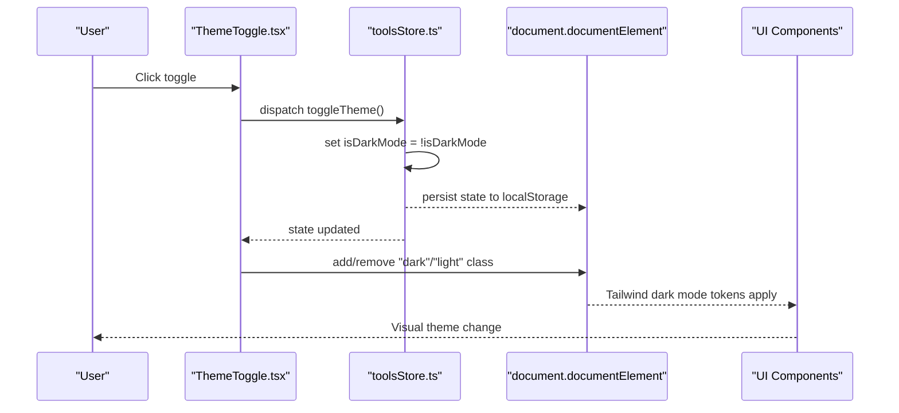
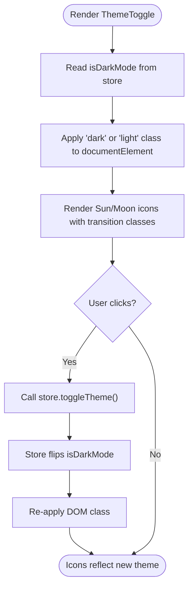
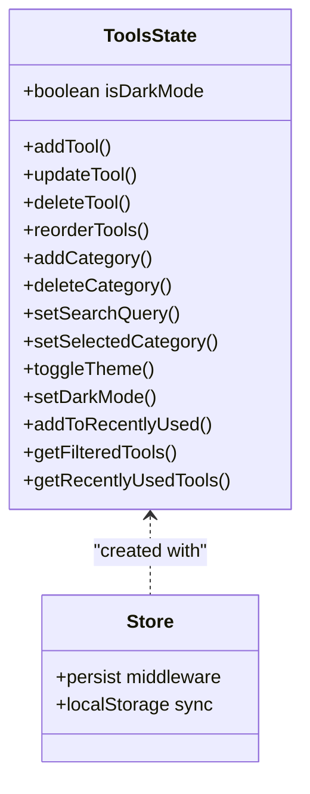
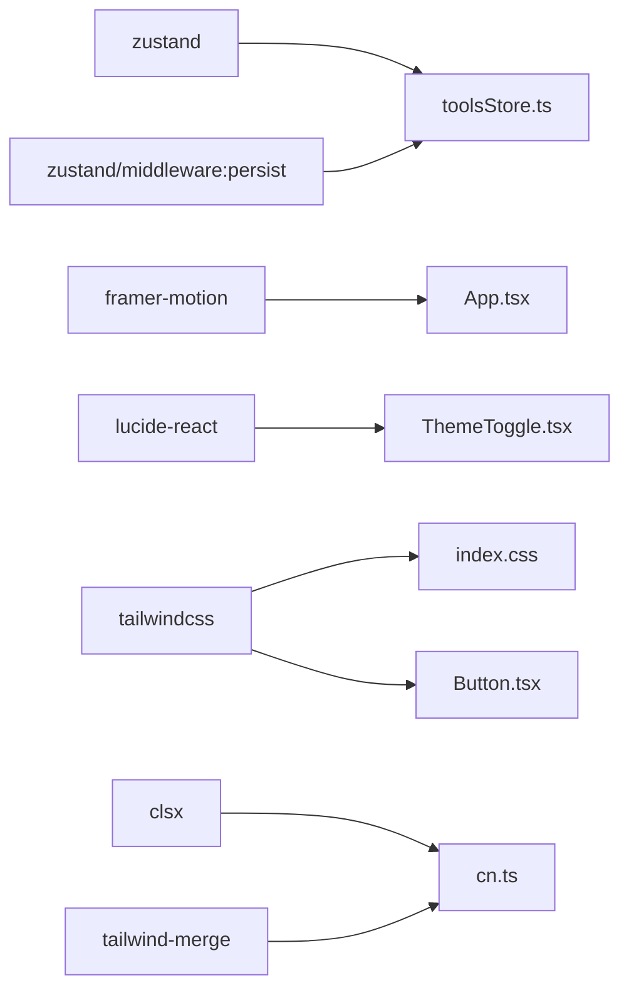

# Theme System & Color Management

<cite>
**Referenced Files in This Document**
- [ThemeToggle.tsx](file://src/components/features/ThemeToggle.tsx)
- [toolsStore.ts](file://src/stores/toolsStore.ts)
- [tailwind.config.js](file://tailwind.config.js)
- [index.css](file://src/index.css)
- [Button.tsx](file://src/components/ui/Button.tsx)
- [index.ts](file://src/types/index.ts)
- [App.tsx](file://src/App.tsx)
- [main.tsx](file://src/main.tsx)
- [Header.tsx](file://src/components/layout/Header.tsx)
- [Footer.tsx](file://src/components/layout/Footer.tsx)
- [cn.ts](file://src/utils/cn.ts)
- [defaultTools.ts](file://src/constants/defaultTools.ts)
- [package.json](file://package.json)
</cite>

## Table of Contents
1. [Introduction](#introduction)
2. [Project Structure](#project-structure)
3. [Core Components](#core-components)
4. [Architecture Overview](#architecture-overview)
5. [Detailed Component Analysis](#detailed-component-analysis)
6. [Dependency Analysis](#dependency-analysis)
7. [Performance Considerations](#performance-considerations)
8. [Troubleshooting Guide](#troubleshooting-guide)
9. [Conclusion](#conclusion)
10. [Appendices](#appendices)

## Introduction
This document explains the AIPulse theme system and color management implementation. It covers the dark/light mode toggle component, Lucide React icon switching, state management via Zustand store, DOM class manipulation for theme application, Tailwind CSS dark mode configuration, color scheme variables, theme persistence, transitions using Framer Motion, and accessibility considerations. It also provides implementation patterns for customizing colors, adding new themes, and maintaining visual consistency across components.

## Project Structure
The theme system spans several layers:
- UI toggle component that renders Lucide icons and triggers state changes
- Zustand store managing theme state and persistence
- Tailwind configuration defining color tokens and dark mode behavior
- Global CSS applying color-scheme and mode-specific styles
- UI components that adapt to dark/light modes using Tailwind utilities
- Application-level DOM class application for immediate theme rendering

**Diagram sources**
- [ThemeToggle.tsx](file://src/components/features/ThemeToggle.tsx#L1-L43)
- [Header.tsx](file://src/components/layout/Header.tsx#L1-L83)
- [Button.tsx](file://src/components/ui/Button.tsx#L1-L88)
- [Footer.tsx](file://src/components/layout/Footer.tsx#L1-L21)
- [toolsStore.ts](file://src/stores/toolsStore.ts#L1-L177)
- [tailwind.config.js](file://tailwind.config.js#L1-L69)
- [index.css](file://src/index.css#L1-L141)
- [App.tsx](file://src/App.tsx#L1-L122)
- [main.tsx](file://src/main.tsx#L1-L11)

**Section sources**
- [ThemeToggle.tsx](file://src/components/features/ThemeToggle.tsx#L1-L43)
- [toolsStore.ts](file://src/stores/toolsStore.ts#L1-L177)
- [tailwind.config.js](file://tailwind.config.js#L1-L69)
- [index.css](file://src/index.css#L1-L141)
- [App.tsx](file://src/App.tsx#L1-L122)
- [main.tsx](file://src/main.tsx#L1-L11)

## Core Components
- ThemeToggle: Renders sun/moon icons, toggles theme via Zustand, and applies DOM class for immediate visual feedback.
- toolsStore: Centralized state with theme actions, persisted to localStorage.
- Tailwind config: Defines color tokens and dark mode behavior.
- Global CSS: Applies color-scheme and mode-specific overrides.
- UI components: Use Tailwind utilities to adapt to dark/light modes.

Key implementation patterns:
- DOM class manipulation on document element to switch between dark and light modes
- Zustand persist middleware to maintain theme across sessions
- Tailwind dark mode via class strategy
- Lucide React icons for intuitive UX
- Framer Motion for entrance animations and transitions

**Section sources**
- [ThemeToggle.tsx](file://src/components/features/ThemeToggle.tsx#L6-L42)
- [toolsStore.ts](file://src/stores/toolsStore.ts#L103-L110)
- [tailwind.config.js](file://tailwind.config.js#L7-L34)
- [index.css](file://src/index.css#L90-L98)
- [Button.tsx](file://src/components/ui/Button.tsx#L27-L34)

## Architecture Overview
The theme system follows a unidirectional data flow:
- User interacts with ThemeToggle
- ThemeToggle calls store action to flip isDarkMode
- Store updates state and persists it
- Effects apply/remove "dark"/"light" class on document element
- Tailwind utilities switch colors based on the applied class
- UI components re-render with appropriate color tokens

**Diagram sources**
- [ThemeToggle.tsx](file://src/components/features/ThemeToggle.tsx#L10-L18)
- [toolsStore.ts](file://src/stores/toolsStore.ts#L103-L110)
- [index.css](file://src/index.css#L90-L98)
- [Button.tsx](file://src/components/ui/Button.tsx#L27-L34)

## Detailed Component Analysis

### ThemeToggle Component
Responsibilities:
- Render sun and moon icons with opacity/rotation transitions
- Trigger store action to toggle theme
- Apply/remove "dark"/"light" class on document element
- Provide accessible labels for screen readers

Implementation highlights:
- Uses Lucide React Sun/Moon icons
- Conditional classes animate icon visibility based on isDarkMode
- Calls store.toggleTheme on click
- Adds/removes "dark"/"light" class for Tailwind dark mode

**Diagram sources**
- [ThemeToggle.tsx](file://src/components/features/ThemeToggle.tsx#L6-L42)
- [toolsStore.ts](file://src/stores/toolsStore.ts#L103-L110)
- [index.css](file://src/index.css#L90-L98)

**Section sources**
- [ThemeToggle.tsx](file://src/components/features/ThemeToggle.tsx#L1-L43)
- [Header.tsx](file://src/components/layout/Header.tsx#L53-L53)

### Zustand Store (toolsStore)
Responsibilities:
- Manage isDarkMode state
- Provide toggleTheme and setDarkMode actions
- Persist state to localStorage using Zustand persist middleware
- Expose theme-aware getters and setters

Key actions:
- toggleTheme: flips isDarkMode
- setDarkMode: forces a specific theme value
- Persisted fields include isDarkMode

Persistence:
- Middleware configured with a storage key and selective state serialization

**Diagram sources**
- [toolsStore.ts](file://src/stores/toolsStore.ts#L14-L177)
- [index.ts](file://src/types/index.ts#L19-L51)

**Section sources**
- [toolsStore.ts](file://src/stores/toolsStore.ts#L1-L177)
- [index.ts](file://src/types/index.ts#L19-L51)

### Tailwind CSS Dark Mode Configuration
Configuration highlights:
- darkMode: 'class'
- Extends color palette with semantic tokens:
  - primary (with dark/light variants)
  - background (dark, card, cardHover, light, cardLight)
  - text (primary, secondary, muted, primaryLight, secondaryLight)
  - border (DEFAULT, light)
- Adds custom animations and transitions
- Provides transition defaults for smooth color changes

Usage:
- Components apply dark mode tokens using Tailwind utilities
- The "dark" class on document element activates dark mode styles

**Section sources**
- [tailwind.config.js](file://tailwind.config.js#L7-L65)
- [Button.tsx](file://src/components/ui/Button.tsx#L27-L34)

### Global CSS and Color-Scheme Variables
Global CSS responsibilities:
- Defines color-scheme: dark/light on .dark/.light classes
- Provides focus-visible outline with primary color
- Includes input autofill styles for both modes
- Adds transition defaults for smooth color transitions
- Applies background grid pattern and backdrop blur effects

Integration:
- The "dark" class toggled on document element aligns with Tailwind dark mode
- UI components rely on Tailwind tokens for consistent colors

**Section sources**
- [index.css](file://src/index.css#L90-L141)
- [App.tsx](file://src/App.tsx#L54-L54)

### UI Components Adaptation
Components adapt to themes using Tailwind utilities:
- Background tokens for pages and cards
- Text color tokens for headers and footers
- Border tokens for containers and inputs
- Button variants leverage primary and text tokens

Patterns:
- Use dark:text-* and light:text-* for mode-specific text
- Use bg-background-dark/light for backgrounds
- Use text-text-primary/secondary for typography
- Use border-border/dark:border-border-light for borders

**Section sources**
- [Button.tsx](file://src/components/ui/Button.tsx#L27-L34)
- [Header.tsx](file://src/components/layout/Header.tsx#L17-L33)
- [Footer.tsx](file://src/components/layout/Footer.tsx#L7-L17)
- [App.tsx](file://src/App.tsx#L54-L54)

### Theme Persistence Mechanism
Mechanism:
- Zustand persist middleware serializes isDarkMode along with other state
- Storage key ensures theme survives reloads
- On app initialization, the store restores persisted theme

Integration:
- ThemeToggle and App both rely on isDarkMode from the store
- DOM class is applied during component mount and on state changes

**Section sources**
- [toolsStore.ts](file://src/stores/toolsStore.ts#L166-L175)
- [ThemeToggle.tsx](file://src/components/features/ThemeToggle.tsx#L10-L18)
- [App.tsx](file://src/App.tsx#L19-L26)

### Theme Transition Animations Using Framer Motion
Animations:
- App uses Framer Motion for entrance animations on sections
- ThemeToggle uses CSS transitions for icon swapping
- Global CSS defines transition defaults for color changes

Patterns:
- Use motion wrappers for page sections to enhance perceived performance
- Keep icon transitions subtle and fast for responsive feedback
- Rely on Tailwind transition utilities for color and background changes

**Section sources**
- [App.tsx](file://src/App.tsx#L76-L99)
- [ThemeToggle.tsx](file://src/components/features/ThemeToggle.tsx#L28-L39)
- [index.css](file://src/index.css#L84-L88)

### Accessibility Considerations for Theme Switching
Accessibility practices:
- ThemeToggle includes aria-label indicating current mode
- Focus-visible outline uses primary color for keyboard navigation
- Color contrast maintained via semantic tokens
- Icons convey meaning without relying solely on color

Recommendations:
- Ensure sufficient contrast in both modes
- Provide visible focus indicators
- Announce theme changes for assistive technologies if needed

**Section sources**
- [ThemeToggle.tsx](file://src/components/features/ThemeToggle.tsx#L26-L26)
- [index.css](file://src/index.css#L72-L75)

## Dependency Analysis
External libraries and their roles:
- Zustand: State management with persist middleware
- Framer Motion: Page entrance animations
- Lucide React: Icons for theme toggle
- Tailwind CSS: Utility-first styling and dark mode
- clsx/tailwind-merge: Class merging and deduplication

**Diagram sources**
- [package.json](file://package.json#L22-L34)
- [toolsStore.ts](file://src/stores/toolsStore.ts#L1-L2)
- [App.tsx](file://src/App.tsx#L2-L2)
- [ThemeToggle.tsx](file://src/components/features/ThemeToggle.tsx#L1-L1)
- [Button.tsx](file://src/components/ui/Button.tsx#L2-L2)
- [cn.ts](file://src/utils/cn.ts#L1-L2)

**Section sources**
- [package.json](file://package.json#L22-L34)
- [toolsStore.ts](file://src/stores/toolsStore.ts#L1-L2)
- [ThemeToggle.tsx](file://src/components/features/ThemeToggle.tsx#L1-L1)
- [Button.tsx](file://src/components/ui/Button.tsx#L2-L2)
- [cn.ts](file://src/utils/cn.ts#L1-L2)

## Performance Considerations
- Minimal re-renders: ThemeToggle only subscribes to isDarkMode
- Efficient DOM manipulation: Single class addition/removal per toggle
- CSS transitions: Smooth color changes without heavy JS
- Persisted state: Reduces runtime computation after initial load
- Tailwind utilities: Pre-built styles avoid runtime style calculations

## Troubleshooting Guide
Common issues and resolutions:
- Theme not persisting across reloads
  - Verify persist middleware configuration and storage key
  - Confirm isDarkMode is included in partialize
- Icons not switching properly
  - Ensure isDarkMode state updates before DOM class change
  - Check that both sun and moon icons receive transition classes
- Incorrect color contrast
  - Review Tailwind color tokens and semantic mappings
  - Test both dark and light modes with contrast tools
- Flicker on initial load
  - Apply dark class on mount in App component
  - Ensure global CSS sets color-scheme early

**Section sources**
- [toolsStore.ts](file://src/stores/toolsStore.ts#L166-L175)
- [ThemeToggle.tsx](file://src/components/features/ThemeToggle.tsx#L10-L18)
- [index.css](file://src/index.css#L90-L98)
- [App.tsx](file://src/App.tsx#L19-L26)

## Conclusion
AIPulse implements a robust, accessible theme system combining Zustand for state management, Tailwind CSS for styling, and Lucide React for intuitive icons. The design emphasizes simplicity, performance, and consistency across components. Developers can customize colors by extending Tailwind tokens, add new themes by introducing additional classes and tokens, and maintain visual coherence by leveraging semantic color names and transition utilities.

## Appendices

### Customizing Colors and Adding New Themes
Steps:
- Extend Tailwind color tokens in tailwind.config.js
- Define new semantic tokens for backgrounds, text, and borders
- Introduce new mode classes (e.g., "sepia") and corresponding color-scheme values
- Update global CSS to support new classes
- Adjust UI components to use new tokens consistently
- Test transitions and contrast in all supported modes

Patterns:
- Use semantic names (background, text, border) for maintainability
- Provide fallbacks for light/dark variants
- Keep transition durations uniform for coherent UX

**Section sources**
- [tailwind.config.js](file://tailwind.config.js#L10-L34)
- [index.css](file://src/index.css#L90-L98)
- [Button.tsx](file://src/components/ui/Button.tsx#L27-L34)

### Maintaining Visual Consistency Across Components
Guidelines:
- Prefer Tailwind utilities over inline styles
- Use cn utility for safe class merging
- Leverage shared tokens from Tailwind config
- Apply consistent spacing and typography scales
- Test components in both dark and light modes

**Section sources**
- [cn.ts](file://src/utils/cn.ts#L4-L6)
- [Button.tsx](file://src/components/ui/Button.tsx#L27-L34)
- [Header.tsx](file://src/components/layout/Header.tsx#L17-L33)
- [Footer.tsx](file://src/components/layout/Footer.tsx#L7-L17)