# User Interface & Experience

<cite>
**Referenced Files in This Document**
- [App.tsx](file://src/App.tsx)
- [index.css](file://src/index.css)
- [Header.tsx](file://src/components/layout/Header.tsx)
- [ThemeToggle.tsx](file://src/components/features/ThemeToggle.tsx)
- [CategoryTabs.tsx](file://src/components/features/CategoryTabs.tsx)
- [SearchBar.tsx](file://src/components/features/SearchBar.tsx)
- [ToolGrid.tsx](file://src/components/features/ToolGrid.tsx)
- [Button.tsx](file://src/components/ui/Button.tsx)
- [Modal.tsx](file://src/components/ui/Modal.tsx)
- [ToolModal.tsx](file://src/components/modals/ToolModal.tsx)
- [toolsStore.ts](file://src/stores/toolsStore.ts)
- [index.ts](file://src/types/index.ts)
- [cn.ts](file://src/utils/cn.ts)
- [package.json](file://package.json)
</cite>

## Table of Contents
1. [Introduction](#introduction)
2. [Project Structure](#project-structure)
3. [Core Components](#core-components)
4. [Architecture Overview](#architecture-overview)
5. [Detailed Component Analysis](#detailed-component-analysis)
6. [Dependency Analysis](#dependency-analysis)
7. [Performance Considerations](#performance-considerations)
8. [Accessibility Features](#accessibility-features)
9. [Responsive Design and Layout](#responsive-design-and-layout)
10. [Animation System](#animation-system)
11. [Navigation and Interaction Patterns](#navigation-and-interaction-patterns)
12. [Modal System](#modal-system)
13. [Theme System](#theme-system)
14. [Troubleshooting Guide](#troubleshooting-guide)
15. [Conclusion](#conclusion)

## Introduction
This document provides comprehensive UI/UX documentation for AIPulse, focusing on the theme system, responsive design, animation patterns, navigation, accessibility, modal interactions, and layout systems. It synthesizes the implementation details present in the codebase to guide both developers and designers in maintaining consistency, enhancing usability, and ensuring cross-browser compatibility.

## Project Structure
AIPulse follows a component-driven architecture with clear separation of concerns:
- Layout components define global header, footer, and page scaffolding.
- Feature components encapsulate domain-specific UI (search, category tabs, tool grid).
- UI primitives provide reusable controls (buttons, inputs, modals).
- Modals implement focused workflows for tool creation/editing and deletion.
- Zustand-powered stores manage state, filters, and persistence.
- Tailwind CSS and custom CSS define the design tokens, animations, and utilities.

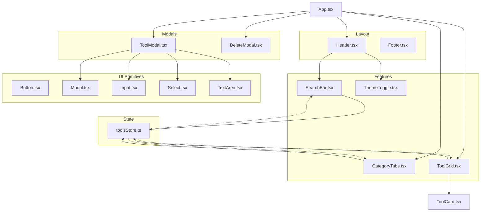

**Diagram sources**
- [App.tsx](file://src/App.tsx#L1-L122)
- [Header.tsx](file://src/components/layout/Header.tsx#L1-L83)
- [CategoryTabs.tsx](file://src/components/features/CategoryTabs.tsx#L1-L106)
- [SearchBar.tsx](file://src/components/features/SearchBar.tsx#L1-L42)
- [ToolGrid.tsx](file://src/components/features/ToolGrid.tsx#L1-L112)
- [ThemeToggle.tsx](file://src/components/features/ThemeToggle.tsx#L1-L43)
- [Button.tsx](file://src/components/ui/Button.tsx#L1-L88)
- [Modal.tsx](file://src/components/ui/Modal.tsx#L1-L128)
- [ToolModal.tsx](file://src/components/modals/ToolModal.tsx#L1-L253)
- [toolsStore.ts](file://src/stores/toolsStore.ts#L1-L177)

**Section sources**
- [App.tsx](file://src/App.tsx#L1-L122)
- [package.json](file://package.json#L1-L35)

## Core Components
- App orchestrates the page layout, applies theme classes, and renders the main sections with motion transitions.
- Header integrates logo, search bar, theme toggle, and action buttons with responsive visibility.
- CategoryTabs implements category filtering with animated active indicators and counts.
- SearchBar debounces input and updates the store’s search query.
- ToolGrid renders filtered tools in a responsive grid and supports drag-and-drop reordering.
- Button provides consistent variants, sizes, icons, loading states, and focus styles.
- Modal composes backdrop, container, header, content, and footer with escape-key handling.
- ToolModal manages form validation, category creation, icon selection, and persistence via the store.

**Section sources**
- [App.tsx](file://src/App.tsx#L13-L119)
- [Header.tsx](file://src/components/layout/Header.tsx#L11-L82)
- [CategoryTabs.tsx](file://src/components/features/CategoryTabs.tsx#L5-L105)
- [SearchBar.tsx](file://src/components/features/SearchBar.tsx#L6-L41)
- [ToolGrid.tsx](file://src/components/features/ToolGrid.tsx#L30-L111)
- [Button.tsx](file://src/components/ui/Button.tsx#L12-L87)
- [Modal.tsx](file://src/components/ui/Modal.tsx#L26-L127)
- [ToolModal.tsx](file://src/components/modals/ToolModal.tsx#L23-L252)

## Architecture Overview
The UI architecture centers on a store-driven filtering pipeline and motion-enhanced interactions:
- State: tools, categories, search query, selected category, theme, and recently used.
- Filters: category and search query applied to produce a sorted, ordered tool list.
- Rendering: grid layout adapts to breakpoints; animations enhance transitions and hover states.
- Modals: isolated overlays with escape handling and controlled focus.

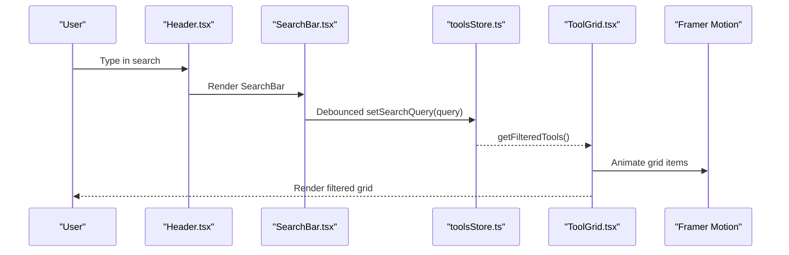

**Diagram sources**
- [Header.tsx](file://src/components/layout/Header.tsx#L1-L83)
- [SearchBar.tsx](file://src/components/features/SearchBar.tsx#L1-L42)
- [toolsStore.ts](file://src/stores/toolsStore.ts#L132-L156)
- [ToolGrid.tsx](file://src/components/features/ToolGrid.tsx#L30-L111)

## Detailed Component Analysis

### Theme Toggle and Theme Application
- ThemeToggle toggles the theme in the store and applies/removes document classes for dark/light modes.
- App listens to theme changes and sets the root class accordingly.
- index.css defines color-scheme toggles and theme-specific variables.

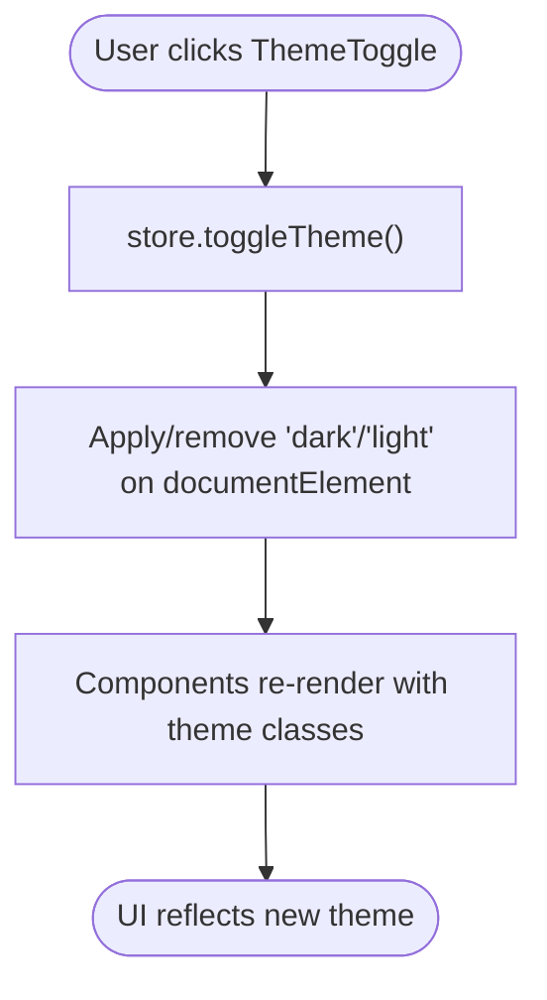

**Diagram sources**
- [ThemeToggle.tsx](file://src/components/features/ThemeToggle.tsx#L6-L18)
- [App.tsx](file://src/App.tsx#L19-L26)
- [index.css](file://src/index.css#L118-L126)

**Section sources**
- [ThemeToggle.tsx](file://src/components/features/ThemeToggle.tsx#L6-L42)
- [App.tsx](file://src/App.tsx#L17-L26)
- [index.css](file://src/index.css#L118-L126)

### Category Filtering and Active States
- CategoryTabs computes counts, toggles selection, and animates active tab backgrounds using layoutId.
- toolsStore.getFilteredTools applies category and search filters and sorts by order.

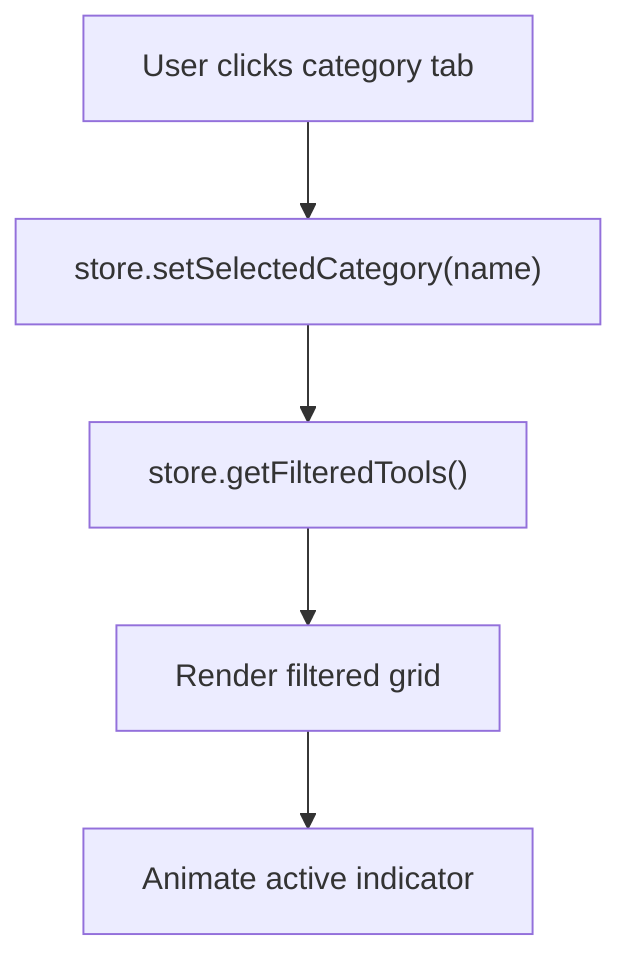

**Diagram sources**
- [CategoryTabs.tsx](file://src/components/features/CategoryTabs.tsx#L13-L19)
- [toolsStore.ts](file://src/stores/toolsStore.ts#L132-L156)
- [ToolGrid.tsx](file://src/components/features/ToolGrid.tsx#L33-L33)

**Section sources**
- [CategoryTabs.tsx](file://src/components/features/CategoryTabs.tsx#L5-L105)
- [toolsStore.ts](file://src/stores/toolsStore.ts#L132-L156)

### Search Functionality and Debouncing
- SearchBar maintains local state and debounces updates to the store’s search query.
- toolsStore.getFilteredTools includes name, category, and description matching.

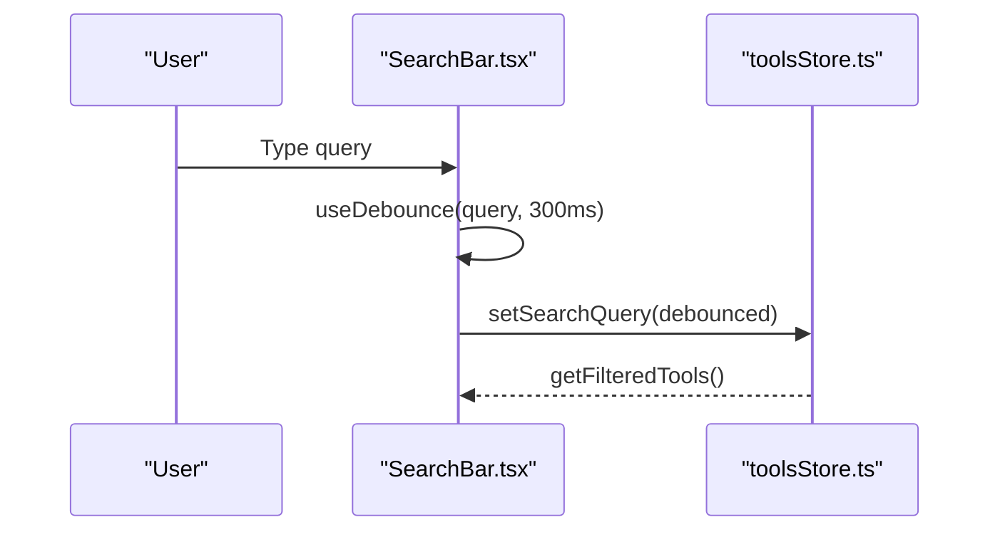

**Diagram sources**
- [SearchBar.tsx](file://src/components/features/SearchBar.tsx#L6-L18)
- [toolsStore.ts](file://src/stores/toolsStore.ts#L132-L156)

**Section sources**
- [SearchBar.tsx](file://src/components/features/SearchBar.tsx#L6-L41)
- [toolsStore.ts](file://src/stores/toolsStore.ts#L95-L101)
- [toolsStore.ts](file://src/stores/toolsStore.ts#L132-L156)

### Tool Grid and Drag-and-Drop Reordering
- ToolGrid uses @dnd-kit for pointer and keyboard sensors, drag end handling, and sorting.
- Responsive grid adjusts columns across breakpoints; empty state renders with motion.

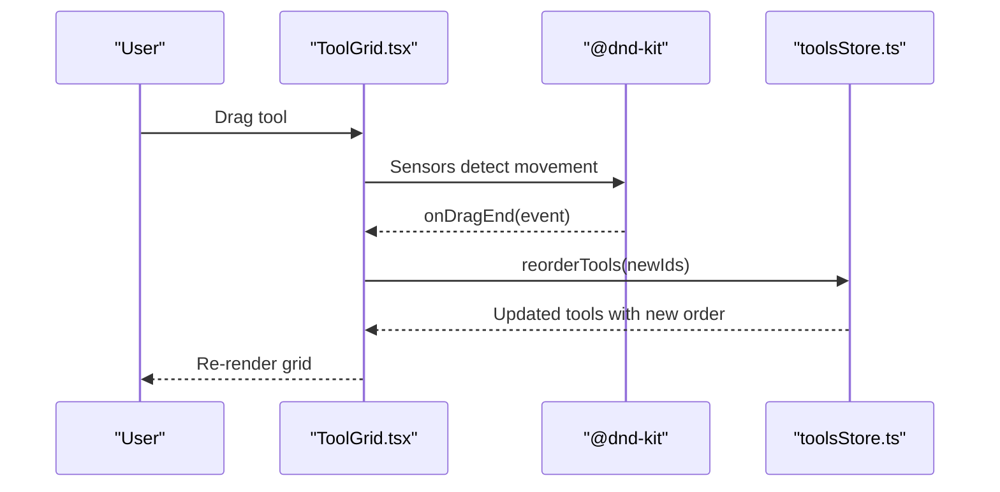

**Diagram sources**
- [ToolGrid.tsx](file://src/components/features/ToolGrid.tsx#L35-L56)
- [toolsStore.ts](file://src/stores/toolsStore.ts#L53-L75)

**Section sources**
- [ToolGrid.tsx](file://src/components/features/ToolGrid.tsx#L30-L111)
- [toolsStore.ts](file://src/stores/toolsStore.ts#L53-L75)

### Modal System: Creation, Editing, and Deletion
- Modal provides backdrop, escape key handling, and click-to-dismiss.
- ToolModal manages form state, validation, category creation, and persistence.

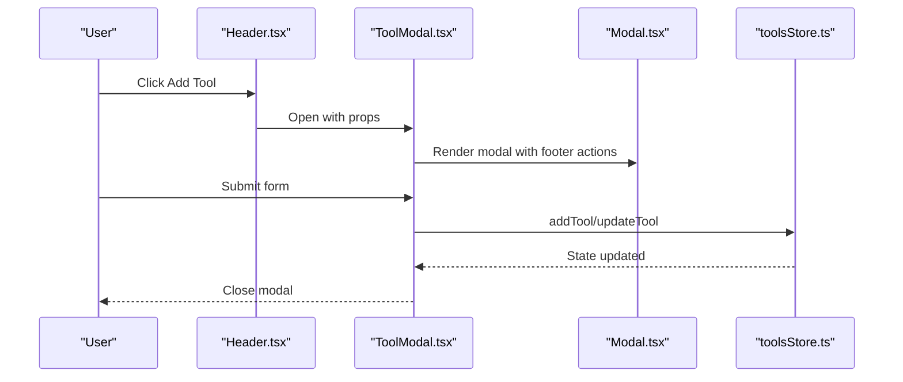

**Diagram sources**
- [Header.tsx](file://src/components/layout/Header.tsx#L62-L76)
- [ToolModal.tsx](file://src/components/modals/ToolModal.tsx#L80-L108)
- [Modal.tsx](file://src/components/ui/Modal.tsx#L37-L54)
- [toolsStore.ts](file://src/stores/toolsStore.ts#L25-L51)

**Section sources**
- [Modal.tsx](file://src/components/ui/Modal.tsx#L26-L127)
- [ToolModal.tsx](file://src/components/modals/ToolModal.tsx#L23-L252)
- [toolsStore.ts](file://src/stores/toolsStore.ts#L25-L51)

## Dependency Analysis
External libraries and their roles:
- Framer Motion: entrance/exit animations, layout animations, and gesture-driven transitions.
- @dnd-kit: drag-and-drop reordering with keyboard and pointer sensors.
- lucide-react: UI icons used across components.
- clsx and tailwind-merge: safe class merging for Tailwind utilities.
- uuid: generating unique identifiers for tools and categories.
- zustand: state management with persistence.

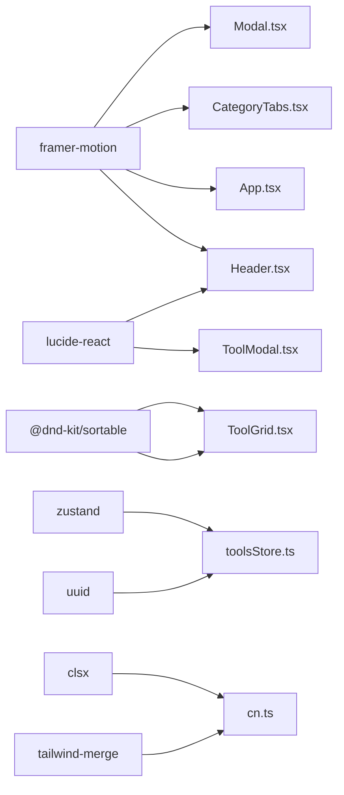

**Diagram sources**
- [package.json](file://package.json#L21-L33)
- [App.tsx](file://src/App.tsx#L1-L122)
- [Header.tsx](file://src/components/layout/Header.tsx#L1-L83)
- [CategoryTabs.tsx](file://src/components/features/CategoryTabs.tsx#L1-L106)
- [Modal.tsx](file://src/components/ui/Modal.tsx#L1-L128)
- [ToolGrid.tsx](file://src/components/features/ToolGrid.tsx#L1-L112)
- [ToolModal.tsx](file://src/components/modals/ToolModal.tsx#L1-L253)
- [toolsStore.ts](file://src/stores/toolsStore.ts#L1-L177)
- [cn.ts](file://src/utils/cn.ts#L1-L7)

**Section sources**
- [package.json](file://package.json#L21-L33)

## Performance Considerations
- Motion optimizations: prefer layoutId for smooth layout animations; keep transition durations reasonable (e.g., 0.2–0.4s).
- Debouncing: search query debounce reduces store updates and re-renders.
- Memoization: ToolGrid uses useMemo to avoid unnecessary recomputation of filtered tools.
- Drag-and-drop: minimal state updates during drag; compute new order only on drop.
- CSS animations: leverage hardware-accelerated properties (transform, opacity) and avoid layout thrashing.
- Bundle size: tree-shake unused icons and limit heavy animations on low-power devices.

[No sources needed since this section provides general guidance]

## Accessibility Features
- Focus management: focus-visible outlines and keyboard navigation supported by @dnd-kit sensors.
- ARIA and labels: buttons include aria-labels for icon-only controls (e.g., Add Tool, Close modal).
- Screen reader support: semantic markup and labels for interactive elements.
- Color contrast: theme-aware tokens ensure readable text across dark/light modes.
- Keyboard interactions: modal escape handling and sortable keyboard coordinates.

**Section sources**
- [index.css](file://src/index.css#L106-L110)
- [Header.tsx](file://src/components/layout/Header.tsx#L58-L76)
- [Modal.tsx](file://src/components/ui/Modal.tsx#L37-L54)
- [ToolGrid.tsx](file://src/components/features/ToolGrid.tsx#L35-L44)

## Responsive Design and Layout
- Mobile-first approach: base styles target small screens; Tailwind utilities add breakpoints (sm, lg, xl).
- Grid layout: responsive columns adjust from single column on small screens to four on extra-large screens.
- Header responsiveness: action buttons adapt visibility and sizing across breakpoints.
- Scrollbars and spacing: consistent padding and max widths maintain readability.

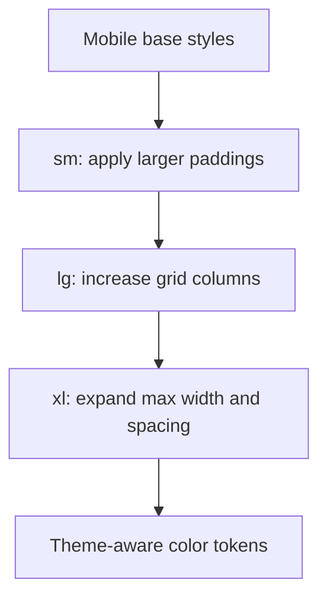

**Diagram sources**
- [ToolGrid.tsx](file://src/components/features/ToolGrid.tsx#L97-L107)
- [Header.tsx](file://src/components/layout/Header.tsx#L19-L79)
- [index.css](file://src/index.css#L3-L32)

**Section sources**
- [ToolGrid.tsx](file://src/components/features/ToolGrid.tsx#L97-L107)
- [Header.tsx](file://src/components/layout/Header.tsx#L19-L79)
- [index.css](file://src/index.css#L3-L32)

## Animation System
- Motion primitives: initial/animate/exit transitions and layout animations (e.g., layoutId for active tab).
- Custom keyframes: slide-in, fade-in, scale-in, and subtle bounce for micro-interactions.
- Hover and active states: card lift effect and button active scaling.
- Smooth scrolling: body scroll-behavior set to smooth.

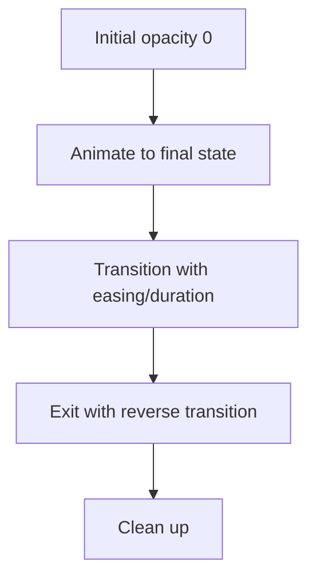

**Diagram sources**
- [App.tsx](file://src/App.tsx#L76-L99)
- [Header.tsx](file://src/components/layout/Header.tsx#L13-L80)
- [CategoryTabs.tsx](file://src/components/features/CategoryTabs.tsx#L22-L103)
- [index.css](file://src/index.css#L34-L52)

**Section sources**
- [App.tsx](file://src/App.tsx#L76-L99)
- [Header.tsx](file://src/components/layout/Header.tsx#L13-L80)
- [CategoryTabs.tsx](file://src/components/features/CategoryTabs.tsx#L22-L103)
- [index.css](file://src/index.css#L27-L52)

## Navigation and Interaction Patterns
- Header navigation: logo, search, theme toggle, and action buttons.
- Category filtering: horizontal scrolling tabs with counts and animated active state.
- Search: live filtering with debounced updates and clear action.
- Tool interactions: edit/delete actions routed to modals; drag-and-drop reordering.

**Section sources**
- [Header.tsx](file://src/components/layout/Header.tsx#L11-L82)
- [CategoryTabs.tsx](file://src/components/features/CategoryTabs.tsx#L5-L105)
- [SearchBar.tsx](file://src/components/features/SearchBar.tsx#L6-L41)
- [ToolGrid.tsx](file://src/components/features/ToolGrid.tsx#L30-L111)

## Modal System
- Backdrop interactions: click-to-dismiss and escape key handling.
- Focus management: body overflow hidden while modal is open; controlled focus via click propagation.
- Form workflows: validation, loading states, and persistence via store actions.

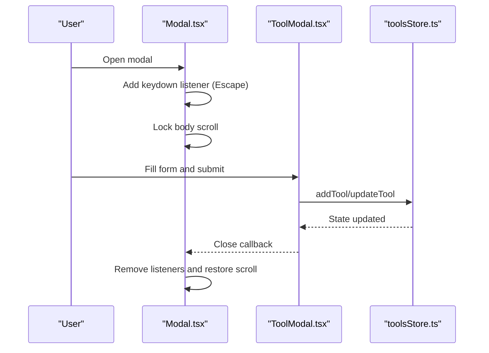

**Diagram sources**
- [Modal.tsx](file://src/components/ui/Modal.tsx#L37-L54)
- [ToolModal.tsx](file://src/components/modals/ToolModal.tsx#L80-L108)
- [toolsStore.ts](file://src/stores/toolsStore.ts#L25-L51)

**Section sources**
- [Modal.tsx](file://src/components/ui/Modal.tsx#L26-L127)
- [ToolModal.tsx](file://src/components/modals/ToolModal.tsx#L23-L252)

## Theme System
- Theme state: stored in the tools store with dark mode as default.
- Theme application: document element classes switch between dark and light.
- Color tokens: CSS variables define primary, backgrounds, borders, and text colors; Tailwind dark mode utilities apply theme-specific variants.
- System preference detection: the current implementation relies on explicit toggle; system preference detection can be integrated by reading system color-scheme media queries and initializing store accordingly.

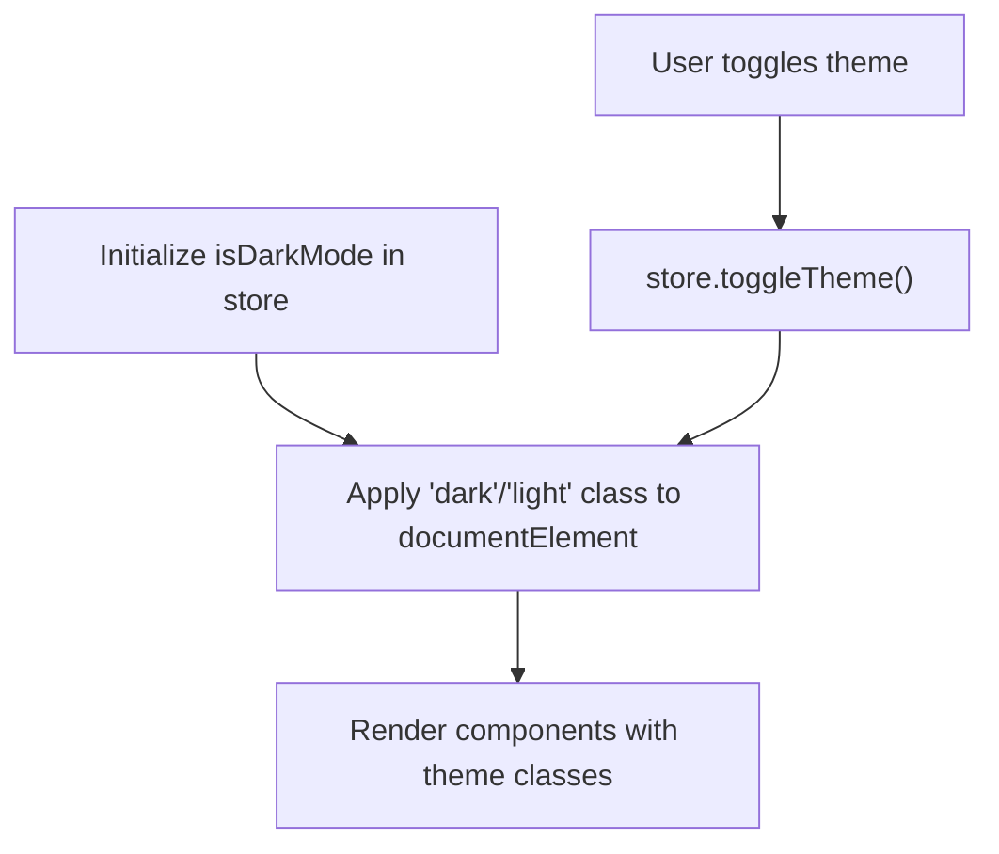

**Diagram sources**
- [toolsStore.ts](file://src/stores/toolsStore.ts#L22-L22)
- [toolsStore.ts](file://src/stores/toolsStore.ts#L104-L106)
- [ThemeToggle.tsx](file://src/components/features/ThemeToggle.tsx#L9-L18)
- [App.tsx](file://src/App.tsx#L19-L26)
- [index.css](file://src/index.css#L118-L126)

**Section sources**
- [toolsStore.ts](file://src/stores/toolsStore.ts#L103-L110)
- [ThemeToggle.tsx](file://src/components/features/ThemeToggle.tsx#L6-L42)
- [App.tsx](file://src/App.tsx#L17-L26)
- [index.css](file://src/index.css#L3-L32)

## Troubleshooting Guide
- Theme not applying: verify documentElement class updates and that Tailwind dark mode utilities are present.
- Search not filtering: confirm debounced query is updating the store and getFilteredTools is invoked.
- Drag-and-drop not working: ensure sensors are configured and SortableContext items match filtered tools.
- Modal not closing: check escape key listener and backdrop click handler; ensure body scroll restoration.
- Animation jank: reduce transition complexity, avoid layout thrashing, and prefer transform/opacity.

**Section sources**
- [ThemeToggle.tsx](file://src/components/features/ThemeToggle.tsx#L9-L18)
- [SearchBar.tsx](file://src/components/features/SearchBar.tsx#L11-L13)
- [ToolGrid.tsx](file://src/components/features/ToolGrid.tsx#L35-L56)
- [Modal.tsx](file://src/components/ui/Modal.tsx#L37-L54)

## Conclusion
AIPulse delivers a cohesive UI/UX through a combination of theme-aware design tokens, responsive layouts, motion-enhanced interactions, and robust state management. By adhering to the patterns documented here—consistent theming, accessible navigation, optimized animations, and structured modals—the platform can maintain high usability and performance across devices and user needs.